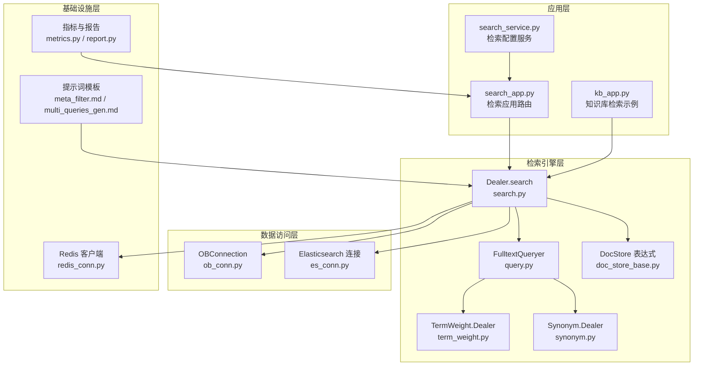
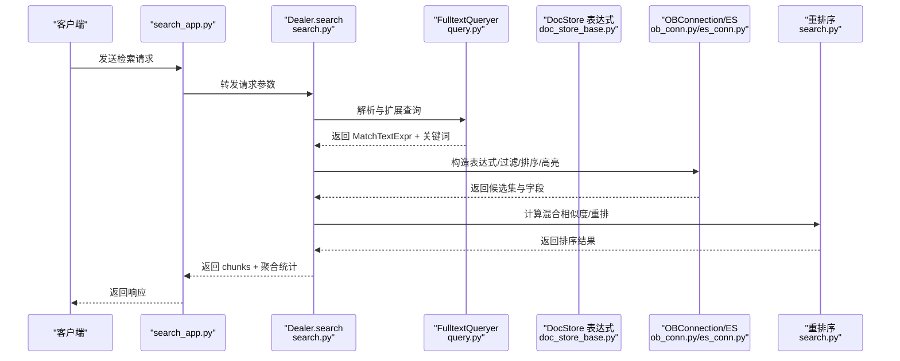
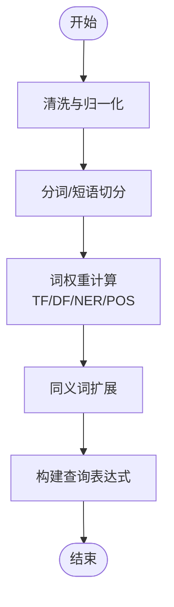
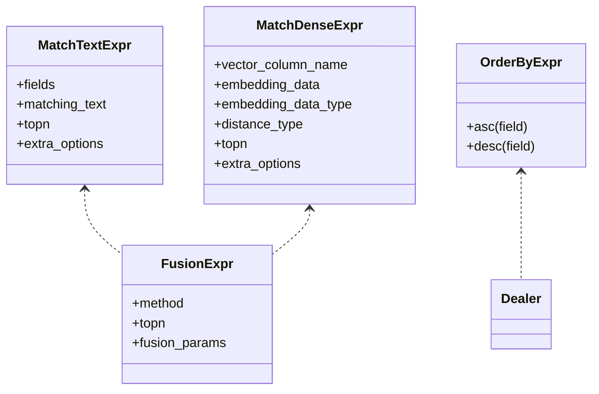
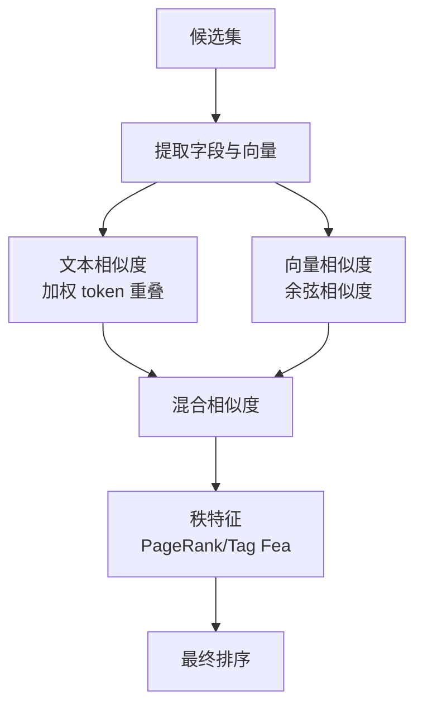
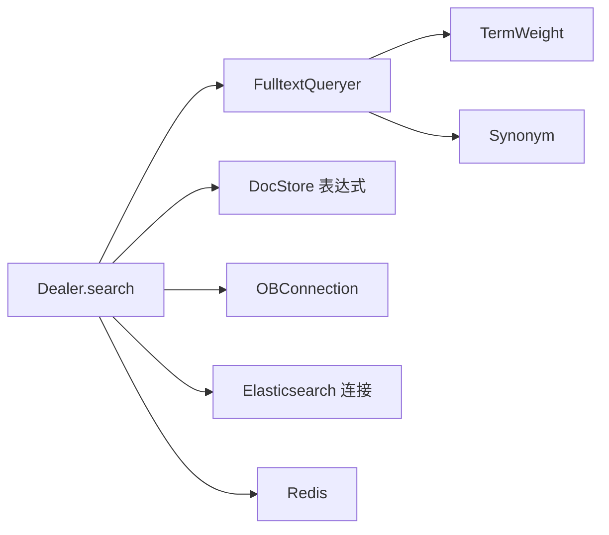

# 查询检索

<cite>
**本文引用的文件**
- [search.py](file://rag/nlp/search.py)
- [query.py](file://rag/nlp/query.py)
- [term_weight.py](file://rag/nlp/term_weight.py)
- [synonym.py](file://rag/nlp/synonym.py)
- [ob_conn.py](file://rag/utils/ob_conn.py)
- [es_conn.py](file://rag/utils/es_conn.py)
- [doc_store_base.py](file://common/doc_store/doc_store_base.py)
- [kb_app.py](file://api/apps/kb_app.py)
- [search_app.py](file://api/apps/search_app.py)
- [search_service.py](file://api/db/services/search_service.py)
- [metrics.py](file://test/benchmark/metrics.py)
- [report.py](file://test/benchmark/report.py)
- [redis_conn.py](file://rag/utils/redis_conn.py)
- [meta_filter.md](file://rag/prompts/meta_filter.md)
- [multi_queries_gen.md](file://rag/prompts/multi_queries_gen.md)
</cite>

## 目录
1. [简介](#简介)
2. [项目结构](#项目结构)
3. [核心组件](#核心组件)
4. [架构总览](#架构总览)
5. [详细组件分析](#详细组件分析)
6. [依赖分析](#依赖分析)
7. [性能考虑](#性能考虑)
8. [故障排查指南](#故障排查指南)
9. [结论](#结论)
10. [附录](#附录)

## 简介
本文件面向“查询检索系统”的技术文档，覆盖从查询预处理、语法分析、意图识别到查询扩展的全流程；深入解释多模态检索（文本检索、向量检索、混合检索）的实现与适用场景；阐述检索算法（BM25风格、语义相似度、深度学习嵌入）的应用；说明排序与重排机制（相关性评分、时间衰减、用户偏好）；提供高级检索能力（布尔、范围、模糊、通配）；并总结性能优化策略（索引优化、缓存、并行与分布式）。最后给出检索结果展示与高亮、统计与分析能力的说明。

## 项目结构
检索系统主要由以下层次构成：
- 应用层：对外提供检索接口与管理能力（API 应用、服务封装）
- 检索引擎层：查询解析与表达式构造、检索执行与融合
- 数据访问层：文档存储连接器（OceanBase/ES/Infinity 等）
- 基础设施层：缓存（Redis）、指标与报告、提示词模板

图示来源
- [search_app.py:1-188](file://api/apps/search_app.py#L1-L188)
- [search_service.py:1-122](file://api/db/services/search_service.py#L1-L122)
- [kb_app.py:956-989](file://api/apps/kb_app.py#L956-L989)
- [search.py:37-174](file://rag/nlp/search.py#L37-L174)
- [query.py:27-174](file://rag/nlp/query.py#L27-L174)
- [term_weight.py:27-247](file://rag/nlp/term_weight.py#L27-L247)
- [synonym.py:26-102](file://rag/nlp/synonym.py#L26-L102)
- [doc_store_base.py:56-141](file://common/doc_store/doc_store_base.py#L56-L141)
- [ob_conn.py:354-802](file://rag/utils/ob_conn.py#L354-L802)
- [es_conn.py:97-125](file://rag/utils/es_conn.py#L97-L125)
- [redis_conn.py:60-172](file://rag/utils/redis_conn.py#L60-L172)
- [metrics.py:1-67](file://test/benchmark/metrics.py#L1-L67)
- [report.py:73-87](file://test/benchmark/report.py#L73-L87)
- [meta_filter.md:1-67](file://rag/prompts/meta_filter.md#L1-L67)
- [multi_queries_gen.md:1-41](file://rag/prompts/multi_queries_gen.md#L1-L41)

章节来源
- [search_app.py:1-188](file://api/apps/search_app.py#L1-L188)
- [search_service.py:1-122](file://api/db/services/search_service.py#L1-L122)
- [kb_app.py:956-989](file://api/apps/kb_app.py#L956-L989)
- [search.py:37-174](file://rag/nlp/search.py#L37-L174)
- [query.py:27-174](file://rag/nlp/query.py#L27-L174)
- [term_weight.py:27-247](file://rag/nlp/term_weight.py#L27-L247)
- [synonym.py:26-102](file://rag/nlp/synonym.py#L26-L102)
- [doc_store_base.py:56-141](file://common/doc_store/doc_store_base.py#L56-L141)
- [ob_conn.py:354-802](file://rag/utils/ob_conn.py#L354-L802)
- [es_conn.py:97-125](file://rag/utils/es_conn.py#L97-L125)
- [redis_conn.py:60-172](file://rag/utils/redis_conn.py#L60-L172)
- [metrics.py:1-67](file://test/benchmark/metrics.py#L1-L67)
- [report.py:73-87](file://test/benchmark/report.py#L73-L87)
- [meta_filter.md:1-67](file://rag/prompts/meta_filter.md#L1-L67)
- [multi_queries_gen.md:1-41](file://rag/prompts/multi_queries_gen.md#L1-L41)

## 核心组件
- Dealer：检索主控制器，负责查询预处理、表达式构造、检索执行、重排序与结果聚合
- FulltextQueryer：查询解析与扩展，支持中英文分词、同义词扩展、短语与权重组合
- TermWeight.Dealer：词权重计算（基于词频、DF、命名实体、词性），支撑 BM25 风格评分
- Synonym.Dealer：同义词扩展，支持本地字典与 WordNet 实时扩展
- DocStore 表达式：MatchTextExpr、MatchDenseExpr、FusionExpr、OrderByExpr 等
- OBConnection/ES 连接：SQL/DSL 构造、融合检索、高亮、排序、元数据过滤
- Redis：分布式锁、限流、消息队列与状态存储
- 指标与报告：延迟、吞吐、分位统计，支持检索性能评估

章节来源
- [search.py:37-174](file://rag/nlp/search.py#L37-L174)
- [query.py:27-174](file://rag/nlp/query.py#L27-L174)
- [term_weight.py:27-247](file://rag/nlp/term_weight.py#L27-L247)
- [synonym.py:26-102](file://rag/nlp/synonym.py#L26-L102)
- [doc_store_base.py:56-141](file://common/doc_store/doc_store_base.py#L56-L141)
- [ob_conn.py:354-802](file://rag/utils/ob_conn.py#L354-L802)
- [es_conn.py:97-125](file://rag/utils/es_conn.py#L97-L125)
- [redis_conn.py:60-172](file://rag/utils/redis_conn.py#L60-L172)
- [metrics.py:1-67](file://test/benchmark/metrics.py#L1-L67)
- [report.py:73-87](file://test/benchmark/report.py#L73-L87)

## 架构总览
检索系统采用“查询解析 + 多路检索 + 融合重排 + 结果输出”的流水线架构。查询经 Dealer 构造为多种表达式（文本、向量、融合），通过 DocStore 连接器下发至后端存储（OceanBase/ES/Infinity），再由 Dealer 进行重排序与聚合，最终返回给上层应用。

图示来源
- [search_app.py:1-188](file://api/apps/search_app.py#L1-L188)
- [search.py:75-174](file://rag/nlp/search.py#L75-L174)
- [query.py:41-174](file://rag/nlp/query.py#L41-L174)
- [doc_store_base.py:56-141](file://common/doc_store/doc_store_base.py#L56-L141)
- [ob_conn.py:732-802](file://rag/utils/ob_conn.py#L732-L802)
- [es_conn.py:97-125](file://rag/utils/es_conn.py#L97-L125)

## 详细组件分析

### 查询预处理与语法分析
- 中英文混合清洗、繁简转换、全角半角归一
- 英文大小写归一、特殊字符清理
- 中文细粒度分词与短语切分，英文词干/词形还原
- 词权重计算：结合词频、文档频率、命名实体、词性标注，形成 BM25 风格权重
- 同义词扩展：优先本地字典，其次 WordNet，控制扩展规模

图示来源
- [query.py:41-174](file://rag/nlp/query.py#L41-L174)
- [term_weight.py:163-247](file://rag/nlp/term_weight.py#L163-L247)
- [synonym.py:71-96](file://rag/nlp/synonym.py#L71-L96)

章节来源
- [query.py:41-174](file://rag/nlp/query.py#L41-L174)
- [term_weight.py:163-247](file://rag/nlp/term_weight.py#L163-L247)
- [synonym.py:71-96](file://rag/nlp/synonym.py#L71-L96)

### 意图识别与查询扩展
- 基于关键词与短语的组合，生成多粒度查询项
- 对中文采用细粒度 token 并进行短语近似匹配
- 对英文采用词对近似与短语组合，提升召回
- 支持最小匹配比例，平衡召回与精度

章节来源
- [query.py:41-174](file://rag/nlp/query.py#L41-L174)

### 多模态检索实现
- 文本检索（BM25 风格）：基于多字段加权、短语匹配、最小匹配控制
- 向量检索：余弦距离/余弦相似度，支持 KNN 近似检索与候选裁剪
- 融合检索：文本与向量得分加权融合，支持先文本后向量或双向融合两种策略
- 元数据过滤：支持数组字段、存在性、范围、JSON 字段等复杂条件
- 排序与高亮：支持按字段排序、高亮命中词、片段抽取

图示来源
- [doc_store_base.py:56-141](file://common/doc_store/doc_store_base.py#L56-L141)

章节来源
- [ob_conn.py:732-802](file://rag/utils/ob_conn.py#L732-L802)
- [es_conn.py:97-125](file://rag/utils/es_conn.py#L97-L125)
- [doc_store_base.py:56-141](file://common/doc_store/doc_store_base.py#L56-L141)

### 检索算法与重排
- 文本相似度：基于权重化的 token 重叠度，支持标题、问题、重要词加权
- 向量相似度：余弦相似度，向量化批量计算，支持 NaN/Inf 处理
- 混合相似度：加权融合文本与向量相似度，并叠加秩特征（PageRank/Tag Feature）
- 重排模型：可选 rerank 模型，统一输入文本，批量相似度计算，异常回退

图示来源
- [search.py:334-437](file://rag/nlp/search.py#L334-L437)
- [search.py:478-565](file://rag/nlp/search.py#L478-L565)

章节来源
- [search.py:334-437](file://rag/nlp/search.py#L334-L437)
- [search.py:478-565](file://rag/nlp/search.py#L478-L565)

### 高级检索能力
- 布尔查询：AND/OR/NOT 组合，支持 term/terms/range/filter
- 范围查询：数值/时间范围，JSON 字段比较（大于/小于/等于/不等于/区间）
- 模糊与通配：短语近似、前缀/后缀匹配、JSON CONTAINS 等
- 元数据过滤：通过提示词模板生成过滤条件，支持“与/或”逻辑与操作符集合

章节来源
- [ob_conn.py:205-282](file://rag/utils/ob_conn.py#L205-L282)
- [meta_filter.md:1-67](file://rag/prompts/meta_filter.md#L1-L67)

### 检索结果展示与高亮
- 高亮策略：优先使用后端 DSL 高亮，回退到关键词正则包裹
- 片段提取：根据位置信息与高亮标记提取上下文片段
- 展示字段：内容、标题、重要词、图片 ID、位置、类型、父块 ID 等

章节来源
- [ob_conn.py:1549-1585](file://rag/utils/ob_conn.py#L1549-L1585)
- [search.py:694-735](file://rag/nlp/search.py#L694-L735)

### 检索统计与分析
- 性能指标：延迟（首次 token、总耗时）、吞吐（QPS）、分位统计（p50/p90/p95）
- 报告生成：按并发、持续时间、迭代次数汇总统计，输出报告
- 检索配置：支持检索应用的创建、更新、查询与删除

章节来源
- [metrics.py:1-67](file://test/benchmark/metrics.py#L1-L67)
- [report.py:73-87](file://test/benchmark/report.py#L73-L87)
- [search_app.py:30-188](file://api/apps/search_app.py#L30-L188)
- [search_service.py:26-122](file://api/db/services/search_service.py#L26-L122)

## 依赖分析
- Dealer 依赖 FulltextQueryer、DocStore 表达式、DocStore 连接器（OB/ES）
- Queryer 依赖 TermWeight 与 Synonym，提供权重与扩展
- DocStore 表达式为跨存储抽象，OB/ES 连接器分别实现具体 SQL/DSL
- Redis 用于分布式锁、限流与消息队列

图示来源
- [search.py:37-174](file://rag/nlp/search.py#L37-L174)
- [query.py:27-174](file://rag/nlp/query.py#L27-L174)
- [term_weight.py:27-247](file://rag/nlp/term_weight.py#L27-L247)
- [synonym.py:26-102](file://rag/nlp/synonym.py#L26-L102)
- [doc_store_base.py:56-141](file://common/doc_store/doc_store_base.py#L56-L141)
- [ob_conn.py:354-802](file://rag/utils/ob_conn.py#L354-L802)
- [es_conn.py:97-125](file://rag/utils/es_conn.py#L97-L125)
- [redis_conn.py:60-172](file://rag/utils/redis_conn.py#L60-L172)

章节来源
- [search.py:37-174](file://rag/nlp/search.py#L37-L174)
- [query.py:27-174](file://rag/nlp/query.py#L27-L174)
- [term_weight.py:27-247](file://rag/nlp/term_weight.py#L27-L247)
- [synonym.py:26-102](file://rag/nlp/synonym.py#L26-L102)
- [doc_store_base.py:56-141](file://common/doc_store/doc_store_base.py#L56-L141)
- [ob_conn.py:354-802](file://rag/utils/ob_conn.py#L354-L802)
- [es_conn.py:97-125](file://rag/utils/es_conn.py#L97-L125)
- [redis_conn.py:60-172](file://rag/utils/redis_conn.py#L60-L172)

## 性能考虑
- 索引优化
  - 全文索引：IK 分词器，多字段加权
  - 向量索引：HNSW/HASH，余弦距离
  - 辅助索引：常用过滤字段（kb_id、doc_id、available_int 等）
- 候选裁剪
  - KNN num_candidates 控制候选规模，降低向量扫描
  - 文本最小匹配比例与融合权重动态调整
- 并行与批处理
  - 向量相似度矩阵化批量计算
  - 重排模型统一输入文本，减少循环开销
- 缓存与分布式
  - Redis 分布式锁、限流、消息队列
  - 结果高亮与片段提取的缓存策略
- 分布式检索
  - 多租户/多 KB 的索引合并与过滤
  - 跨存储一致性与版本控制

章节来源
- [ob_conn.py:683-716](file://rag/utils/ob_conn.py#L683-L716)
- [es_conn.py:111-120](file://rag/utils/es_conn.py#L111-L120)
- [search.py:334-437](file://rag/nlp/search.py#L334-L437)
- [redis_conn.py:60-172](file://rag/utils/redis_conn.py#L60-L172)

## 故障排查指南
- 连接与健康检查
  - OceanBase/ES/Infinity 连接池与超时设置
  - 版本兼容性检查与变量刷新
- 查询失败与回退
  - 空结果时降低最小匹配与相似度阈值
  - 回退到仅文本或仅向量检索
- 重排异常
  - 重排模型失败时回退到传统相似度
  - 向量维度不一致时填充零向量
- 高亮与片段
  - 后端高亮不可用时启用关键词包裹
  - 片段提取失败时回退到原文

章节来源
- [ob_conn.py:449-484](file://rag/utils/ob_conn.py#L449-L484)
- [search.py:138-150](file://rag/nlp/search.py#L138-L150)
- [search.py:554-557](file://rag/nlp/search.py#L554-L557)
- [ob_conn.py:1549-1585](file://rag/utils/ob_conn.py#L1549-L1585)

## 结论
该检索系统以 Dealer 为核心，结合 Queryer 的查询扩展与 DocStore 表达式抽象，实现了文本、向量与融合检索的统一入口。通过权重化 BM25 风格文本相似度、余弦向量相似度与秩特征融合，以及可插拔的重排模型，系统在召回与排序上具备良好的灵活性与可扩展性。配合 Redis、指标与报告工具，能够支撑生产环境的性能监控与优化。

## 附录
- 高级检索提示词模板
  - 元数据过滤：根据用户问题与可用元数据生成过滤条件，支持“与/或”与多种操作符
  - 多查询生成：针对检索不足场景，生成互补查询以增强召回

章节来源
- [meta_filter.md:1-67](file://rag/prompts/meta_filter.md#L1-L67)
- [multi_queries_gen.md:1-41](file://rag/prompts/multi_queries_gen.md#L1-L41)