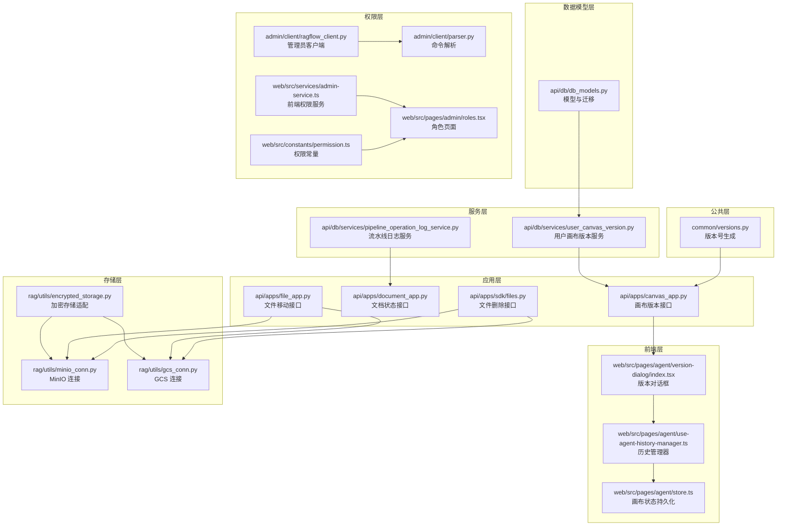
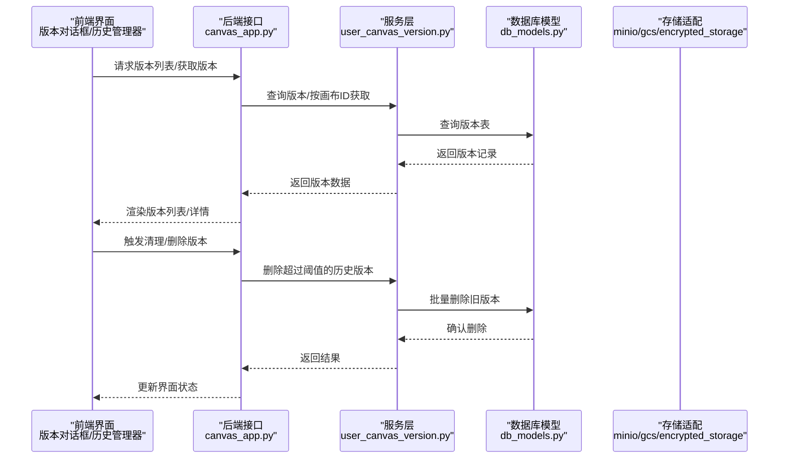
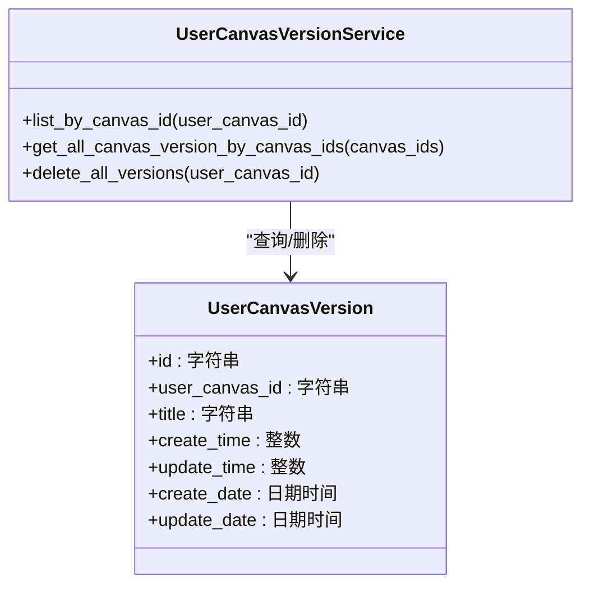
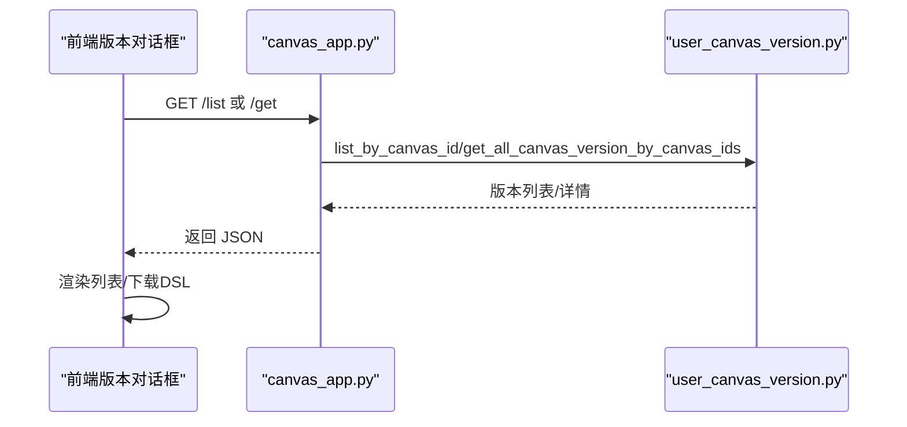
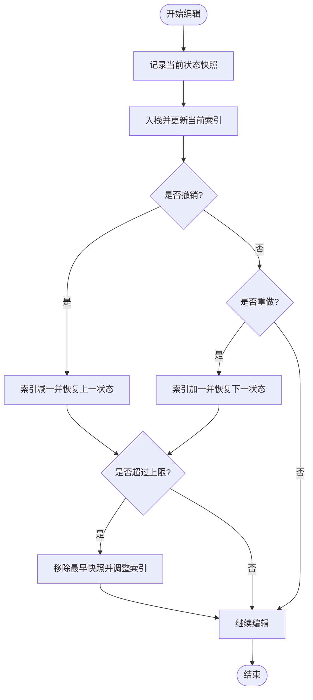
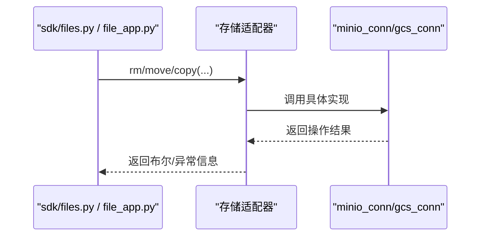
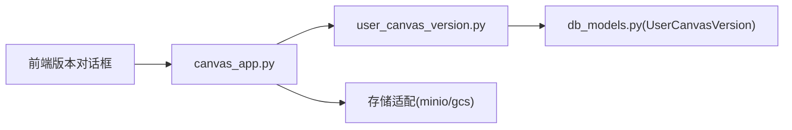

# 版本控制

<cite>
**本文引用的文件**
- [common/versions.py](file://common/versions.py)
- [api/db/db_models.py](file://api/db/db_models.py)
- [api/db/services/user_canvas_version.py](file://api/db/services/user_canvas_version.py)
- [api/apps/canvas_app.py](file://api/apps/canvas_app.py)
- [web/src/pages/agent/version-dialog/index.tsx](file://web/src/pages/agent/version-dialog/index.tsx)
- [web/src/pages/agent/use-agent-history-manager.ts](file://web/src/pages/agent/use-agent-history-manager.ts)
- [web/src/pages/agent/store.ts](file://web/src/pages/agent/store.ts)
- [api/apps/document_app.py](file://api/apps/document_app.py)
- [api/db/services/pipeline_operation_log_service.py](file://api/db/services/pipeline_operation_log_service.py)
- [api/apps/sdk/files.py](file://api/apps/sdk/files.py)
- [api/apps/file_app.py](file://api/apps/file_app.py)
- [rag/utils/minio_conn.py](file://rag/utils/minio_conn.py)
- [rag/utils/gcs_conn.py](file://rag/utils/gcs_conn.py)
- [rag/utils/encrypted_storage.py](file://rag/utils/encrypted_storage.py)
- [admin/client/ragflow_client.py](file://admin/client/ragflow_client.py)
- [admin/client/parser.py](file://admin/client/parser.py)
- [web/src/services/admin-service.ts](file://web/src/services/admin-service.ts)
- [web/src/constants/permission.ts](file://web/src/constants/permission.ts)
- [web/src/pages/admin/roles.tsx](file://web/src/pages/admin/roles.tsx)
</cite>

## 目录
1. [引言](#引言)
2. [项目结构](#项目结构)
3. [核心组件](#核心组件)
4. [架构总览](#架构总览)
5. [详细组件分析](#详细组件分析)
6. [依赖分析](#依赖分析)
7. [性能考虑](#性能考虑)
8. [故障排查指南](#故障排查指南)
9. [结论](#结论)
10. [附录](#附录)

## 引言
本文件面向版本控制系统，聚焦于知识库版本管理的设计理念与实现细节，覆盖版本号生成、版本继承关系、生命周期管理、版本创建触发条件、版本差异比较、版本回滚、版本合并与冲突解决、版本标签与注释、版本历史查询与浏览、版本清理与归档、权限集成以及版本迁移与升级等主题。文档以代码为依据，结合前端交互与后端服务，提供从概念到落地的全景式说明。

## 项目结构
版本控制涉及的代码分布在以下层次：
- 公共层：版本号生成与系统信息获取
- 数据模型层：数据库模型定义与迁移
- 服务层：版本查询、删除、清理等业务逻辑
- 应用层：HTTP 接口路由与对外能力
- 前端层：版本对话框、历史管理器、画布状态持久化
- 存储层：对象存储适配与移动/复制/删除
- 权限层：角色与权限管理、CLI 与前端接口

图表来源
- [common/versions.py:1-51](file://common/versions.py#L1-L51)
- [api/db/db_models.py:936-960](file://api/db/db_models.py#L936-L960)
- [api/db/services/user_canvas_version.py:1-61](file://api/db/services/user_canvas_version.py#L1-L61)
- [api/apps/canvas_app.py:95-468](file://api/apps/canvas_app.py#L95-L468)
- [web/src/pages/agent/version-dialog/index.tsx:33-76](file://web/src/pages/agent/version-dialog/index.tsx#L33-L76)
- [web/src/pages/agent/use-agent-history-manager.ts:41-92](file://web/src/pages/agent/use-agent-history-manager.ts#L41-L92)
- [web/src/pages/agent/store.ts:397-437](file://web/src/pages/agent/store.ts#L397-L437)
- [api/apps/document_app.py:522-553](file://api/apps/document_app.py#L522-L553)
- [api/apps/sdk/files.py:478-507](file://api/apps/sdk/files.py#L478-L507)
- [api/apps/file_app.py:414-445](file://api/apps/file_app.py#L414-L445)
- [rag/utils/minio_conn.py:203-279](file://rag/utils/minio_conn.py#L203-L279)
- [rag/utils/gcs_conn.py:170-207](file://rag/utils/gcs_conn.py#L170-L207)
- [rag/utils/encrypted_storage.py:186-227](file://rag/utils/encrypted_storage.py#L186-L227)
- [admin/client/ragflow_client.py:379-428](file://admin/client/ragflow_client.py#L379-L428)
- [admin/client/parser.py:397-434](file://admin/client/parser.py#L397-L434)
- [web/src/services/admin-service.ts:204-240](file://web/src/services/admin-service.ts#L204-L240)
- [web/src/pages/admin/roles.tsx:244-275](file://web/src/pages/admin/roles.tsx#L244-L275)
- [web/src/constants/permission.ts:1-4](file://web/src/constants/permission.ts#L1-L4)

章节来源
- [common/versions.py:1-51](file://common/versions.py#L1-L51)
- [api/db/db_models.py:936-960](file://api/db/db_models.py#L936-L960)
- [api/db/services/user_canvas_version.py:1-61](file://api/db/services/user_canvas_version.py#L1-L61)
- [api/apps/canvas_app.py:95-468](file://api/apps/canvas_app.py#L95-L468)
- [web/src/pages/agent/version-dialog/index.tsx:33-76](file://web/src/pages/agent/version-dialog/index.tsx#L33-L76)
- [web/src/pages/agent/use-agent-history-manager.ts:41-92](file://web/src/pages/agent/use-agent-history-manager.ts#L41-L92)
- [web/src/pages/agent/store.ts:397-437](file://web/src/pages/agent/store.ts#L397-L437)
- [api/apps/document_app.py:522-553](file://api/apps/document_app.py#L522-L553)
- [api/apps/sdk/files.py:478-507](file://api/apps/sdk/files.py#L478-L507)
- [api/apps/file_app.py:414-445](file://api/apps/file_app.py#L414-L445)
- [rag/utils/minio_conn.py:203-279](file://rag/utils/minio_conn.py#L203-L279)
- [rag/utils/gcs_conn.py:170-207](file://rag/utils/gcs_conn.py#L170-L207)
- [rag/utils/encrypted_storage.py:186-227](file://rag/utils/encrypted_storage.py#L186-L227)
- [admin/client/ragflow_client.py:379-428](file://admin/client/ragflow_client.py#L379-L428)
- [admin/client/parser.py:397-434](file://admin/client/parser.py#L397-L434)
- [web/src/services/admin-service.ts:204-240](file://web/src/services/admin-service.ts#L204-L240)
- [web/src/pages/admin/roles.tsx:244-275](file://web/src/pages/admin/roles.tsx#L244-L275)
- [web/src/constants/permission.ts:1-4](file://web/src/constants/permission.ts#L1-L4)

## 核心组件
- 版本号生成：通过公共模块读取本地 VERSION 文件或基于 Git 标签推导版本字符串，用于系统版本标识与发布追踪。
- 用户画布版本模型与服务：提供版本列表、按画布查询、批量删除、上限清理等能力，支撑画布 DSL 的历史版本管理。
- 画布版本接口：提供版本列表、获取指定版本、清理版本等 HTTP 能力，配合前端版本对话框使用。
- 文档状态与索引更新：文档状态变更时同步更新文档存储可用性字段，保障检索一致性。
- 历史管理器与前端持久化：前端维护历史栈，支持撤销/重做，结合后端版本接口实现可视化版本浏览。
- 存储层适配：封装对象存储的复制、移动、删除与桶级清理，保证版本数据的可移植与可维护。
- 权限与角色：管理员 CLI 与前端角色管理，限定对版本操作的访问范围。

章节来源
- [common/versions.py:23-51](file://common/versions.py#L23-L51)
- [api/db/db_models.py:936-960](file://api/db/db_models.py#L936-L960)
- [api/db/services/user_canvas_version.py:1-61](file://api/db/services/user_canvas_version.py#L1-L61)
- [api/apps/canvas_app.py:95-468](file://api/apps/canvas_app.py#L95-L468)
- [api/apps/document_app.py:522-553](file://api/apps/document_app.py#L522-L553)
- [web/src/pages/agent/version-dialog/index.tsx:33-76](file://web/src/pages/agent/version-dialog/index.tsx#L33-L76)
- [web/src/pages/agent/use-agent-history-manager.ts:41-92](file://web/src/pages/agent/use-agent-history-manager.ts#L41-L92)
- [rag/utils/minio_conn.py:203-279](file://rag/utils/minio_conn.py#L203-L279)
- [rag/utils/gcs_conn.py:170-207](file://rag/utils/gcs_conn.py#L170-L207)
- [admin/client/ragflow_client.py:379-428](file://admin/client/ragflow_client.py#L379-L428)
- [web/src/pages/admin/roles.tsx:244-275](file://web/src/pages/admin/roles.tsx#L244-L275)

## 架构总览
版本控制由“前端交互 + 后端接口 + 服务层 + 数据模型 + 存储适配 + 权限控制”构成闭环。前端负责版本对话框与历史管理，后端提供版本查询与清理接口，服务层封装版本数据访问与批量处理，数据模型定义版本实体与迁移策略，存储层提供对象级操作能力，权限层限制操作范围。

图表来源
- [api/apps/canvas_app.py:95-468](file://api/apps/canvas_app.py#L95-L468)
- [api/db/services/user_canvas_version.py:1-61](file://api/db/services/user_canvas_version.py#L1-L61)
- [api/db/db_models.py:936-960](file://api/db/db_models.py#L936-L960)

## 详细组件分析

### 版本号生成与系统信息
- 设计理念：优先使用本地 VERSION 文件作为稳定版本号；若不可用则通过 Git 描述符推导最近标签与提交计数，形成可读版本字符串。
- 实现要点：全局缓存版本信息，避免重复计算；异常兜底返回 unknown，保证启动稳定性。
- 应用场景：系统启动时读取版本号，用于日志、健康检查与运维追踪。

章节来源
- [common/versions.py:23-51](file://common/versions.py#L23-L51)

### 用户画布版本模型与服务
- 模型设计：用户画布版本实体包含主键、创建/更新时间、标题、所属画布 ID 等字段，便于按画布聚合与排序展示。
- 服务能力：
  - 按画布 ID 列表查询版本摘要字段
  - 批量获取版本 ID 列表（分页拉取）
  - 删除超过阈值的历史版本（默认保留前 N 个）
- 生命周期管理：通过阈值控制版本数量，防止无限增长导致存储与查询压力。

图表来源
- [api/db/db_models.py:936-960](file://api/db/db_models.py#L936-L960)
- [api/db/services/user_canvas_version.py:1-61](file://api/db/services/user_canvas_version.py#L1-L61)

章节来源
- [api/db/db_models.py:936-960](file://api/db/db_models.py#L936-L960)
- [api/db/services/user_canvas_version.py:1-61](file://api/db/services/user_canvas_version.py#L1-L61)

### 画布版本接口与前端交互
- 接口能力：
  - 获取版本详情
  - 列出画布版本
  - 清理版本（调用服务层删除逻辑）
- 前端体验：
  - 版本对话框展示历史版本列表
  - 支持分页与选中切换
  - 下载版本 DSL 图谱

图表来源
- [api/apps/canvas_app.py:95-468](file://api/apps/canvas_app.py#L95-L468)
- [web/src/pages/agent/version-dialog/index.tsx:33-76](file://web/src/pages/agent/version-dialog/index.tsx#L33-L76)

章节来源
- [api/apps/canvas_app.py:95-468](file://api/apps/canvas_app.py#L95-L468)
- [web/src/pages/agent/version-dialog/index.tsx:33-76](file://web/src/pages/agent/version-dialog/index.tsx#L33-L76)

### 历史管理器与撤销/重做
- 前端历史栈：在编辑流程中记录节点与边的状态快照，限制最大长度，支持撤销与重做。
- 与后端协作：版本对话框中的选中版本可作为“目标快照”，前端据此恢复到对应历史状态。

图表来源
- [web/src/pages/agent/use-agent-history-manager.ts:41-92](file://web/src/pages/agent/use-agent-history-manager.ts#L41-L92)
- [web/src/pages/agent/store.ts:397-437](file://web/src/pages/agent/store.ts#L397-L437)

章节来源
- [web/src/pages/agent/use-agent-history-manager.ts:41-92](file://web/src/pages/agent/use-agent-history-manager.ts#L41-L92)
- [web/src/pages/agent/store.ts:397-437](file://web/src/pages/agent/store.ts#L397-L437)

### 文档状态与索引一致性
- 触发条件：当文档状态发生变更时，后端同步更新文档存储的可用性字段，确保检索可见性与一致性。
- 影响范围：影响向量/倒排索引的可用性标记，避免“已下线但索引未更新”的不一致。

章节来源
- [api/apps/document_app.py:522-553](file://api/apps/document_app.py#L522-L553)

### 存储层对象操作与版本数据维护
- 能力范围：复制、移动、删除对象；桶级清理；在单桶模式下按前缀清理。
- 集成点：文件删除与移动接口通过统一存储实现执行对象级操作，保障版本数据的可迁移性。

图表来源
- [api/apps/sdk/files.py:478-507](file://api/apps/sdk/files.py#L478-L507)
- [api/apps/file_app.py:414-445](file://api/apps/file_app.py#L414-L445)
- [rag/utils/minio_conn.py:203-279](file://rag/utils/minio_conn.py#L203-L279)
- [rag/utils/gcs_conn.py:170-207](file://rag/utils/gcs_conn.py#L170-L207)
- [rag/utils/encrypted_storage.py:186-227](file://rag/utils/encrypted_storage.py#L186-L227)

章节来源
- [api/apps/sdk/files.py:478-507](file://api/apps/sdk/files.py#L478-L507)
- [api/apps/file_app.py:414-445](file://api/apps/file_app.py#L414-L445)
- [rag/utils/minio_conn.py:203-279](file://rag/utils/minio_conn.py#L203-L279)
- [rag/utils/gcs_conn.py:170-207](file://rag/utils/gcs_conn.py#L170-L207)
- [rag/utils/encrypted_storage.py:186-227](file://rag/utils/encrypted_storage.py#L186-L227)

### 权限与角色管理
- 管理员 CLI：支持授予/撤销角色权限、分配资源权限、查看版本等命令。
- 前端角色页面：以 Tabs 展示资源类型与权限开关，支持批量更新。
- 权限常量：定义“仅本人/团队”两类权限域，贯穿多处资源模型。

章节来源
- [admin/client/ragflow_client.py:379-428](file://admin/client/ragflow_client.py#L379-L428)
- [admin/client/parser.py:397-434](file://admin/client/parser.py#L397-L434)
- [web/src/services/admin-service.ts:204-240](file://web/src/services/admin-service.ts#L204-L240)
- [web/src/pages/admin/roles.tsx:244-275](file://web/src/pages/admin/roles.tsx#L244-L275)
- [web/src/constants/permission.ts:1-4](file://web/src/constants/permission.ts#L1-L4)

## 依赖分析
- 组件耦合：
  - canvas_app 依赖 user_canvas_version_service 提供版本查询与清理
  - user_canvas_version_service 依赖 db_models 中的 UserCanvasVersion 模型
  - 前端版本对话框依赖后端接口返回的数据结构
  - 存储适配器被文件删除/移动接口调用
- 外部依赖：
  - Git 标签用于版本号推导
  - 对象存储（MinIO/GCS）用于版本数据持久化

图表来源
- [api/apps/canvas_app.py:95-468](file://api/apps/canvas_app.py#L95-L468)
- [api/db/services/user_canvas_version.py:1-61](file://api/db/services/user_canvas_version.py#L1-L61)
- [api/db/db_models.py:936-960](file://api/db/db_models.py#L936-L960)

章节来源
- [api/apps/canvas_app.py:95-468](file://api/apps/canvas_app.py#L95-L468)
- [api/db/services/user_canvas_version.py:1-61](file://api/db/services/user_canvas_version.py#L1-L61)
- [api/db/db_models.py:936-960](file://api/db/db_models.py#L936-L960)

## 性能考虑
- 分页批量查询：服务层对版本查询采用分页游标方式，避免一次性拉取大量记录造成内存压力。
- 阈值清理：默认保留有限数量的历史版本，超出部分批量删除，降低数据库膨胀与查询开销。
- 存储操作幂等：复制/移动/删除接口具备异常处理与日志记录，避免重复操作带来的额外成本。
- 前端历史栈上限：限制历史快照数量，防止内存占用过高。

章节来源
- [api/db/services/user_canvas_version.py:28-43](file://api/db/services/user_canvas_version.py#L28-L43)
- [web/src/pages/agent/use-agent-history-manager.ts:41-92](file://web/src/pages/agent/use-agent-history-manager.ts#L41-L92)

## 故障排查指南
- 版本列表为空或异常：
  - 检查画布是否存在且有权限访问
  - 确认服务层查询是否抛出异常
- 版本清理无效：
  - 确认阈值设置与实际版本数量
  - 检查批量删除逻辑是否成功执行
- 存储操作失败：
  - 查看对象存储连接参数与桶/路径配置
  - 检查复制/移动/删除返回值与异常日志
- 权限不足：
  - 确认角色是否具备相应资源权限
  - 检查前端权限开关与后端校验逻辑

章节来源
- [api/apps/canvas_app.py:95-468](file://api/apps/canvas_app.py#L95-L468)
- [api/db/services/user_canvas_version.py:45-61](file://api/db/services/user_canvas_version.py#L45-L61)
- [rag/utils/minio_conn.py:203-279](file://rag/utils/minio_conn.py#L203-L279)
- [rag/utils/gcs_conn.py:170-207](file://rag/utils/gcs_conn.py#L170-L207)
- [web/src/pages/admin/roles.tsx:244-275](file://web/src/pages/admin/roles.tsx#L244-L275)

## 结论
该版本控制系统以“前端历史管理 + 后端版本接口 + 服务层数据治理 + 存储适配 + 权限控制”为核心，实现了从版本创建、浏览、清理到权限约束的全链路能力。通过阈值清理与分页查询保障性能，通过对象存储抽象提升可移植性，通过权限体系确保安全可控。建议在生产环境中结合监控与告警完善可观测性，并持续优化版本阈值与清理策略以适应业务规模增长。

## 附录
- 版本标签与注释：当前代码未发现专门的“版本标签/注释”实体与接口，如需扩展可在 UserCanvasVersion 模型中增加标签/备注字段，并在 canvas_app 与前端对话框中补充对应 UI 与接口。
- 版本差异比较：当前未见差异比较算法实现，可考虑引入增量比较或哈希比对策略，结合前端差异面板展示。
- 版本合并与冲突解决：当前未见合并/冲突解决逻辑，建议在 DSL 级别引入合并策略与冲突提示，必要时提供人工仲裁入口。
- 版本迁移与升级：版本号生成依赖 Git 标签与 VERSION 文件，建议在升级脚本中维护版本文件与标签一致性，确保版本号准确可追溯。