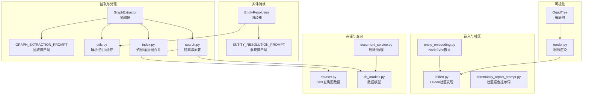
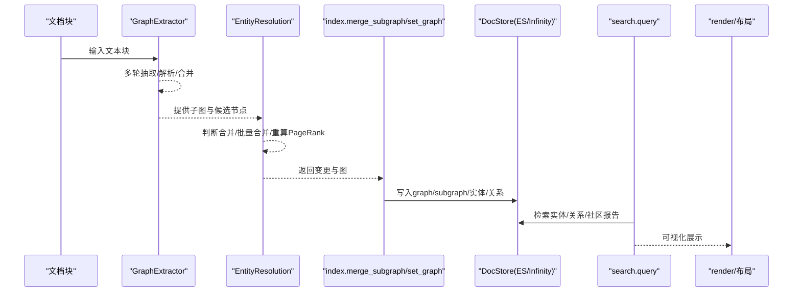
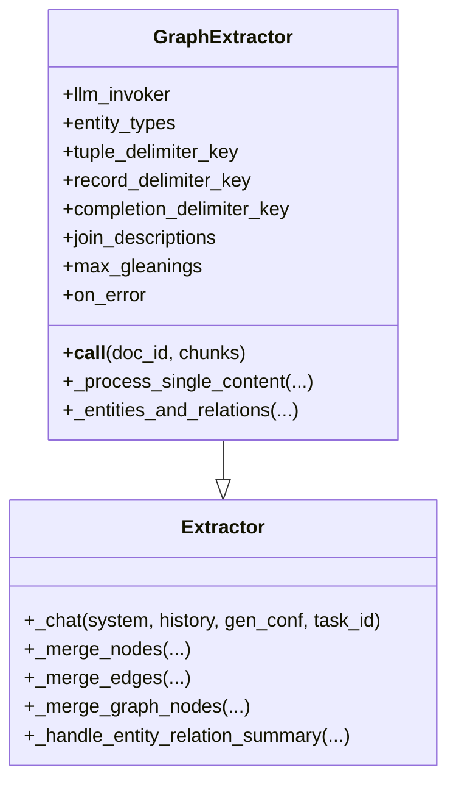
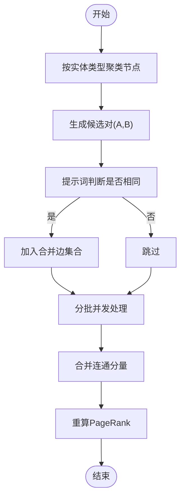
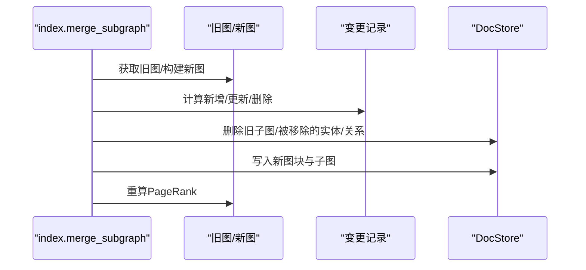
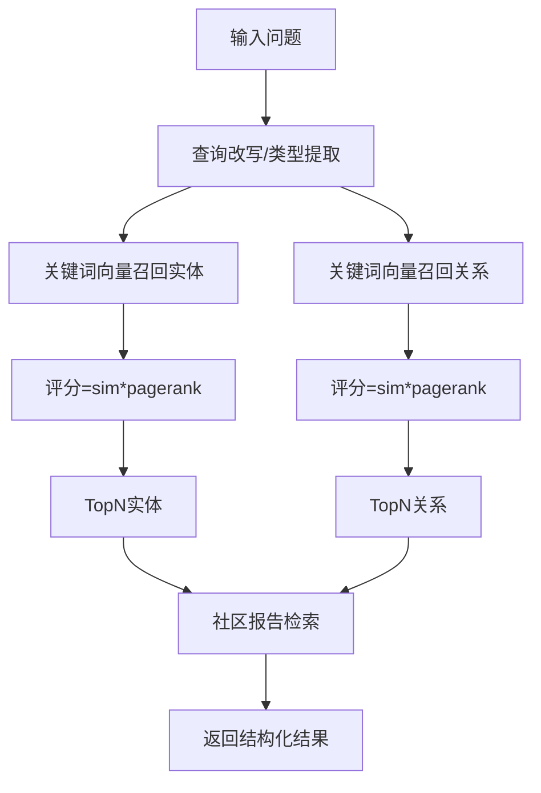
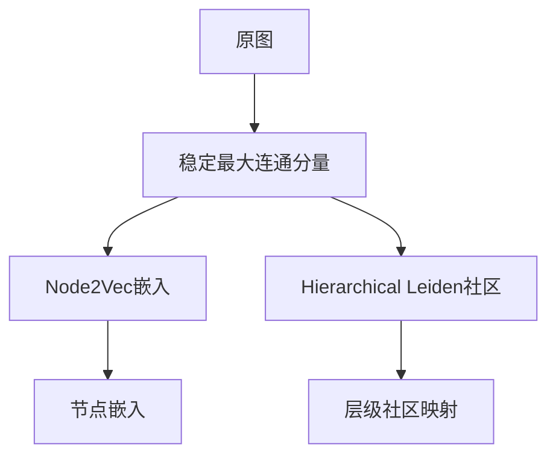
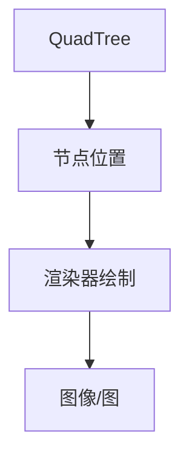
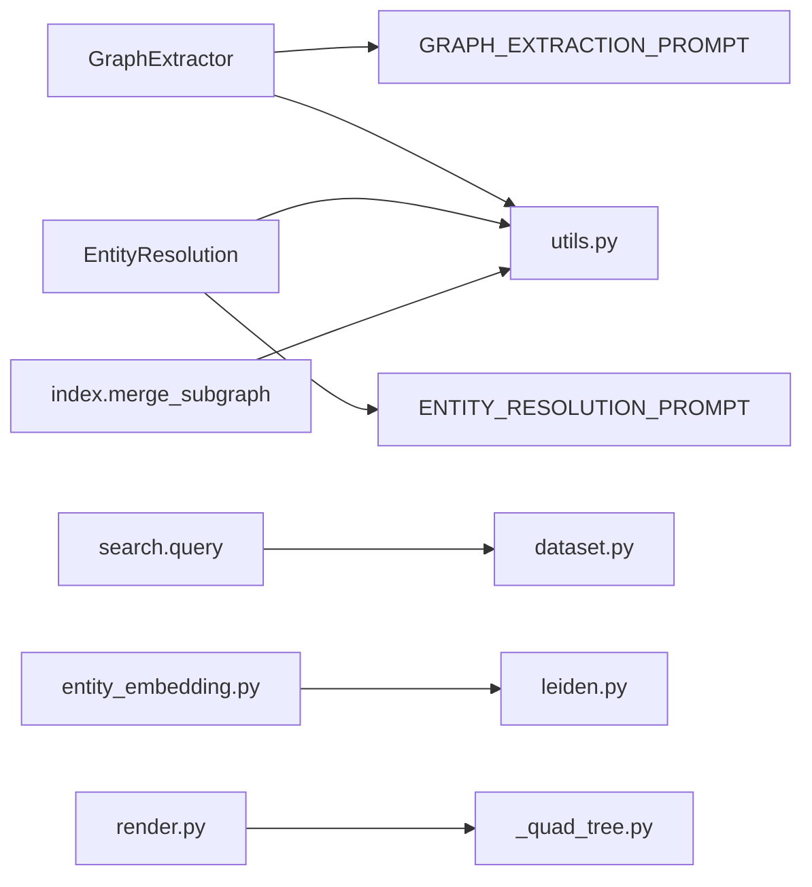

# 知识图谱

<cite>
**本文引用的文件**
- [graph_extractor.py](file://graphrag/general/graph_extractor.py)
- [extractor.py](file://graphrag/general/extractor.py)
- [graph_prompt.py](file://graphrag/general/graph_prompt.py)
- [entity_resolution.py](file://graphrag/entity_resolution.py)
- [entity_resolution_prompt.py](file://graphrag/entity_resolution_prompt.py)
- [utils.py](file://graphrag/utils.py)
- [index.py](file://graphrag/general/index.py)
- [entity_embedding.py](file://graphrag/general/entity_embedding.py)
- [leiden.py](file://graphrag/general/leiden.py)
- [community_report_prompt.py](file://graphrag/general/community_report_prompt.py)
- [search.py](file://graphrag/search.py)
- [dataset.py](file://api/apps/sdk/dataset.py)
- [document_service.py](file://api/db/services/document_service.py)
- [db_models.py](file://api/db/db_models.py)
- [graph_builder.py](file://graspologic/tests/pipeline/test_graph_builder.py)
- [render.py](file://graspologic/graspologic/layouts/render.py)
- [_quad_tree.py](file://graspologic/graspologic/layouts/nooverlap/_quad_tree.py)
</cite>

## 目录
1. [简介](#简介)
2. [项目结构](#项目结构)
3. [核心组件](#核心组件)
4. [架构总览](#架构总览)
5. [详细组件分析](#详细组件分析)
6. [依赖分析](#依赖分析)
7. [性能考虑](#性能考虑)
8. [故障排查指南](#故障排查指南)
9. [结论](#结论)
10. [附录](#附录)

## 简介
本技术文档围绕知识图谱系统的构建与运行展开，覆盖从原始文档到实体识别、关系抽取、图结构生成、实体消歧与合并、社区发现、嵌入与可视化、增量更新与查询检索、以及在问答系统中的应用与质量评估。文档以代码为依据，结合流程图与类图，帮助读者理解端到端的知识图谱流水线。

## 项目结构
知识图谱相关能力主要分布在以下模块：
- 图谱抽取与处理：graphrag/general 下的抽取器、提示词模板、工具函数、索引与合并、社区报告、搜索与检索
- 实体消歧与合并：graphrag/entity_resolution 及其提示词
- 嵌入与社区发现：graphrag/general 下的嵌入与 Leiden 聚类
- 存储与查询：api/db 服务与 SDK 接口
- 可视化：graspologic 的布局与渲染工具
- 数据模型：api/db/db_models 中的字段与类型定义

**图表来源**
- [graph_extractor.py:36-153](file://graphrag/general/graph_extractor.py#L36-L153)
- [graph_prompt.py:8-23](file://graphrag/general/graph_prompt.py#L8-L23)
- [utils.py:202-271](file://graphrag/utils.py#L202-L271)
- [index.py:459-529](file://graphrag/general/index.py#L459-L529)
- [search.py:143-300](file://graphrag/search.py#L143-L300)
- [entity_resolution.py:49-189](file://graphrag/entity_resolution.py#L49-L189)
- [entity_resolution_prompt.py:47-64](file://graphrag/entity_resolution_prompt.py#L47-L64)
- [entity_embedding.py:24-66](file://graphrag/general/entity_embedding.py#L24-L66)
- [leiden.py:64-150](file://graphrag/general/leiden.py#L64-L150)
- [community_report_prompt.py:8-158](file://graphrag/general/community_report_prompt.py#L8-L158)
- [dataset.py:499-531](file://api/apps/sdk/dataset.py#L499-L531)
- [document_service.py:378-395](file://api/db/services/document_service.py#L378-L395)
- [db_models.py:1134-1155](file://api/db/db_models.py#L1134-L1155)
- [render.py:197-238](file://graspologic/graspologic/layouts/render.py#L197-L238)
- [_quad_tree.py:11-43](file://graspologic/graspologic/layouts/nooverlap/_quad_tree.py#L11-L43)

**章节来源**
- [graph_extractor.py:1-153](file://graphrag/general/graph_extractor.py#L1-L153)
- [entity_resolution.py:1-298](file://graphrag/entity_resolution.py#L1-L298)
- [entity_embedding.py:1-66](file://graphrag/general/entity_embedding.py#L1-L66)
- [leiden.py:1-150](file://graphrag/general/leiden.py#L1-L150)
- [search.py:85-300](file://graphrag/search.py#L85-L300)
- [dataset.py:499-531](file://api/apps/sdk/dataset.py#L499-L531)
- [document_service.py:378-395](file://api/db/services/document_service.py#L378-L395)
- [db_models.py:1134-1155](file://api/db/db_models.py#L1134-L1155)
- [render.py:197-238](file://graspologic/graspologic/layouts/render.py#L197-L238)
- [_quad_tree.py:1-43](file://graspologic/graspologic/layouts/nooverlap/_quad_tree.py#L1-L43)

## 核心组件
- 抽取器（GraphExtractor）：基于大模型提示词进行实体与关系抽取，支持多次“gleaning”迭代，解析输出并合并节点与边。
- 实体消歧（EntityResolution）：按实体类型聚类候选对，通过提示词判断是否合并；随后批量合并连通分量并重算 PageRank。
- 图索引与合并（index.py）：生成子图并合并到全局图，写入文档存储，维护 source_id 与变更记录。
- 搜索与检索（search.py）：关键词/向量混合召回实体与关系，结合 PageRank 与相似度打分，支持多跳路径聚合与社区报告检索。
- 嵌入与社区（entity_embedding.py、leiden.py）：对最大连通分量执行 Node2Vec 嵌入，使用 Hierarchical Leiden 进行社区发现。
- 可视化（render.py、_quad_tree.py）：基于布局树与渲染器绘制图，支持透明度、尺寸、背景等参数控制。
- 存储与清理（document_service.py、dataset.py、db_models.py）：按文档维度清理图谱残留，SDK 查询返回排序后的节点与边。

**章节来源**
- [graph_extractor.py:36-153](file://graphrag/general/graph_extractor.py#L36-L153)
- [extractor.py:93-247](file://graphrag/general/extractor.py#L93-L247)
- [entity_resolution.py:49-189](file://graphrag/entity_resolution.py#L49-L189)
- [index.py:459-529](file://graphrag/general/index.py#L459-L529)
- [search.py:143-300](file://graphrag/search.py#L143-L300)
- [entity_embedding.py:24-66](file://graphrag/general/entity_embedding.py#L24-L66)
- [leiden.py:64-150](file://graphrag/general/leiden.py#L64-L150)
- [render.py:197-238](file://graspologic/graspologic/layouts/render.py#L197-L238)
- [_quad_tree.py:11-43](file://graspologic/graspologic/layouts/nooverlap/_quad_tree.py#L11-L43)
- [document_service.py:378-395](file://api/db/services/document_service.py#L378-L395)
- [dataset.py:499-531](file://api/apps/sdk/dataset.py#L499-L531)
- [db_models.py:1134-1155](file://api/db/db_models.py#L1134-L1155)

## 架构总览
下图展示了从文档到知识图谱的端到端流程：抽取器生成实体与关系，消歧器合并重复实体，嵌入与社区发现提升可解释性，最终写入索引并支持检索与可视化。

**图表来源**
- [graph_extractor.py:102-153](file://graphrag/general/graph_extractor.py#L102-L153)
- [entity_resolution.py:71-189](file://graphrag/entity_resolution.py#L71-L189)
- [index.py:471-529](file://graphrag/general/index.py#L471-L529)
- [search.py:143-300](file://graphrag/search.py#L143-L300)
- [render.py:197-238](file://graspologic/graspologic/layouts/render.py#L197-L238)

## 详细组件分析

### 组件A：抽取器（GraphExtractor）
- 角色：负责调用大模型进行实体与关系抽取，支持多次“gleaning”迭代以提升召回；解析输出为节点与边，并进行去重与合并。
- 关键点：
  - 提示词模板与分隔符变量注入，确保解析一致性
  - 多并发任务池限制与错误计数，保障稳定性
  - 节点与边的合并逻辑，统一描述、权重与来源
  - 与 LLM 缓存与令牌计数配合，降低开销

**图表来源**
- [graph_extractor.py:36-153](file://graphrag/general/graph_extractor.py#L36-L153)
- [extractor.py:52-345](file://graphrag/general/extractor.py#L52-L345)

**章节来源**
- [graph_extractor.py:36-153](file://graphrag/general/graph_extractor.py#L36-L153)
- [extractor.py:93-247](file://graphrag/general/extractor.py#L93-L247)

### 组件B：实体消歧（EntityResolution）
- 角色：对同一类型的候选实体对进行相似性判断，决定是否合并；批量合并连通分量后重算 PageRank。
- 关键点：
  - 按实体类型分组，组合候选对
  - 使用提示词模板逐对判断，解析结果并收集需合并的边
  - 并发限制与超时保护，避免长耗时任务阻塞
  - 合并时保留邻居关系，统一描述与权重

**图表来源**
- [entity_resolution.py:71-189](file://graphrag/entity_resolution.py#L71-L189)
- [entity_resolution_prompt.py:47-64](file://graphrag/entity_resolution_prompt.py#L47-L64)

**章节来源**
- [entity_resolution.py:49-189](file://graphrag/entity_resolution.py#L49-L189)
- [entity_resolution_prompt.py:47-64](file://graphrag/entity_resolution_prompt.py#L47-L64)

### 组件C：图索引与合并（index.py）
- 角色：生成子图并合并到全局图，维护 source_id，写入文档存储；支持实体/关系/图的增量更新与清理。
- 关键点：
  - 子图写入与删除旧子图
  - 全局图合并与变更记录
  - 删除被移除的节点/边，写入新的图块
  - 更新 PageRank 并回调进度

**图表来源**
- [index.py:471-529](file://graphrag/general/index.py#L471-L529)
- [utils.py:438-501](file://graphrag/utils.py#L438-L501)

**章节来源**
- [index.py:459-529](file://graphrag/general/index.py#L459-L529)
- [utils.py:438-501](file://graphrag/utils.py#L438-L501)

### 组件D：搜索与检索（search.py）
- 角色：根据问题改写与类型信息，召回实体与关系，融合 PageRank 与相似度打分；支持多跳路径聚合与社区报告检索。
- 关键点：
  - 关键词向量召回实体/关系
  - 类型约束与阈值过滤
  - 多跳路径聚合增强关系置信度
  - 社区报告检索与拼接

**图表来源**
- [search.py:143-300](file://graphrag/search.py#L143-L300)

**章节来源**
- [search.py:85-300](file://graphrag/search.py#L85-L300)

### 组件E：嵌入与社区发现（entity_embedding.py、leiden.py）
- 角色：对最大连通分量执行 Node2Vec 嵌入；使用 Hierarchical Leiden 进行社区发现，支持层级与权重归一化。
- 关键点：
  - 稳定化图结构与节点名标准化
  - 嵌入维度/游走参数可配置
  - 层级社区映射与权重归一

**图表来源**
- [entity_embedding.py:24-66](file://graphrag/general/entity_embedding.py#L24-L66)
- [leiden.py:64-150](file://graphrag/general/leiden.py#L64-L150)

**章节来源**
- [entity_embedding.py:24-66](file://graphrag/general/entity_embedding.py#L24-L66)
- [leiden.py:64-150](file://graphrag/general/leiden.py#L64-L150)

### 组件F：可视化（render.py、_quad_tree.py）
- 角色：基于布局树与渲染器绘制图，支持透明度、尺寸、背景、箭头等参数控制。
- 关键点：
  - QuadTree 统计密度与布局
  - 渲染器绘制节点/边与图层设置

**图表来源**
- [_quad_tree.py:11-43](file://graspologic/graspologic/layouts/nooverlap/_quad_tree.py#L11-L43)
- [render.py:197-238](file://graspologic/graspologic/layouts/render.py#L197-L238)

**章节来源**
- [_quad_tree.py:11-43](file://graspologic/graspologic/layouts/nooverlap/_quad_tree.py#L11-L43)
- [render.py:197-238](file://graspologic/graspologic/layouts/render.py#L197-L238)

### 组件G：存储与清理（document_service.py、dataset.py、db_models.py）
- 角色：按文档维度清理图谱残留，SDK 查询返回排序后的节点与边。
- 关键点：
  - 删除包含该文档 source_id 的实体/关系/图块
  - 清理无 source_id 的残留条目
  - SDK 返回按 pagerank/权重排序的子集

**章节来源**
- [document_service.py:378-395](file://api/db/services/document_service.py#L378-L395)
- [dataset.py:499-531](file://api/apps/sdk/dataset.py#L499-L531)
- [db_models.py:1134-1155](file://api/db/db_models.py#L1134-L1155)

## 依赖分析
- 抽取器依赖提示词模板与解析工具，调用 LLM 并进行缓存与令牌统计
- 实体消歧依赖抽取器结果与提示词模板，使用并发与超时控制
- 索引模块依赖文档存储接口，维护变更与 source_id
- 搜索模块依赖向量检索与社区报告检索
- 嵌入与社区发现依赖图论库与社区发现库
- 可视化依赖布局树与渲染器

**图表来源**
- [graph_extractor.py:36-153](file://graphrag/general/graph_extractor.py#L36-L153)
- [graph_prompt.py:8-23](file://graphrag/general/graph_prompt.py#L8-L23)
- [utils.py:202-271](file://graphrag/utils.py#L202-L271)
- [entity_resolution.py:49-189](file://graphrag/entity_resolution.py#L49-L189)
- [entity_resolution_prompt.py:47-64](file://graphrag/entity_resolution_prompt.py#L47-L64)
- [index.py:471-529](file://graphrag/general/index.py#L471-L529)
- [search.py:143-300](file://graphrag/search.py#L143-L300)
- [dataset.py:499-531](file://api/apps/sdk/dataset.py#L499-L531)
- [entity_embedding.py:24-66](file://graphrag/general/entity_embedding.py#L24-L66)
- [leiden.py:64-150](file://graphrag/general/leiden.py#L64-L150)
- [render.py:197-238](file://graspologic/graspologic/layouts/render.py#L197-L238)
- [_quad_tree.py:11-43](file://graspologic/graspologic/layouts/nooverlap/_quad_tree.py#L11-L43)

**章节来源**
- [graph_extractor.py:36-153](file://graphrag/general/graph_extractor.py#L36-L153)
- [entity_resolution.py:49-189](file://graphrag/entity_resolution.py#L49-L189)
- [index.py:471-529](file://graphrag/general/index.py#L471-L529)
- [search.py:143-300](file://graphrag/search.py#L143-L300)
- [entity_embedding.py:24-66](file://graphrag/general/entity_embedding.py#L24-L66)
- [leiden.py:64-150](file://graphrag/general/leiden.py#L64-L150)
- [render.py:197-238](file://graspologic/graspologic/layouts/render.py#L197-L238)
- [_quad_tree.py:11-43](file://graspologic/graspologic/layouts/nooverlap/_quad_tree.py#L11-L43)

## 性能考虑
- 并发与限流：抽取器与消歧器均采用信号量限制并发，避免 LLM 与存储压力过大
- LLM 缓存与令牌统计：减少重复请求与成本
- 最大连通分量与稳定化：降低后续算法的复杂度与不一致风险
- 分页与裁剪：SDK 查询对节点/边数量与字段长度进行限制，保证前端渲染性能
- 布局树密度优先：提高可视化布局效率与可读性

[本节为通用性能建议，无需特定文件引用]

## 故障排查指南
- 任务取消：各异步流程在关键节点检查任务状态，抛出取消异常并终止
- 错误计数与重试：抽取器在达到最大错误数时中止，便于快速定位问题
- 存储清理：删除文档时清理图谱残留，避免脏数据影响
- 消歧超时：消歧阶段设置超时保护，失败批次跳过并记录日志

**章节来源**
- [extractor.py:65-91](file://graphrag/general/extractor.py#L65-L91)
- [entity_resolution.py:118-136](file://graphrag/entity_resolution.py#L118-L136)
- [document_service.py:378-395](file://api/db/services/document_service.py#L378-L395)

## 结论
该知识图谱系统以抽取器为核心，结合实体消歧、嵌入与社区发现、索引合并与检索查询，形成完整的从文档到图谱再到应用的闭环。通过并发控制、缓存与稳定化策略，系统在可扩展性与性能之间取得平衡；通过可视化与社区报告增强可解释性；通过增量更新与清理机制维持图谱与文档内容的一致性。

## 附录
- 问答系统应用：检索模块已整合多跳路径与社区报告，可用于图遍历推理与解释生成
- 质量评估：建议引入实体覆盖率、关系准确性、图连通性等指标，结合社区报告与多跳路径验证

[本节为概念性总结，无需特定文件引用]