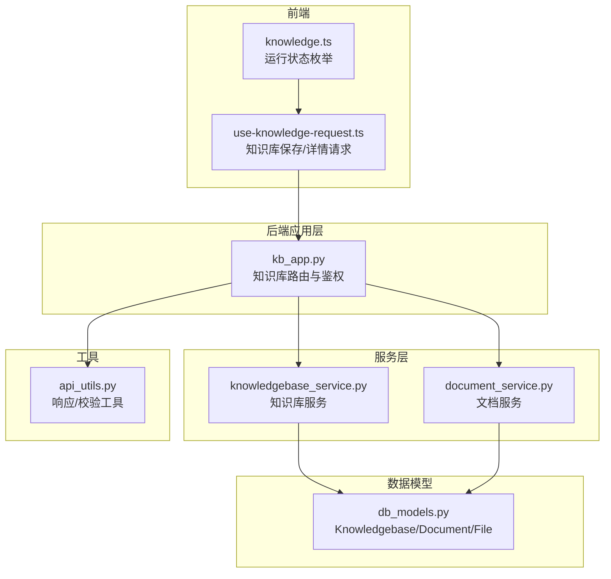
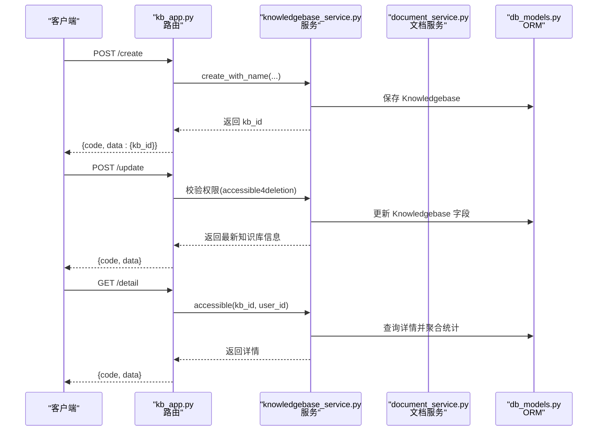
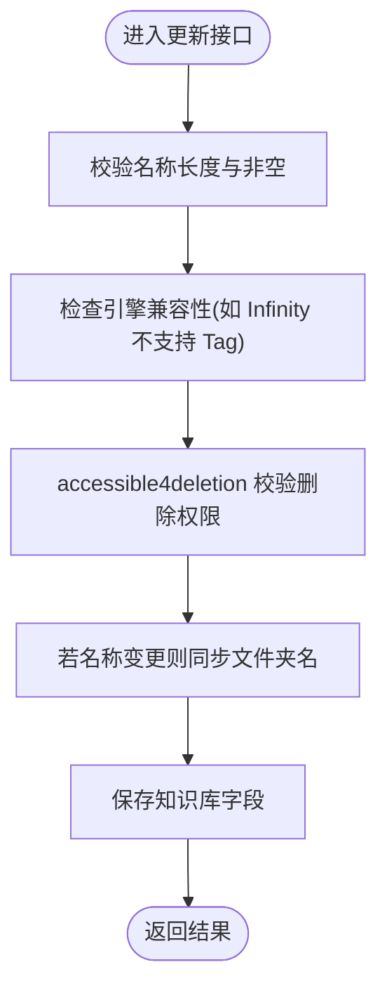
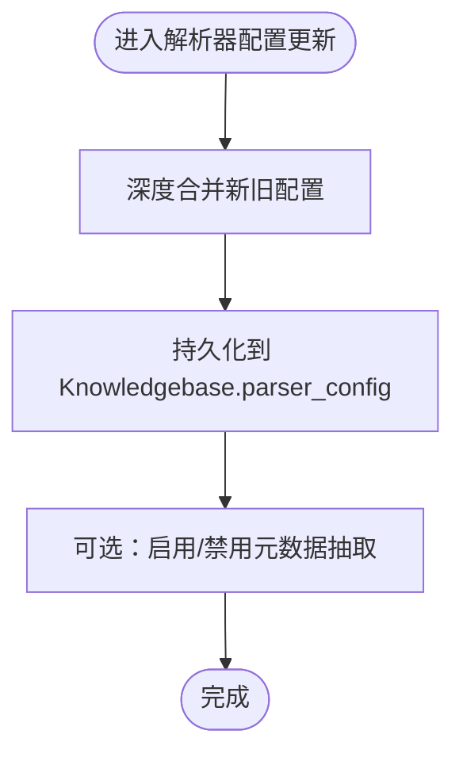
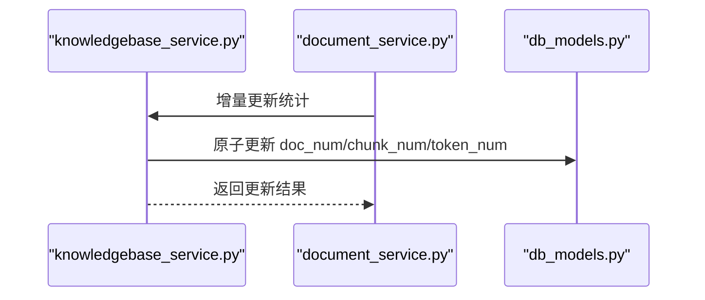
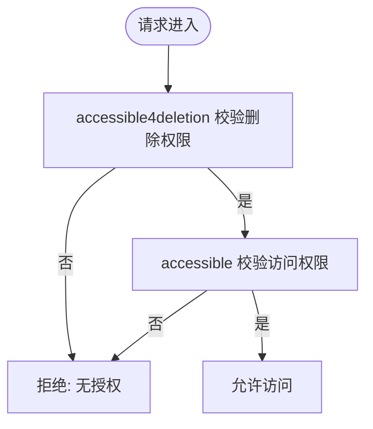
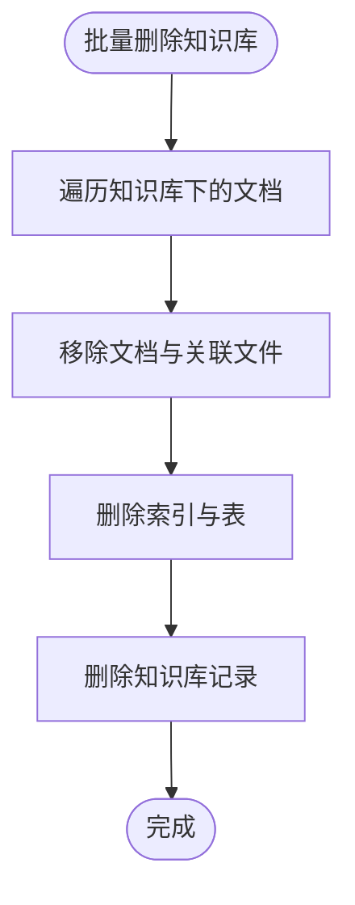
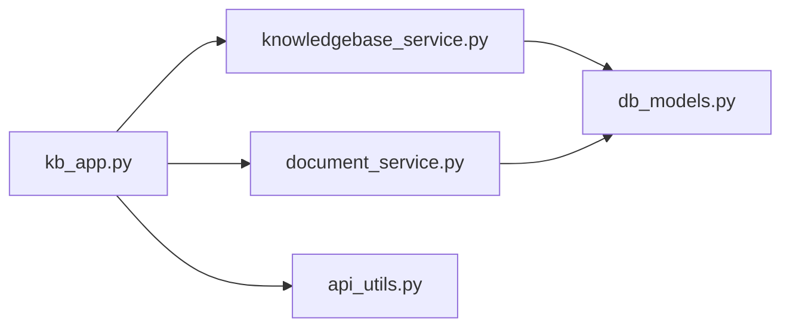

# 知识库管理

<cite>
**本文引用的文件**   
- [api/db/services/knowledgebase_service.py](file://api/db/services/knowledgebase_service.py)
- [api/apps/kb_app.py](file://api/apps/kb_app.py)
- [api/db/db_models.py](file://api/db/db_models.py)
- [api/db/services/document_service.py](file://api/db/services/document_service.py)
- [api/utils/api_utils.py](file://api/utils/api_utils.py)
- [test/testcases/test_web_api/common.py](file://test/testcases/test_web_api/common.py)
- [web/src/hooks/use-knowledge-request.ts](file://web/src/hooks/use-knowledge-request.ts)
- [web/src/constants/knowledge.ts](file://web/src/constants/knowledge.ts)
</cite>

## 目录
1. [简介](#简介)
2. [项目结构](#项目结构)
3. [核心组件](#核心组件)
4. [架构总览](#架构总览)
5. [详细组件分析](#详细组件分析)
6. [依赖关系分析](#依赖关系分析)
7. [性能考量](#性能考量)
8. [故障排查指南](#故障排查指南)
9. [结论](#结论)
10. [附录：API 接口与使用示例](#附录api-接口与使用示例)

## 简介
本文件面向知识库管理系统，系统性梳理知识库的创建、配置、更新、删除、统计与权限控制等全流程机制，并结合后端服务层与应用层代码，给出可执行的 API 使用示例与前端集成要点，帮助开发者快速完成知识库管理功能的集成与扩展。

## 项目结构
围绕知识库管理的关键模块分布如下：
- 应用层（API 路由）：负责请求接入、参数校验、鉴权与调用服务层
- 服务层（业务逻辑）：封装知识库、文档、任务、连接器等核心操作
- 数据模型（ORM）：定义知识库、文档、文件、任务等实体及字段
- 工具与常量：统一响应格式、错误码、参数校验工具
- 前端钩子与常量：知识库页面状态、运行状态枚举、请求封装

**图表来源**
- [api/apps/kb_app.py:54-183](file://api/apps/kb_app.py#L54-L183)
- [api/db/services/knowledgebase_service.py:32-567](file://api/db/services/knowledgebase_service.py#L32-L567)
- [api/db/services/document_service.py:46-200](file://api/db/services/document_service.py#L46-L200)
- [api/db/db_models.py:749-948](file://api/db/db_models.py#L749-L948)
- [api/utils/api_utils.py:150-197](file://api/utils/api_utils.py#L150-L197)
- [web/src/hooks/use-knowledge-request.ts:226-254](file://web/src/hooks/use-knowledge-request.ts#L226-L254)
- [web/src/constants/knowledge.ts:10-26](file://web/src/constants/knowledge.ts#L10-L26)

**章节来源**
- [api/apps/kb_app.py:54-183](file://api/apps/kb_app.py#L54-L183)
- [api/db/services/knowledgebase_service.py:32-197](file://api/db/services/knowledgebase_service.py#L32-L197)
- [api/db/db_models.py:749-948](file://api/db/db_models.py#L749-L948)
- [api/utils/api_utils.py:150-197](file://api/utils/api_utils.py#L150-L197)
- [web/src/hooks/use-knowledge-request.ts:226-254](file://web/src/hooks/use-knowledge-request.ts#L226-L254)
- [web/src/constants/knowledge.ts:10-26](file://web/src/constants/knowledge.ts#L10-L26)

## 核心组件
- 知识库模型（Knowledgebase）
  - 关键字段：头像、租户归属、名称、语言、描述、权限模式、解析器ID、解析器配置、统计指标（文档数、分块数、token数）、图谱/大模型任务ID与时间戳等
  - 权限模式：个人私有（me）与团队共享（team），通过租户维度与用户-租户关联进行访问控制
- 文档模型（Document）
  - 记录每个文档的解析状态、分块/token统计、来源类型、解析器配置等
- 应用层路由（kb_app.py）
  - 提供创建、更新、删除、列表、详情、元信息、基础统计、标签管理、图谱检索等接口
- 服务层（knowledgebase_service.py、document_service.py）
  - 封装知识库与文档的增删改查、统计聚合、权限校验、解析器配置合并与字段映射
- 工具与常量（api_utils.py）
  - 统一响应体、参数校验装饰器、错误处理

**章节来源**
- [api/db/db_models.py:749-784](file://api/db/db_models.py#L749-L784)
- [api/db/db_models.py:787-814](file://api/db/db_models.py#L787-L814)
- [api/apps/kb_app.py:54-183](file://api/apps/kb_app.py#L54-L183)
- [api/db/services/knowledgebase_service.py:32-197](file://api/db/services/knowledgebase_service.py#L32-L197)
- [api/db/services/document_service.py:46-169](file://api/db/services/document_service.py#L46-L169)
- [api/utils/api_utils.py:150-197](file://api/utils/api_utils.py#L150-L197)

## 架构总览
知识库管理采用“应用层路由 → 服务层 → ORM 模型”的分层设计，配合统一的鉴权与参数校验，确保操作安全与一致性。

**图表来源**
- [api/apps/kb_app.py:54-183](file://api/apps/kb_app.py#L54-L183)
- [api/db/services/knowledgebase_service.py:376-431](file://api/db/services/knowledgebase_service.py#L376-L431)
- [api/db/services/document_service.py:252-292](file://api/db/services/document_service.py#L252-L292)
- [api/db/db_models.py:749-784](file://api/db/db_models.py#L749-L784)

## 详细组件分析

### 知识库基本信息管理
- 名称与描述
  - 创建与更新均对名称长度与字符集进行限制；更新时支持重命名并同步文件夹名
- 头像与语言
  - 支持头像字段（base64）与语言字段（如中/英）
- 租户归属与权限
  - 知识库以 tenant_id 归属，permission 支持 me（个人私有）与 team（团队共享）
  - 访问控制通过 UserTenant 关联与 kb.tenant_id 进行校验

**图表来源**
- [api/apps/kb_app.py:77-183](file://api/apps/kb_app.py#L77-L183)
- [api/db/services/knowledgebase_service.py:376-431](file://api/db/services/knowledgebase_service.py#L376-L431)

**章节来源**
- [api/apps/kb_app.py:77-183](file://api/apps/kb_app.py#L77-L183)
- [api/db/db_models.py:749-784](file://api/db/db_models.py#L749-L784)
- [api/db/services/knowledgebase_service.py:474-501](file://api/db/services/knowledgebase_service.py#L474-L501)

### 解析器配置管理
- 默认解析器与合并策略
  - 创建时根据 parser_id 合并默认解析器配置，并注入租户默认 embedding 模型
- 自定义解析器与字段映射
  - 支持深度合并现有配置，保留数组去重；支持删除字段映射
- 元数据与内置元数据
  - 可启用/禁用元数据抽取，并在前端转换为 JSON Schema

**图表来源**
- [api/db/services/knowledgebase_service.py:296-345](file://api/db/services/knowledgebase_service.py#L296-L345)
- [api/apps/kb_app.py:186-199](file://api/apps/kb_app.py#L186-L199)

**章节来源**
- [api/db/services/knowledgebase_service.py:296-345](file://api/db/services/knowledgebase_service.py#L296-L345)
- [api/apps/kb_app.py:186-199](file://api/apps/kb_app.py#L186-L199)

### 统计信息管理
- 实时更新机制
  - 新增文档时原子递增 doc_num；删除文档时按文档统计信息递减
  - 文档解析过程中的 token_num/chunk_num 由下游流程写入
- 基础统计接口
  - 提供基础信息与元信息查询，聚合文档规模与解析状态

**图表来源**
- [api/db/services/knowledgebase_service.py:519-567](file://api/db/services/knowledgebase_service.py#L519-L567)
- [api/db/services/document_service.py:126-169](file://api/db/services/document_service.py#L126-L169)
- [api/db/db_models.py:749-784](file://api/db/db_models.py#L749-L784)

**章节来源**
- [api/db/services/knowledgebase_service.py:519-567](file://api/db/services/knowledgebase_service.py#L519-L567)
- [api/db/services/document_service.py:126-169](file://api/db/services/document_service.py#L126-L169)

### 访问控制与权限管理
- 删除权限
  - 仅知识库创建者可删除（accessible4deletion）
- 通用访问
  - 通过 join UserTenant 与 kb.tenant_id 校验用户是否属于该租户
- 团队共享与个人私有
  - permission=team 时，加入该租户的成员均可访问；permission=me 时仅本人可见

**图表来源**
- [api/db/services/knowledgebase_service.py:52-83](file://api/db/services/knowledgebase_service.py#L52-L83)
- [api/db/services/knowledgebase_service.py:474-487](file://api/db/services/knowledgebase_service.py#L474-L487)

**章节来源**
- [api/db/services/knowledgebase_service.py:52-83](file://api/db/services/knowledgebase_service.py#L52-L83)
- [api/db/services/knowledgebase_service.py:474-487](file://api/db/services/knowledgebase_service.py#L474-L487)

### 批量操作与批量查询
- 批量查询知识库
  - 支持按关键词、解析器ID、排序与分页查询，支持多租户聚合
- 批量删除
  - 删除知识库时，遍历其下所有文档并逐个移除，清理文件与索引，最后删除记录

**图表来源**
- [api/apps/kb_app.py:270-326](file://api/apps/kb_app.py#L270-L326)
- [api/db/services/document_service.py:290-322](file://api/db/services/document_service.py#L290-L322)

**章节来源**
- [api/apps/kb_app.py:233-267](file://api/apps/kb_app.py#L233-L267)
- [api/apps/kb_app.py:270-326](file://api/apps/kb_app.py#L270-L326)

### 前端集成要点
- 知识库保存与刷新
  - 使用请求钩子在保存成功后刷新列表或详情缓存
- 运行状态枚举
  - 定义文档解析状态，便于 UI 展示与交互

**章节来源**
- [web/src/hooks/use-knowledge-request.ts:226-254](file://web/src/hooks/use-knowledge-request.ts#L226-L254)
- [web/src/constants/knowledge.ts:10-26](file://web/src/constants/knowledge.ts#L10-L26)

## 依赖关系分析
- 应用层依赖服务层与工具层，服务层依赖 ORM 模型
- 权限控制贯穿应用层与服务层，确保跨模块一致
- 文档服务与知识库服务共同维护统计指标

**图表来源**
- [api/apps/kb_app.py:54-183](file://api/apps/kb_app.py#L54-L183)
- [api/db/services/knowledgebase_service.py:32-197](file://api/db/services/knowledgebase_service.py#L32-L197)
- [api/db/services/document_service.py:46-169](file://api/db/services/document_service.py#L46-L169)
- [api/db/db_models.py:749-948](file://api/db/db_models.py#L749-L948)
- [api/utils/api_utils.py:150-197](file://api/utils/api_utils.py#L150-L197)

**章节来源**
- [api/apps/kb_app.py:54-183](file://api/apps/kb_app.py#L54-L183)
- [api/db/services/knowledgebase_service.py:32-197](file://api/db/services/knowledgebase_service.py#L32-L197)
- [api/db/services/document_service.py:46-169](file://api/db/services/document_service.py#L46-L169)
- [api/db/db_models.py:749-948](file://api/db/db_models.py#L749-L948)
- [api/utils/api_utils.py:150-197](file://api/utils/api_utils.py#L150-L197)

## 性能考量
- 分页与过滤
  - 列表查询支持关键词、解析器ID、排序与分页，避免一次性加载过多数据
- 统计聚合
  - 通过原子更新减少并发冲突；批量删除时串行清理以保证一致性
- 引擎兼容性
  - 在特定引擎下限制某些解析器（如 Infinity 不支持 Tag），避免无效开销

[本节为通用建议，无需具体文件分析]

## 故障排查指南
- 参数缺失或非法
  - 使用参数校验装饰器返回明确错误码与提示
- 未授权访问
  - accessible/accessible4deletion 校验失败会返回认证错误
- 数据库异常
  - 统一通过 server_error_response 输出异常信息与状态码

**章节来源**
- [api/utils/api_utils.py:150-197](file://api/utils/api_utils.py#L150-L197)
- [api/utils/api_utils.py:132-147](file://api/utils/api_utils.py#L132-L147)
- [api/db/services/knowledgebase_service.py:52-83](file://api/db/services/knowledgebase_service.py#L52-L83)

## 结论
知识库管理模块通过清晰的分层设计与严格的权限控制，实现了从创建、配置、更新到删除的全生命周期管理；解析器配置与统计指标的实时维护保障了系统的可观测性与可用性；结合前端钩子与状态枚举，开发者可以快速集成并扩展知识库管理能力。

[本节为总结，无需具体文件分析]

## 附录：API 接口与使用示例

### 基础信息与配置
- 创建知识库
  - 方法与路径：POST /create
  - 请求体字段：name、parser_id（可选）、description（可选）、language（可选）、permission（可选）、avatar（可选）、parser_config（可选）
  - 成功返回：{code: 0, data: {kb_id}}
  - 示例参考：[test/testcases/test_web_api/common.py:171-173](file://test/testcases/test_web_api/common.py#L171-L173)

- 更新知识库
  - 方法与路径：POST /update
  - 请求体字段：kb_id、name、description、parser_id、其他可选字段
  - 成功返回：{code: 0, data: 知识库对象}
  - 示例参考：[test/testcases/test_web_api/common.py:183-185](file://test/testcases/test_web_api/common.py#L183-L185)

- 获取知识库详情
  - 方法与路径：GET /detail?kb_id=...
  - 成功返回：{code: 0, data: 详情对象（含大小、连接器、解析器配置等）}
  - 示例参考：[test/testcases/test_web_api/common.py:193-195](file://test/testcases/test_web_api/common.py#L193-L195)

- 获取基础统计
  - 方法与路径：GET /basic_info?kb_id=...
  - 成功返回：{code: 0, data: 基础统计信息}
  - 示例参考：[test/testcases/test_web_api/common.py:473-486](file://test/testcases/test_web_api/common.py#L473-L486)

- 获取元信息
  - 方法与路径：GET /get_meta?kb_ids=...
  - 成功返回：{code: 0, data: 元信息聚合}
  - 示例参考：[test/testcases/test_web_api/common.py:198-200](file://test/testcases/test_web_api/common.py#L198-L200)

### 列表与批量
- 列出知识库
  - 方法与路径：POST /list
  - 查询参数：keywords、page、page_size、parser_id、orderby、desc
  - 请求体字段：owner_ids（可选）
  - 成功返回：{code: 0, data: {kbs, total}}
  - 示例参考：[test/testcases/test_web_api/common.py:176-180](file://test/testcases/test_web_api/common.py#L176-L180)

- 删除知识库
  - 方法与路径：POST /rm
  - 请求体字段：kb_id
  - 成功返回：{code: 0, data: true}
  - 示例参考：[test/testcases/test_web_api/common.py:188-190](file://test/testcases/test_web_api/common.py#L188-L190)

### 图谱与标签
- 知识图谱
  - 方法与路径：GET /<kb_id>/knowledge_graph
  - 成功返回：{code: 0, data: {graph, mind_map}}
  - 示例参考：[test/testcases/test_web_api/common.py:404-441](file://test/testcases/test_web_api/common.py#L404-L441)

- 标签管理
  - 列出标签：GET /<kb_id>/tags 或 GET /tags?kb_ids=...
  - 删除标签：POST /<kb_id>/rm_tags
  - 重命名标签：POST /<kb_id>/rename_tag
  - 示例参考：[test/testcases/test_web_api/common.py:329-401](file://test/testcases/test_web_api/common.py#L329-L401)

### 前端集成要点
- 保存知识库后刷新缓存
  - 使用请求钩子在保存成功后触发查询客户端失效，刷新列表或详情
  - 参考：[web/src/hooks/use-knowledge-request.ts:226-254](file://web/src/hooks/use-knowledge-request.ts#L226-L254)

- 运行状态展示
  - 使用运行状态枚举渲染解析进度与结果
  - 参考：[web/src/constants/knowledge.ts:10-26](file://web/src/constants/knowledge.ts#L10-L26)