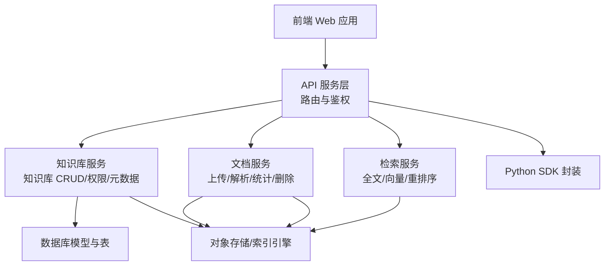
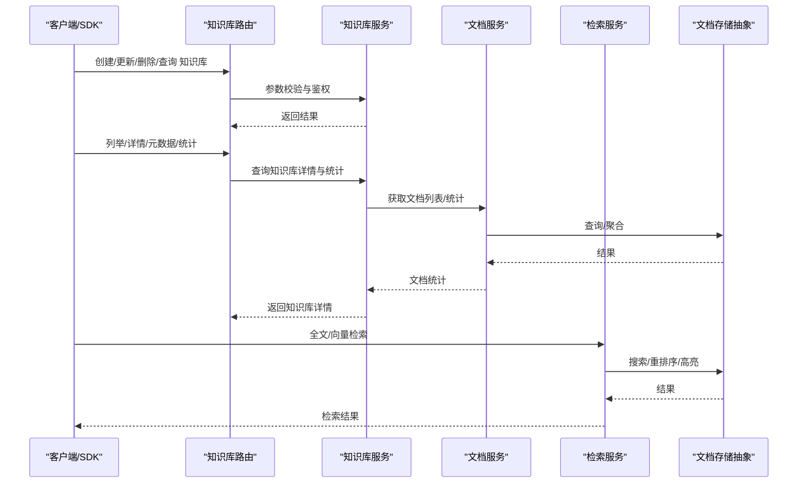
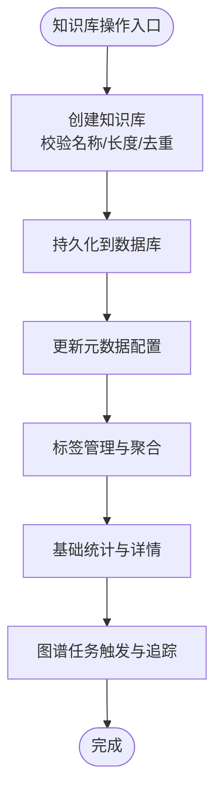
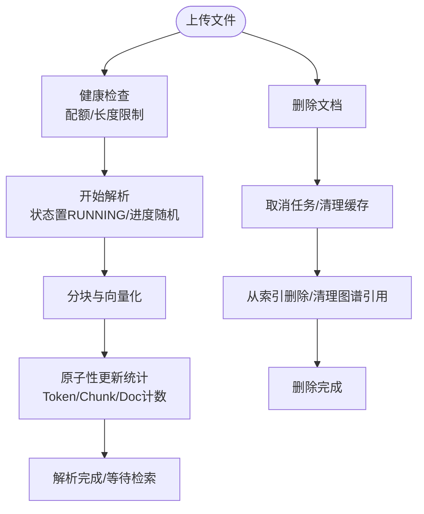
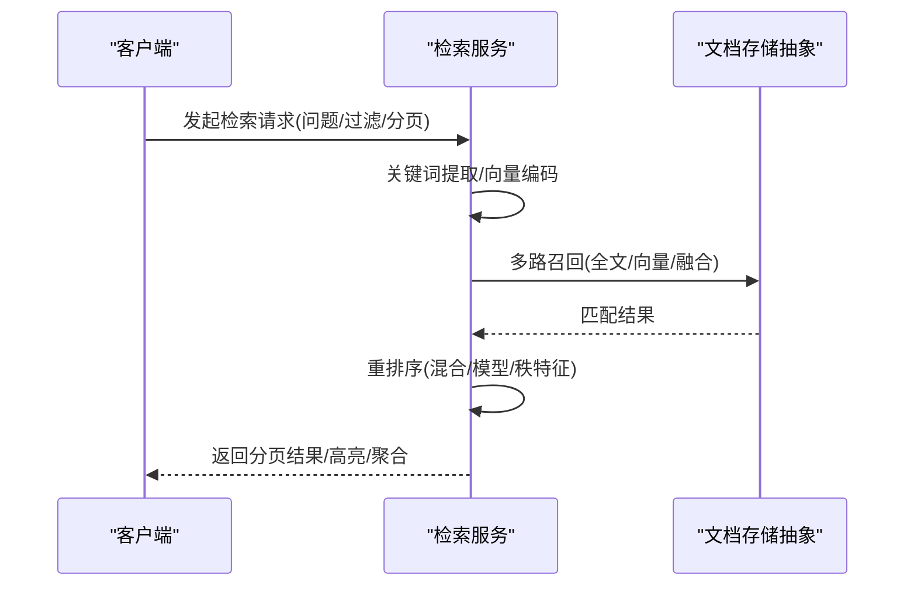
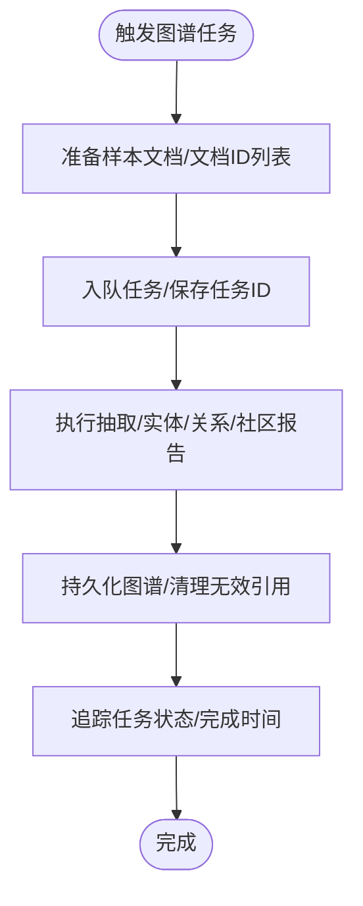
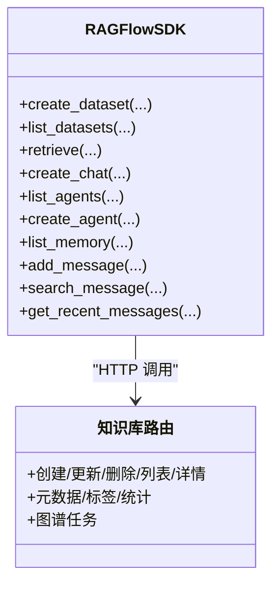
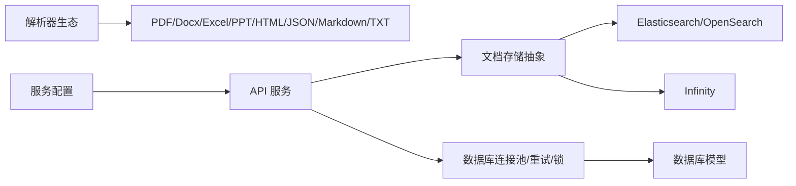

# 知识管理

<cite>
**本文引用的文件**
- [README.md](file://README.md)
- [kb_app.py](file://api/apps/kb_app.py)
- [knowledgebase_service.py](file://api/db/services/knowledgebase_service.py)
- [document_service.py](file://api/db/services/document_service.py)
- [search.py](file://rag/nlp/search.py)
- [doc_store_base.py](file://common/doc_store/doc_store_base.py)
- [ragflow.py](file://sdk/python/ragflow_sdk/ragflow.py)
- [search_app.py](file://api/apps/search_app.py)
- [api_app.py](file://api/apps/api_app.py)
- [service_conf.yaml](file://conf/service_conf.yaml)
- [db_models.py](file://api/db/db_models.py)
- [__init__.py(parser)](file://deepdoc/parser/__init__.py)
- [graph_extractor.py](file://graphrag/general/graph_extractor.py)
</cite>

## 目录
1. [简介](#简介)
2. [项目结构](#项目结构)
3. [核心组件](#核心组件)
4. [架构总览](#架构总览)
5. [详细组件分析](#详细组件分析)
6. [依赖分析](#依赖分析)
7. [性能考虑](#性能考虑)
8. [故障排查指南](#故障排查指南)
9. [结论](#结论)
10. [附录](#附录)

## 简介
本文件面向知识管理系统，系统性梳理知识库的创建、管理与维护流程，覆盖元数据管理、权限控制、版本管理、文档上传与处理、检索与查询、知识图谱构建与管理、性能优化、迁移与备份、以及API与SDK集成等内容。目标是帮助开发者与运维人员快速理解系统架构与实现细节，并提供可操作的实践建议。

## 项目结构
系统采用分层架构：前端Web应用、后端API服务、数据库与对象存储、文档解析与检索引擎、任务执行与消息队列等模块协同工作。核心目录与职责概览如下：
- api/apps：对外HTTP接口路由与业务编排
- api/db：数据库模型与服务层
- rag/nlp：全文检索、向量检索、重排序与聚合
- common/doc_store：文档存储抽象与连接器
- deepdoc/parser：多格式文档解析器
- graphrag：知识图谱抽取与构建
- sdk/python：Python SDK封装
- conf：运行时服务配置
- docker/helm：容器化与部署模板

**图表来源**
- [kb_app.py:1-1004](file://api/apps/kb_app.py#L1-L1004)
- [document_service.py:1-1342](file://api/db/services/document_service.py#L1-L1342)
- [search.py:1-1013](file://rag/nlp/search.py#L1-L1013)
- [db_models.py:1-1306](file://api/db/db_models.py#L1-L1306)

**章节来源**
- [README.md:137-141](file://README.md#L137-L141)

## 核心组件
- 知识库服务：负责知识库的创建、更新、删除、列表、详情、标签管理、元数据设置、基础统计、图谱任务调度等。
- 文档服务：负责文档的上传、解析状态跟踪、分块统计、元数据聚合、删除清理、任务取消与重跑。
- 检索服务：负责全文检索、向量检索、融合重排序、高亮、聚合统计与分页。
- 文档存储抽象：统一不同后端（如Elasticsearch/OpenSearch/Infinity）的检索与写入接口。
- 解析器：支持PDF、Word、Excel、PPT、HTML、JSON、Markdown、TXT等多种格式。
- 知识图谱：基于GraphRAG/RAPTOR/MindMap进行实体关系抽取与可视化。
- SDK：提供Python SDK以简化外部系统集成。

**章节来源**
- [kb_app.py:54-800](file://api/apps/kb_app.py#L54-L800)
- [knowledgebase_service.py:32-567](file://api/db/services/knowledgebase_service.py#L32-L567)
- [document_service.py:46-800](file://api/db/services/document_service.py#L46-L800)
- [search.py:37-800](file://rag/nlp/search.py#L37-L800)
- [doc_store_base.py:143-271](file://common/doc_store/doc_store_base.py#L143-L271)
- [__init__.py(parser):17-41](file://deepdoc/parser/__init__.py#L17-L41)
- [graph_extractor.py:36-153](file://graphrag/general/graph_extractor.py#L36-L153)

## 架构总览
系统通过API网关/路由进入，经鉴权与参数校验后，调用服务层完成业务逻辑，再通过文档存储抽象访问底层索引或数据库，最终返回结果。SDK提供统一的客户端封装。

**图表来源**
- [kb_app.py:54-800](file://api/apps/kb_app.py#L54-L800)
- [knowledgebase_service.py:134-292](file://api/db/services/knowledgebase_service.py#L134-L292)
- [document_service.py:80-169](file://api/db/services/document_service.py#L80-L169)
- [search.py:597-770](file://rag/nlp/search.py#L597-L770)
- [doc_store_base.py:190-208](file://common/doc_store/doc_store_base.py#L190-L208)

## 详细组件分析

### 知识库管理与权限控制
- 创建/更新/删除/列表/详情：提供名称、描述、语言、权限、解析器配置、分页参数等字段的管理能力；支持按租户/团队共享与个人私有。
- 权限控制：基于用户-租户关联判断是否具备删除/修改权限；支持团队共享与拥有者权限。
- 元数据与标签：支持元数据配置开关与Schema转换；支持标签增删改查与聚合统计。
- 基础统计：文档总数、分片总数、Token总量、大小汇总等。
- 图谱任务：支持GraphRAG、RAPTOR、MindMap任务的触发与追踪。

**图表来源**
- [kb_app.py:54-200](file://api/apps/kb_app.py#L54-L200)
- [knowledgebase_service.py:374-430](file://api/db/services/knowledgebase_service.py#L374-L430)
- [document_service.py:717-781](file://api/db/services/document_service.py#L717-L781)

**章节来源**
- [kb_app.py:54-800](file://api/apps/kb_app.py#L54-L800)
- [knowledgebase_service.py:32-567](file://api/db/services/knowledgebase_service.py#L32-L567)
- [db_models.py:750-784](file://api/db/db_models.py#L750-L784)

### 文档上传与处理流程
- 上传与健康检查：对文件名长度、用户配额等进行限制与校验。
- 解析状态与进度：记录解析开始时间、耗时、进度、状态与消息；支持取消/重跑。
- 分块统计与增量更新：解析完成后原子性更新知识库与文档的Token/Chunk计数。
- 删除清理：删除文档时同步取消任务、清理图片/缩略图、从索引删除、清理图谱引用。
- 元数据聚合：支持扁平化与历史兼容两种聚合方式，便于过滤与条件查询。

**图表来源**
- [document_service.py:115-124](file://api/db/services/document_service.py#L115-L124)
- [document_service.py:696-713](file://api/db/services/document_service.py#L696-L713)
- [document_service.py:460-510](file://api/db/services/document_service.py#L460-L510)
- [document_service.py:338-394](file://api/db/services/document_service.py#L338-L394)

**章节来源**
- [document_service.py:46-800](file://api/db/services/document_service.py#L46-L800)

### 检索与查询机制
- 全文检索：支持高亮字段、关键词提取、排序规则。
- 向量检索：支持融合重排序（关键词权重与向量权重），支持不同后端的归一化差异。
- 重排序：支持内置混合相似度与rerank模型；支持秩特征（PageRank/Tag）加权。
- 聚合与分页：按文档维度聚合、分页输出、性能日志记录。
- 过滤与筛选：支持按知识库ID、文档ID、类型、后缀、元数据条件等过滤。

**图表来源**
- [search.py:597-770](file://rag/nlp/search.py#L597-L770)
- [doc_store_base.py:190-208](file://common/doc_store/doc_store_base.py#L190-L208)

**章节来源**
- [search.py:37-800](file://rag/nlp/search.py#L37-L800)
- [doc_store_base.py:143-271](file://common/doc_store/doc_store_base.py#L143-L271)

### 知识图谱构建与管理
- 实体抽取与关系识别：基于GraphRAG流程，结合LLM提示词与迭代挖掘，输出节点与边。
- 图可视化：支持导出图结构与思维导图，支持过滤与裁剪。
- 任务编排：支持GraphRAG、RAPTOR、MindMap三类任务的触发、追踪与状态管理。

**图表来源**
- [kb_app.py:596-800](file://api/apps/kb_app.py#L596-L800)
- [graph_extractor.py:102-153](file://graphrag/general/graph_extractor.py#L102-L153)

**章节来源**
- [kb_app.py:596-800](file://api/apps/kb_app.py#L596-L800)
- [graph_extractor.py:36-153](file://graphrag/general/graph_extractor.py#L36-L153)

### API与SDK
- API：提供知识库、文档、检索、搜索应用、API令牌等接口，统一鉴权与参数校验。
- SDK：提供Python SDK，封装创建数据集、聊天、检索、代理、记忆体等常用操作，便于快速集成。

**图表来源**
- [ragflow.py:27-376](file://sdk/python/ragflow_sdk/ragflow.py#L27-L376)
- [kb_app.py:54-800](file://api/apps/kb_app.py#L54-L800)

**章节来源**
- [api_app.py:26-118](file://api/apps/api_app.py#L26-L118)
- [search_app.py:30-188](file://api/apps/search_app.py#L30-L188)
- [ragflow.py:27-376](file://sdk/python/ragflow_sdk/ragflow.py#L27-L376)

## 依赖分析
- 数据库与连接池：提供MySQL/PostgreSQL连接池与自动重连、事务重试、分布式锁等能力。
- 文档存储抽象：统一检索接口，屏蔽Elasticsearch/OpenSearch/Infinity差异。
- 解析器生态：集中导出多种格式解析器，便于扩展与替换。
- 配置中心：通过YAML配置服务端口、存储、搜索引擎、消息队列等。

**图表来源**
- [db_models.py:242-563](file://api/db/db_models.py#L242-L563)
- [doc_store_base.py:143-271](file://common/doc_store/doc_store_base.py#L143-L271)
- [__init__.py(parser):17-41](file://deepdoc/parser/__init__.py#L17-L41)
- [service_conf.yaml:1-159](file://conf/service_conf.yaml#L1-L159)

**章节来源**
- [db_models.py:242-563](file://api/db/db_models.py#L242-L563)
- [service_conf.yaml:1-159](file://conf/service_conf.yaml#L1-L159)

## 性能考虑
- 检索性能
  - 向量与关键词融合重排序，合理设置权重与阈值，避免过度召回。
  - 使用秩特征（PageRank/Tag）提升相关性排序稳定性。
  - 分页与Rerank窗口控制，避免一次性加载过多结果。
- 写入与索引
  - 批量插入与原子性更新，减少频繁写入带来的锁竞争。
  - 索引创建与删除需谨慎，避免在高峰期执行。
- 并发与限流
  - 检索过程中的并发调用需配合限流与线程池执行，避免阻塞。
  - 任务执行与消息队列配合，保证后台任务有序执行。
- 存储与缓存
  - 对热点查询结果进行缓存，降低后端压力。
  - 对大文件与图片资源采用对象存储，减少数据库膨胀。

[本节为通用指导，无需特定文件引用]

## 故障排查指南
- 知识库删除失败
  - 检查删除权限与租户归属；确认数据库记录与索引均清理完毕。
- 文档解析异常
  - 查看解析状态与进度消息；确认任务是否被取消或重跑。
  - 检查对象存储中是否存在残留图片/缩略图。
- 检索无结果或低质量
  - 调整相似度阈值与向量权重；确认索引是否已建立。
  - 检查关键词提取与高亮字段配置。
- 图谱任务卡住
  - 查看任务ID与状态；确认LLM可用与提示词配置正确。
- API鉴权失败
  - 确认请求头携带正确的Bearer Token；核对令牌有效期与绑定对话/画布。

**章节来源**
- [kb_app.py:270-326](file://api/apps/kb_app.py#L270-L326)
- [document_service.py:338-394](file://api/db/services/document_service.py#L338-L394)
- [search.py:613-770](file://rag/nlp/search.py#L613-L770)
- [api_app.py:26-118](file://api/apps/api_app.py#L26-L118)

## 结论
该知识管理系统围绕“知识库”“文档”“检索”“图谱”四大核心能力构建，通过统一的服务层与抽象存储，实现了跨格式解析、多模态检索、图谱抽取与SDK集成。在工程层面，提供了完善的权限控制、元数据管理、任务编排与可观测性，适合企业级大规模场景部署与二次开发。

[本节为总结性内容，无需特定文件引用]

## 附录

### API与SDK使用要点
- 使用SDK前先获取API Key并设置基础URL与版本号。
- 创建数据集时可指定解析器配置与嵌入模型；检索时可传入相似度阈值、向量权重、TopK等参数。
- 通过检索接口可灵活组合关键词与向量检索，并支持高亮与聚合统计。

**章节来源**
- [ragflow.py:27-376](file://sdk/python/ragflow_sdk/ragflow.py#L27-L376)

### 配置参考
- 服务端口与数据库、对象存储、搜索引擎、Redis等配置集中在YAML文件中，启动前请根据环境调整。
- 支持切换文档引擎（Elasticsearch/OpenSearch/Infinity），切换时需注意数据迁移与索引重建。

**章节来源**
- [service_conf.yaml:1-159](file://conf/service_conf.yaml#L1-L159)