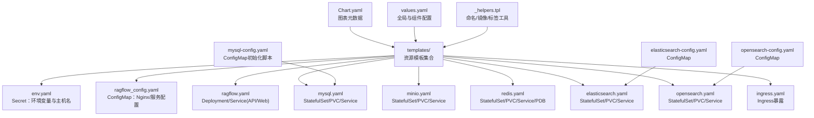
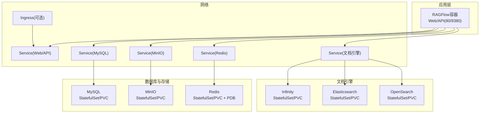
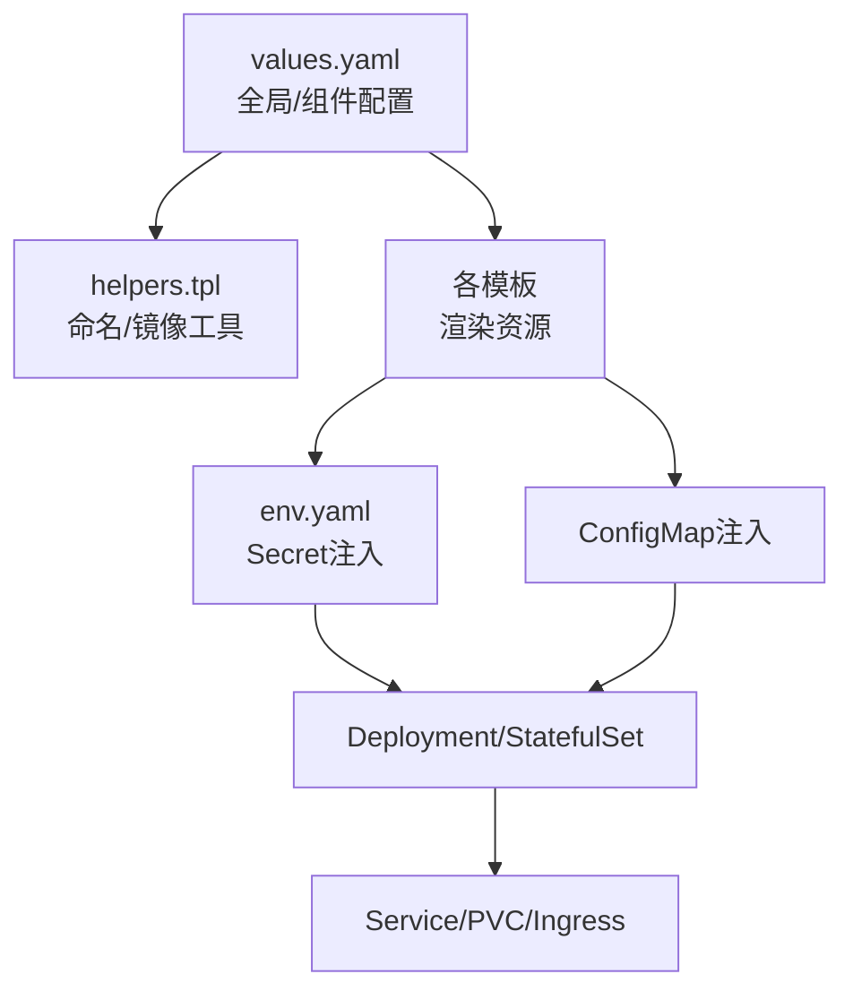

# Kubernetes部署

<cite>
**本文引用的文件**
- [Chart.yaml](file://helm/Chart.yaml)
- [values.yaml](file://helm/values.yaml)
- [README.md](file://helm/README.md)
- [_helpers.tpl](file://helm/templates/_helpers.tpl)
- [env.yaml](file://helm/templates/env.yaml)
- [ragflow_config.yaml](file://helm/templates/ragflow_config.yaml)
- [ragflow.yaml](file://helm/templates/ragflow.yaml)
- [mysql.yaml](file://helm/templates/mysql.yaml)
- [mysql-config.yaml](file://helm/templates/mysql-config.yaml)
- [minio.yaml](file://helm/templates/minio.yaml)
- [redis.yaml](file://helm/templates/redis.yaml)
- [elasticsearch.yaml](file://helm/templates/elasticsearch.yaml)
- [elasticsearch-config.yaml](file://helm/templates/elasticsearch-config.yaml)
- [opensearch.yaml](file://helm/templates/opensearch.yaml)
- [opensearch-config.yaml](file://helm/templates/opensearch-config.yaml)
- [ingress.yaml](file://helm/templates/ingress.yaml)
</cite>

## 目录
1. [简介](#简介)
2. [项目结构](#项目结构)
3. [核心组件](#核心组件)
4. [架构总览](#架构总览)
5. [详细组件分析](#详细组件分析)
6. [依赖关系分析](#依赖关系分析)
7. [性能与资源规划](#性能与资源规划)
8. [部署流程与验证](#部署流程与验证)
9. [存储与备份迁移](#存储与备份迁移)
10. [监控与日志](#监控与日志)
11. [故障排查指南](#故障排查指南)
12. [结论](#结论)

## 简介
本文件面向在Kubernetes上部署RAGFlow的工程师与运维人员，系统性说明Helm Chart的结构与配置、Kubernetes资源设计与关系、集群最佳实践、完整部署流程、存储与备份迁移策略，以及生产环境可观测性的配置方法。文档基于仓库中的helm目录进行深入解析，帮助读者快速、安全地完成生产级部署。

## 项目结构
Helm Chart位于helm目录，采用“应用型图表（application）”组织方式，包含以下关键部分：
- Chart元数据：Chart.yaml定义图表名称、类型、版本与应用版本
- 全局与组件配置：values.yaml集中定义全局镜像仓库前缀、镜像拉取密钥、各组件镜像与资源、存储容量、Ingress等
- 模板渲染：templates目录包含所有Kubernetes资源清单模板，按功能模块拆分
- 辅助模板：_helpers.tpl提供命名、标签、镜像仓库替换等可复用逻辑
- 文档：README.md提供安装、外部服务对接、Ingress暴露、校验等操作指引

图示来源
- [Chart.yaml:1-25](file://helm/Chart.yaml#L1-L25)
- [values.yaml:1-259](file://helm/values.yaml#L1-L259)
- [_helpers.tpl:1-88](file://helm/templates/_helpers.tpl#L1-L88)
- [env.yaml:1-72](file://helm/templates/env.yaml#L1-L72)
- [ragflow_config.yaml:1-90](file://helm/templates/ragflow_config.yaml#L1-L90)
- [ragflow.yaml:1-120](file://helm/templates/ragflow.yaml#L1-L120)
- [mysql.yaml:1-113](file://helm/templates/mysql.yaml#L1-L113)
- [minio.yaml:1-108](file://helm/templates/minio.yaml#L1-L108)
- [redis.yaml:1-136](file://helm/templates/redis.yaml#L1-L136)
- [elasticsearch.yaml:1-132](file://helm/templates/elasticsearch.yaml#L1-L132)
- [opensearch.yaml:1-136](file://helm/templates/opensearch.yaml#L1-L136)
- [ingress.yaml:1-44](file://helm/templates/ingress.yaml#L1-L44)
- [elasticsearch-config.yaml:1-18](file://helm/templates/elasticsearch-config.yaml#L1-L18)
- [opensearch-config.yaml:1-19](file://helm/templates/opensearch-config.yaml#L1-L19)
- [mysql-config.yaml:1-12](file://helm/templates/mysql-config.yaml#L1-L12)

章节来源
- [Chart.yaml:1-25](file://helm/Chart.yaml#L1-L25)
- [values.yaml:1-259](file://helm/values.yaml#L1-L259)
- [README.md:1-134](file://helm/README.md#L1-L134)

## 核心组件
- 应用容器（RAGFlow）
  - 使用Deployment运行Web/API容器，端口80（Web）、9380（API），挂载Nginx配置与可选服务配置/LLM工厂配置
  - 通过Secret注入环境变量，含数据库、对象存储、缓存、文档引擎等连接信息
- 文档引擎（三选一）
  - Infinity：StatefulSet + PVC + Service，端口23817/23820/5432，带存活探针
  - Elasticsearch：StatefulSet + PVC + Service，含initContainer修正权限与sysctl设置
  - OpenSearch：StatefulSet + PVC + Service，含initContainer与存活探针
- 基础设施
  - MySQL：StatefulSet + PVC + Service，启动时创建默认数据库
  - MinIO：StatefulSet + PVC + Service，提供S3兼容对象存储
  - Redis：StatefulSet + PVC + Service + PDB，支持持久化与资源限制
- 网络与入口
  - ClusterIP Service暴露Web/API；可通过Ingress对外暴露
- 配置与密钥
  - Secret统一注入敏感与非敏感环境变量
  - ConfigMap提供Nginx与各文档引擎的配置

章节来源
- [ragflow.yaml:1-120](file://helm/templates/ragflow.yaml#L1-L120)
- [env.yaml:1-72](file://helm/templates/env.yaml#L1-L72)
- [ragflow_config.yaml:1-90](file://helm/templates/ragflow_config.yaml#L1-L90)
- [mysql.yaml:1-113](file://helm/templates/mysql.yaml#L1-L113)
- [minio.yaml:1-108](file://helm/templates/minio.yaml#L1-L108)
- [redis.yaml:1-136](file://helm/templates/redis.yaml#L1-L136)
- [elasticsearch.yaml:1-132](file://helm/templates/elasticsearch.yaml#L1-L132)
- [opensearch.yaml:1-136](file://helm/templates/opensearch.yaml#L1-L136)
- [ingress.yaml:1-44](file://helm/templates/ingress.yaml#L1-L44)

## 架构总览
下图展示RAGFlow在Kubernetes中的整体拓扑：应用容器依赖MySQL、MinIO、Redis与所选文档引擎；通过Service暴露，可选Ingress对外提供Web访问。

图示来源
- [ragflow.yaml:84-120](file://helm/templates/ragflow.yaml#L84-L120)
- [mysql.yaml:96-113](file://helm/templates/mysql.yaml#L96-L113)
- [minio.yaml:86-108](file://helm/templates/minio.yaml#L86-L108)
- [redis.yaml:106-136](file://helm/templates/redis.yaml#L106-L136)
- [elasticsearch.yaml:115-132](file://helm/templates/elasticsearch.yaml#L115-L132)
- [opensearch.yaml:119-136](file://helm/templates/opensearch.yaml#L119-L136)
- [ingress.yaml:1-44](file://helm/templates/ingress.yaml#L1-L44)

## 详细组件分析

### Chart元数据与版本
- 类型：application
- 版本：chart version与app version均在Chart.yaml中定义，遵循语义化版本规范
- 描述：用于在Kubernetes上部署RAGFlow及其依赖

章节来源
- [Chart.yaml:1-25](file://helm/Chart.yaml#L1-L25)

### Helm配置与参数
- 全局镜像仓库与拉取密钥
  - global.repo：为所有镜像添加统一仓库前缀，支持替换registry并保留路径
  - global.imagePullSecrets：全局Pod镜像拉取密钥
- 环境变量（env.*）
  - 文档引擎选择：DOC_ENGINE（infinity/elasticsearch/opensearch）
  - 数据库、对象存储、缓存密码与连接参数
  - 时间区、批量大小等运行参数
- 组件配置
  - ragflow/deployment.strategy/resources：可覆盖滚动更新策略与资源请求/限制
  - elasticsearch/opensearch/infinity/mysql/minio/redis：镜像、存储类、容量、资源、Service类型
  - ingress：是否启用、className、annotations、hosts、tls

章节来源
- [values.yaml:1-259](file://helm/values.yaml#L1-L259)
- [README.md:20-134](file://helm/README.md#L20-L134)

### 资源模板与命名规范
- 名称与标签
  - _helpers.tpl提供name/fullname/chart/labels/selectorLabels/serviceAccountName等通用逻辑
  - 通过模板函数保证DNS兼容与标签一致性
- 镜像仓库替换
  - 支持global.repo对镜像registry进行替换，保留路径

章节来源
- [_helpers.tpl:1-88](file://helm/templates/_helpers.tpl#L1-L88)

### 环境变量与Secret注入
- Secret名称：由fullname拼接后缀生成
- 注入规则
  - 非外部主机变量的env.*键值直接注入
  - 内部服务主机名通过集群DNS自动注入（如：{release}-mysql.{namespace}.svc）
  - 外部服务需显式提供主机与端口，否则触发必填校验
  - 密码与账号注入：MySQL同时注入MYSQL_PASSWORD与MYSQL_ROOT_PASSWORD；MinIO注入MINIO_ROOT_PASSWORD；OpenSearch注入初始管理员密码
- 文档引擎选择
  - 仅注入被选中的引擎主机与端口，避免冗余

章节来源
- [env.yaml:1-72](file://helm/templates/env.yaml#L1-L72)

### Web/API服务与Nginx配置
- Deployment
  - 容器端口：80（Web）、9380（API）
  - 挂载ConfigMap：nginx-config（包含ragflow.conf、proxy.conf、nginx.conf）
  - 可选挂载：local.service_conf.yaml、llm_factories.json
  - 通过Secret注入环境变量
- Service
  - Web：ClusterIP，端口80
  - API：可选独立Service，端口80，目标9380
- ConfigMap
  - 提供Nginx主配置、代理配置与静态资源缓存策略

章节来源
- [ragflow.yaml:1-120](file://helm/templates/ragflow.yaml#L1-L120)
- [ragflow_config.yaml:1-90](file://helm/templates/ragflow_config.yaml#L1-L90)

### 数据库（MySQL）
- StatefulSet + PVC：默认容量与存储类可配置
- 启动参数：字符集、认证插件、TLS版本、初始化脚本路径等
- 初始化脚本：创建默认数据库
- Service：ClusterIP，端口3306

章节来源
- [mysql.yaml:1-113](file://helm/templates/mysql.yaml#L1-L113)
- [mysql-config.yaml:1-12](file://helm/templates/mysql-config.yaml#L1-L12)

### 对象存储（MinIO）
- StatefulSet + PVC：提供S3兼容接口与控制台
- 端口：9000（S3）、9001（Console）
- Service：ClusterIP，端口9000/9001

章节来源
- [minio.yaml:1-108](file://helm/templates/minio.yaml#L1-L108)

### 缓存（Redis）
- StatefulSet + PVC + Headless Service：Headless用于稳定Pod网络标识
- 命令行参数：密码、内存上限与淘汰策略
- PDB：最小可用1，保障高可用
- Service：ClusterIP，端口6379

章节来源
- [redis.yaml:1-136](file://helm/templates/redis.yaml#L1-L136)

### 文档引擎（三选一）
- Infinity
  - StatefulSet + PVC：数据目录挂载至PVC
  - 端口：23817（Thrift）、23820（HTTP）、5432（PostgreSQL兼容）
  - 存活探针：HTTP GET /admin/node/current
- Elasticsearch
  - StatefulSet + PVC：initContainer修正权限与sysctl
  - 端口：9200（HTTP）、9300（Transport）
  - ConfigMap：单节点、磁盘水位、时区等
- OpenSearch
  - StatefulSet + PVC：initContainer修正权限与sysctl
  - 端口：9201（HTTP）
  - ConfigMap：单节点、磁盘水位、时区、端口
  - 存活探针：HTTP Basic Auth访问

章节来源
- [infinity.yaml:1-123](file://helm/templates/infinity.yaml#L1-L123)
- [elasticsearch.yaml:1-132](file://helm/templates/elasticsearch.yaml#L1-L132)
- [elasticsearch-config.yaml:1-18](file://helm/templates/elasticsearch-config.yaml#L1-L18)
- [opensearch.yaml:1-136](file://helm/templates/opensearch.yaml#L1-L136)
- [opensearch-config.yaml:1-19](file://helm/templates/opensearch-config.yaml#L1-L19)

### Ingress暴露
- 可选启用，支持className、annotations、hosts、tls
- 将流量转发至Web Service（端口http）

章节来源
- [ingress.yaml:1-44](file://helm/templates/ingress.yaml#L1-L44)
- [README.md:107-121](file://helm/README.md#L107-L121)

## 依赖关系分析
- 组件耦合
  - RAGFlow依赖MySQL、MinIO、Redis与所选文档引擎
  - 文档引擎三选一，互斥渲染
- 外部服务对接
  - 当*.enabled=false时，需在env中提供对应主机与端口，否则Secret注入阶段会失败
- 资源依赖链
  - Secret与ConfigMap先于Deployment渲染，确保容器启动时具备所需配置与密钥

图示来源
- [values.yaml:1-259](file://helm/values.yaml#L1-L259)
- [_helpers.tpl:1-88](file://helm/templates/_helpers.tpl#L1-L88)
- [env.yaml:1-72](file://helm/templates/env.yaml#L1-L72)
- [ragflow_config.yaml:1-90](file://helm/templates/ragflow_config.yaml#L1-L90)
- [ragflow.yaml:1-120](file://helm/templates/ragflow.yaml#L1-L120)
- [mysql.yaml:1-113](file://helm/templates/mysql.yaml#L1-L113)
- [minio.yaml:1-108](file://helm/templates/minio.yaml#L1-L108)
- [redis.yaml:1-136](file://helm/templates/redis.yaml#L1-L136)
- [elasticsearch.yaml:1-132](file://helm/templates/elasticsearch.yaml#L1-L132)
- [opensearch.yaml:1-136](file://helm/templates/opensearch.yaml#L1-L136)
- [ingress.yaml:1-44](file://helm/templates/ingress.yaml#L1-L44)

## 性能与资源规划
- 资源请求/限制
  - values.yaml中为各组件提供resources.requests（CPU/内存）作为参考，建议结合压测结果调整
- 滚动更新策略
  - 可通过deployment.strategy覆盖默认策略，平衡可用性与更新速度
- 文档引擎优化
  - Elasticsearch/OpenSearch需满足JVM锁页与内核参数要求（initContainer已处理）
  - Infinity提供存活探针，建议配合HPA或扩缩容策略
- 缓存与存储
  - Redis持久化与PVC容量需根据业务峰值调优
  - MySQL/MinIO/Infinity存储容量按数据量与增长预期预留冗余

章节来源
- [values.yaml:153-182](file://helm/values.yaml#L153-L182)
- [elasticsearch.yaml:56-110](file://helm/templates/elasticsearch.yaml#L56-L110)
- [opensearch.yaml:56-114](file://helm/templates/opensearch.yaml#L56-L114)
- [redis.yaml:70-104](file://helm/templates/redis.yaml#L70-L104)

## 部署流程与验证
- 准备工作
  - 确认Kubernetes与Helm版本满足要求
  - 准备存储类（StorageClass）以支持PVC动态供应
- 安装
  - 创建命名空间并安装Chart（示例命令见README）
- 升级与卸载
  - 升级：基于values覆盖文件执行升级
  - 卸载：删除Release
- 校验
  - 使用helm lint与helm template进行语法与渲染校验
  - 观察Pod状态、PVC绑定、Service/Ingress状态
  - 访问Web界面与API端点，确认连通性与基本功能

章节来源
- [README.md:8-18](file://helm/README.md#L8-L18)
- [README.md:122-128](file://helm/README.md#L122-L128)

## 存储与备份迁移
- 存储卷
  - MySQL/MinIO/Redis/Infinity均通过PVC持久化，建议为PVC设置合适的storageClassName与容量
- 备份策略
  - MySQL：建议使用逻辑备份（mysqldump）或物理备份（Percona XtraBackup）结合快照
  - MinIO：建议使用S3兼容的备份工具或对象存储层面的跨区域复制
  - Redis：若启用持久化，结合RDB/AOF策略与定期快照
  - Infinity：建议定期导出数据目录并进行归档
- 迁移方案
  - 通过PVC快照或备份恢复到新集群，或使用对象存储作为中间介质进行跨集群迁移
  - 迁移前后核对连接参数与Secret一致性

章节来源
- [mysql.yaml:4-21](file://helm/templates/mysql.yaml#L4-L21)
- [minio.yaml:4-21](file://helm/templates/minio.yaml#L4-L21)
- [redis.yaml:89-104](file://helm/templates/redis.yaml#L89-L104)
- [infinity.yaml:3-20](file://helm/templates/infinity.yaml#L3-L20)

## 监控与日志
- 可观测性建议
  - 指标采集：Prometheus + Grafana，抓取各组件容器指标与自定义指标
  - 日志采集：Fluent Bit/Fluentd + Elasticsearch/OpenSearch/ Loki，统一收集容器标准输出与Nginx访问日志
  - 健康检查：利用现有存活探针与就绪探针，结合告警策略
- 集成要点
  - 为Deployment/StatefulSet配置资源限制与探针
  - 为Ingress与Service配置注解以适配Ingress控制器与负载均衡器
  - 为Secret与ConfigMap配置变更触发滚动更新（通过checksum注解实现）

章节来源
- [ragflow.yaml:24-26](file://helm/templates/ragflow.yaml#L24-L26)
- [elasticsearch.yaml:44-45](file://helm/templates/elasticsearch.yaml#L44-L45)
- [opensearch.yaml:44-45](file://helm/templates/opensearch.yaml#L44-L45)
- [redis.yaml:42-42](file://helm/templates/redis.yaml#L42-L42)

## 故障排查指南
- 常见问题定位
  - Pod无法启动：检查Secret是否包含必需的主机与密码；查看InitContainer日志（Elasticsearch/OpenSearch）
  - 存储未就绪：确认StorageClass可用、PVC处于Bound状态
  - Ingress不可达：核对className、hosts、tls配置与证书；检查Service端口映射
- 排查步骤
  - 查看Pod事件与日志
  - 校验渲染后的YAML（helm template）
  - 逐步禁用外部服务，确认内部服务能否正常启动
- 关键校验点
  - env.yaml中外部服务主机/端口必填项
  - 文档引擎选择与对应密码/端口注入
  - PVC容量与存储类权限

章节来源
- [env.yaml:19-40](file://helm/templates/env.yaml#L19-L40)
- [elasticsearch.yaml:56-77](file://helm/templates/elasticsearch.yaml#L56-L77)
- [opensearch.yaml:56-77](file://helm/templates/opensearch.yaml#L56-L77)
- [README.md:122-128](file://helm/README.md#L122-L128)

## 结论
本部署文档基于Helm Chart的模板与配置，系统梳理了RAGFlow在Kubernetes上的资源设计、依赖关系与最佳实践。通过合理的资源配置、存储规划与可观测性建设，可在生产环境中稳定运行RAGFlow。建议在上线前完成压测与演练，并建立完善的备份与迁移机制，确保业务连续性。