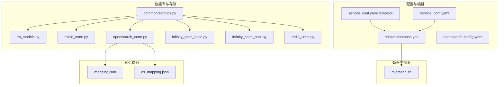
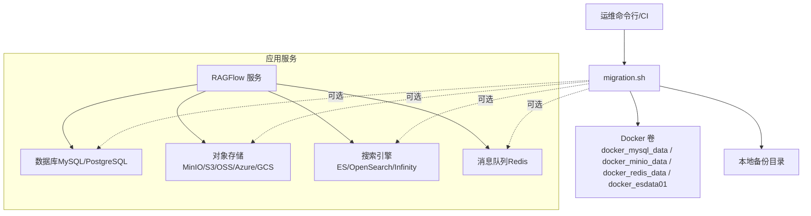
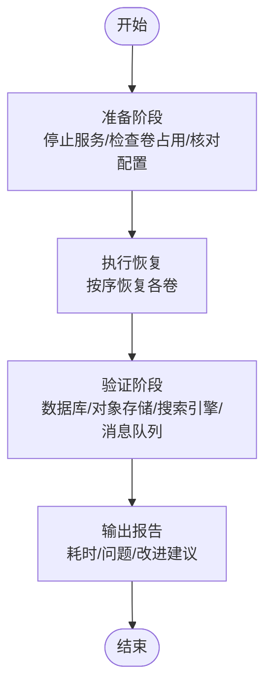
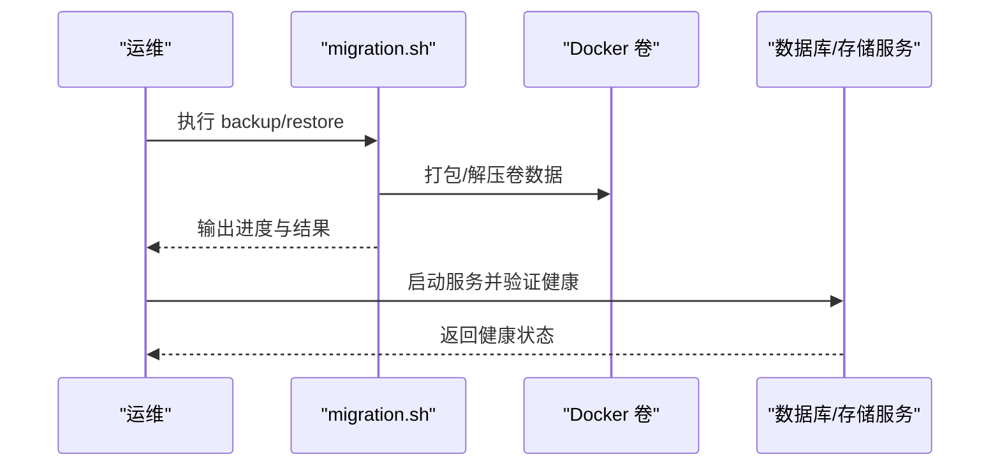
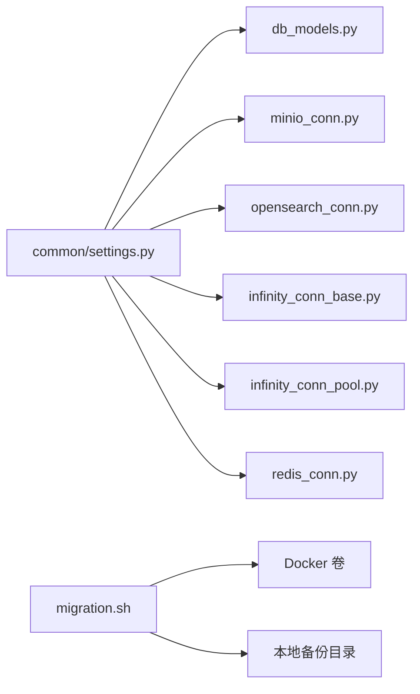

# 备份与恢复

<cite>
**本文引用的文件**   
- [service_conf.yaml（模板）](file://docker/service_conf.yaml.template)
- [service_conf.yaml（本地）](file://conf/service_conf.yaml)
- [Docker Compose（示例）](file://docker/docker-compose.yml)
- [迁移脚本（备份/恢复）](file://docker/migration.sh)
- [数据库模型与重试池](file://api/db/db_models.py)
- [通用设置（含数据库/文档引擎/对象存储）](file://common/settings.py)
- [MinIO 连接封装](file://rag/utils/minio_conn.py)
- [OpenSearch 连接封装](file://rag/utils/opensearch_conn.py)
- [Infinity 连接封装](file://common/doc_store/infinity_conn_base.py)
- [Infinity 连接池封装](file://common/doc_store/infinity_conn_pool.py)
- [Redis 连接封装](file://rag/utils/redis_conn.py)
- [ES 映射（Elasticsearch）](file://conf/mapping.json)
- [ES 映射（OpenSearch）](file://conf/os_mapping.json)
- [Helm 配置（OpenSearch 单节点）](file://helm/templates/opensearch-config.yaml)
- [数据库连接测试接口](file://api/apps/canvas_app.py)
</cite>

## 目录
1. [简介](#简介)
2. [项目结构](#项目结构)
3. [核心组件](#核心组件)
4. [架构总览](#架构总览)
5. [详细组件分析](#详细组件分析)
6. [依赖关系分析](#依赖关系分析)
7. [性能考量](#性能考量)
8. [故障排查指南](#故障排查指南)
9. [结论](#结论)
10. [附录](#附录)

## 简介
本运维文档面向 RAGFlow 的备份与恢复场景，系统化梳理数据备份策略（全量/增量/差异）、备份数据管理与存储、灾难恢复流程与计划、数据库备份与恢复（MySQL、PostgreSQL、Elasticsearch 等）、配置备份与版本管理、备份恢复测试与演练，以及自动化备份方案。文档结合仓库中的配置文件、脚本与组件实现，提供可落地的操作指引与可视化图示。

## 项目结构
围绕备份与恢复的关键文件与目录如下：
- 配置与部署
  - docker/service_conf.yaml.template：服务配置模板（数据库、对象存储、搜索引擎、Redis 等）
  - conf/service_conf.yaml：本地默认配置（演示环境）
  - docker/docker-compose.yml：示例编排（挂载配置模板、日志卷）
  - helm/templates/opensearch-config.yaml：OpenSearch 单节点配置（用于 Helm 部署）
- 备份与恢复脚本
  - docker/migration.sh：基于 Docker 卷的全量备份/恢复工具（MySQL、MinIO、Redis、Elasticsearch）
- 数据库与存储连接
  - api/db/db_models.py：数据库连接池与重试机制（MySQL/PostgreSQL）
  - common/settings.py：统一读取 DB_TYPE、DOC_ENGINE、STORAGE_IMPL 等运行时配置
  - rag/utils/minio_conn.py：MinIO 对象存储连接与健康检查
  - rag/utils/opensearch_conn.py：OpenSearch 连接与索引映射
  - common/doc_store/infinity_conn_base.py、common/doc_store/infinity_conn_pool.py：Infinity 文档存储连接与 SQL 转换
  - rag/utils/redis_conn.py：Redis 连接与健康检查
- 映射与索引
  - conf/mapping.json、conf/os_mapping.json：Elasticsearch/OpenSearch 向量字段映射
- 测试与验证
  - api/apps/canvas_app.py：数据库连接测试接口（MySQL/PostgreSQL）

**图表来源**
- [service_conf.yaml（模板）:1-200](file://docker/service_conf.yaml.template#L1-L200)
- [service_conf.yaml（本地）:1-159](file://conf/service_conf.yaml#L1-L159)
- [Docker Compose（示例）:1-133](file://docker/docker-compose.yml#L1-L133)
- [迁移脚本（备份/恢复）:1-298](file://docker/migration.sh#L1-L298)
- [数据库模型与重试池:1-200](file://api/db/db_models.py#L1-L200)
- [通用设置（含数据库/文档引擎/对象存储）:68-298](file://common/settings.py#L68-L298)
- [MinIO 连接封装:78-132](file://rag/utils/minio_conn.py#L78-L132)
- [OpenSearch 连接封装:68-216](file://rag/utils/opensearch_conn.py#L68-L216)
- [ES 映射（Elasticsearch）:169-212](file://conf/mapping.json#L169-L212)
- [ES 映射（OpenSearch）:169-226](file://conf/os_mapping.json#L169-L226)

**章节来源**
- [service_conf.yaml（模板）:1-200](file://docker/service_conf.yaml.template#L1-L200)
- [service_conf.yaml（本地）:1-159](file://conf/service_conf.yaml#L1-L159)
- [Docker Compose（示例）:1-133](file://docker/docker-compose.yml#L1-L133)
- [迁移脚本（备份/恢复）:1-298](file://docker/migration.sh#L1-L298)

## 核心组件
- 配置中心
  - 通过环境变量与配置文件决定数据库类型（DB_TYPE）、文档引擎（DOC_ENGINE）、对象存储实现（STORAGE_IMPL），并加载对应连接参数。
- 数据库层
  - 支持 MySQL/PostgreSQL，具备连接池与断线重连重试机制，保障事务稳定性。
- 存储层
  - 对象存储支持 MinIO、S3、OSS、Azure Blob、GCS 等；OpenSearch/Elasticsearch 作为向量检索后端；Infinity 作为替代文档存储。
- 备份与恢复
  - 提供基于 Docker 卷的全量备份/恢复脚本，覆盖 MySQL、MinIO、Redis、Elasticsearch 数据卷。

**章节来源**
- [通用设置（含数据库/文档引擎/对象存储）:68-298](file://common/settings.py#L68-L298)
- [数据库模型与重试池:295-391](file://api/db/db_models.py#L295-L391)
- [MinIO 连接封装:78-132](file://rag/utils/minio_conn.py#L78-L132)
- [OpenSearch 连接封装:68-216](file://rag/utils/opensearch_conn.py#L68-L216)
- [Infinity 连接封装:63-225](file://common/doc_store/infinity_conn_base.py#L63-L225)
- [Infinity 连接池封装:39-102](file://common/doc_store/infinity_conn_pool.py#L39-L102)
- [迁移脚本（备份/恢复）:1-298](file://docker/migration.sh#L1-L298)

## 架构总览
下图展示备份与恢复在系统中的位置与交互：

**图表来源**
- [迁移脚本（备份/恢复）:1-298](file://docker/migration.sh#L1-L298)
- [通用设置（含数据库/文档引擎/对象存储）:68-298](file://common/settings.py#L68-L298)
- [Docker Compose（示例）:1-133](file://docker/docker-compose.yml#L1-L133)

## 详细组件分析

### 备份策略与实施方案
- 全量备份
  - 使用迁移脚本对 Docker 卷进行打包归档，生成压缩包，便于离线归档与跨环境迁移。
  - 适用场景：首次部署、重大升级前、跨机房迁移。
- 增量/差异备份
  - 当前脚本为全量卷级备份。若需实现数据库/对象存储层面的增量/差异备份，建议：
    - 数据库：结合业务表结构与时间戳字段，按日期分区或增量日志导出。
    - 对象存储：使用对象存储自带的生命周期规则或增量同步工具。
    - 搜索引擎：导出索引元数据与向量映射，重建索引时按映射重建。
- 配置方法
  - 通过环境变量与配置文件切换 DB_TYPE、DOC_ENGINE、STORAGE_IMPL，确保备份时与生产一致。
  - 在容器启动时挂载配置模板，避免镜像内硬编码导致的不一致。

**章节来源**
- [迁移脚本（备份/恢复）:127-173](file://docker/migration.sh#L127-L173)
- [service_conf.yaml（模板）:1-200](file://docker/service_conf.yaml.template#L1-L200)
- [Docker Compose（示例）:42-43](file://docker/docker-compose.yml#L42-L43)

### 备份数据管理与存储
- 文件组织
  - 建议以“日期_批次”命名备份目录，每个卷生成独立压缩包，便于定位与恢复。
- 存储位置
  - 本地归档盘 + 远程对象存储（如 OSS/S3）双写，满足异地容灾。
- 保留策略
  - 基于时间窗口（如 30/90/180 天）滚动清理旧备份，结合配额限制防止磁盘膨胀。
- 备份验证
  - 定期执行恢复演练，验证压缩包完整性与可恢复性；对数据库与对象存储分别进行读写校验。

**章节来源**
- [迁移脚本（备份/恢复）:127-173](file://docker/migration.sh#L127-L173)

### 灾难恢复流程与计划
- 恢复目标（RTO/RPO）
  - RPO：基于备份频率与增量策略设定；RTO：基于恢复脚本与资源准备时间。
- 恢复步骤
  - 准备阶段：确认环境变量与配置一致，停止业务服务，确认卷未被占用。
  - 执行阶段：按顺序恢复各卷，校验服务健康状态。
  - 验证阶段：对数据库、对象存储、搜索引擎、消息队列进行功能与性能验证。
- 测试与演练
  - 定期在预生产环境执行“备份→恢复→验证”的闭环演练，记录耗时与问题清单。

**图表来源**
- [迁移脚本（备份/恢复）:175-263](file://docker/migration.sh#L175-L263)

**章节来源**
- [迁移脚本（备份/恢复）:175-263](file://docker/migration.sh#L175-L263)

### 数据库备份与恢复（MySQL/PostgreSQL/Elasticsearch）
- MySQL/PostgreSQL
  - 使用迁移脚本对 docker_mysql_data 卷进行全量备份/恢复。
  - 若需更细粒度，可在业务低峰期导出单库/单表，配合时间戳命名与校验。
- Elasticsearch/OpenSearch
  - 使用迁移脚本对 docker_esdata01 卷进行全量备份/恢复。
  - 结合映射文件（mapping.json/os_mapping.json）在新环境中重建索引结构。
- Infinity
  - 通过连接池封装与 SQL 转换能力，结合映射文件进行索引与表结构迁移。

**图表来源**
- [迁移脚本（备份/恢复）:127-263](file://docker/migration.sh#L127-L263)
- [数据库模型与重试池:295-391](file://api/db/db_models.py#L295-L391)
- [OpenSearch 连接封装:68-216](file://rag/utils/opensearch_conn.py#L68-L216)
- [ES 映射（Elasticsearch）:169-212](file://conf/mapping.json#L169-L212)
- [ES 映射（OpenSearch）:169-226](file://conf/os_mapping.json#L169-L226)

**章节来源**
- [迁移脚本（备份/恢复）:127-263](file://docker/migration.sh#L127-L263)
- [数据库模型与重试池:295-391](file://api/db/db_models.py#L295-L391)
- [OpenSearch 连接封装:68-216](file://rag/utils/opensearch_conn.py#L68-L216)
- [ES 映射（Elasticsearch）:169-212](file://conf/mapping.json#L169-L212)
- [ES 映射（OpenSearch）:169-226](file://conf/os_mapping.json#L169-L226)

### 配置备份与版本管理
- 配置项来源
  - DB_TYPE、DOC_ENGINE、STORAGE_IMPL、对象存储与搜索引擎参数均来自配置文件与环境变量。
- 版本管理建议
  - 将 service_conf.yaml 与映射文件纳入版本控制；每次变更打标签并记录影响范围。
  - 通过 CI 自动化校验配置合法性与兼容性。

**章节来源**
- [通用设置（含数据库/文档引擎/对象存储）:68-298](file://common/settings.py#L68-L298)
- [service_conf.yaml（模板）:1-200](file://docker/service_conf.yaml.template#L1-L200)
- [service_conf.yaml（本地）:1-159](file://conf/service_conf.yaml#L1-L159)

### 备份恢复测试与演练
- 数据库连接测试
  - 通过接口对 MySQL/PostgreSQL 进行连通性测试，确保恢复后数据库可用。
- 对象存储与搜索引擎健康检查
  - 通过连接封装的 health 接口验证 MinIO、OpenSearch/ES、Infinity 的可用性。
- 回归验证
  - 恢复后执行典型检索与上传流程，验证端到端功能。

**章节来源**
- [数据库连接测试接口:320-345](file://api/apps/canvas_app.py#L320-L345)
- [MinIO 连接封装:99-122](file://rag/utils/minio_conn.py#L99-L122)
- [OpenSearch 连接封装:85-90](file://rag/utils/opensearch_conn.py#L85-L90)
- [Infinity 连接封装:213-225](file://common/doc_store/infinity_conn_base.py#L213-L225)

### 自动化备份实现方案
- 基于定时任务
  - 在运维主机或 CI 平台设置定时任务，调用迁移脚本执行备份。
- 基于编排
  - 将备份脚本集成到 docker-compose 或 Helm Chart 中，随服务启动自动执行。
- 基于监控告警
  - 结合日志与健康检查，失败时触发通知与重试。

**章节来源**
- [迁移脚本（备份/恢复）:1-298](file://docker/migration.sh#L1-L298)
- [Docker Compose（示例）:1-133](file://docker/docker-compose.yml#L1-L133)

## 依赖关系分析
- 配置依赖
  - common/settings.py 依据 DB_TYPE、DOC_ENGINE、STORAGE_IMPL 决定具体连接实现。
- 组件耦合
  - 迁移脚本依赖 Docker 卷命名与服务健康状态；数据库/存储连接依赖配置文件与环境变量。
- 外部依赖
  - Docker、对象存储服务、搜索引擎集群、数据库实例。

**图表来源**
- [通用设置（含数据库/文档引擎/对象存储）:68-298](file://common/settings.py#L68-L298)
- [数据库模型与重试池:295-391](file://api/db/db_models.py#L295-L391)
- [MinIO 连接封装:78-132](file://rag/utils/minio_conn.py#L78-L132)
- [OpenSearch 连接封装:68-216](file://rag/utils/opensearch_conn.py#L68-L216)
- [Infinity 连接封装:63-225](file://common/doc_store/infinity_conn_base.py#L63-L225)
- [Infinity 连接池封装:39-102](file://common/doc_store/infinity_conn_pool.py#L39-L102)
- [迁移脚本（备份/恢复）:1-298](file://docker/migration.sh#L1-L298)

**章节来源**
- [通用设置（含数据库/文档引擎/对象存储）:68-298](file://common/settings.py#L68-L298)
- [数据库模型与重试池:295-391](file://api/db/db_models.py#L295-L391)
- [MinIO 连接封装:78-132](file://rag/utils/minio_conn.py#L78-L132)
- [OpenSearch 连接封装:68-216](file://rag/utils/opensearch_conn.py#L68-L216)
- [Infinity 连接封装:63-225](file://common/doc_store/infinity_conn_base.py#L63-L225)
- [Infinity 连接池封装:39-102](file://common/doc_store/infinity_conn_pool.py#L39-L102)
- [迁移脚本（备份/恢复）:1-298](file://docker/migration.sh#L1-L298)

## 性能考量
- 备份性能
  - 卷级备份受磁盘 I/O 与压缩算法影响；建议在业务低峰期执行，并选择高性能存储介质。
- 恢复性能
  - 恢复顺序与资源准备（网络、存储、数据库实例）直接影响 RTO；建议提前扩容与预热。
- 搜索引擎
  - 索引重建需考虑映射文件一致性与分片/副本配置，避免恢复后频繁重平衡。

[本节为通用指导，无需特定文件引用]

## 故障排查指南
- Docker 未运行或不可访问
  - 现象：脚本报错退出
  - 处理：启动 Docker 并赋予足够权限
- 卷被占用
  - 现象：提示有容器正在使用目标卷
  - 处理：停止相关容器后再执行备份/恢复
- 备份文件缺失
  - 现象：恢复前校验失败
  - 处理：确认所有卷对应的压缩包存在且完整
- 服务健康检查失败
  - 数据库：检查连接参数与网络连通性
  - 对象存储：检查桶是否存在与权限
  - 搜索引擎：检查集群状态与映射文件

**章节来源**
- [迁移脚本（备份/恢复）:45-114](file://docker/migration.sh#L45-L114)
- [迁移脚本（备份/恢复）:183-207](file://docker/migration.sh#L183-L207)
- [数据库模型与重试池:295-391](file://api/db/db_models.py#L295-L391)
- [MinIO 连接封装:99-122](file://rag/utils/minio_conn.py#L99-L122)
- [OpenSearch 连接封装:85-90](file://rag/utils/opensearch_conn.py#L85-L90)

## 结论
通过统一的配置中心、标准化的 Docker 卷备份/恢复脚本、以及数据库与存储的连接封装，RAGFlow 已具备完善的备份与恢复基础。建议在此基础上完善增量/差异策略、强化自动化与演练、并持续优化恢复流程以满足业务的 RTO/RPO 目标。

[本节为总结，无需特定文件引用]

## 附录
- 快速参考
  - 备份：./docker/migration.sh backup [备份目录]
  - 恢复：./docker/migration.sh restore [备份目录]
  - 配置：docker/service_conf.yaml.template 与 conf/service_conf.yaml
  - 映射：conf/mapping.json、conf/os_mapping.json
  - 运行时配置：common/settings.py

**章节来源**
- [迁移脚本（备份/恢复）:17-43](file://docker/migration.sh#L17-L43)
- [service_conf.yaml（模板）:1-200](file://docker/service_conf.yaml.template#L1-L200)
- [service_conf.yaml（本地）:1-159](file://conf/service_conf.yaml#L1-L159)
- [ES 映射（Elasticsearch）:169-212](file://conf/mapping.json#L169-L212)
- [ES 映射（OpenSearch）:169-226](file://conf/os_mapping.json#L169-L226)
- [通用设置（含数据库/文档引擎/对象存储）:68-298](file://common/settings.py#L68-L298)