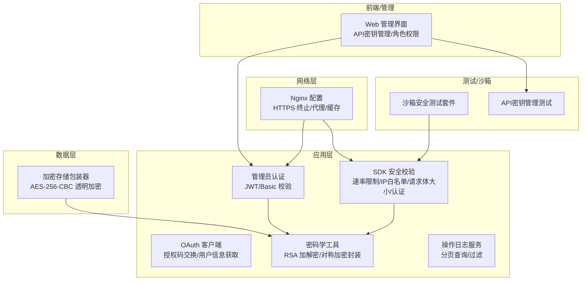
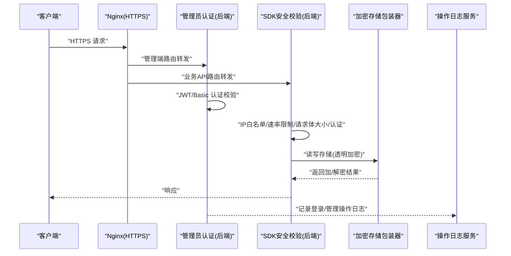
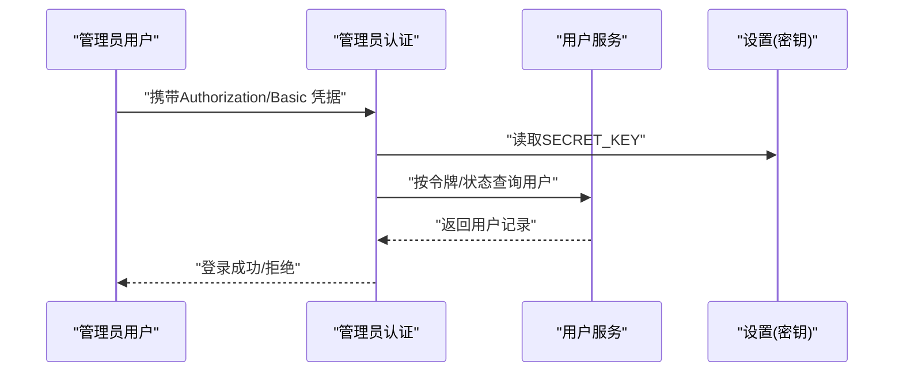
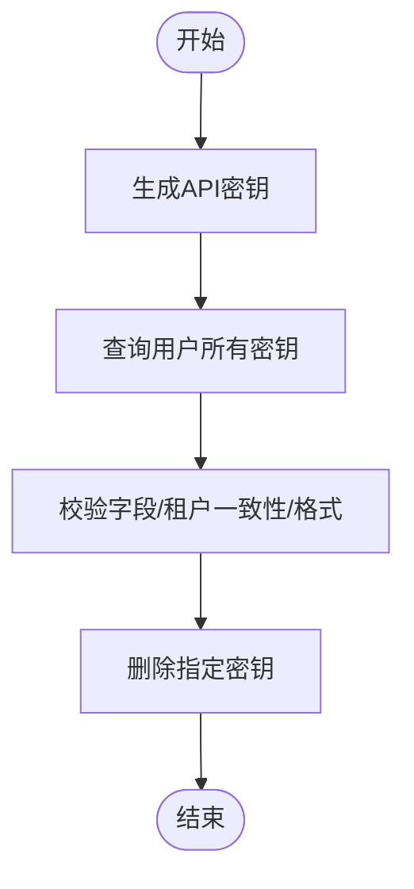
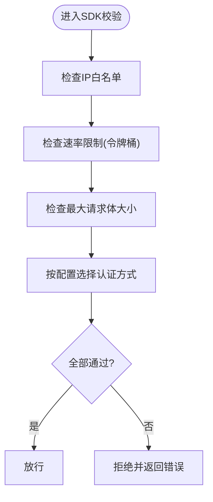
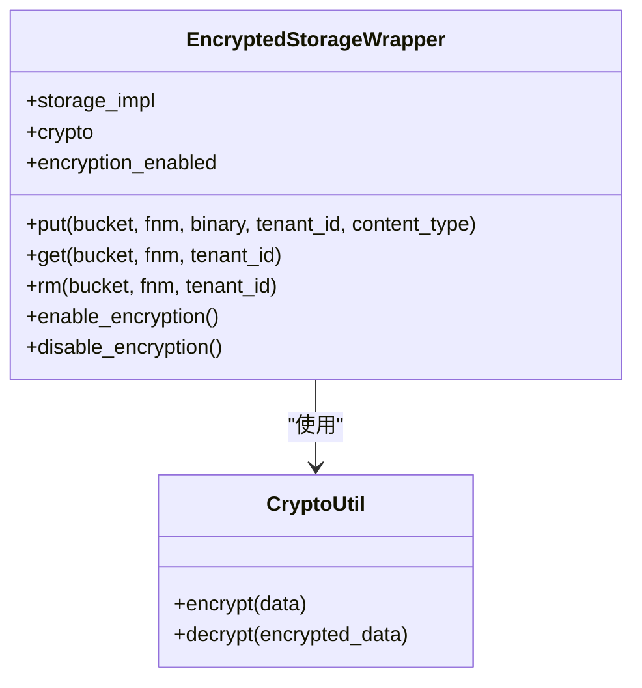
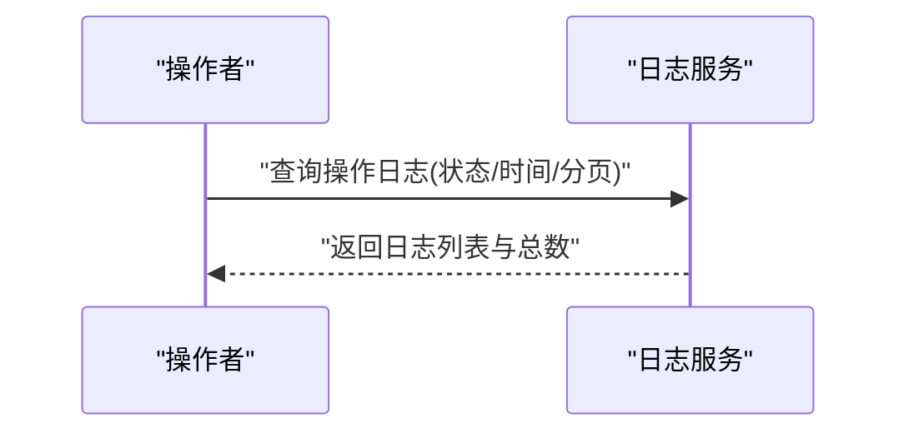
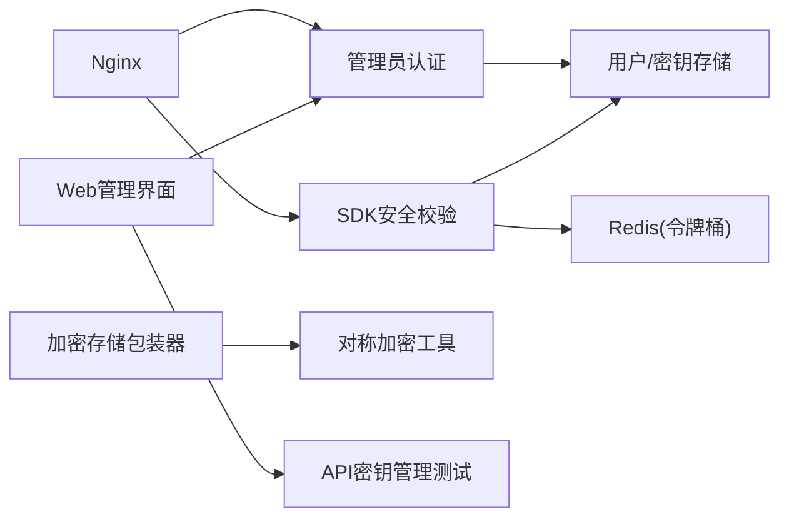

# 安全配置

<cite>
**本文引用的文件**
- [SECURITY.md](file://SECURITY.md)
- [api/apps/auth/oauth.py](file://api/apps/auth/oauth.py)
- [admin/server/auth.py](file://admin/server/auth.py)
- [api/utils/crypt.py](file://api/utils/crypt.py)
- [api/apps/sdk/agents.py](file://api/apps/sdk/agents.py)
- [docker/nginx/ragflow.https.conf](file://docker/nginx/ragflow.https.conf)
- [docker/nginx/nginx.conf](file://docker/nginx/nginx.conf)
- [docker/README.md](file://docker/README.md)
- [rag/utils/encrypted_storage.py](file://rag/utils/encrypted_storage.py)
- [common/crypto_utils.py](file://common/crypto_utils.py)
- [api/db/services/pipeline_operation_log_service.py](file://api/db/services/pipeline_operation_log_service.py)
- [sandbox/tests/sandbox_security_tests_full.py](file://sandbox/tests/sandbox_security_tests_full.py)
- [test/testcases/test_admin_api/test_user_api_key_management/test_get_user_api_key.py](file://test/testcases/test_admin_api/test_user_api_key_management/test_get_user_api_key.py)
- [test/testcases/test_admin_api/test_user_api_key_management/test_delete_user_api_key.py](file://test/testcases/test_admin_api/test_user_api_key_management/test_delete_user_api_key.py)
- [test/testcases/test_admin_api/test_user_api_key_management/test_generate_user_api_key.py](file://test/testcases/test_admin_api/test_user_api_key_management/test_generate_user_api_key.py)
- [web/src/pages/user-setting/interface.ts](file://web/src/pages/user-setting/interface.ts)
- [web/src/services/admin.service.d.ts](file://web/src/services/admin.service.d.ts)
- [test/testcases/test_web_api/test_search_app/test_search_crud.py](file://test/testcases/test_web_api/test_search_app/test_search_crud.py)
</cite>

## 目录
1. [简介](#简介)
2. [项目结构](#项目结构)
3. [核心组件](#核心组件)
4. [架构总览](#架构总览)
5. [详细组件分析](#详细组件分析)
6. [依赖关系分析](#依赖关系分析)
7. [性能考量](#性能考量)
8. [故障排查指南](#故障排查指南)
9. [结论](#结论)
10. [附录](#附录)

## 简介
本运维指南面向RAGFlow项目的安全配置与运行维护，围绕网络安全、身份认证与授权、数据保护、安全审计与合规、威胁防护以及安全事件响应等方面，结合代码库中的实现与配置文件，提供可落地的操作步骤、检查清单与最佳实践，帮助团队建立并持续改进系统的整体安全能力。

## 项目结构
RAGFlow在安全相关方面主要涉及以下层次：
- 网络层：通过Nginx进行HTTPS终止、访问日志与静态资源缓存、上游代理转发。
- 应用层：后端服务负责认证鉴权、API密钥管理、SDK安全校验（速率限制、IP白名单、最大请求体、令牌/Basic/JWT校验）。
- 数据层：存储侧支持透明加密包装器，结合对称加密工具类实现数据在存储介质上的加密。
- 前端与管理界面：提供API密钥生成、查看、删除等管理能力，并定义角色权限模型。
- 测试与沙箱：包含针对SDK安全校验与沙箱安全的测试用例，用于验证安全策略执行情况。

图示来源
- [docker/nginx/ragflow.https.conf:1-47](file://docker/nginx/ragflow.https.conf#L1-L47)
- [admin/server/auth.py:38-189](file://admin/server/auth.py#L38-L189)
- [api/apps/auth/oauth.py:32-152](file://api/apps/auth/oauth.py#L32-L152)
- [api/apps/sdk/agents.py:194-315](file://api/apps/sdk/agents.py#L194-L315)
- [api/utils/crypt.py:25-65](file://api/utils/crypt.py#L25-L65)
- [rag/utils/encrypted_storage.py:23-270](file://rag/utils/encrypted_storage.py#L23-L270)
- [api/db/services/pipeline_operation_log_service.py:249-265](file://api/db/services/pipeline_operation_log_service.py#L249-L265)
- [sandbox/tests/sandbox_security_tests_full.py:381-415](file://sandbox/tests/sandbox_security_tests_full.py#L381-L415)
- [test/testcases/test_admin_api/test_user_api_key_management/test_get_user_api_key.py:35-158](file://test/testcases/test_admin_api/test_user_api_key_management/test_get_user_api_key.py#L35-L158)

章节来源
- [docker/nginx/nginx.conf:1-34](file://docker/nginx/nginx.conf#L1-L34)
- [docker/nginx/ragflow.https.conf:1-47](file://docker/nginx/ragflow.https.conf#L1-L47)

## 核心组件
- 网络与TLS
  - 使用Nginx作为反向代理与HTTPS终止，启用证书链与私钥挂载，开启Gzip压缩与静态资源缓存，区分管理端与业务端路由。
- 身份认证与授权
  - 管理员登录采用基于序列化令牌的加载器，支持Basic认证校验；OAuth客户端支持授权码换取Token与用户信息获取。
- API密钥与角色权限
  - 提供API密钥的生成、查询、删除；前端类型定义包含角色权限结构，便于UI侧展示与交互。
- SDK安全校验
  - 支持IP白名单、速率限制（Redis令牌桶）、最大请求体限制、多种认证方式（Token/Basic/JWT）。
- 数据保护
  - 存储层提供透明加密包装器，使用对称加密算法，自动加解密；加密魔数、IV与密文格式统一管理。
- 安全审计
  - 操作日志服务支持按状态、时间范围、分页排序查询，便于审计与合规检查。
- 威胁防护与测试
  - 沙箱安全测试覆盖并发场景与错误统计；同时存在安全策略修复说明文档。

章节来源
- [docker/README.md:210-271](file://docker/README.md#L210-L271)
- [docker/nginx/ragflow.https.conf:1-47](file://docker/nginx/ragflow.https.conf#L1-L47)
- [admin/server/auth.py:38-189](file://admin/server/auth.py#L38-L189)
- [api/apps/auth/oauth.py:32-152](file://api/apps/auth/oauth.py#L32-L152)
- [api/apps/sdk/agents.py:194-315](file://api/apps/sdk/agents.py#L194-L315)
- [rag/utils/encrypted_storage.py:23-270](file://rag/utils/encrypted_storage.py#L23-L270)
- [common/crypto_utils.py:73-111](file://common/crypto_utils.py#L73-L111)
- [api/db/services/pipeline_operation_log_service.py:249-265](file://api/db/services/pipeline_operation_log_service.py#L249-L265)
- [sandbox/tests/sandbox_security_tests_full.py:381-415](file://sandbox/tests/sandbox_security_tests_full.py#L381-L415)
- [SECURITY.md:1-75](file://SECURITY.md#L1-L75)

## 架构总览
下图展示了从Nginx到后端服务、再到存储与日志的端到端安全路径。

图示来源
- [docker/nginx/ragflow.https.conf:25-33](file://docker/nginx/ragflow.https.conf#L25-L33)
- [admin/server/auth.py:38-189](file://admin/server/auth.py#L38-L189)
- [api/apps/sdk/agents.py:194-315](file://api/apps/sdk/agents.py#L194-L315)
- [rag/utils/encrypted_storage.py:49-102](file://rag/utils/encrypted_storage.py#L49-L102)
- [api/db/services/pipeline_operation_log_service.py:249-265](file://api/db/services/pipeline_operation_log_service.py#L249-L265)

## 详细组件分析

### 网络与TLS配置
- HTTPS终止与证书
  - 通过挂载Let’s Encrypt或自签证书至Nginx，启用443监听与HTTP到HTTPS重定向。
  - 启用Gzip压缩与静态资源长期缓存，降低带宽与提升性能。
- 上游代理
  - 区分管理端与业务端路由，分别代理至不同后端端口，便于独立部署与安全隔离。
- 日志
  - 统一访问日志格式，便于后续审计与合规分析。

章节来源
- [docker/nginx/ragflow.https.conf:1-47](file://docker/nginx/ragflow.https.conf#L1-L47)
- [docker/nginx/nginx.conf:13-32](file://docker/nginx/nginx.conf#L13-L32)
- [docker/README.md:210-271](file://docker/README.md#L210-L271)

### 身份认证与授权
- 管理员认证
  - 基于Flask-Login的请求加载器，使用序列化令牌解析与数据库校验，支持空令牌与格式校验。
  - Basic认证校验装饰器，缺失凭据时返回未认证，校验失败返回拒绝。
- OAuth集成
  - 提供授权URL构造、授权码换Token、异步/同步获取用户信息，支持自定义作用域与超时控制。
- 密码学工具
  - RSA公私钥加解密工具，用于前端与CLI侧密码安全传递。

图示来源
- [admin/server/auth.py:38-189](file://admin/server/auth.py#L38-L189)
- [api/utils/crypt.py:25-65](file://api/utils/crypt.py#L25-L65)

章节来源
- [admin/server/auth.py:38-189](file://admin/server/auth.py#L38-L189)
- [api/apps/auth/oauth.py:32-152](file://api/apps/auth/oauth.py#L32-L152)
- [api/utils/crypt.py:25-65](file://api/utils/crypt.py#L25-L65)

### API密钥与角色权限
- API密钥管理
  - 支持生成、查询、删除API密钥；测试覆盖字段完整性、租户一致性与格式校验。
- 角色权限模型
  - 类型定义包含角色与权限结构，支持启用/只读/读写/分享等细粒度权限。

图示来源
- [test/testcases/test_admin_api/test_user_api_key_management/test_generate_user_api_key.py:148-173](file://test/testcases/test_admin_api/test_user_api_key_management/test_generate_user_api_key.py#L148-L173)
- [test/testcases/test_admin_api/test_user_api_key_management/test_get_user_api_key.py:35-158](file://test/testcases/test_admin_api/test_user_api_key_management/test_get_user_api_key.py#L35-L158)
- [test/testcases/test_admin_api/test_user_api_key_management/test_delete_user_api_key.py:55-73](file://test/testcases/test_admin_api/test_user_api_key_management/test_delete_user_api_key.py#L55-L73)
- [web/src/pages/user-setting/interface.ts:1-5](file://web/src/pages/user-setting/interface.ts#L1-L5)
- [web/src/services/admin.service.d.ts:105-169](file://web/src/services/admin.service.d.ts#L105-L169)

章节来源
- [test/testcases/test_admin_api/test_user_api_key_management/test_generate_user_api_key.py:148-173](file://test/testcases/test_admin_api/test_user_api_key_management/test_generate_user_api_key.py#L148-L173)
- [test/testcases/test_admin_api/test_user_api_key_management/test_get_user_api_key.py:35-158](file://test/testcases/test_admin_api/test_user_api_key_management/test_get_user_api_key.py#L35-L158)
- [test/testcases/test_admin_api/test_user_api_key_management/test_delete_user_api_key.py:55-73](file://test/testcases/test_admin_api/test_user_api_key_management/test_delete_user_api_key.py#L55-L73)
- [web/src/pages/user-setting/interface.ts:1-5](file://web/src/pages/user-setting/interface.ts#L1-L5)
- [web/src/services/admin.service.d.ts:105-169](file://web/src/services/admin.service.d.ts#L105-L169)

### SDK安全校验
- IP白名单
  - 支持单IP与CIDR网段匹配，未命中则拒绝请求。
- 速率限制
  - 基于Redis Lua令牌桶实现，支持秒/分钟/小时/天窗口，超过阈值拒绝。
- 最大请求体大小
  - 支持KB/MB单位解析，超过上限直接拒绝。
- 认证方式
  - 支持无认证、Header Token、Basic、JWT等多种模式，按配置选择校验逻辑。

图示来源
- [api/apps/sdk/agents.py:194-315](file://api/apps/sdk/agents.py#L194-L315)

章节来源
- [api/apps/sdk/agents.py:194-315](file://api/apps/sdk/agents.py#L194-L315)

### 数据保护（传输与存储）
- 传输安全
  - 通过Nginx HTTPS终止与证书链，确保客户端与服务端之间的传输加密。
- 存储加密
  - 加密存储包装器对put/get操作进行透明加解密，默认算法与密钥来源于环境变量；支持启用/禁用加密开关。
- 对称加密工具
  - 统一封装加密/解密流程，包含魔数、IV与填充处理，保证兼容性与安全性。

图示来源
- [rag/utils/encrypted_storage.py:23-270](file://rag/utils/encrypted_storage.py#L23-L270)
- [common/crypto_utils.py:73-111](file://common/crypto_utils.py#L73-L111)

章节来源
- [docker/nginx/ragflow.https.conf:10-15](file://docker/nginx/ragflow.https.conf#L10-L15)
- [rag/utils/encrypted_storage.py:23-270](file://rag/utils/encrypted_storage.py#L23-L270)
- [common/crypto_utils.py:73-111](file://common/crypto_utils.py#L73-L111)

### 安全审计与合规
- 操作日志
  - 支持按操作状态、日期范围过滤，支持升序/降序与分页，便于合规审计与问题追溯。
- 访问日志
  - Nginx统一访问日志格式，包含客户端IP、UA、X-Forwarded-For等，满足合规要求。

图示来源
- [api/db/services/pipeline_operation_log_service.py:249-265](file://api/db/services/pipeline_operation_log_service.py#L249-L265)
- [docker/nginx/nginx.conf:17-21](file://docker/nginx/nginx.conf#L17-L21)

章节来源
- [api/db/services/pipeline_operation_log_service.py:249-265](file://api/db/services/pipeline_operation_log_service.py#L249-L265)
- [docker/nginx/nginx.conf:17-21](file://docker/nginx/nginx.conf#L17-L21)

### 威胁防护与测试
- 沙箱安全测试
  - 并发线程执行多组测试用例，输出通过/失败统计与错误详情，便于发现潜在安全问题。
- 安全策略修复
  - 文档中提供针对pickle反序列化的受限加载修复方案，强调在getattr前严格过滤模块与名称。

章节来源
- [sandbox/tests/sandbox_security_tests_full.py:381-415](file://sandbox/tests/sandbox_security_tests_full.py#L381-L415)
- [SECURITY.md:1-75](file://SECURITY.md#L1-L75)

## 依赖关系分析
- 组件耦合
  - Nginx与后端服务通过明确的路由分离，降低耦合；SDK安全校验与Redis令牌桶紧密耦合以实现速率限制。
  - 加密存储包装器依赖底层存储实现与对称加密工具，具备良好的可替换性。
- 外部依赖
  - Redis用于令牌桶限流；Nginx用于HTTPS与反向代理；RSA密钥对用于密码安全传递。
- 潜在风险
  - 若Redis不可用，速率限制可能失效；若证书链不完整，HTTPS会话将失败；若API密钥管理接口未正确鉴权，可能导致越权。

图示来源
- [docker/nginx/ragflow.https.conf:25-33](file://docker/nginx/ragflow.https.conf#L25-L33)
- [api/apps/sdk/agents.py:262-302](file://api/apps/sdk/agents.py#L262-L302)
- [rag/utils/encrypted_storage.py:23-48](file://rag/utils/encrypted_storage.py#L23-L48)
- [test/testcases/test_admin_api/test_user_api_key_management/test_get_user_api_key.py:35-60](file://test/testcases/test_admin_api/test_user_api_key_management/test_get_user_api_key.py#L35-L60)

章节来源
- [api/apps/sdk/agents.py:262-302](file://api/apps/sdk/agents.py#L262-L302)
- [rag/utils/encrypted_storage.py:23-48](file://rag/utils/encrypted_storage.py#L23-L48)

## 性能考量
- Nginx层面
  - 合理设置keepalive超时与Gzip参数，避免过大压缩导致CPU压力；静态资源长缓存减少回源。
- 限流与并发
  - 令牌桶参数需结合业务峰值流量调优，避免误杀正常请求；并发线程数与Redis连接池需平衡。
- 存储加密
  - 加解密开销与块大小相关，建议在批量读写场景下评估吞吐影响。

## 故障排查指南
- HTTPS证书问题
  - 确认fullchain.pem与privkey.pem路径正确且可读；检查Nginx配置中的server_name与监听端口。
- 认证失败
  - 管理员登录：检查Authorization头格式与长度、数据库中用户状态；Basic认证缺失时返回未认证。
  - OAuth：确认授权URL、Token URL与用户信息URL可达，检查回调地址与作用域配置。
- API密钥异常
  - 生成后无法查询：核对租户ID一致性与字段完整性；删除后仍可见：确认查询接口鉴权与缓存。
- 速率限制触发
  - 检查Redis可用性与Lua脚本执行；调整窗口与阈值；确认客户端是否在同一窗口内频繁请求。
- 存储加密异常
  - 检查加密开关状态与密钥环境变量；确认底层存储实现具备必要方法；关注日志异常堆栈。

章节来源
- [docker/nginx/ragflow.https.conf:10-15](file://docker/nginx/ragflow.https.conf#L10-L15)
- [admin/server/auth.py:38-189](file://admin/server/auth.py#L38-L189)
- [api/apps/auth/oauth.py:65-126](file://api/apps/auth/oauth.py#L65-L126)
- [test/testcases/test_admin_api/test_user_api_key_management/test_get_user_api_key.py:35-60](file://test/testcases/test_admin_api/test_user_api_key_management/test_get_user_api_key.py#L35-L60)
- [api/apps/sdk/agents.py:262-302](file://api/apps/sdk/agents.py#L262-L302)
- [rag/utils/encrypted_storage.py:63-102](file://rag/utils/encrypted_storage.py#L63-L102)

## 结论
RAGFlow在网络安全、身份认证、API密钥与权限、数据保护、审计与合规、威胁防护等方面提供了较为完善的实现与配置参考。建议在生产环境中：
- 强制启用HTTPS并定期轮换证书；
- 严格管理API密钥生命周期；
- 合理配置速率限制与IP白名单；
- 开启并完善操作日志与访问日志；
- 持续进行安全测试与漏洞修复；
- 建立标准化的安全事件响应流程与演练机制。

## 附录

### 安全配置检查清单
- 网络与TLS
  - [ ] 已启用HTTPS并正确挂载证书链与私钥
  - [ ] 已配置HTTP到HTTPS重定向
  - [ ] 已启用Gzip与静态资源缓存
  - [ ] 已区分管理端与业务端路由
- 身份认证与授权
  - [ ] 管理员登录已启用JWT/Basic校验
  - [ ] OAuth授权码流程可用，回调地址与作用域正确
  - [ ] RSA密钥对已生成并正确放置
- API密钥与权限
  - [ ] API密钥生成/查询/删除接口可用
  - [ ] 租户ID一致性与字段格式校验通过
  - [ ] 角色权限模型已在前端正确展示
- SDK安全校验
  - [ ] IP白名单生效
  - [ ] 速率限制(令牌桶)可用
  - [ ] 最大请求体限制生效
  - [ ] 认证方式按需启用
- 数据保护
  - [ ] 加密存储包装器已启用
  - [ ] 对称加密算法与密钥配置正确
- 审计与合规
  - [ ] 操作日志可按状态/时间范围查询
  - [ ] 访问日志格式符合合规要求
- 威胁防护与测试
  - [ ] 沙箱安全测试已执行并通过
  - [ ] 已修复相关安全策略漏洞

### 安全事件响应流程
- 事件分类
  - 低/中/高/严重级别划分，依据影响面与潜在损失。
- 应急处理
  - 快速隔离受影响组件，临时关闭或降级相关功能；回滚可疑变更。
- 恢复措施
  - 修复漏洞并验证；恢复服务；清理日志与告警。
- 事后分析
  - 回溯日志与操作记录，形成根因报告与改进项。