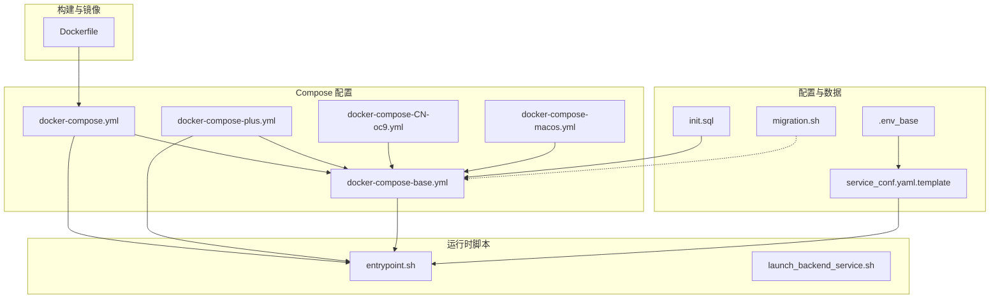
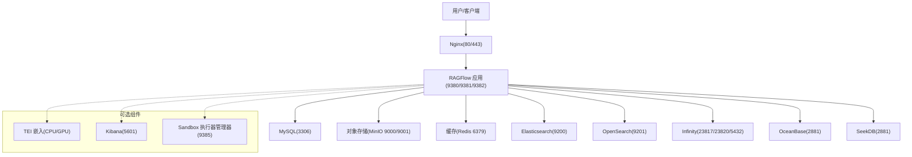
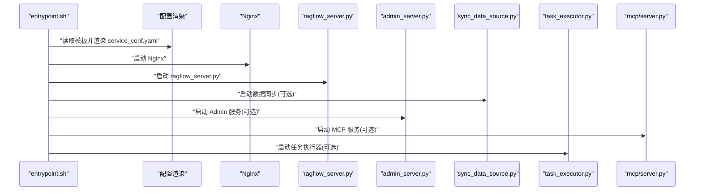
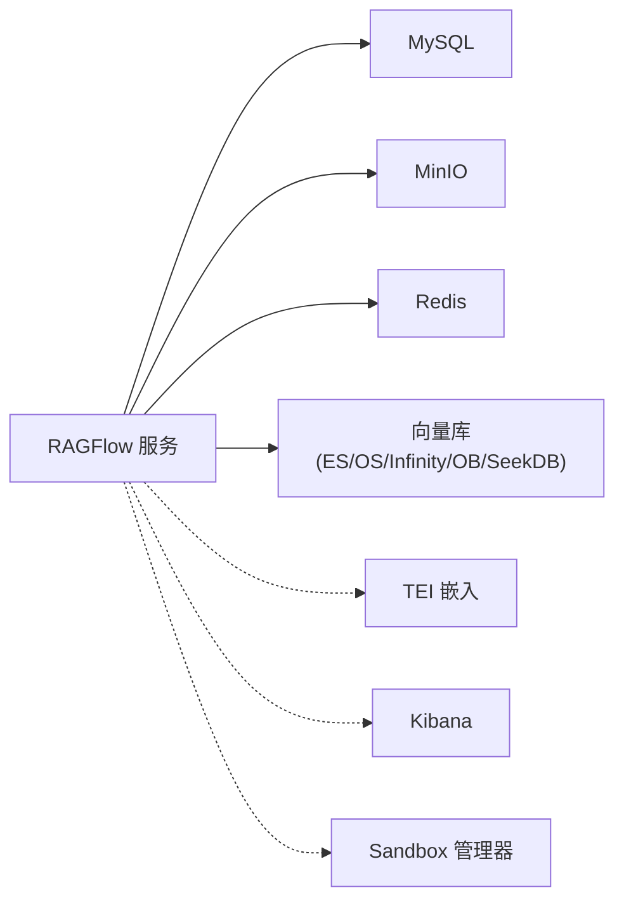

# 容器化部署

<cite>
**本文引用的文件**
- [docker-compose.yml](file://docker/docker-compose.yml)
- [docker-compose-plus.yml](file://docker/docker-compose-plus.yml)
- [docker-compose-base.yml](file://docker/docker-compose-base.yml)
- [docker-compose-CN-oc9.yml](file://docker/docker-compose-CN-oc9.yml)
- [docker-compose-macos.yml](file://docker/docker-compose-macos.yml)
- [entrypoint.sh](file://docker/entrypoint.sh)
- [launch_backend_service.sh](file://docker/launch_backend_service.sh)
- [.env_base](file://docker/.env_base)
- [service_conf.yaml.template](file://docker/service_conf.yaml.template)
- [init.sql](file://docker/init.sql)
- [README.md](file://docker/README.md)
- [migration.sh](file://docker/migration.sh)
- [Dockerfile](file://Dockerfile)
</cite>

## 目录
1. [简介](#简介)
2. [项目结构](#项目结构)
3. [核心组件](#核心组件)
4. [架构总览](#架构总览)
5. [详细组件分析](#详细组件分析)
6. [依赖关系分析](#依赖关系分析)
7. [性能与资源规划](#性能与资源规划)
8. [部署步骤与操作指南](#部署步骤与操作指南)
9. [配置定制与模板使用](#配置定制与模板使用)
10. [常见问题排查](#常见问题排查)
11. [结论](#结论)

## 简介
本指南面向在容器环境中部署 RAGFlow 的用户，围绕 Docker Compose 配置、服务定义、网络与卷挂载、环境变量、CPU/GPU 版本差异、容器启动流程与初始化脚本、部署步骤、配置模板与端口映射、以及常见问题排查进行全面说明。目标是帮助您从零完成稳定、可扩展且可维护的容器化部署。

## 项目结构
与容器化部署直接相关的核心目录与文件如下：
- docker-compose 主配置：docker-compose.yml、docker-compose-plus.yml、docker-compose-base.yml、docker-compose-CN-oc9.yml、docker-compose-macos.yml
- 启动入口与后端服务脚本：entrypoint.sh、launch_backend_service.sh
- 环境变量模板：.env_base（用于生成最终 .env）
- 服务配置模板：service_conf.yaml.template
- 初始化 SQL：init.sql
- 迁移脚本：migration.sh
- 构建镜像：Dockerfile

图表来源
- [docker-compose.yml:1-133](file://docker/docker-compose.yml#L1-L133)
- [docker-compose-plus.yml:1-143](file://docker/docker-compose-plus.yml#L1-L143)
- [docker-compose-base.yml:1-326](file://docker/docker-compose-base.yml#L1-L326)
- [docker-compose-CN-oc9.yml:1-63](file://docker/docker-compose-CN-oc9.yml#L1-L63)
- [docker-compose-macos.yml:1-47](file://docker/docker-compose-macos.yml#L1-L47)
- [entrypoint.sh:1-273](file://docker/entrypoint.sh#L1-L273)
- [launch_backend_service.sh:1-130](file://docker/launch_backend_service.sh#L1-L130)
- [.env_base:1-280](file://docker/.env_base#L1-L280)
- [service_conf.yaml.template:1-200](file://docker/service_conf.yaml.template#L1-L200)
- [init.sql:1-2](file://docker/init.sql#L1-L2)
- [migration.sh:1-298](file://docker/migration.sh#L1-L298)
- [Dockerfile:1-224](file://Dockerfile#L1-L224)

章节来源
- [docker-compose.yml:1-133](file://docker/docker-compose.yml#L1-L133)
- [docker-compose-plus.yml:1-143](file://docker/docker-compose-plus.yml#L1-L143)
- [docker-compose-base.yml:1-326](file://docker/docker-compose-base.yml#L1-L326)
- [docker-compose-CN-oc9.yml:1-63](file://docker/docker-compose-CN-oc9.yml#L1-L63)
- [docker-compose-macos.yml:1-47](file://docker/docker-compose-macos.yml#L1-L47)
- [entrypoint.sh:1-273](file://docker/entrypoint.sh#L1-L273)
- [launch_backend_service.sh:1-130](file://docker/launch_backend_service.sh#L1-L130)
- [.env_base:1-280](file://docker/.env_base#L1-L280)
- [service_conf.yaml.template:1-200](file://docker/service_conf.yaml.template#L1-L200)
- [init.sql:1-2](file://docker/init.sql#L1-L2)
- [migration.sh:1-298](file://docker/migration.sh#L1-L298)
- [Dockerfile:1-224](file://Dockerfile#L1-L224)

## 核心组件
- 服务编排层
  - 基础服务：MySQL、MinIO、Redis、Elasticsearch/OpenSearch/Infinity/OceanBase/SeekDB、Kibana、Sandbox 执行器管理器、TEI 嵌入服务（CPU/GPU）
  - 应用服务：RAGFlow CPU/GPU 服务（通过同一镜像，由 profiles 和 deploy 控制设备）
- 启动与控制层
  - entrypoint.sh：统一入口，负责渲染配置、按标志位启动 Web/Nginx、任务执行器、数据同步、Admin/MCP 服务，支持参数化控制
  - launch_backend_service.sh：独立后端服务启动脚本（非 Compose 默认），含重试与进程管理
- 配置与数据层
  - .env_base：环境变量模板，生成 .env；包含端口、密码、存储、日志级别、线程池等
  - service_conf.yaml.template：RAGFlow 服务配置模板，自动替换环境变量生成最终配置
  - init.sql：初始化数据库脚本
- 迁移与备份
  - migration.sh：对 MySQL、MinIO、Redis、Elasticsearch 数据卷进行打包/恢复

章节来源
- [docker-compose-base.yml:1-326](file://docker/docker-compose-base.yml#L1-L326)
- [docker-compose.yml:1-133](file://docker/docker-compose.yml#L1-L133)
- [docker-compose-plus.yml:1-143](file://docker/docker-compose-plus.yml#L1-L143)
- [entrypoint.sh:1-273](file://docker/entrypoint.sh#L1-L273)
- [launch_backend_service.sh:1-130](file://docker/launch_backend_service.sh#L1-L130)
- [.env_base:1-280](file://docker/.env_base#L1-L280)
- [service_conf.yaml.template:1-200](file://docker/service_conf.yaml.template#L1-L200)
- [init.sql:1-2](file://docker/init.sql#L1-L2)
- [migration.sh:1-298](file://docker/migration.sh#L1-L298)

## 架构总览
下图展示容器化部署的整体交互：RAGFlow 服务通过 Nginx 暴露 Web/HTTPS/API/Admin/MCP 端口；应用服务依赖 MySQL、对象存储（MinIO）、缓存（Redis）与向量库（Elasticsearch/OpenSearch/Infinity/OceanBase/SeekDB）；可选嵌入服务 TEI（CPU/GPU）与 Kibana、Sandbox 执行器管理器。

图表来源
- [docker-compose-base.yml:1-326](file://docker/docker-compose-base.yml#L1-L326)
- [docker-compose.yml:1-133](file://docker/docker-compose.yml#L1-L133)
- [docker-compose-plus.yml:1-143](file://docker/docker-compose-plus.yml#L1-L143)

## 详细组件分析

### Compose 服务定义与参数
- 顶层 include 与基础服务
  - docker-compose.yml/include 引入 docker-compose-base.yml，后者定义了所有依赖服务（MySQL、MinIO、Redis、ES/OpenSearch/Infinity/OceanBase/SeekDB、Kibana、Sandbox、TEI-CPU/GPU 等）
  - 通过 profiles 组合启用不同向量引擎与设备类型
- RAGFlow 服务（CPU/GPU）
  - 共享镜像与入口脚本，通过命令行参数控制是否启用 Admin/MCP 服务
  - 端口映射：Web(HTTP/HTTPS/API/Admin/MCP）
  - 卷挂载：日志、Nginx 配置、模板配置、入口脚本
  - 依赖健康检查：MySQL 健康后才启动
  - GPU 版本通过 deploy.resources.reservations.devices 指定 NVIDIA 设备
- 可选服务
  - TEI 嵌入服务（CPU/GPU）：通过 profiles 或直接启用
  - Kibana：需配合 ES 配置与 profiles
  - Sandbox 执行器管理器：需要主机 Docker Socket 权限

章节来源
- [docker-compose.yml:1-133](file://docker/docker-compose.yml#L1-L133)
- [docker-compose-plus.yml:1-143](file://docker/docker-compose-plus.yml#L1-L143)
- [docker-compose-base.yml:1-326](file://docker/docker-compose-base.yml#L1-L326)

### 网络与卷挂载
- 网络
  - 所有服务位于自定义 bridge 网络 ragflow，服务间通过服务名互访
- 卷
  - 数据持久化：各服务独立命名卷（如 mysql_data、minio_data、redis_data、esdata01 等）
  - 配置与日志：挂载 Nginx 配置、service_conf.yaml.template、日志目录
  - GPU/CUDA：在 plus 模板中挂载 CUDA 库路径以支持 GPU 推理

章节来源
- [docker-compose-base.yml:301-326](file://docker/docker-compose-base.yml#L301-L326)
- [docker-compose-plus.yml:90-117](file://docker/docker-compose-plus.yml#L90-L117)

### 环境变量与模板
- .env_base 提供默认值与注释，生成 .env 后被 Compose 与入口脚本读取
- 关键类别
  - 文档引擎选择：DOC_ENGINE（elasticsearch/infinity/oceanbase/opensearch/seekdb）
  - 设备类型：DEVICE（cpu/gpu）
  - 端口映射：SVR_WEB_HTTP_PORT、SVR_WEB_HTTPS_PORT、SVR_HTTP_PORT、ADMIN_SVR_HTTP_PORT、SVR_MCP_PORT、ES_PORT、OS_PORT、INFINITY_*、OCEANBASE_PORT、MINIO_*、REDIS_PORT、TEI_PORT 等
  - 密码与凭据：ELASTIC_PASSWORD、OPENSEARCH_PASSWORD、MYSQL_PASSWORD、MINIO_USER/PASSWORD、REDIS_PASSWORD、OCEANBASE_*、SEEKDB_* 等
  - 资源限制：MEM_LIMIT
  - 存储与对象：MINIO_USER/PASSWORD、OSS/阿里云 OSS 配置占位
  - 日志与并发：LOG_LEVELS、THREAD_POOL_MAX_WORKERS、DOC_BULK_SIZE、EMBEDDING_BATCH_SIZE
  - 可选功能：REGISTER_ENABLED、SANDBOX_*、USE_DOCLING、MINERU_*、DOTNET_SYSTEM_GLOBALIZATION_INVARIANT 等

章节来源
- [.env_base:1-280](file://docker/.env_base#L1-L280)

### 配置模板与渲染
- service_conf.yaml.template
  - 包含 ragflow/admin、mysql、minio、es/os/infinity/oceanbase/seekdb、redis、oss 等配置项
  - 支持环境变量占位符，由入口脚本在容器内渲染为最终 service_conf.yaml
- 渲染逻辑
  - 入口脚本读取模板，逐行处理带默认值的环境变量占位，输出到 conf/service_conf.yaml
  - 该文件随后被 API 服务器与任务执行器加载

章节来源
- [service_conf.yaml.template:1-200](file://docker/service_conf.yaml.template#L1-L200)
- [entrypoint.sh:151-174](file://docker/entrypoint.sh#L151-L174)

### 容器启动流程与初始化脚本
- entrypoint.sh
  - 参数解析：支持禁用 Web/任务执行器/数据同步、启用 Admin/MCP、范围式任务执行器、主机 ID 等
  - 配置渲染：将 service_conf.yaml.template 渲染为 service_conf.yaml
  - 组件启动：按标志位启动 Nginx + ragflow_server、数据同步、Admin 服务、MCP 服务、任务执行器（单进程或范围/固定数量）
  - 可选 Docling 安装与模型检测
- launch_backend_service.sh
  - 独立后端启动脚本，含 WS 工作进程数、重试机制、信号处理、子进程管理
  - 适用于非 Compose 场景或调试

图表来源
- [entrypoint.sh:182-273](file://docker/entrypoint.sh#L182-L273)

章节来源
- [entrypoint.sh:1-273](file://docker/entrypoint.sh#L1-L273)
- [launch_backend_service.sh:1-130](file://docker/launch_backend_service.sh#L1-L130)

### 不同部署模式与适用场景
- CPU 版本
  - 适合通用推理与中小规模部署，资源占用较低
  - 通过 profiles: cpu 启用
- GPU 版本
  - 适合大模型推理与高吞吐场景，需具备 NVIDIA 驱动与运行时
  - 通过 profiles: gpu 与 deploy.resources.reservations.devices 指定 GPU
- 向量库选择
  - Elasticsearch/OpenSearch：成熟生态，适合传统检索
  - Infinity/SeekDB/OceanBase：国产化替代方案，按需启用对应 profiles
- 嵌入服务
  - TEI（CPU/GPU）：按需启用，提升向量化效率

章节来源
- [docker-compose.yml:5-107](file://docker/docker-compose.yml#L5-L107)
- [docker-compose-plus.yml:56-117](file://docker/docker-compose-plus.yml#L56-L117)
- [docker-compose-base.yml:244-277](file://docker/docker-compose-base.yml#L244-L277)

## 依赖关系分析
- 服务依赖
  - RAGFlow 服务依赖 MySQL 健康后启动
  - 可选组件（ES/OpenSearch/Infinity/OceanBase/SeekDB/Kibana/TEI/Sandbox）通过 profiles 控制启用
- 外部依赖
  - Nginx 作为反向代理，转发至 API/Admin/MCP 端口
  - 对象存储与缓存用于文件与会话存储
- 进程依赖
  - entrypoint.sh 内部管理多个后台进程，彼此通过配置文件与共享卷通信

图表来源
- [docker-compose-base.yml:1-326](file://docker/docker-compose-base.yml#L1-L326)
- [docker-compose.yml:1-133](file://docker/docker-compose.yml#L1-L133)

章节来源
- [docker-compose-base.yml:1-326](file://docker/docker-compose-base.yml#L1-L326)
- [docker-compose.yml:1-133](file://docker/docker-compose.yml#L1-L133)

## 性能与资源规划
- 内存限制
  - MEM_LIMIT 控制容器内存上限，建议根据业务规模与向量库类型调整
- 并发与批处理
  - THREAD_POOL_MAX_WORKERS、DOC_BULK_SIZE、EMBEDDING_BATCH_SIZE 影响吞吐与资源占用
- 端口与网络
  - 确保宿主机端口未被占用，避免冲突
- GPU 调度
  - GPU 版本需正确安装驱动与 nvidia-container-toolkit，deploy.resources.reservations.devices 指定设备

章节来源
- [.env_base:63-280](file://docker/.env_base#L63-L280)
- [docker-compose-plus.yml:110-117](file://docker/docker-compose-plus.yml#L110-L117)

## 部署步骤与操作指南

### 步骤一：准备环境
- 安装 Docker 与 Docker Compose
- 准备 .env 文件：基于 .env_base 设置密码、端口、向量库与设备类型
- 准备 Nginx 配置：根据需要放置 ragflow.conf/ragflow.https.conf 与 proxy.conf
- 准备 service_conf.yaml.template：按需修改数据库、对象存储、向量库等连接参数

章节来源
- [.env_base:1-280](file://docker/.env_base#L1-L280)
- [service_conf.yaml.template:1-200](file://docker/service_conf.yaml.template#L1-L200)
- [README.md:1-271](file://docker/README.md#L1-L271)

### 步骤二：选择部署模式
- CPU 模式：profiles 中包含 cpu
- GPU 模式：profiles 中包含 gpu，并启用 deploy.resources.reservations.devices
- 向量库：选择 DOC_ENGINE 对应的 profiles（elasticsearch/opensearch/infinity/oceanbase/seekdb）

章节来源
- [docker-compose.yml:5-107](file://docker/docker-compose.yml#L5-L107)
- [docker-compose-plus.yml:56-117](file://docker/docker-compose-plus.yml#L56-L117)
- [.env_base:13-28](file://docker/.env_base#L13-L28)

### 步骤三：启动服务
- 使用 docker-compose 命令启动（示例）
  - docker-compose -f docker/docker-compose.yml -f docker/docker-compose-base.yml up -d
- 等待各服务健康：可通过 docker-compose ps 查看状态
- 访问 Web/HTTPS/API/Admin/MCP 端口进行验证

章节来源
- [docker-compose.yml:1-133](file://docker/docker-compose.yml#L1-L133)
- [docker-compose-plus.yml:1-143](file://docker/docker-compose-plus.yml#L1-L143)
- [docker-compose-base.yml:1-326](file://docker/docker-compose-base.yml#L1-L326)

### 步骤四：初始化与验证
- 初次启动会执行 init.sql 创建数据库与使用库
- 通过浏览器访问 Web/HTTPS 端口，确认服务可用
- 如启用 Admin/MCP，分别访问对应端口进行功能验证

章节来源
- [init.sql:1-2](file://docker/init.sql#L1-L2)
- [docker-compose.yml:31-36](file://docker/docker-compose.yml#L31-L36)
- [docker-compose-plus.yml:33-38](file://docker/docker-compose-plus.yml#L33-L38)

### 步骤五：迁移与备份（可选）
- 使用 migration.sh 进行数据卷备份与恢复
  - 备份：./migration.sh backup [目录名]
  - 恢复：./migration.sh restore [目录名]
- 注意：执行前需停止相关容器，避免数据损坏

章节来源
- [migration.sh:1-298](file://docker/migration.sh#L1-L298)

## 配置定制与模板使用

### 环境变量设置
- 必填项
  - MYSQL_PASSWORD、MINIO_USER/PASSWORD、REDIS_PASSWORD、ELASTIC_PASSWORD/OPENSEARCH_PASSWORD 等
- 端口映射
  - SVR_WEB_HTTP_PORT、SVR_WEB_HTTPS_PORT、SVR_HTTP_PORT、ADMIN_SVR_HTTP_PORT、SVR_MCP_PORT
  - ES_PORT、OS_PORT、INFINITY_*、OCEANBASE_PORT、MINIO_PORT/CONSOLE_PORT、REDIS_PORT、TEI_PORT
- 资源与行为
  - MEM_LIMIT、THREAD_POOL_MAX_WORKERS、DOC_BULK_SIZE、EMBEDDING_BATCH_SIZE、REGISTER_ENABLED、USE_DOCLING、SANDBOX_* 等

章节来源
- [.env_base:1-280](file://docker/.env_base#L1-L280)

### 服务配置模板使用
- 修改 service_conf.yaml.template 中的数据库、对象存储、向量库、Redis 等连接参数
- 保存后由入口脚本自动渲染为 service_conf.yaml
- 注意：若使用 HTTPS，需更新 Nginx 配置并挂载证书卷

章节来源
- [service_conf.yaml.template:1-200](file://docker/service_conf.yaml.template#L1-L200)
- [entrypoint.sh:151-174](file://docker/entrypoint.sh#L151-L174)
- [README.md:200-271](file://docker/README.md#L200-L271)

### 端口映射与网络
- 端口映射遵循 .env_base 中的默认值，可在 .env 中覆盖
- 服务间通过服务名互访，无需修改内部 host/port

章节来源
- [.env_base:148-188](file://docker/.env_base#L148-L188)
- [docker-compose-base.yml:1-326](file://docker/docker-compose-base.yml#L1-L326)

## 常见问题排查

### 服务无法启动或频繁重启
- 检查依赖健康：确保 MySQL 健康后再启动 RAGFlow
- 查看日志：容器日志与 Nginx 日志（挂载的 ragflow-logs）
- 端口冲突：确认宿主机端口未被占用

章节来源
- [docker-compose.yml:6-8](file://docker/docker-compose.yml#L6-L8)
- [docker-compose-plus.yml:57-59](file://docker/docker-compose-plus.yml#L57-L59)

### 数据库初始化失败
- 确认 init.sql 是否正确挂载并执行
- 检查 MYSQL_PASSWORD 与数据库权限

章节来源
- [init.sql:1-2](file://docker/init.sql#L1-L2)
- [docker-compose-base.yml:182-194](file://docker/docker-compose-base.yml#L182-L194)

### HTTPS 配置无效
- 确认已挂载证书卷并切换到 HTTPS 配置文件
- 更新 Nginx 配置中的域名与证书路径

章节来源
- [README.md:200-271](file://docker/README.md#L200-L271)

### GPU 推理不可用
- 确认已启用 GPU profiles 与 deploy.resources.reservations.devices
- 检查宿主机 NVIDIA 驱动与 nvidia-container-toolkit 安装情况

章节来源
- [docker-compose-plus.yml:110-117](file://docker/docker-compose-plus.yml#L110-L117)

### 数据迁移失败或数据丢失
- 执行前先停止相关容器
- 备份现有数据卷，再执行恢复
- 确认备份文件完整存在

章节来源
- [migration.sh:104-110](file://docker/migration.sh#L104-L110)
- [migration.sh:224-232](file://docker/migration.sh#L224-L232)

## 结论
通过 Docker Compose 的模块化设计与入口脚本的统一调度，RAGFlow 在容器环境中实现了灵活、可扩展的部署能力。结合 .env_base 与 service_conf.yaml.template，用户可以快速适配不同硬件与数据栈需求。建议在生产环境重点关注资源规划、HTTPS 与备份策略，并根据业务规模选择合适的向量库与设备类型。