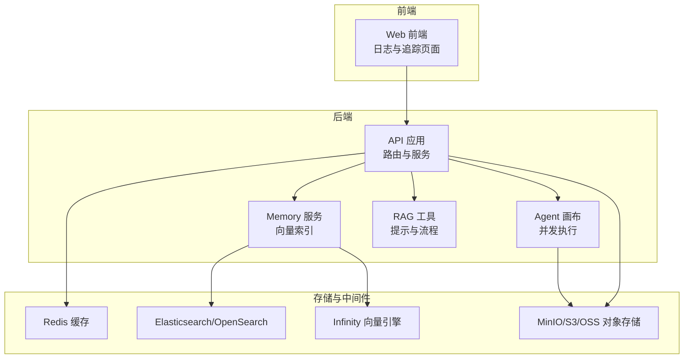
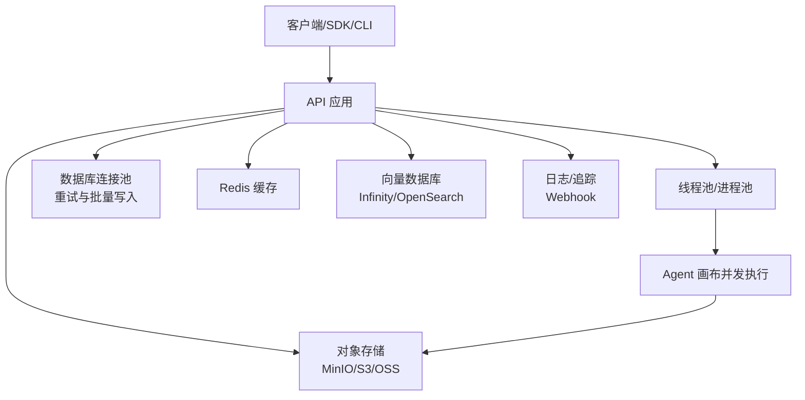
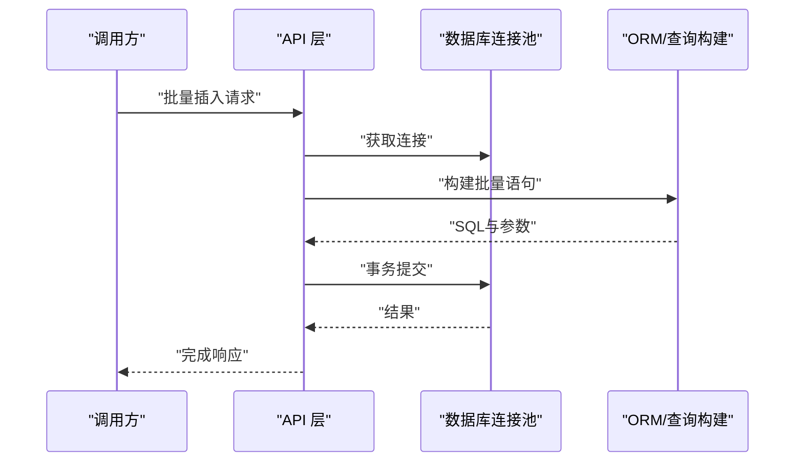
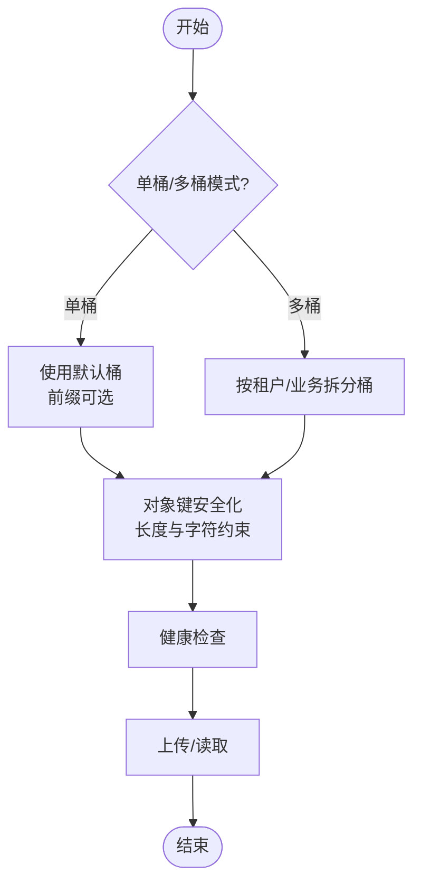
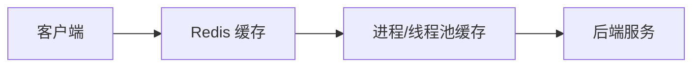
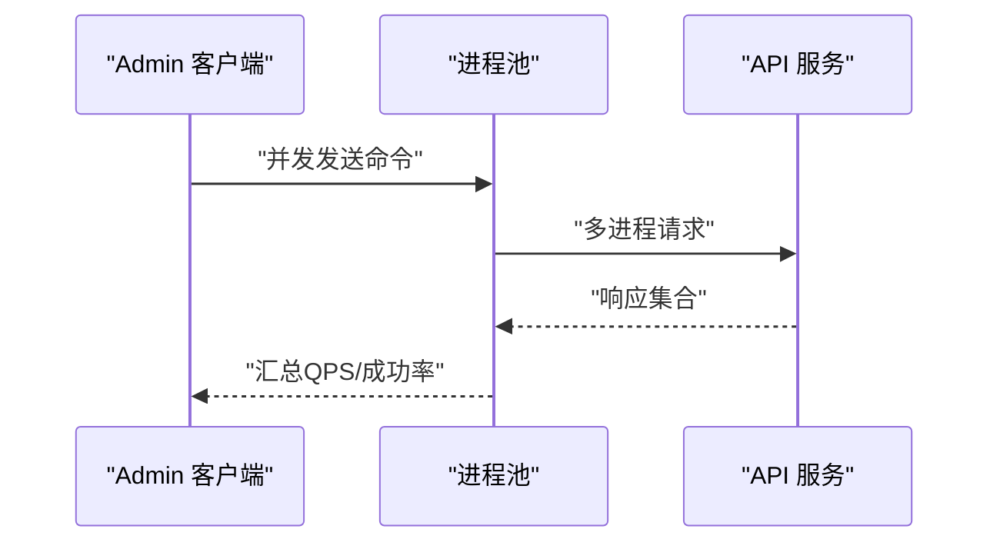
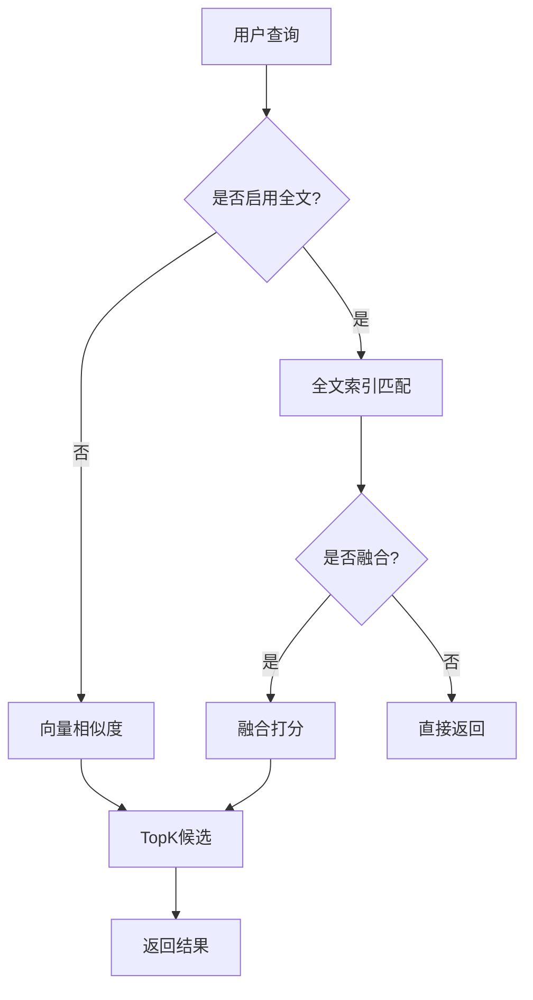
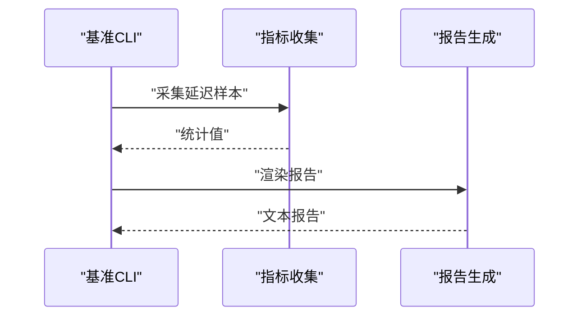
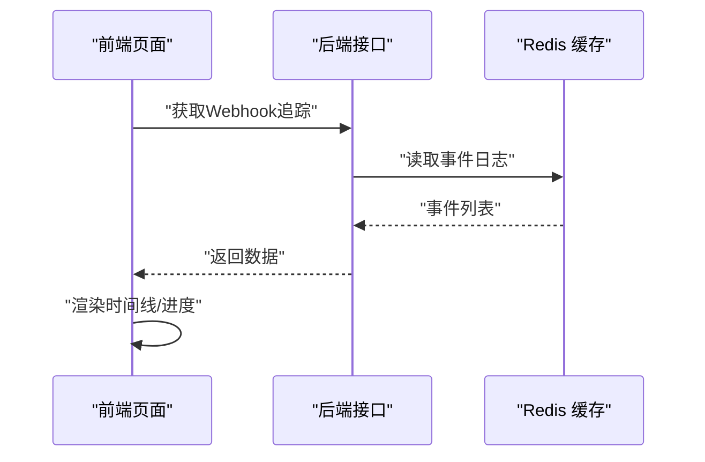
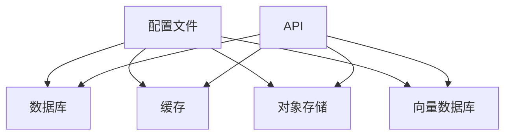

# 性能调优

<cite>
**本文引用的文件**
- [service_conf.yaml（模板）](file://docker/service_conf.yaml.template)
- [service_conf.yaml（示例）](file://conf/service_conf.yaml)
- [数据库连接与重试装饰器](file://api/db/db_models.py)
- [批量写入工具](file://api/db/db_utils.py)
- [线程池管理与统计](file://common/misc_utils.py)
- [并发解析文档测试](file://test/testcases/test_sdk_api/test_file_management_within_dataset/test_parse_documents.py)
- [Admin 客户端基准测试](file://admin/client/ragflow_client.py)
- [基准测试指标与汇总](file://test/benchmark/metrics.py)
- [基准测试报告生成](file://test/benchmark/report.py)
- [MinIO 连接与健康检查](file://rag/utils/minio_conn.py)
- [Infinity 连接池与URI构造](file://common/doc_store/infinity_conn_pool.py)
- [Infinity SQL转换与执行](file://common/doc_store/infinity_conn_base.py)
- [OceanBase 连接与环境变量加载](file://rag/utils/ob_conn.py)
- [Redis 配置（Helm）](file://helm/templates/redis.yaml)
- [消息服务向量索引操作](file://memory/services/messages.py)
- [Agent画布并发执行](file://agent/canvas.py)
- [数据源并发工具](file://common/data_source/utils.py)
- [SDK Agent Webhook追踪](file://api/apps/sdk/agents.py)
- [前端Agent日志页面](file://web/src/pages/agents/agent-log-page.tsx)
- [前端Webhook追踪Hook](file://web/src/hooks/use-agent-request.ts)
- [前端MC服务器请求Hook](file://web/src/hooks/use-mcp-request.ts)
- [RAG提示：多查询生成](file://rag/prompts/multi_queries_gen.md)
</cite>

## 目录
1. [简介](#简介)
2. [项目结构](#项目结构)
3. [核心组件](#核心组件)
4. [架构总览](#架构总览)
5. [详细组件分析](#详细组件分析)
6. [依赖分析](#依赖分析)
7. [性能考量](#性能考量)
8. [故障排查指南](#故障排查指南)
9. [结论](#结论)
10. [附录](#附录)

## 简介
本指南面向RAGFlow项目的性能调优实践，聚焦以下关键领域：
- CPU密集型任务优化：线程池配置、异步执行、并发调度
- 内存使用控制：批处理、连接池参数、对象存储路径与前缀
- I/O性能提升：数据库批量写入、连接池刷新、缓存命中与预热
- 数据库性能调优：查询优化、索引设计（全文/向量）、连接池配置
- 存储系统优化：对象存储（MinIO/S3/OSS）配置、向量数据库（Infinity/OpenSearch/Elasticsearch）调优、文件系统选择
- 缓存策略：多级缓存、失效与预热、Redis配置
- 并发处理：线程池、进程池、异步处理、负载均衡
- 性能测试与基准：QPS、延迟分位、错误率统计
- 性能监控与分析：日志、追踪、Webhook事件流

## 项目结构
RAGFlow采用前后端分离与多模块协作的架构。后端以Python为主，包含API网关、知识库与检索、向量存储、对象存储适配层；前端基于React；测试与基准位于独立目录；容器化通过Helm与Docker Compose管理。

图示来源
- [service_conf.yaml（模板）](file://docker/service_conf.yaml.template)
- [service_conf.yaml（示例）](file://conf/service_conf.yaml)
- [Agent画布并发执行](file://agent/canvas.py)
- [消息服务向量索引操作](file://memory/services/messages.py)
- [MinIO 连接与健康检查](file://rag/utils/minio_conn.py)
- [Redis 配置（Helm）](file://helm/templates/redis.yaml)

章节来源
- [service_conf.yaml（模板）](file://docker/service_conf.yaml.template)
- [service_conf.yaml（示例）](file://conf/service_conf.yaml)

## 核心组件
- 线程池与并发执行：统一的线程池工厂、统计与关闭、在事件循环中执行同步任务
- 数据库连接与重试：带重试的连接池封装、批量写入、动态模型与表达式构建
- 存储适配：MinIO/S3/OSS、Infinity连接池与SQL转换
- 缓存：Redis配置与使用（Helm模板）
- 性能测试：基准测试指标、报告生成、并发压测客户端
- 日志与追踪：Webhook事件流、前端日志页面

章节来源
- [线程池管理与统计](file://common/misc_utils.py)
- [数据库连接与重试装饰器](file://api/db/db_models.py)
- [批量写入工具](file://api/db/db_utils.py)
- [MinIO 连接与健康检查](file://rag/utils/minio_conn.py)
- [Infinity 连接池与URI构造](file://common/doc_store/infinity_conn_pool.py)
- [Infinity SQL转换与执行](file://common/doc_store/infinity_conn_base.py)
- [Redis 配置（Helm）](file://helm/templates/redis.yaml)
- [基准测试指标与汇总](file://test/benchmark/metrics.py)
- [基准测试报告生成](file://test/benchmark/report.py)
- [Admin 客户端基准测试](file://admin/client/ragflow_client.py)

## 架构总览
下图展示RAGFlow后端到存储与缓存的关键交互，以及性能相关配置点。

图示来源
- [service_conf.yaml（模板）](file://docker/service_conf.yaml.template)
- [Agent画布并发执行](file://agent/canvas.py)
- [数据库连接与重试装饰器](file://api/db/db_models.py)
- [批量写入工具](file://api/db/db_utils.py)
- [MinIO 连接与健康检查](file://rag/utils/minio_conn.py)
- [Redis 配置（Helm）](file://helm/templates/redis.yaml)

## 详细组件分析

### 数据库性能调优
- 连接池与重试
  - 使用带重试的池化数据库类，支持MySQL/Postgres，具备最大重试次数与指数退避延迟
  - 在连接丢失时自动处理并重试，降低瞬时故障对吞吐的影响
- 批量写入
  - 批大小固定为1000，事务原子提交，减少往返开销
  - 支持冲突保留策略，兼容不同数据库语法
- 动态模型与查询表达式
  - 动态表索引与模型拼装，支持复杂查询表达式组合与排序

图示来源
- [数据库连接与重试装饰器](file://api/db/db_models.py)
- [批量写入工具](file://api/db/db_utils.py)

章节来源
- [数据库连接与重试装饰器](file://api/db/db_models.py)
- [批量写入工具](file://api/db/db_utils.py)

### 存储系统性能优化
- 对象存储
  - MinIO/S3/OSS统一适配，支持单桶/多桶模式、前缀路径、对象键安全化
  - 健康检查确保可用性，减少失败重试对主流程影响
- 向量数据库
  - Infinity连接池自动刷新，URI解析与端口配置
  - SQL别名替换与执行前调试日志，便于定位性能问题
- 文件系统
  - 建议优先使用本地SSD或高性能网络盘，结合对象存储作为归档层

图示来源
- [MinIO 连接与健康检查](file://rag/utils/minio_conn.py)
- [Infinity 连接池与URI构造](file://common/doc_store/infinity_conn_pool.py)
- [Infinity SQL转换与执行](file://common/doc_store/infinity_conn_base.py)

章节来源
- [MinIO 连接与健康检查](file://rag/utils/minio_conn.py)
- [Infinity 连接池与URI构造](file://common/doc_store/infinity_conn_pool.py)
- [Infinity SQL转换与执行](file://common/doc_store/infinity_conn_base.py)

### 缓存策略设计与实现
- 多级缓存
  - L1：Redis（Helm模板中已配置密码与内存策略），用于热点数据与会话
  - L2：进程内/线程池缓存（按需扩展）
- 失效与预热
  - 基于业务键的失效策略，结合定时任务进行热点预热
- 配置要点
  - 最大内存与淘汰策略（LRU）已在模板中体现，建议根据峰值QPS调整

图示来源
- [Redis 配置（Helm）](file://helm/templates/redis.yaml)

章节来源
- [Redis 配置（Helm）](file://helm/templates/redis.yaml)

### 并发处理优化
- 线程池
  - 按任务类型（IO/CPU/通用）动态配置最大工作线程数，限制上限避免资源争用
  - 提供统计接口与优雅关闭，便于运维观测与重启
- 进程池
  - Admin客户端基准测试使用进程池进行高并发请求，适合CPU受限场景
- 异步与并发执行
  - Agent画布在事件循环中通过线程池执行同步组件，避免阻塞
  - 数据源工具支持并发函数执行与上下文传播

图示来源
- [Admin 客户端基准测试](file://admin/client/ragflow_client.py)

章节来源
- [线程池管理与统计](file://common/misc_utils.py)
- [Agent画布并发执行](file://agent/canvas.py)
- [数据源并发工具](file://common/data_source/utils.py)
- [Admin 客户端基准测试](file://admin/client/ragflow_client.py)

### 查询优化与索引设计
- 全文检索与融合
  - OceanBase连接支持全文检索开关、融合搜索与Hint控制，按需启用以平衡召回与速度
- 向量检索
  - 向量列与索引创建、HNSW参数（M、EF构造）与查询候选数、TopK
- 查询表达式
  - ORM表达式构建支持多种比较运算符，便于构建高效过滤条件

图示来源
- [OceanBase 连接与环境变量加载](file://rag/utils/ob_conn.py)

章节来源
- [OceanBase 连接与环境变量加载](file://rag/utils/ob_conn.py)

### 性能测试与基准测试
- 指标定义
  - 首Token延迟、总延迟、平均/最小/P50/P90/P95、QPS、错误率
- 报告生成
  - 统一格式输出接口、并发度、迭代次数、成功/失败计数、延迟统计与错误摘要
- 基准执行
  - 进程池并发压测，计算总耗时与QPS，支持单接口与多接口对比

图示来源
- [基准测试指标与汇总](file://test/benchmark/metrics.py)
- [基准测试报告生成](file://test/benchmark/report.py)

章节来源
- [基准测试指标与汇总](file://test/benchmark/metrics.py)
- [基准测试报告生成](file://test/benchmark/report.py)
- [Admin 客户端基准测试](file://admin/client/ragflow_client.py)

### 性能监控与分析
- Webhook事件流
  - 后端提供Webhook追踪接口，前端轮询获取事件，支持时间戳增量拉取
- 日志页面
  - 前端Agent日志页面支持日期范围、关键词筛选、排序与分页
- 追踪与可视化
  - 结合节点进度条与错误标记，辅助定位瓶颈

图示来源
- [SDK Agent Webhook追踪](file://api/apps/sdk/agents.py)
- [前端Agent日志页面](file://web/src/pages/agents/agent-log-page.tsx)
- [前端Webhook追踪Hook](file://web/src/hooks/use-agent-request.ts)

章节来源
- [SDK Agent Webhook追踪](file://api/apps/sdk/agents.py)
- [前端Agent日志页面](file://web/src/pages/agents/agent-log-page.tsx)
- [前端Webhook追踪Hook](file://web/src/hooks/use-agent-request.ts)

## 依赖分析
- 配置驱动的外部依赖
  - 数据库、对象存储、向量数据库、缓存等均通过配置文件集中管理，便于在不同环境中切换与调优
- 组件耦合
  - API层对存储与缓存的依赖通过统一工厂/连接池封装，降低耦合度
- 并发与I/O
  - 线程池与进程池解耦CPU与I/O密集型任务，避免阻塞

图示来源
- [service_conf.yaml（模板）](file://docker/service_conf.yaml.template)
- [service_conf.yaml（示例）](file://conf/service_conf.yaml)

章节来源
- [service_conf.yaml（模板）](file://docker/service_conf.yaml.template)
- [service_conf.yaml（示例）](file://conf/service_conf.yaml)

## 性能考量
- CPU密集型任务
  - 使用进程池执行CPU受限操作（如Admin基准测试）
  - 线程池仅用于IO密集与阻塞场景，避免GIL竞争
- 内存控制
  - 批量写入固定批次大小，降低峰值内存占用
  - 对象键安全化与长度限制，避免过长键导致的索引/存储压力
- I/O优化
  - 连接池参数（最大连接、超时、包大小）按吞吐与延迟目标调优
  - 向量检索候选数与TopK平衡召回与延迟
- 数据库
  - 合理的索引策略（全文/向量）与查询表达式，避免全表扫描
- 存储
  - 单桶/多桶模式权衡：单桶利于列举性能，多桶利于隔离与扩展
- 缓存
  - 基于业务特征的预热策略，结合LRU淘汰与失效机制
- 并发
  - 线程池最大工作线程数按CPU核数与任务类型自适应配置
- 测试与监控
  - 基准测试覆盖QPS、延迟分位与错误率；监控结合Webhook事件流与日志页面

## 故障排查指南
- 数据库连接异常
  - 检查连接池重试配置与最大重试次数；关注连接丢失后的自动恢复
- 对象存储不可用
  - 使用健康检查接口确认可用性；核对桶存在性与访问凭据
- 向量检索慢
  - 调整HNSW参数（M、EF构造）与查询候选数；确认向量索引已创建
- 缓存命中低
  - 校验缓存键策略与预热计划；检查Redis内存与淘汰策略
- 并发瓶颈
  - 分析线程池队列长度与最大工作线程；区分CPU与IO瓶颈
- 监控与追踪
  - 使用Webhook追踪接口与前端日志页面定位异常节点与错误消息

章节来源
- [数据库连接与重试装饰器](file://api/db/db_models.py)
- [MinIO 连接与健康检查](file://rag/utils/minio_conn.py)
- [OceanBase 连接与环境变量加载](file://rag/utils/ob_conn.py)
- [Redis 配置（Helm）](file://helm/templates/redis.yaml)
- [线程池管理与统计](file://common/misc_utils.py)
- [SDK Agent Webhook追踪](file://api/apps/sdk/agents.py)
- [前端Agent日志页面](file://web/src/pages/agents/agent-log-page.tsx)

## 结论
通过连接池与批量写入降低数据库开销，利用线程池/进程池解耦CPU与I/O，结合对象存储与向量数据库的参数调优，配合多级缓存与基准测试体系，可系统性提升RAGFlow整体性能。同时，完善的监控与追踪机制有助于持续发现瓶颈并验证优化效果。

## 附录
- 关键配置项参考
  - 数据库：最大连接数、超时、包大小
  - 对象存储：单桶/多桶模式、前缀路径、安全化策略
  - 向量数据库：HNSW参数、查询候选数、TopK
  - 缓存：最大内存、淘汰策略、认证
- 建议的调优步骤
  - 明确SLA（QPS/延迟/错误率）
  - 基准测试定位瓶颈（CPU/IO/存储/数据库）
  - 分模块调参（连接池、批大小、索引、缓存）
  - 回归测试与监控验证