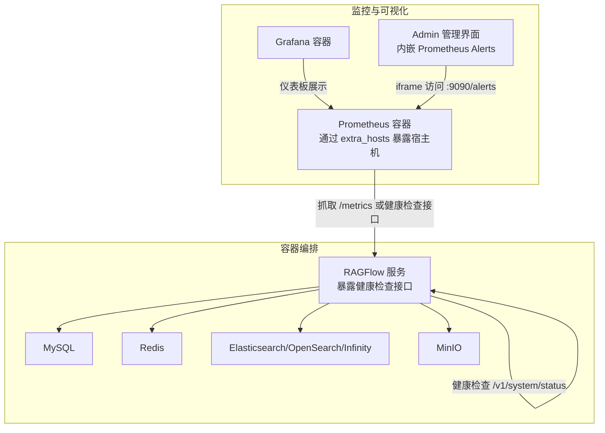
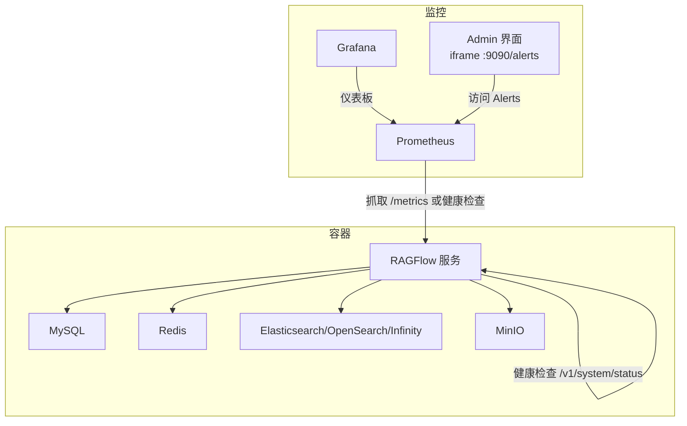
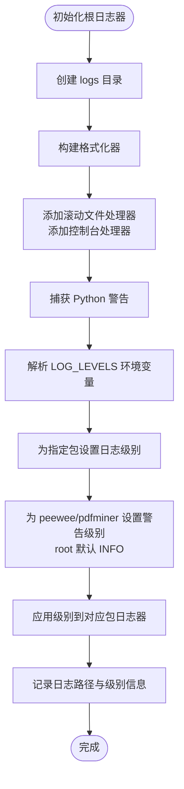
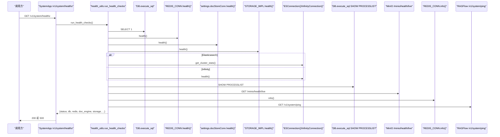
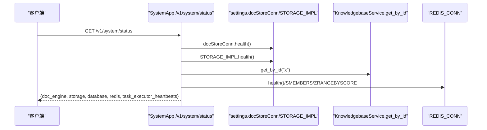
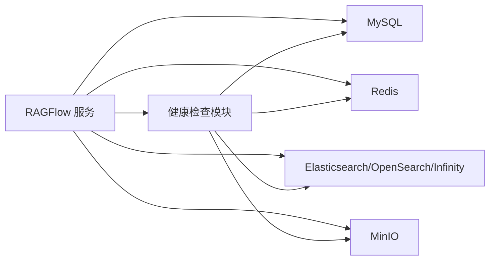

# 监控与日志

<cite>
**本文引用的文件**
- [common/log_utils.py](file://common/log_utils.py)
- [api/utils/health_utils.py](file://api/utils/health_utils.py)
- [api/apps/system_app.py](file://api/apps/system_app.py)
- [docker/docker-compose.yml](file://docker/docker-compose.yml)
- [docker/docker-compose-plus.yml](file://docker/docker-compose-plus.yml)
- [docker/docker-compose-macos.yml](file://docker/docker-compose-macos.yml)
- [docker/service_conf.yaml.template](file://docker/service_conf.yaml.template)
- [conf/service_conf.yaml](file://conf/service_conf.yaml)
- [helm/values.yaml](file://helm/values.yaml)
- [web/src/pages/admin/monitoring.tsx](file://web/src/pages/admin/monitoring.tsx)
- [docs/faq.mdx](file://docs/faq.mdx)
</cite>

## 目录
1. [简介](#简介)
2. [项目结构](#项目结构)
3. [核心组件](#核心组件)
4. [架构总览](#架构总览)
5. [详细组件分析](#详细组件分析)
6. [依赖分析](#依赖分析)
7. [性能考虑](#性能考虑)
8. [故障排查指南](#故障排查指南)
9. [结论](#结论)
10. [附录](#附录)

## 简介
本运维指南面向RAGFlow项目的监控与日志体系，覆盖以下主题：
- 监控指标定义与采集：CPU、内存、磁盘、网络、数据库与文档引擎健康度等
- 日志系统架构与配置：日志级别、格式、轮转、输出位置与前端展示
- 健康检查机制：服务自检、依赖项探测、任务执行器心跳
- 监控仪表板集成：Prometheus/Grafana接入建议（基于现有容器编排）
- 日志分析与故障诊断：日志查询、错误追踪、性能分析思路
- 告警规则与管理：健康检查返回码与UI联动
- 可视化展示：通过Admin页面内嵌Prometheus Alerts界面

本指南以仓库中实际实现为依据，避免臆测，所有说明均标注“章节来源”或“图表来源”。

## 项目结构
RAGFlow在容器编排层面已预留Prometheus对接点，并通过系统接口暴露健康状态；日志由后端统一初始化并落盘到容器卷，前端提供Admin监控页内嵌Prometheus Alerts。

图表来源
- [docker/docker-compose.yml:96-106](file://docker/docker-compose.yml#L96-L106)
- [docker/docker-compose-plus.yml:51-54](file://docker/docker-compose-plus.yml#L51-L54)
- [docker/docker-compose-macos.yml:26-29](file://docker/docker-compose-macos.yml#L26-L29)
- [web/src/pages/admin/monitoring.tsx:10-13](file://web/src/pages/admin/monitoring.tsx#L10-L13)

章节来源
- [docker/docker-compose.yml:85-106](file://docker/docker-compose.yml#L85-L106)
- [docker/docker-compose-plus.yml:47-54](file://docker/docker-compose-plus.yml#L47-L54)
- [docker/docker-compose-macos.yml:22-29](file://docker/docker-compose-macos.yml#L22-L29)
- [web/src/pages/admin/monitoring.tsx:1-19](file://web/src/pages/admin/monitoring.tsx#L1-L19)

## 核心组件
- 日志系统
  - 后端根日志器初始化：统一格式、滚动文件处理器、控制台处理器、按包名细粒度日志级别
  - 异常捕获与记录：统一异常记录与参数文本化
- 健康检查
  - 数据库、Redis、文档引擎、存储、MinIO、RAGFlow服务自身、任务执行器心跳
  - 统一健康检查聚合接口，返回整体状态与各子系统元信息
- 系统状态接口
  - 提供文档引擎、存储、数据库、Redis健康状态与耗时
- 配置与部署
  - Docker Compose模板与本地service_conf.yaml
  - Helm values集中环境变量与资源限制
- 可视化
  - Admin页面内嵌Prometheus Alerts iframe

章节来源
- [common/log_utils.py:25-86](file://common/log_utils.py#L25-L86)
- [api/utils/health_utils.py:29-222](file://api/utils/health_utils.py#L29-L222)
- [api/apps/system_app.py:65-171](file://api/apps/system_app.py#L65-L171)
- [docker/service_conf.yaml.template:1-200](file://docker/service_conf.yaml.template#L1-L200)
- [conf/service_conf.yaml:1-159](file://conf/service_conf.yaml#L1-L159)
- [helm/values.yaml:13-75](file://helm/values.yaml#L13-L75)
- [web/src/pages/admin/monitoring.tsx:10-13](file://web/src/pages/admin/monitoring.tsx#L10-L13)

## 架构总览
下图展示RAGFlow监控与日志的关键交互：容器编排暴露Prometheus抓取点，Admin界面内嵌Prometheus Alerts，后端提供健康检查与系统状态接口，日志统一落盘到容器卷。

图表来源
- [docker/docker-compose.yml:96-106](file://docker/docker-compose.yml#L96-L106)
- [web/src/pages/admin/monitoring.tsx:10-13](file://web/src/pages/admin/monitoring.tsx#L10-L13)
- [api/apps/system_app.py:65-171](file://api/apps/system_app.py#L65-L171)

## 详细组件分析

### 日志系统
- 初始化流程
  - 创建项目logs目录，生成滚动文件处理器与控制台处理器
  - 使用统一格式化器，支持时间、级别、进程ID等字段
  - 支持通过环境变量对特定包设置日志级别，未指定则采用默认级别
  - 对第三方包如peewee、pdfminer设置警告级别兜底
- 异常处理
  - 统一记录异常堆栈
  - 尝试提取对象的text属性作为上下文输出，随后抛出原异常

图表来源
- [common/log_utils.py:25-72](file://common/log_utils.py#L25-L72)

章节来源
- [common/log_utils.py:25-86](file://common/log_utils.py#L25-L86)

### 健康检查机制
- 子系统探测
  - 数据库连通性探针
  - Redis健康探测
  - 文档引擎（Elasticsearch/OpenSearch/Infinity）健康探测
  - 存储实现健康探测
  - Elasticsearch集群统计（当启用ES）
  - Infinity健康探测（当启用Infinity）
  - MySQL进程列表探测
  - MinIO存活探测
  - Redis信息探测
  - RAGFlow服务自身ping探测
  - 任务执行器心跳探测（基于Redis集合与有序集合）
- 统一聚合
  - run_health_checks汇总各子系统结果，返回整体状态与失败元信息

图表来源
- [api/utils/health_utils.py:187-222](file://api/utils/health_utils.py#L187-L222)
- [api/utils/health_utils.py:33-163](file://api/utils/health_utils.py#L33-L163)
- [api/apps/system_app.py:174-177](file://api/apps/system_app.py#L174-L177)

章节来源
- [api/utils/health_utils.py:29-222](file://api/utils/health_utils.py#L29-L222)
- [api/apps/system_app.py:174-177](file://api/apps/system_app.py#L174-L177)

### 系统状态接口
- 接口路径：/v1/system/status
- 返回内容
  - 文档引擎健康与耗时
  - 存储实现健康与类型
  - 数据库类型与健康
  - Redis健康
  - 任务执行器心跳快照（从Redis集合与有序集合读取）

图表来源
- [api/apps/system_app.py:65-171](file://api/apps/system_app.py#L65-L171)

章节来源
- [api/apps/system_app.py:65-171](file://api/apps/system_app.py#L65-L171)

### 部署与配置要点
- Docker Compose
  - 通过extra_hosts将宿主机IP暴露给Prometheus容器，便于抓取
  - 服务挂载日志目录到 ./ragflow-logs
- service_conf.yaml
  - 定义RAGFlow、MySQL、MinIO、Elasticsearch/OpenSearch/Infinity、Redis等连接参数
  - 支持通过环境变量覆盖默认值
- Helm values.yaml
  - 集中设置DOC_ENGINE、密码、时区、批大小等环境变量
  - 控制各依赖镜像版本与资源请求

章节来源
- [docker/docker-compose.yml:96-106](file://docker/docker-compose.yml#L96-L106)
- [docker/docker-compose-plus.yml:51-54](file://docker/docker-compose-plus.yml#L51-L54)
- [docker/docker-compose-macos.yml:26-29](file://docker/docker-compose-macos.yml#L26-L29)
- [docker/service_conf.yaml.template:1-200](file://docker/service_conf.yaml.template#L1-L200)
- [conf/service_conf.yaml:1-159](file://conf/service_conf.yaml#L1-L159)
- [helm/values.yaml:13-75](file://helm/values.yaml#L13-L75)

### 可视化与告警
- Admin监控页内嵌Prometheus Alerts界面，直接访问 :9090/alerts
- 健康检查接口返回200/500，可用于外部监控系统判定服务可用性

章节来源
- [web/src/pages/admin/monitoring.tsx:10-13](file://web/src/pages/admin/monitoring.tsx#L10-L13)
- [api/apps/system_app.py:174-177](file://api/apps/system_app.py#L174-L177)

## 依赖分析
- 运行时依赖
  - 数据库：MySQL
  - 缓存/消息队列：Redis
  - 文档引擎：Elasticsearch、OpenSearch或Infinity（二选一）
  - 对象存储：MinIO
- 健康检查依赖
  - 通过settings.docStoreConn、STORAGE_IMPL、REDIS_CONN等抽象进行探测
  - 文档引擎健康取决于当前DOC_ENGINE环境变量

图表来源
- [api/utils/health_utils.py:33-163](file://api/utils/health_utils.py#L33-L163)
- [api/apps/system_app.py:65-171](file://api/apps/system_app.py#L65-L171)
- [helm/values.yaml:14-21](file://helm/values.yaml#L14-L21)

章节来源
- [api/utils/health_utils.py:33-163](file://api/utils/health_utils.py#L33-L163)
- [api/apps/system_app.py:65-171](file://api/apps/system_app.py#L65-L171)
- [helm/values.yaml:14-21](file://helm/values.yaml#L14-L21)

## 性能考虑
- 日志滚动策略
  - 单文件最大10MB，保留5个备份，避免日志膨胀
- 健康检查开销
  - 多数探针为轻量级操作（如SELECT 1），避免对生产造成压力
- 文档引擎与存储
  - 健康探测会返回耗时，可作为性能参考
- 资源限制
  - Helm values中为Elasticsearch/OpenSearch设置CPU/Memory请求，建议结合Prometheus监控进行容量规划

章节来源
- [common/log_utils.py:38-44](file://common/log_utils.py#L38-L44)
- [api/utils/health_utils.py:33-68](file://api/utils/health_utils.py#L33-L68)
- [api/apps/system_app.py:99-171](file://api/apps/system_app.py#L99-L171)
- [helm/values.yaml:153-182](file://helm/values.yaml#L153-L182)

## 故障排查指南
- 容器状态与服务状态
  - Docker容器UP不代表服务可用，需结合健康检查接口判断
- 健康检查失败定位
  - 查看 /v1/system/status 与 /v1/system/healthz 返回的元信息
  - 关注数据库、Redis、文档引擎、存储、MinIO的耗时与错误
- 日志定位
  - 检查容器日志卷 ./ragflow-logs
  - 使用LOG_LEVELS环境变量临时提升日志级别
- 前端监控
  - 通过Admin页面访问Prometheus Alerts，确认告警状态

章节来源
- [docs/faq.mdx:290-311](file://docs/faq.mdx#L290-L311)
- [api/apps/system_app.py:174-177](file://api/apps/system_app.py#L174-L177)
- [web/src/pages/admin/monitoring.tsx:10-13](file://web/src/pages/admin/monitoring.tsx#L10-L13)

## 结论
RAGFlow的监控与日志体系以“健康检查+统一日志+容器编排Prometheus对接”为核心，具备：
- 明确的健康检查维度与聚合结果
- 可控的日志级别与滚动策略
- 可扩展的容器编排与Helm配置
- Admin界面内嵌Prometheus Alerts的可视化入口

建议在生产环境中结合Prometheus/Grafana进行长期趋势分析，并根据业务峰值调整资源与告警阈值。

## 附录

### 监控仪表板搭建（基于现有编排）
- Prometheus抓取点
  - 在Compose中通过extra_hosts将宿主机IP暴露给Prometheus容器
  - 可抓取RAGFlow健康检查接口或应用指标（如存在）
- Grafana仪表板
  - 添加Prometheus数据源，基于健康检查状态与耗时构建面板
  - 可加入容器资源指标（CPU/内存/磁盘/网络）以辅助定位

章节来源
- [docker/docker-compose.yml:96-106](file://docker/docker-compose.yml#L96-L106)
- [docker/docker-compose-plus.yml:51-54](file://docker/docker-compose-plus.yml#L51-L54)
- [docker/docker-compose-macos.yml:26-29](file://docker/docker-compose-macos.yml#L26-L29)