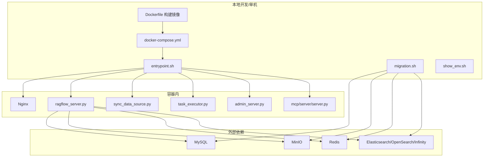
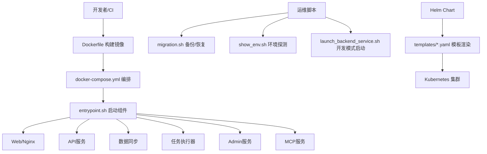
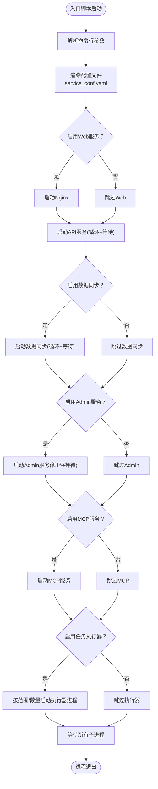
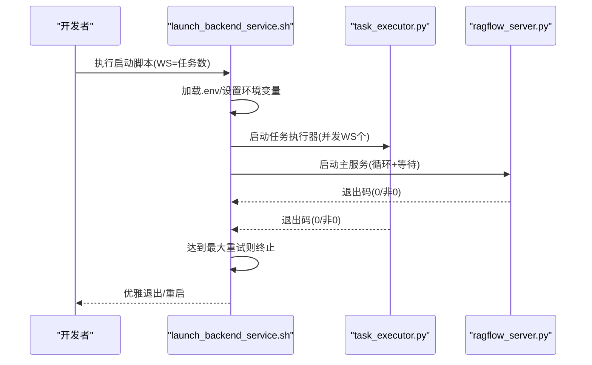
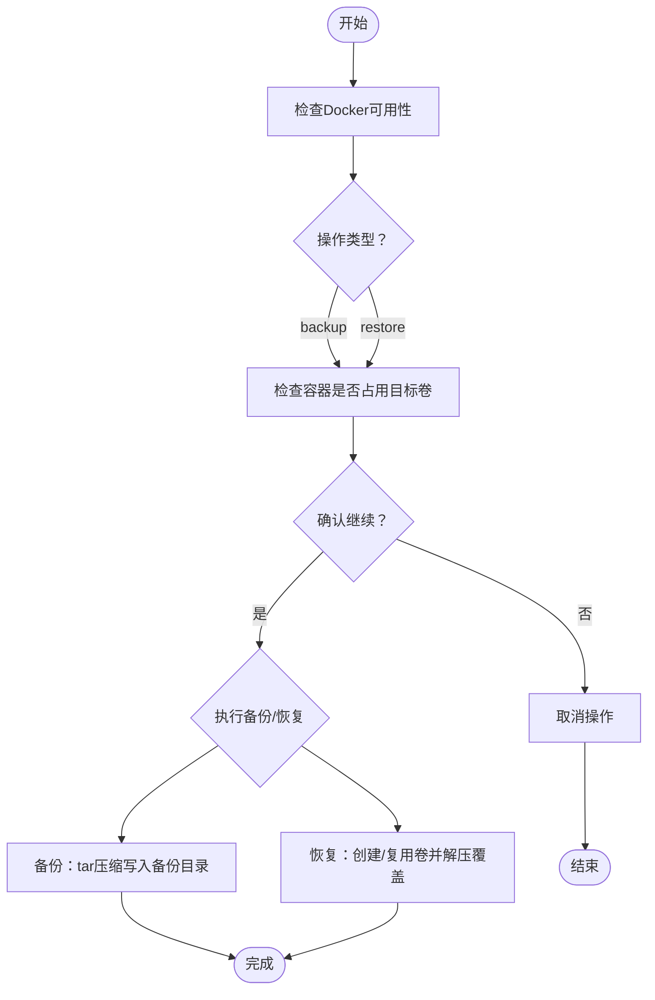
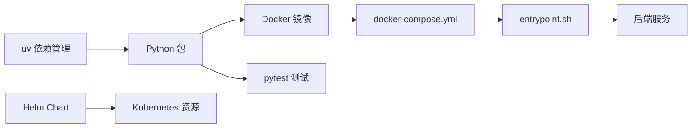

# 运维自动化

<cite>
**本文引用的文件**   
- [README.md](file://README.md)
- [docker-compose.yml](file://docker/docker-compose.yml)
- [Dockerfile](file://Dockerfile)
- [entrypoint.sh](file://docker/entrypoint.sh)
- [launch_backend_service.sh](file://docker/launch_backend_service.sh)
- [migration.sh](file://docker/migration.sh)
- [show_env.sh](file://show_env.sh)
- [pyproject.toml](file://pyproject.toml)
- [build_cli_release.sh](file://admin/build_cli_release.sh)
- [.github/copilot-instructions.md](file://.github/copilot-instructions.md)
- [helm/Chart.yaml](file://helm/Chart.yaml)
- [helm/values.yaml](file://helm/values.yaml)
- [helm/templates/ragflow.yaml](file://helm/templates/ragflow.yaml)
- [helm/templates/mysql.yaml](file://helm/templates/mysql.yaml)
- [helm/templates/minio.yaml](file://helm/templates/minio.yaml)
- [helm/templates/redis.yaml](file://helm/templates/redis.yaml)
- [helm/templates/elasticsearch.yaml](file://helm/templates/elasticsearch.yaml)
- [helm/templates/opensearch.yaml](file://helm/templates/opensearch.yaml)
- [helm/templates/infinity.yaml](file://helm/templates/infinity.yaml)
- [helm/templates/ingress.yaml](file://helm/templates/ingress.yaml)
- [helm/templates/env.yaml](file://helm/templates/env.yaml)
- [helm/templates/ragflow_config.yaml](file://helm/templates/ragflow_config.yaml)
</cite>

## 目录
1. [简介](#简介)
2. [项目结构](#项目结构)
3. [核心组件](#核心组件)
4. [架构总览](#架构总览)
5. [详细组件分析](#详细组件分析)
6. [依赖关系分析](#依赖关系分析)
7. [性能考量](#性能考量)
8. [故障排查指南](#故障排查指南)
9. [结论](#结论)
10. [附录](#附录)

## 简介
本指南面向运维与平台工程团队，系统化梳理RAGFlow在部署、监控、备份恢复、CI/CD与IaC方面的自动化能力与最佳实践。内容覆盖：
- 部署脚本与容器编排：Docker Compose与Entrypoint多组件启动与参数化控制
- 备份与恢复脚本：面向MySQL、MinIO、Redis、Elasticsearch的数据迁移工具
- 维护与巡检：环境探测、健康检查与资源准备
- CI/CD流水线：基于uv与pytest的构建、测试与打包流程
- 基础设施即代码（IaC）：Helm Chart与模板化配置
- 自动化运维任务：定时、事件驱动与批量处理思路
- 智能化运维：指标采集、告警与自动修复的落地路径
- 文档自动化：通过模板与脚本生成标准化运维文档

## 项目结构
RAGFlow采用“容器化 + 脚本化 + Helm模板”的混合方式实现运维自动化：
- 容器镜像由Dockerfile统一构建，包含前端产物、后端服务与依赖
- Docker Compose负责服务编排与端口映射、卷挂载与环境变量注入
- Entrypoint脚本按需启用Web服务器、数据同步、任务执行器、Admin/MCP服务
- 运维脚本提供备份/恢复、环境探测、后端服务启动等能力
- Helm Chart用于Kubernetes部署，模板化数据库、对象存储、搜索引擎与Ingestion引擎

图表来源
- [docker-compose.yml:1-133](file://docker/docker-compose.yml#L1-L133)
- [Dockerfile:1-224](file://Dockerfile#L1-L224)
- [entrypoint.sh:1-273](file://docker/entrypoint.sh#L1-L273)
- [migration.sh:1-298](file://docker/migration.sh#L1-L298)

章节来源
- [README.md:145-272](file://README.md#L145-L272)
- [docker-compose.yml:1-133](file://docker/docker-compose.yml#L1-L133)
- [Dockerfile:1-224](file://Dockerfile#L1-L224)
- [entrypoint.sh:1-273](file://docker/entrypoint.sh#L1-L273)
- [migration.sh:1-298](file://docker/migration.sh#L1-L298)
- [show_env.sh:1-63](file://show_env.sh#L1-L63)

## 核心组件
- 入口脚本与多组件编排
  - 支持禁用Web/任务执行器/数据同步，以及启用Admin/MCP服务
  - 动态替换配置模板中的环境变量，输出最终配置文件
  - 提供范围式或固定数量的任务执行器实例化
- 后端服务启动脚本
  - 开发模式下加载.env，设置运行时库路径与jemalloc预加载
  - 后台并发启动多个任务执行器与主服务，并带重试与信号处理
- 数据迁移脚本
  - 备份/恢复四大核心数据卷（MySQL、MinIO、Redis、Elasticsearch）
  - 容器占用检测、确认提示、体积校验与增量覆盖策略
- 环境探测脚本
  - 输出仓库名、提交号、操作系统、CPU类型、内存、Docker版本、Python版本
- CLI发布脚本
  - 清理旧构建目录、复制源码与包元数据、构建wheel包并校验产物
- Helm IaC
  - Chart定义、values.yaml参数化、模板渲染数据库/存储/搜索引擎/Ingestion引擎与Ingress

章节来源
- [entrypoint.sh:1-273](file://docker/entrypoint.sh#L1-L273)
- [launch_backend_service.sh:1-130](file://docker/launch_backend_service.sh#L1-L130)
- [migration.sh:1-298](file://docker/migration.sh#L1-L298)
- [show_env.sh:1-63](file://show_env.sh#L1-L63)
- [build_cli_release.sh:1-47](file://admin/build_cli_release.sh#L1-L47)
- [helm/Chart.yaml](file://helm/Chart.yaml)
- [helm/values.yaml](file://helm/values.yaml)
- [helm/templates/ragflow.yaml](file://helm/templates/ragflow.yaml)
- [helm/templates/mysql.yaml](file://helm/templates/mysql.yaml)
- [helm/templates/minio.yaml](file://helm/templates/minio.yaml)
- [helm/templates/redis.yaml](file://helm/templates/redis.yaml)
- [helm/templates/elasticsearch.yaml](file://helm/templates/elasticsearch.yaml)
- [helm/templates/opensearch.yaml](file://helm/templates/opensearch.yaml)
- [helm/templates/infinity.yaml](file://helm/templates/infinity.yaml)
- [helm/templates/ingress.yaml](file://helm/templates/ingress.yaml)
- [helm/templates/env.yaml](file://helm/templates/env.yaml)
- [helm/templates/ragflow_config.yaml](file://helm/templates/ragflow_config.yaml)

## 架构总览
RAGFlow的运维自动化以“容器镜像 + 编排 + 入口脚本 + 运维脚本 + Helm模板”为核心，形成从本地开发到生产部署的一体化自动化闭环。

图表来源
- [Dockerfile:1-224](file://Dockerfile#L1-L224)
- [docker-compose.yml:1-133](file://docker/docker-compose.yml#L1-L133)
- [entrypoint.sh:1-273](file://docker/entrypoint.sh#L1-L273)
- [migration.sh:1-298](file://docker/migration.sh#L1-L298)
- [show_env.sh:1-63](file://show_env.sh#L1-L63)
- [launch_backend_service.sh:1-130](file://docker/launch_backend_service.sh#L1-L130)
- [helm/templates/ragflow.yaml](file://helm/templates/ragflow.yaml)

## 详细组件分析

### 入口脚本与多组件编排（entrypoint.sh）
- 功能要点
  - 参数解析：支持禁用Web/任务执行器/数据同步；启用Admin/MCP服务；范围式或固定数量的任务执行器；主机ID等
  - 配置注入：读取模板文件，将环境变量占位符替换为实际值，生成最终配置
  - 组件启动：按需启动Nginx、API服务、数据同步、Admin/MCP服务；任务执行器以循环+重试方式守护
  - 可选特性：Docling按需安装、jemalloc预加载优化内存分配
- 关键流程图

图表来源
- [entrypoint.sh:1-273](file://docker/entrypoint.sh#L1-L273)

章节来源
- [entrypoint.sh:1-273](file://docker/entrypoint.sh#L1-L273)

### 后端服务启动脚本（launch_backend_service.sh）
- 功能要点
  - 加载.env，清理代理变量，设置PYTHONPATH与jemalloc路径
  - 并发启动指定数量的任务执行器与主服务，每个组件带最大重试次数
  - 捕获SIGINT/SIGTERM，优雅关闭所有子进程
- 序列图（开发模式启动）

图表来源
- [launch_backend_service.sh:1-130](file://docker/launch_backend_service.sh#L1-L130)

章节来源
- [launch_backend_service.sh:1-130](file://docker/launch_backend_service.sh#L1-L130)

### 数据迁移脚本（migration.sh）
- 功能要点
  - 备份：对MySQL、MinIO、Redis、Elasticsearch四类卷进行压缩归档
  - 恢复：校验备份完整性，创建/复用目标卷，解压覆盖
  - 安全性：检测是否有容器正在使用目标卷，必要时提示停止容器
  - 用户交互：对覆盖风险进行二次确认
- 流程图

图表来源
- [migration.sh:1-298](file://docker/migration.sh#L1-L298)

章节来源
- [migration.sh:1-298](file://docker/migration.sh#L1-L298)

### 环境探测脚本（show_env.sh）
- 功能要点
  - 获取Git仓库名与提交号
  - 操作系统、CPU类型、内存容量
  - Docker与Python版本
- 使用场景
  - 故障定位、版本追踪、兼容性验证

章节来源
- [show_env.sh:1-63](file://show_env.sh#L1-L63)

### CLI发布脚本（admin/build_cli_release.sh）
- 功能要点
  - 清理旧构建目录、复制源码与元数据、构建wheel包、校验产物
- 适用场景
  - 自动化打包与分发CLI工具

章节来源
- [build_cli_release.sh:1-47](file://admin/build_cli_release.sh#L1-L47)

### Helm IaC（Chart与模板）
- 结构概览
  - Chart.yaml：定义Chart元信息与依赖
  - values.yaml：参数化数据库、存储、搜索引擎、Ingress等
  - templates/*：渲染后的Kubernetes资源清单
- 关键模板
  - ragflow.yaml：应用Deployment/Service/HPA等
  - mysql.yaml、minio.yaml、redis.yaml：数据库/对象存储/缓存
  - elasticsearch.yaml、opensearch.yaml、infinity.yaml：全文检索/向量引擎
  - ingress.yaml：入口网关
  - env.yaml、ragflow_config.yaml：环境变量与配置映射

章节来源
- [helm/Chart.yaml](file://helm/Chart.yaml)
- [helm/values.yaml](file://helm/values.yaml)
- [helm/templates/ragflow.yaml](file://helm/templates/ragflow.yaml)
- [helm/templates/mysql.yaml](file://helm/templates/mysql.yaml)
- [helm/templates/minio.yaml](file://helm/templates/minio.yaml)
- [helm/templates/redis.yaml](file://helm/templates/redis.yaml)
- [helm/templates/elasticsearch.yaml](file://helm/templates/elasticsearch.yaml)
- [helm/templates/opensearch.yaml](file://helm/templates/opensearch.yaml)
- [helm/templates/infinity.yaml](file://helm/templates/infinity.yaml)
- [helm/templates/ingress.yaml](file://helm/templates/ingress.yaml)
- [helm/templates/env.yaml](file://helm/templates/env.yaml)
- [helm/templates/ragflow_config.yaml](file://helm/templates/ragflow_config.yaml)

## 依赖关系分析
- 构建与测试
  - 项目使用uv进行依赖同步与构建，pytest作为测试框架，覆盖率配置可扩展
- 容器与编排
  - Dockerfile分阶段构建，Docker Compose定义服务与网络、卷、环境变量
  - Entrypoint脚本作为单一入口，统一调度各子服务
- IaC与部署
  - Helm模板将配置参数化，便于不同环境差异化部署

图表来源
- [pyproject.toml:1-278](file://pyproject.toml#L1-L278)
- [Dockerfile:1-224](file://Dockerfile#L1-L224)
- [docker-compose.yml:1-133](file://docker/docker-compose.yml#L1-L133)
- [entrypoint.sh:1-273](file://docker/entrypoint.sh#L1-L273)
- [helm/Chart.yaml](file://helm/Chart.yaml)

章节来源
- [pyproject.toml:1-278](file://pyproject.toml#L1-L278)
- [docker-compose.yml:1-133](file://docker/docker-compose.yml#L1-L133)
- [Dockerfile:1-224](file://Dockerfile#L1-L224)
- [entrypoint.sh:1-273](file://docker/entrypoint.sh#L1-L273)
- [helm/Chart.yaml](file://helm/Chart.yaml)

## 性能考量
- 内存优化
  - jemalloc预加载减少碎片与峰值内存占用，适用于高并发任务执行器
- 并发与重试
  - 任务执行器与主服务均采用循环+等待机制，结合最大重试次数避免瞬时失败导致的长期停机
- 资源隔离
  - Docker Compose与Helm模板支持资源限制与GPU部署（如适用），建议在生产中明确CPU/内存配额
- I/O与存储
  - 备份/恢复采用tar压缩归档，建议结合快照与异地备份策略提升可靠性

## 故障排查指南
- 启动失败
  - 使用开发模式启动脚本查看服务日志与重试行为
  - 检查环境变量是否正确注入（.env与service_conf.yaml）
- 数据不一致
  - 使用迁移脚本进行备份/恢复，注意容器占用检测与覆盖确认
- 环境问题
  - 使用环境探测脚本快速核对操作系统、Docker与Python版本
- CI/CD问题
  - 参考Copilot说明与pytest配置，确保依赖同步与测试通过

章节来源
- [launch_backend_service.sh:1-130](file://docker/launch_backend_service.sh#L1-L130)
- [entrypoint.sh:150-174](file://docker/entrypoint.sh#L150-L174)
- [migration.sh:45-114](file://docker/migration.sh#L45-L114)
- [show_env.sh:1-63](file://show_env.sh#L1-L63)
- [.github/copilot-instructions.md:1-23](file://.github/copilot-instructions.md#L1-L23)
- [pyproject.toml:198-227](file://pyproject.toml#L198-L227)

## 结论
RAGFlow通过容器化、脚本化与模板化的IaC，构建了从开发到生产的自动化运维体系。入口脚本统一编排、迁移脚本保障数据安全、Helm模板实现参数化部署，配合CI/CD与监控告警，可进一步完善智能化运维闭环。建议在生产环境中补充：
- 指标采集与告警（Prometheus/Grafana）
- 自动修复与弹性伸缩（HPA/自愈策略）
- 文档自动化（基于模板与脚本生成标准SOP）
- 事件驱动与批处理（消息队列与定时任务）

## 附录
- 快速参考
  - 启动服务：docker compose启动，入口脚本按需启用组件
  - 备份/恢复：migration.sh按步骤执行，注意容器占用与覆盖确认
  - 开发调试：launch_backend_service.sh设置WS并行度，捕获信号优雅退出
  - 发布CLI：admin/build_cli_release.sh生成wheel包
  - Kubernetes部署：helm install渲染Chart与values，应用至集群