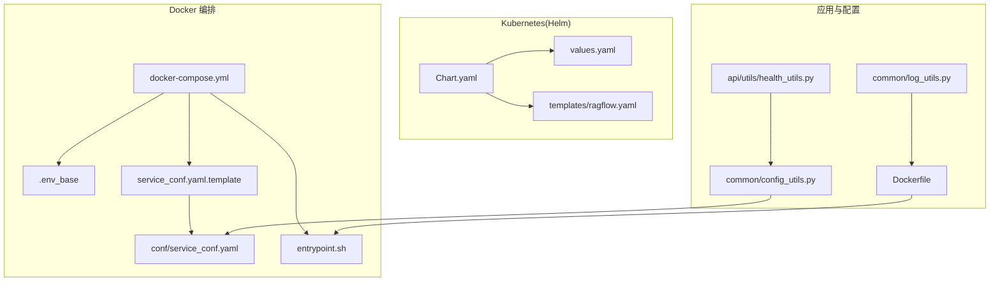
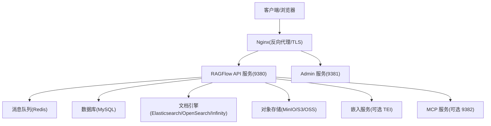
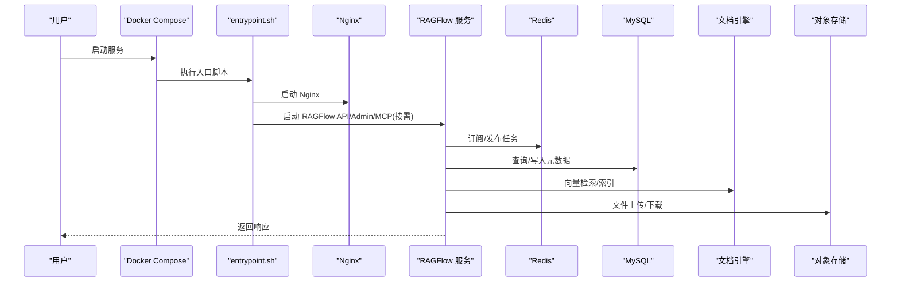
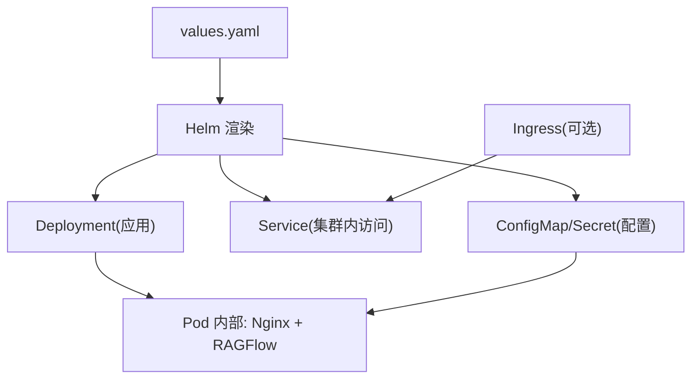
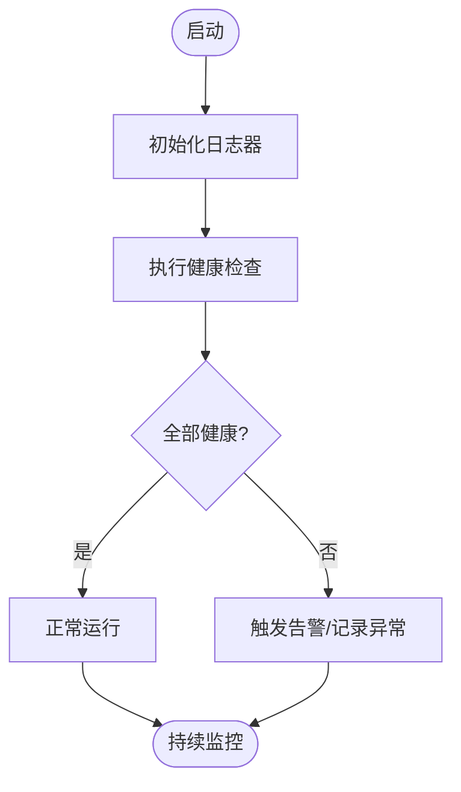
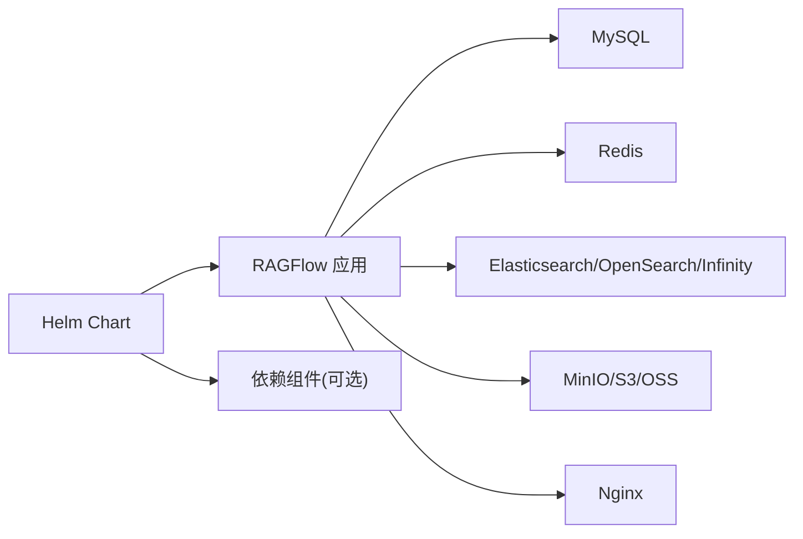

# 部署运维

<cite>
**本文引用的文件**
- [docker-compose.yml](file://docker/docker-compose.yml)
- [README.md（Docker）](file://docker/README.md)
- [.env_base](file://docker/.env_base)
- [service_conf.yaml 模板](file://docker/service_conf.yaml.template)
- [service_conf.yaml](file://conf/service_conf.yaml)
- [入口脚本 entrypoint.sh](file://docker/entrypoint.sh)
- [Dockerfile](file://Dockerfile)
- [Helm Chart.yaml](file://helm/Chart.yaml)
- [Helm values.yaml](file://helm/values.yaml)
- [Helm 模板 ragflow.yaml](file://helm/templates/ragflow.yaml)
- [配置工具 config_utils.py](file://common/config_utils.py)
- [健康检查 health_utils.py](file://api/utils/health_utils.py)
- [日志工具 log_utils.py（公共）](file://common/log_utils.py)
- [命令行工具 commands.py](file://api/utils/commands.py)
</cite>

## 目录
1. [简介](#简介)
2. [项目结构](#项目结构)
3. [核心组件](#核心组件)
4. [架构总览](#架构总览)
5. [详细组件分析](#详细组件分析)
6. [依赖关系分析](#依赖关系分析)
7. [性能考虑](#性能考虑)
8. [故障排除指南](#故障排除指南)
9. [结论](#结论)
10. [附录](#附录)

## 简介
本指南面向生产环境的部署与运维，覆盖以下主题：
- 多种部署模式：Docker 容器化、Kubernetes（Helm）集群部署、单机部署
- 配置管理最佳实践：环境变量、服务配置文件、密钥与加密
- 监控与日志：指标采集、日志聚合、健康检查与告警联动
- 性能调优：资源分配、缓存优化、向量化服务与数据库调优
- 安全配置：网络安全、访问控制、数据保护
- 备份与恢复：数据库与对象存储的备份策略
- 故障排除与应急响应：健康检查、日志定位、常见问题
- 自动化运维：脚本、命令行工具、CI/CD 集成建议
- 容量规划与扩缩容：基于负载与资源使用率的弹性策略

## 项目结构
RAGFlow 提供了多套部署方式与配置模板，便于在不同环境中快速落地：
- Docker Compose：一键拉起应用与依赖（MySQL、MinIO、Redis、Elasticsearch/OpenSearch/Infinity 等）
- Kubernetes（Helm）：通过 Chart 将应用与依赖以标准化方式部署到集群
- 单机部署：直接运行后端服务与 Nginx，适用于小规模或测试场景

图示来源
- [docker-compose.yml:1-133](file://docker/docker-compose.yml#L1-L133)
- [.env_base:1-280](file://docker/.env_base#L1-L280)
- [service_conf.yaml 模板:1-200](file://docker/service_conf.yaml.template#L1-L200)
- [service_conf.yaml:1-159](file://conf/service_conf.yaml#L1-L159)
- [入口脚本 entrypoint.sh:1-273](file://docker/entrypoint.sh#L1-L273)
- [Dockerfile:1-224](file://Dockerfile#L1-L224)
- [Helm Chart.yaml:1-25](file://helm/Chart.yaml#L1-L25)
- [Helm values.yaml:1-259](file://helm/values.yaml#L1-L259)
- [Helm 模板 ragflow.yaml:1-120](file://helm/templates/ragflow.yaml#L1-L120)
- [配置工具 config_utils.py:1-156](file://common/config_utils.py#L1-L156)
- [健康检查 health_utils.py:1-223](file://api/utils/health_utils.py#L1-L223)
- [日志工具 log_utils.py（公共）:1-87](file://common/log_utils.py#L1-L87)

章节来源
- [docker-compose.yml:1-133](file://docker/docker-compose.yml#L1-L133)
- [README.md（Docker）:1-271](file://docker/README.md#L1-L271)
- [.env_base:1-280](file://docker/.env_base#L1-L280)
- [service_conf.yaml 模板:1-200](file://docker/service_conf.yaml.template#L1-L200)
- [service_conf.yaml:1-159](file://conf/service_conf.yaml#L1-L159)
- [入口脚本 entrypoint.sh:1-273](file://docker/entrypoint.sh#L1-L273)
- [Dockerfile:1-224](file://Dockerfile#L1-L224)
- [Helm Chart.yaml:1-25](file://helm/Chart.yaml#L1-L25)
- [Helm values.yaml:1-259](file://helm/values.yaml#L1-L259)
- [Helm 模板 ragflow.yaml:1-120](file://helm/templates/ragflow.yaml#L1-L120)
- [配置工具 config_utils.py:1-156](file://common/config_utils.py#L1-L156)
- [健康检查 health_utils.py:1-223](file://api/utils/health_utils.py#L1-L223)
- [日志工具 log_utils.py（公共）:1-87](file://common/log_utils.py#L1-L87)

## 核心组件
- 应用容器与入口
  - Dockerfile 定义构建阶段与运行时环境，包含前端构建、Python 运行时、系统依赖与入口脚本
  - 入口脚本负责根据参数启动 Web/Nginx、任务执行器、数据同步、Admin/MCP 服务，并支持范围消费者与固定 worker 数量
- 配置体系
  - .env_base 提供环境变量模板，涵盖文档引擎类型、数据库、对象存储、Redis、时区、日志级别等
  - service_conf.yaml.template 作为模板，通过环境变量渲染生成 conf/service_conf.yaml
  - common/config_utils.py 负责读取全局与本地配置、合并覆盖、加解密数据库密码、更新配置
- 健康检查与日志
  - health_utils.py 提供数据库、Redis、文档引擎、存储、RAGFlow 与任务执行器健康检查
  - log_utils.py 初始化根日志器，支持滚动日志与按包设置日志级别
- Kubernetes（Helm）
  - Chart.yaml 描述 Chart 信息；values.yaml 定义默认镜像、资源、存储、服务暴露与依赖组件；templates/ragflow.yaml 渲染 Deployment、Service 与挂载配置

章节来源
- [Dockerfile:1-224](file://Dockerfile#L1-L224)
- [入口脚本 entrypoint.sh:1-273](file://docker/entrypoint.sh#L1-L273)
- [.env_base:1-280](file://docker/.env_base#L1-L280)
- [service_conf.yaml 模板:1-200](file://docker/service_conf.yaml.template#L1-L200)
- [service_conf.yaml:1-159](file://conf/service_conf.yaml#L1-L159)
- [配置工具 config_utils.py:1-156](file://common/config_utils.py#L1-L156)
- [健康检查 health_utils.py:1-223](file://api/utils/health_utils.py#L1-L223)
- [日志工具 log_utils.py（公共）:1-87](file://common/log_utils.py#L1-L87)
- [Helm Chart.yaml:1-25](file://helm/Chart.yaml#L1-L25)
- [Helm values.yaml:1-259](file://helm/values.yaml#L1-L259)
- [Helm 模板 ragflow.yaml:1-120](file://helm/templates/ragflow.yaml#L1-L120)

## 架构总览
下图展示生产部署的典型拓扑：Nginx 作为反向代理与 TLS 终止，RAGFlow 后端提供 API 与 Admin/MCP 服务，消息队列用于任务分发，数据库与文档引擎支撑元数据与向量检索，对象存储承载文件。

图示来源
- [docker-compose.yml:1-133](file://docker/docker-compose.yml#L1-L133)
- [README.md（Docker）:1-271](file://docker/README.md#L1-L271)
- [service_conf.yaml 模板:1-200](file://docker/service_conf.yaml.template#L1-L200)
- [Helm 模板 ragflow.yaml:1-120](file://helm/templates/ragflow.yaml#L1-L120)

## 详细组件分析

### Docker 容器化部署
- 服务编排
  - 使用 profiles 控制文档引擎与设备类型（CPU/GPU），通过 env_file 加载 .env_base
  - 挂载 Nginx 配置、service_conf.yaml 模板、入口脚本与日志目录
- 端口映射
  - Web/HTTP/HTTPS/API/Admin/MCP 端口均支持自定义映射
- 入口脚本能力
  - 支持禁用 Web/Nginx、禁用任务执行器、禁用数据同步
  - 支持启用 Admin/MCP 服务，支持 MCP 传输开关与主机 API Key
  - 支持范围消费者或固定 worker 数量的任务执行器
- 环境变量与配置
  - .env_base 提供 DOC_ENGINE、DEVICE、各组件主机名与端口、时区、最大文件大小、批处理大小、日志级别等
  - service_conf.yaml.template 通过环境变量渲染数据库、对象存储、Redis、文档引擎等连接参数

图示来源
- [docker-compose.yml:1-133](file://docker/docker-compose.yml#L1-L133)
- [入口脚本 entrypoint.sh:1-273](file://docker/entrypoint.sh#L1-L273)
- [README.md（Docker）:1-271](file://docker/README.md#L1-L271)

章节来源
- [docker-compose.yml:1-133](file://docker/docker-compose.yml#L1-L133)
- [README.md（Docker）:1-271](file://docker/README.md#L1-L271)
- [.env_base:1-280](file://docker/.env_base#L1-L280)
- [service_conf.yaml 模板:1-200](file://docker/service_conf.yaml.template#L1-L200)
- [入口脚本 entrypoint.sh:1-273](file://docker/entrypoint.sh#L1-L273)

### Kubernetes（Helm）集群部署
- Chart 与 Values
  - Chart.yaml 描述应用类型与版本；values.yaml 定义镜像仓库、标签、资源请求/限制、存储类与容量、服务类型与暴露方式
  - 支持多种文档引擎（Elasticsearch/OpenSearch/Infinity）与外部依赖（MySQL/Redis/MinIO）
- 模板渲染
  - templates/ragflow.yaml 渲染 Deployment、Service、ConfigMap/Secret 挂载（包含 Nginx 配置与 service_conf 覆盖）
- Ingress 与 TLS
  - values.yaml 中提供 Ingress 开关与注解示例，结合 Nginx 配置实现域名与证书管理

图示来源
- [Helm Chart.yaml:1-25](file://helm/Chart.yaml#L1-L25)
- [Helm values.yaml:1-259](file://helm/values.yaml#L1-L259)
- [Helm 模板 ragflow.yaml:1-120](file://helm/templates/ragflow.yaml#L1-L120)

章节来源
- [Helm Chart.yaml:1-25](file://helm/Chart.yaml#L1-L25)
- [Helm values.yaml:1-259](file://helm/values.yaml#L1-L259)
- [Helm 模板 ragflow.yaml:1-120](file://helm/templates/ragflow.yaml#L1-L120)

### 单机部署（非容器）
- 适用场景：开发测试、小规模部署
- 关键点：直接运行后端服务与 Nginx，配置文件从 conf/service_conf.yaml 读取，日志输出到 logs 目录
- 注意：需要手动安装依赖（Python、数据库、文档引擎、对象存储等）

章节来源
- [service_conf.yaml:1-159](file://conf/service_conf.yaml#L1-L159)
- [日志工具 log_utils.py（公共）:1-87](file://common/log_utils.py#L1-L87)

### 配置管理最佳实践
- 环境变量
  - 使用 .env_base 管理全局变量，如 DOC_ENGINE、DEVICE、时区、最大文件大小、批处理大小、日志级别等
- 服务配置文件
  - service_conf.yaml.template 通过环境变量渲染生成 conf/service_conf.yaml，避免硬编码敏感信息
  - common/config_utils.py 支持读取全局与本地配置、合并覆盖、加解密数据库密码、动态更新配置
- 密钥与加密
  - 支持通过配置项启用数据库密码解密流程，私钥由外部注入并通过模块函数解密
- 变更与回滚
  - 通过 ConfigMap/Secret 或卷挂载更新配置，配合 Helm 的 checksum 注解触发滚动更新

章节来源
- [.env_base:1-280](file://docker/.env_base#L1-L280)
- [service_conf.yaml 模板:1-200](file://docker/service_conf.yaml.template#L1-L200)
- [service_conf.yaml:1-159](file://conf/service_conf.yaml#L1-L159)
- [配置工具 config_utils.py:1-156](file://common/config_utils.py#L1-L156)

### 监控与日志系统
- 日志
  - 初始化根日志器，同时输出到文件（滚动）与标准输出，支持通过环境变量设置包级日志级别
- 健康检查
  - 提供数据库、Redis、文档引擎、存储、RAGFlow 与任务执行器的健康检查接口与逻辑
- 指标与告警
  - Docker 场景可通过 Prometheus/Docker Daemon 集成；Kubernetes 场景建议使用 Metrics Server + HPA/自定义指标
  - 结合健康检查结果与日志分析，建立告警规则（如服务不可达、数据库超时、存储异常）

图示来源
- [日志工具 log_utils.py（公共）:1-87](file://common/log_utils.py#L1-L87)
- [健康检查 health_utils.py:1-223](file://api/utils/health_utils.py#L1-L223)

章节来源
- [日志工具 log_utils.py（公共）:1-87](file://common/log_utils.py#L1-L87)
- [健康检查 health_utils.py:1-223](file://api/utils/health_utils.py#L1-L223)

### 性能调优策略
- 资源分配
  - Docker：通过 MEM_LIMIT 控制容器内存上限；Compose 中可为 GPU 设备预留
  - Kubernetes：在 values.yaml 中设置 CPU/内存请求与限制，结合 HPA 实现自动扩缩
- 缓存优化
  - Redis 作为消息队列与缓存，合理设置过期与淘汰策略；任务执行器通过心跳与消费者范围提升吞吐
- 文档引擎与向量化
  - 根据 DOC_ENGINE 选择合适引擎；调整批处理大小（DOC_BULK_SIZE/EMBEDDING_BATCH_SIZE）与连接池参数
- 数据库
  - 调整 MySQL 最大连接数、超时时间与最大包大小；对高并发场景启用连接池与只读副本

章节来源
- [.env_base:1-280](file://docker/.env_base#L1-L280)
- [Helm values.yaml:1-259](file://helm/values.yaml#L1-L259)
- [入口脚本 entrypoint.sh:1-273](file://docker/entrypoint.sh#L1-L273)

### 安全配置要求
- 网络安全
  - 生产环境必须启用 HTTPS，使用 Let’s Encrypt 或自有证书；通过 Ingress/反向代理终止 TLS
  - 限制对外暴露端口，仅开放 80/443/9380/9381（必要时）
- 访问控制
  - 强制修改默认密码（Elasticsearch、MySQL、MinIO、Redis 等）
  - 启用 OAuth/OIDC 登录（在 service_conf.yaml 中配置），并校验回调地址一致性
- 数据保护
  - 对数据库密码等敏感字段启用解密流程；对象存储使用最小权限凭据
  - 启用对象存储服务端加密（SSE）与访问控制列表（ACL）

章节来源
- [README.md（Docker）:1-271](file://docker/README.md#L1-L271)
- [.env_base:1-280](file://docker/.env_base#L1-L280)
- [service_conf.yaml 模板:1-200](file://docker/service_conf.yaml.template#L1-L200)
- [配置工具 config_utils.py:1-156](file://common/config_utils.py#L1-L156)

### 备份与恢复
- 数据库备份
  - MySQL：使用逻辑备份（mysqldump）或物理备份（Percona XtraBackup），定期归档至对象存储
- 对象存储备份
  - 使用对象存储的跨区域复制或生命周期策略，保留多副本
- 配置备份
  - 保存 conf/service_conf.yaml 与 Helm values.yaml，结合 Git 管理变更历史
- 恢复演练
  - 制定恢复时间目标（RTO）与恢复点目标（RPO），定期进行演练

章节来源
- [service_conf.yaml:1-159](file://conf/service_conf.yaml#L1-L159)
- [Helm values.yaml:1-259](file://helm/values.yaml#L1-L259)

### 故障排除与应急响应
- 健康检查
  - 使用健康检查接口快速定位数据库、Redis、文档引擎、存储与服务存活状态
- 日志定位
  - 查看容器日志与应用日志（logs 目录），结合日志级别过滤
- 常见问题
  - 端口冲突：确认宿主机端口未被占用
  - 证书错误：确保证书链完整且域名匹配
  - 连接失败：核对 service_conf.yaml 中主机名与端口、网络连通性与防火墙策略
- 应急响应
  - 快速降级：临时关闭非关键组件（如 MCP/Admin），优先保障核心 API
  - 回滚：回退到上一个稳定镜像或 Helm 版本

章节来源
- [健康检查 health_utils.py:1-223](file://api/utils/health_utils.py#L1-L223)
- [日志工具 log_utils.py（公共）:1-87](file://common/log_utils.py#L1-L87)
- [README.md（Docker）:1-271](file://docker/README.md#L1-L271)

### 自动化运维工具与脚本
- 入口脚本
  - 支持禁用组件、启用 Admin/MCP、设置消费者范围与 worker 数量，便于自动化编排
- 命令行工具
  - 提供重置密码与邮箱的 CLI 命令，便于运维自动化
- CI/CD 集成
  - Docker 镜像构建与 Helm 发布可集成流水线；通过 values.yaml 参数化部署

章节来源
- [入口脚本 entrypoint.sh:1-273](file://docker/entrypoint.sh#L1-L273)
- [命令行工具 commands.py:1-80](file://api/utils/commands.py#L1-L80)

### 容量规划与扩缩容
- 观察指标
  - CPU/内存使用率、数据库连接数、文档引擎查询延迟、对象存储吞吐与延迟
- 扩缩容策略
  - Kubernetes：基于 CPU/内存与自定义指标使用 HPA；水平扩展 RAGFlow Pod，垂直调整资源配额
  - Docker：按负载增加任务执行器 worker 数量或消费者范围
- 存储与网络
  - 根据文件上传峰值与并发，扩容对象存储容量与带宽；为文档引擎与数据库预留足够 IOPS

章节来源
- [Helm values.yaml:1-259](file://helm/values.yaml#L1-L259)
- [入口脚本 entrypoint.sh:1-273](file://docker/entrypoint.sh#L1-L273)

## 依赖关系分析
- 组件耦合
  - RAGFlow 服务依赖数据库、消息队列、文档引擎与对象存储；入口脚本统一调度多个子进程
  - Helm 模板通过 ConfigMap/Secret 注入配置，降低镜像与环境耦合
- 外部依赖
  - Docker 场景：MySQL、MinIO、Redis、Elasticsearch/OpenSearch/Infinity
  - Kubernetes 场景：可启用内置或外部 MySQL/Redis/MinIO/文档引擎

图示来源
- [docker-compose.yml:1-133](file://docker/docker-compose.yml#L1-L133)
- [Helm 模板 ragflow.yaml:1-120](file://helm/templates/ragflow.yaml#L1-L120)

章节来源
- [docker-compose.yml:1-133](file://docker/docker-compose.yml#L1-L133)
- [Helm 模板 ragflow.yaml:1-120](file://helm/templates/ragflow.yaml#L1-L120)

## 性能考虑
- 资源规划
  - 为数据库与文档引擎预留充足内存与磁盘 IOPS；为对象存储设置合适的存储类与容量
- 批处理与并发
  - 根据硬件能力调整 DOC_BULK_SIZE 与 EMBEDDING_BATCH_SIZE；合理设置任务执行器 worker 数量
- 网络与缓存
  - 使用 CDN 与就近接入减少延迟；Redis 作为缓存层降低数据库压力
- 监控与预警
  - 建立关键指标阈值与告警，结合日志与健康检查进行根因分析

## 故障排除指南
- 快速诊断
  - 使用健康检查接口确认各组件状态；查看应用与容器日志
- 常见问题定位
  - 数据库连接失败：核对主机名、端口、凭据与网络策略
  - 文档引擎不可用：检查引擎健康状态与索引配置
  - 对象存储异常：验证凭据、桶权限与网络连通性
- 应急处置
  - 临时降级非关键功能；回滚到上一稳定版本；切换备用文档引擎或存储

章节来源
- [健康检查 health_utils.py:1-223](file://api/utils/health_utils.py#L1-L223)
- [日志工具 log_utils.py（公共）:1-87](file://common/log_utils.py#L1-L87)

## 结论
通过 Docker 与 Helm 提供的标准化部署方式，结合完善的配置管理、健康检查与日志体系，RAGFlow 能够在生产环境中实现高可用、可观测与可扩展的运维目标。建议在上线前完成安全加固、容量评估与应急预案演练，持续优化性能与成本。

## 附录
- 部署清单
  - 准备环境变量与密钥（.env_base、service_conf.yaml）
  - 选择部署模式（Docker/Helm/单机）
  - 配置 HTTPS 与 Ingress（如需）
  - 启用健康检查与日志采集
  - 制定备份与恢复策略
  - 建立监控与告警机制