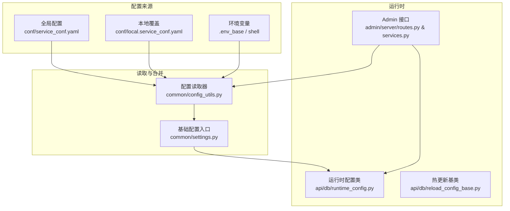
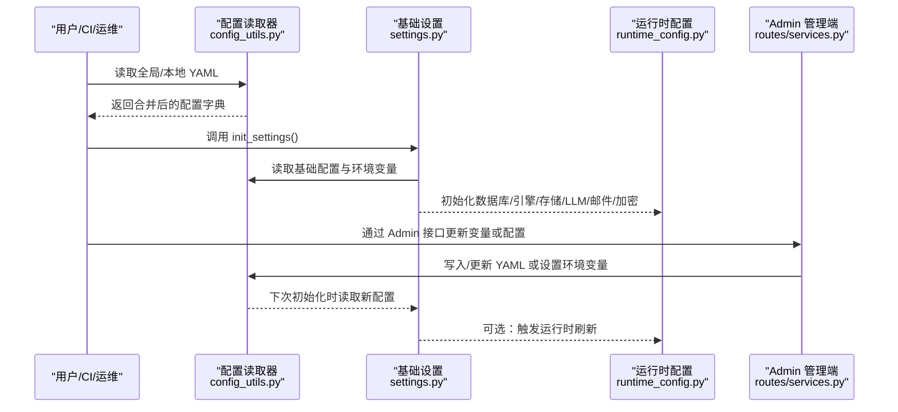
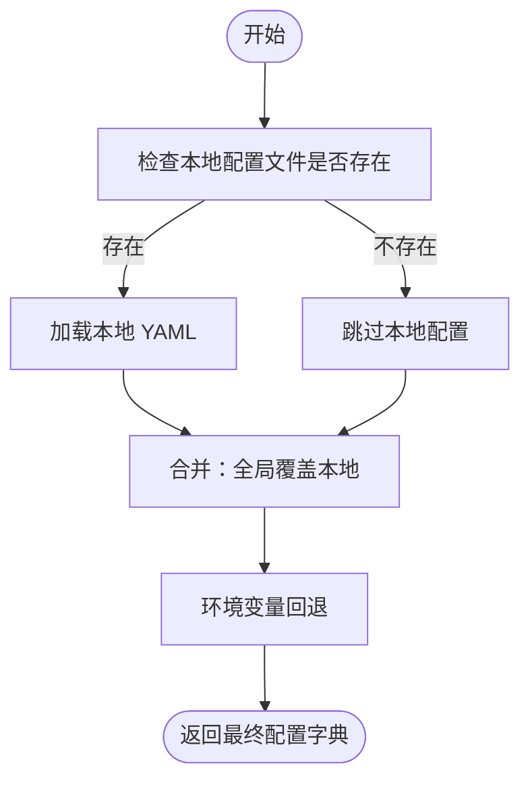
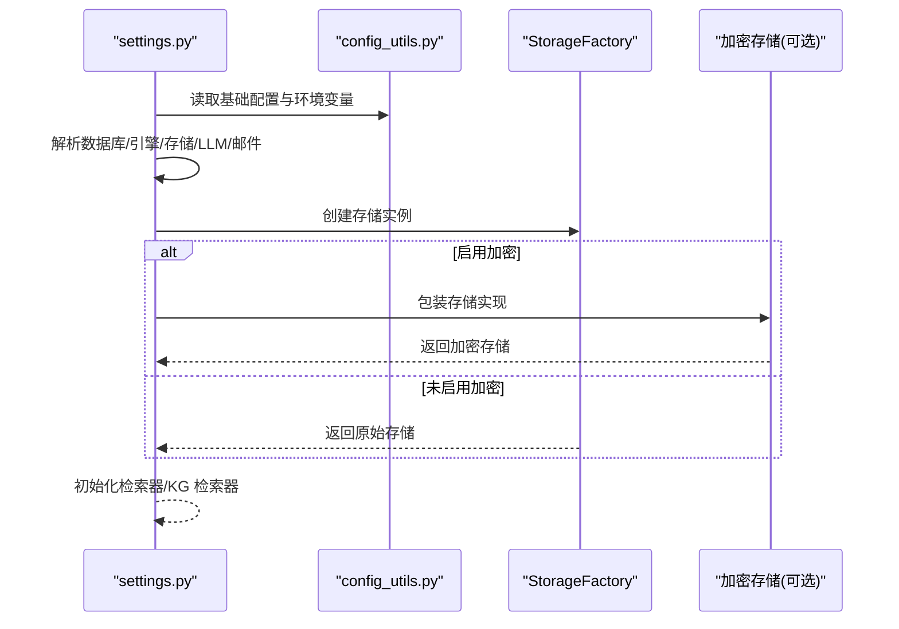
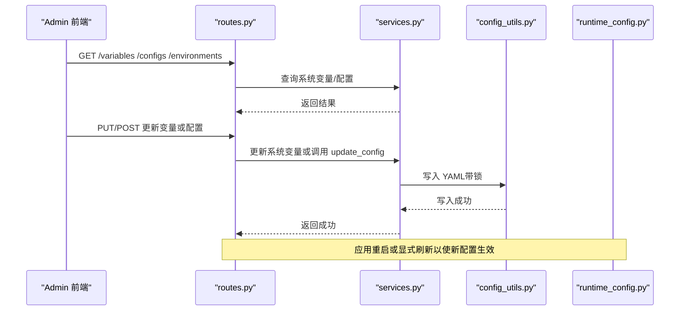
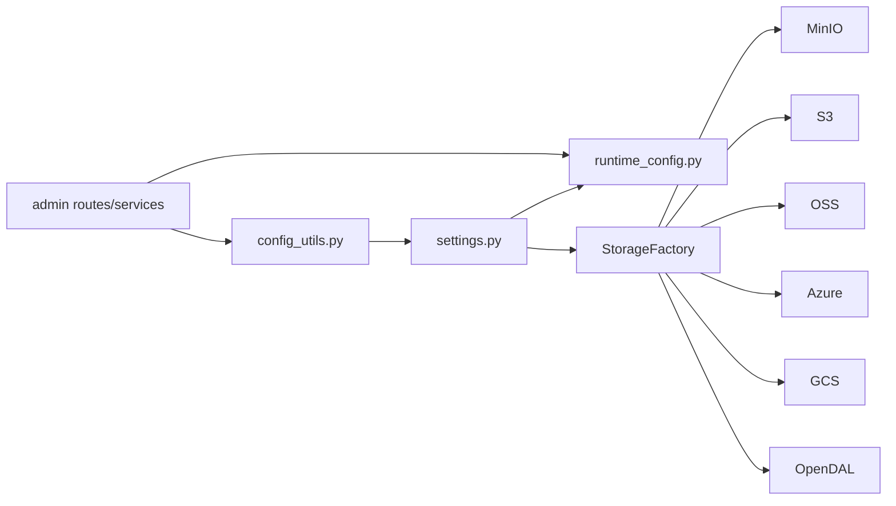

# 配置管理

<cite>
**本文引用的文件**   
- [conf/service_conf.yaml](file://conf/service_conf.yaml)
- [docker/service_conf.yaml.template](file://docker/service_conf.yaml.template)
- [common/config_utils.py](file://common/config_utils.py)
- [common/settings.py](file://common/settings.py)
- [api/utils/configs.py](file://api/utils/configs.py)
- [api/db/reload_config_base.py](file://api/db/reload_config_base.py)
- [api/db/runtime_config.py](file://api/db/runtime_config.py)
- [admin/server/routes.py](file://admin/server/routes.py)
- [admin/server/services.py](file://admin/server/services.py)
- [docker/.env_base](file://docker/.env_base)
- [conf/system_settings.json](file://conf/system_settings.json)
- [conf/chunking_config.json](file://conf/chunking_config.json)
</cite>

## 目录
1. [引言](#引言)
2. [项目结构](#项目结构)
3. [核心组件](#核心组件)
4. [架构总览](#架构总览)
5. [详细组件分析](#详细组件分析)
6. [依赖分析](#依赖分析)
7. [性能考量](#性能考量)
8. [故障排除指南](#故障排除指南)
9. [结论](#结论)
10. [附录](#附录)

## 引言
本指南面向运维与开发人员，系统性讲解 RAGFlow 的配置管理体系：服务配置文件结构与参数、环境变量使用与最佳实践、配置热更新机制、配置模板与默认值、配置安全（加密、权限、审计）、以及常见问题排查方法。目标是帮助读者在不同环境（本地、容器、生产）中高效、安全地管理与切换配置。

## 项目结构
RAGFlow 的配置由“YAML 全局配置 + 本地覆盖 + 环境变量 + 运行时管理”四层构成：
- 全局配置：conf/service_conf.yaml 提供默认服务配置
- 本地覆盖：conf/local.service_conf.yaml 合并覆盖全局配置
- 环境变量：优先级高于配置文件，用于敏感与运行时参数
- 运行时管理：Admin 管理端提供变量与配置查询/更新接口

图表来源
- [conf/service_conf.yaml:1-159](file://conf/service_conf.yaml#L1-L159)
- [docker/service_conf.yaml.template:1-200](file://docker/service_conf.yaml.template#L1-L200)
- [common/config_utils.py:55-116](file://common/config_utils.py#L55-L116)
- [common/settings.py:169-350](file://common/settings.py#L169-L350)
- [api/db/runtime_config.py:20-55](file://api/db/runtime_config.py#L20-L55)
- [api/db/reload_config_base.py:16-29](file://api/db/reload_config_base.py#L16-L29)
- [admin/server/routes.py:438-475](file://admin/server/routes.py#L438-L475)
- [admin/server/services.py:378-409](file://admin/server/services.py#L378-L409)

章节来源
- [conf/service_conf.yaml:1-159](file://conf/service_conf.yaml#L1-L159)
- [docker/service_conf.yaml.template:1-200](file://docker/service_conf.yaml.template#L1-L200)
- [common/config_utils.py:28-116](file://common/config_utils.py#L28-L116)
- [common/settings.py:169-350](file://common/settings.py#L169-L350)
- [docker/.env_base:1-280](file://docker/.env_base#L1-L280)

## 核心组件
- 配置读取与合并：通过读取全局与本地 YAML 并与环境变量融合，形成最终配置字典
- 基础设置初始化：根据配置与环境变量初始化数据库、文档引擎、对象存储、LLM 默认模型、邮件、加密等
- 运行时配置：提供可动态更新的键值集合，支持管理员端查询与修改
- 热更新机制：Admin 管理端写入配置后，运行时配置类可按需刷新；同时支持部分环境变量即时生效
- 安全与序列化：提供受限反序列化与配置脱敏输出，支持数据库密码解密

章节来源
- [common/config_utils.py:55-116](file://common/config_utils.py#L55-L116)
- [common/settings.py:169-350](file://common/settings.py#L169-L350)
- [api/db/runtime_config.py:20-55](file://api/db/runtime_config.py#L20-L55)
- [api/db/reload_config_base.py:16-29](file://api/db/reload_config_base.py#L16-L29)
- [api/utils/configs.py:29-62](file://api/utils/configs.py#L29-L62)

## 架构总览
下图展示从配置文件到运行时生效的关键流程，包括配置加载、环境变量覆盖、初始化与热更新路径。

图表来源
- [common/config_utils.py:55-116](file://common/config_utils.py#L55-L116)
- [common/settings.py:169-350](file://common/settings.py#L169-L350)
- [api/db/runtime_config.py:20-55](file://api/db/runtime_config.py#L20-L55)
- [admin/server/routes.py:438-475](file://admin/server/routes.py#L438-L475)
- [admin/server/services.py:378-409](file://admin/server/services.py#L378-L409)

## 详细组件分析

### 1) 服务配置文件结构与参数说明
- 服务与端口：ragflow/admin 主机与 HTTP 端口
- 数据库：MySQL/MariaDB 连接参数、最大连接数、超时、包大小
- 对象存储：MinIO 用户/密码/主机/桶/前缀
- 文档引擎：Elasticsearch/OpenSearch/Infinity/OceanBase/SeekDB 的主机、用户名、密码等
- 缓存与消息队列：Redis 连接参数与任务执行器类型
- LLM 默认模型：默认工厂、API 密钥、基础 URL、各模型类型（聊天/嵌入/重排序/ASR/图像转文本）
- 其他：注释示例展示了 S3/GCS/OSS/Azure/OpenDAL 等对象存储与 OAuth、SMTP、腾讯云 TCADP 等扩展配置

章节来源
- [conf/service_conf.yaml:1-159](file://conf/service_conf.yaml#L1-L159)

### 2) 环境变量使用与最佳实践
- 优先级：环境变量 > 本地 YAML > 全局 YAML
- 关键变量（示例）：
  - DOC_ENGINE：选择文档引擎（elasticsearch/infinity/opensearch/oceanbase/seekdb）
  - DB_TYPE：数据库类型（mysql 等）
  - STORAGE_IMPL：对象存储实现（MINIO/AWS_S3/OSS/Azure_SPN/Azure_SAS/GCS/OPENDAL）
  - RAGFLOW_SECRET_KEY：应用密钥（建议≥32 字符）
  - RAGFLOW_CRYPTO_ENABLED/ALGORITHM/KEY：启用并配置对象存储加密
  - MAX_CONTENT_LENGTH/DOC_BULK_SIZE/EMBEDDING_BATCH_SIZE：上传与批处理参数
  - REGISTER_ENABLED：是否允许注册
  - SANDBOX_*：沙箱执行器相关开关与主机
  - LOG_LEVELS：日志级别控制
- 最佳实践：
  - 敏感信息一律通过环境变量注入，不落盘明文
  - 使用 Docker 模板中的默认占位符进行环境注入
  - 不同环境（dev/staging/prod）通过 Compose Profiles 与 .env_base 切换

章节来源
- [docker/.env_base:1-280](file://docker/.env_base#L1-L280)
- [docker/service_conf.yaml.template:1-200](file://docker/service_conf.yaml.template#L1-L200)
- [common/settings.py:136-230](file://common/settings.py#L136-L230)

### 3) 配置读取与合并机制
- 读取顺序：先加载本地 conf/local.service_conf.yaml（若存在），再加载全局 conf/service_conf.yaml，后者覆盖前者
- 合并与回退：get_base_config 支持从环境变量回退，避免缺失
- 写入保护：update_config 使用文件锁确保并发安全写入

图表来源
- [common/config_utils.py:55-116](file://common/config_utils.py#L55-L116)

章节来源
- [common/config_utils.py:28-116](file://common/config_utils.py#L28-L116)

### 4) 基础设置初始化流程
- 数据库：根据 DB_TYPE 解密并加载数据库配置
- 文档引擎：根据 DOC_ENGINE 选择 ES/OpenSearch/Infinity/OceanBase/SeekDB，初始化对应连接
- 对象存储：根据 STORAGE_IMPL 选择 MinIO/S3/OSS/Azure/GCS/OpenDAL，并可叠加加密包装
- LLM 默认模型：解析 user_default_llm，默认模型、工厂、API Key、基础 URL
- 邮件：从 smtp 配置读取服务器、端口、SSL/TLS、凭据与默认发件人
- 加密：当启用加密时，创建加密存储包装器

图表来源
- [common/settings.py:169-350](file://common/settings.py#L169-L350)
- [common/config_utils.py:119-144](file://common/config_utils.py#L119-L144)

章节来源
- [common/settings.py:169-350](file://common/settings.py#L169-L350)

### 5) 配置热更新机制
- 运行时配置：RuntimeConfig 提供键值集合与初始化方法，支持按需刷新
- 热更新基类：ReloadConfigBase 提供统一的 get_all/get 方法
- Admin 管理端：
  - 获取变量/配置：/variables、/configs、/environments
  - 更新变量：通过 SystemSettingsService 更新系统变量持久化
  - 更新配置：通过 update_config 写入 YAML 文件（带锁）

图表来源
- [admin/server/routes.py:438-475](file://admin/server/routes.py#L438-L475)
- [admin/server/services.py:364-409](file://admin/server/services.py#L364-L409)
- [common/config_utils.py:147-156](file://common/config_utils.py#L147-L156)
- [api/db/runtime_config.py:20-55](file://api/db/runtime_config.py#L20-L55)

章节来源
- [api/db/reload_config_base.py:16-29](file://api/db/reload_config_base.py#L16-L29)
- [api/db/runtime_config.py:20-55](file://api/db/runtime_config.py#L20-L55)
- [admin/server/routes.py:438-475](file://admin/server/routes.py#L438-L475)
- [admin/server/services.py:364-409](file://admin/server/services.py#L364-L409)
- [common/config_utils.py:147-156](file://common/config_utils.py#L147-L156)

### 6) 配置模板与默认值
- Docker 模板：docker/service_conf.yaml.template 提供占位符，结合 .env_base 注入默认值
- 默认值策略：
  - 文档引擎：默认 elasticsearch
  - 存储实现：默认 MINIO
  - 数据库：默认 mysql
  - 对象存储：MinIO 用户/密码/主机/端口/桶/前缀
  - LLM：默认 embedding_model 基础 URL 占位
- 自定义配置：
  - 在 conf/local.service_conf.yaml 中覆盖全局默认
  - 通过环境变量覆盖任意字段
  - 使用 Admin 管理端动态调整运行时变量

章节来源
- [docker/service_conf.yaml.template:1-200](file://docker/service_conf.yaml.template#L1-L200)
- [docker/.env_base:1-280](file://docker/.env_base#L1-L280)
- [conf/service_conf.yaml:1-159](file://conf/service_conf.yaml#L1-L159)

### 7) 配置安全
- 敏感信息处理：
  - 数据库密码解密：通过 decrypt_database_config 与自定义模块函数解密
  - 配置脱敏输出：show_configs 对密码、密钥等字段打码
  - 受限反序列化：restricted_loads 限制可反序列化模块，降低 pickle 风险
- 权限控制：
  - Admin 接口需要登录与管理员鉴权
  - 系统变量更新受服务层校验
- 审计与可观测性：
  - 日志记录当前配置（含脱敏）
  - 环境变量列表接口便于审计

章节来源
- [common/config_utils.py:119-144](file://common/config_utils.py#L119-L144)
- [common/config_utils.py:78-109](file://common/config_utils.py#L78-L109)
- [api/utils/configs.py:29-62](file://api/utils/configs.py#L29-L62)
- [admin/server/routes.py:438-475](file://admin/server/routes.py#L438-L475)
- [admin/server/services.py:389-409](file://admin/server/services.py#L389-L409)

### 8) 配置模板使用指南
- 使用步骤：
  - 复制 docker/service_conf.yaml.template 为 conf/service_conf.yaml
  - 在 .env_base 中设置所需变量，或直接在 shell 导入
  - 在 conf/local.service_conf.yaml 中添加仅本机覆盖项
- 参数设置要点：
  - 文档引擎与设备：通过 COMPOSE_PROFILES 与 DOC_ENGINE/DEVICE 组合
  - 对象存储：选择 STORAGE_IMPL 并配置对应块存储参数
  - LLM：设置 user_default_llm.default_models 与工厂/密钥/基础 URL
- 默认值定义：
  - 未设置时采用 .env_base 的默认值
  - 未在 .env_base 设置时采用 conf/service_conf.yaml 的默认值

章节来源
- [docker/service_conf.yaml.template:1-200](file://docker/service_conf.yaml.template#L1-L200)
- [docker/.env_base:1-280](file://docker/.env_base#L1-L280)
- [conf/service_conf.yaml:1-159](file://conf/service_conf.yaml#L1-L159)

### 9) 额外配置模板与策略
- 系统设置模板：conf/system_settings.json 定义系统变量的名称、数据类型与默认值，便于 Admin 端统一管理
- 分块策略模板：conf/chunking_config.json 定义默认/结构感知/语义分块策略、优化与内容保护参数

章节来源
- [conf/system_settings.json:1-64](file://conf/system_settings.json#L1-L64)
- [conf/chunking_config.json:1-66](file://conf/chunking_config.json#L1-L66)

## 依赖分析
- 配置读取依赖：common/config_utils.py 依赖 ruamel.yaml 与文件系统，提供安全读取、合并与写入
- 基础设置依赖：common/settings.py 依赖 config_utils 与各类连接模块（ES/Infinity/OpenSearch/OceanBase、MinIO/S3/OSS/Azure/GCS/OpenDAL）
- 管理端依赖：admin/server/routes.py 与 services.py 依赖配置读取与运行时配置类
- 运行时依赖：api/db/runtime_config.py 与 reload_config_base.py 提供热更新能力

图表来源
- [common/config_utils.py:28-116](file://common/config_utils.py#L28-L116)
- [common/settings.py:153-323](file://common/settings.py#L153-L323)
- [api/db/runtime_config.py:20-55](file://api/db/runtime_config.py#L20-L55)
- [admin/server/routes.py:438-475](file://admin/server/routes.py#L438-L475)
- [admin/server/services.py:378-409](file://admin/server/services.py#L378-L409)

章节来源
- [common/config_utils.py:28-116](file://common/config_utils.py#L28-L116)
- [common/settings.py:153-323](file://common/settings.py#L153-L323)
- [api/db/runtime_config.py:20-55](file://api/db/runtime_config.py#L20-L55)
- [admin/server/routes.py:438-475](file://admin/server/routes.py#L438-L475)
- [admin/server/services.py:378-409](file://admin/server/services.py#L378-L409)

## 性能考量
- 批处理与并发：
  - DOC_BULK_SIZE 控制文档批处理数量
  - EMBEDDING_BATCH_SIZE 控制嵌入生成批次大小
  - THREAD_POOL_MAX_WORKERS 控制线程池最大工作线数
- 存储与网络：
  - 对象存储实现（MinIO/S3/OSS/Azure/GCS/OpenDAL）的连接参数与并发需与硬件匹配
  - 文档引擎（ES/OpenSearch/Infinity/OceanBase/SeekDB）的连接池与超时参数影响吞吐
- 计算设备：
  - DEVICE=cpu/gpu 通过 Compose Profiles 控制推理设备与相关服务（如 TEI）的启用

章节来源
- [docker/.env_base:200-280](file://docker/.env_base#L200-L280)
- [common/settings.py:344-347](file://common/settings.py#L344-L347)

## 故障排除指南
- 配置加载失败
  - 检查 conf/local.service_conf.yaml 是否为合法 YAML
  - 查看日志中“loading yaml file config failed”错误
- 密码解密异常
  - 确认 encrypt_password/encrypt_module/private_key 已正确设置
  - 使用 decrypt_database_config 验证解密流程
- 环境变量未生效
  - 确认变量名与 get_base_config 的 key 一致（大写）
  - 检查 .env_base 是否正确导入，或 shell 是否已导出
- Admin 更新无效
  - 确认写入 YAML 成功（update_config 使用文件锁）
  - 重启服务或显式触发运行时刷新
- 对象存储加密失败
  - 检查 RAGFLOW_CRYPTO_ENABLED/ALGORITHM/KEY 是否正确
  - 查看日志中“Failed to initialize encrypted storage”

章节来源
- [common/config_utils.py:28-47](file://common/config_utils.py#L28-L47)
- [common/config_utils.py:119-144](file://common/config_utils.py#L119-L144)
- [common/settings.py:299-317](file://common/settings.py#L299-L317)
- [admin/server/services.py:364-376](file://admin/server/services.py#L364-L376)

## 结论
RAGFlow 的配置体系以 YAML 为基础、环境变量为补充、Admin 管理端为运维入口，辅以运行时热更新与安全机制，实现了跨环境的一致性与灵活性。遵循本文的最佳实践，可在保证安全的前提下高效完成配置的定义、切换与演进。

## 附录
- 常用配置键参考
  - 文档引擎：DOC_ENGINE
  - 数据库：DB_TYPE
  - 对象存储：STORAGE_IMPL
  - LLM 默认模型：user_default_llm
  - 加密：RAGFLOW_CRYPTO_ENABLED/ALGORITHM/KEY
  - 上传与批处理：MAX_CONTENT_LENGTH/DOC_BULK_SIZE/EMBEDDING_BATCH_SIZE
  - 注册开关：REGISTER_ENABLED
  - 沙箱：SANDBOX_ENABLED/HOST/EXECUTOR_MANAGER_* 等
- Docker 模板与 .env_base 的映射关系
  - 将 .env_base 中的变量注入到 docker/service_conf.yaml.template 的占位符中，再生成 conf/service_conf.yaml

章节来源
- [docker/service_conf.yaml.template:1-200](file://docker/service_conf.yaml.template#L1-L200)
- [docker/.env_base:1-280](file://docker/.env_base#L1-L280)
- [conf/service_conf.yaml:1-159](file://conf/service_conf.yaml#L1-L159)