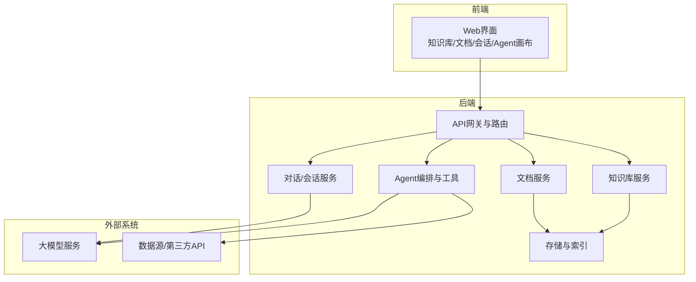
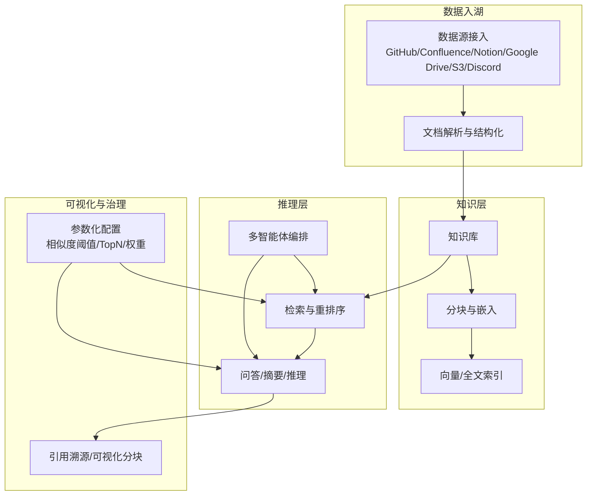
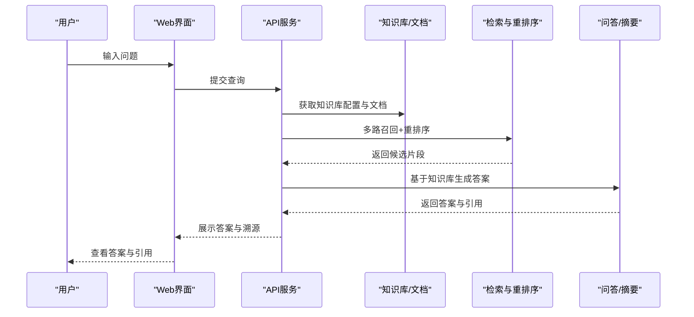
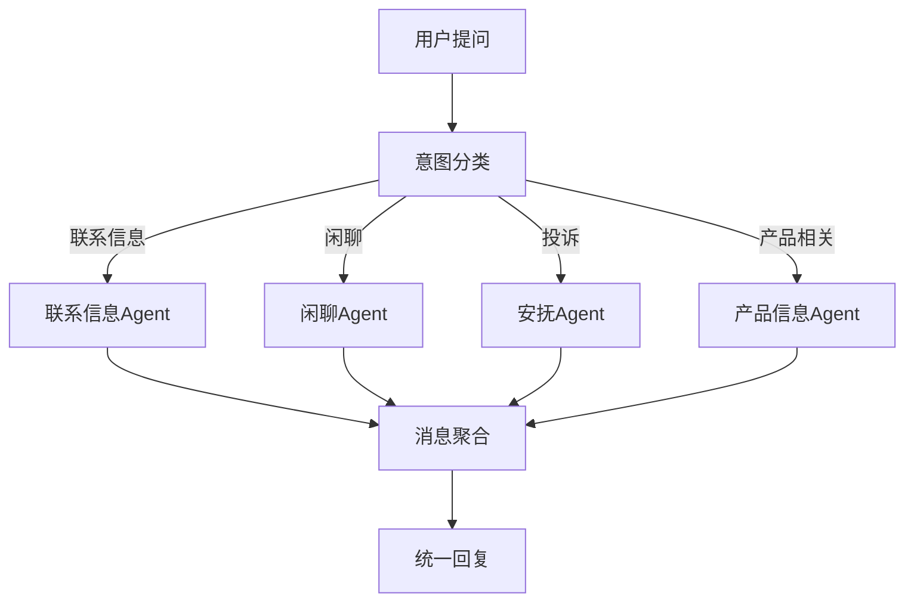
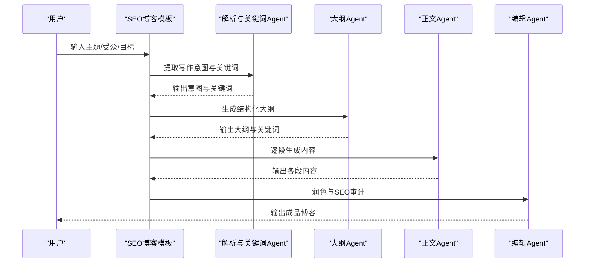
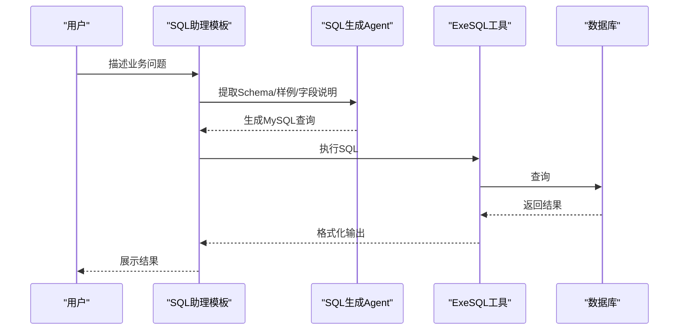
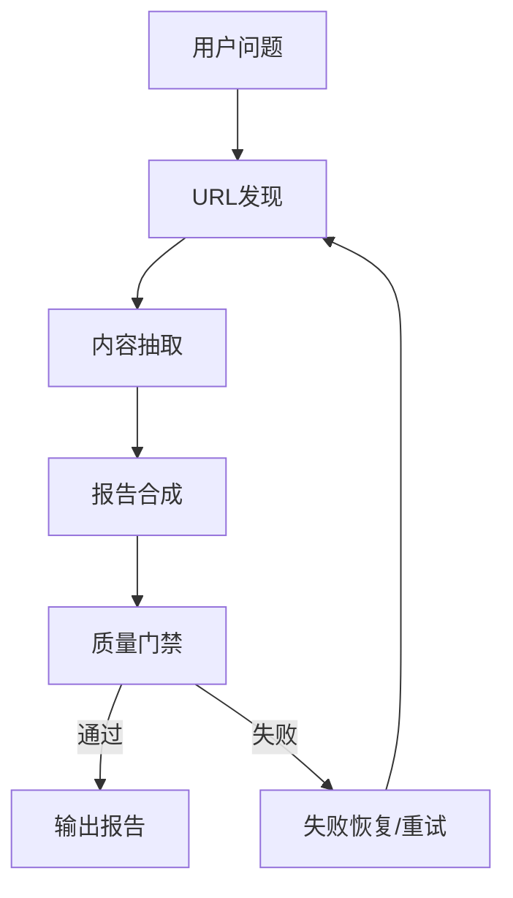
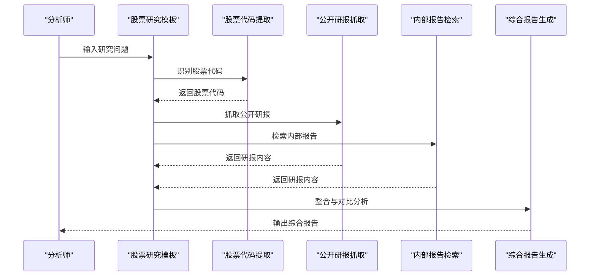
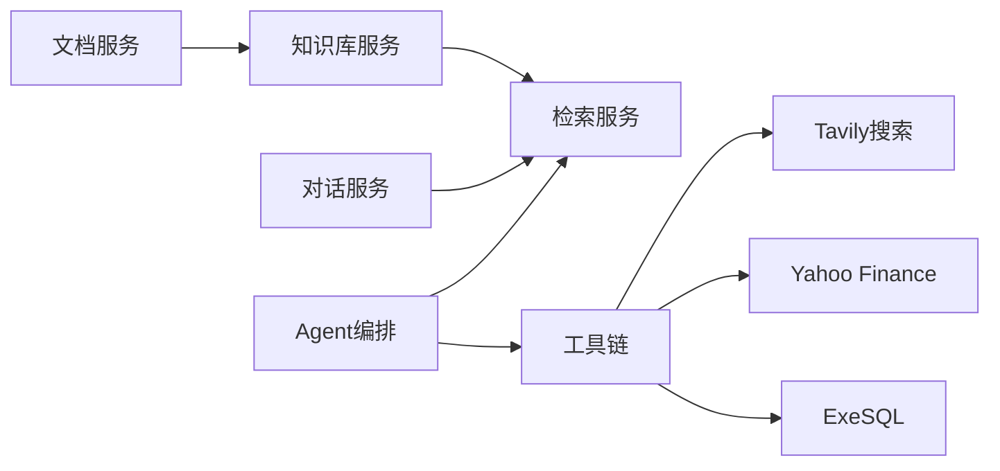

# 应用场景

<cite>
**本文引用的文件**
- [README.md](file://README.md)
- [README_zh.md](file://README_zh.md)
- [rag.md](file://docs/basics/rag.md)
- [customer_service.json](file://agent/templates/customer_service.json)
- [deep_research.json](file://agent/templates/deep_research.json)
- [sql_assistant.json](file://agent/templates/sql_assistant.json)
- [seo_blog.json](file://agent/templates/seo_blog.json)
- [stock_research_report.json](file://agent/templates/stock_research_report.json)
- [knowledge-service.ts](file://web/src/services/knowledge-service.ts)
- [dataset-util.ts](file://web/src/utils/dataset-util.ts)
- [common.py](file://api/db/services/common.py)
- [knowledgebase_service.py](file://api/db/services/knowledgebase_service.py)
- [test_http_api/common.py](file://test/testcases/test_http_api/common.py)
- [test_web_api/common.py](file://test/testcases/test_web_api/common.py)
- [sdk_python_common.py](file://sdk/python/test/test_frontend_api/common.py)
- [admin_client.py](file://admin/client/ragflow_client.py)
- [test_update_chat_assistant.py](file://test/testcases/test_sdk_api/test_chat_assistant_management/test_update_chat_assistant.py)
- [test_create_chat_assistant.py](file://test/testcases/test_http_api/test_chat_assistant_management/test_create_chat_assistant.py)
- [next_step.md](file://rag/prompts/next_step.md)
</cite>

## 目录
1. [引言](#引言)
2. [项目结构](#项目结构)
3. [核心组件](#核心组件)
4. [架构总览](#架构总览)
5. [详细场景分析](#详细场景分析)
6. [依赖关系分析](#依赖关系分析)
7. [性能考量](#性能考量)
8. [故障排查指南](#故障排查指南)
9. [结论](#结论)
10. [附录](#附录)

## 引言
本文件面向RAGFlow项目的使用者与实施团队，系统性梳理RAGFlow在不同业务场景下的适用性、需求分析、解决方案设计与实施建议。RAGFlow以“检索增强生成（RAG）+智能体（Agent）”为核心能力，覆盖文档问答、智能客服、内容创作、数据分析、知识管理、企业内部AI助手等多个典型场景。本文将结合项目README、模板DSL与API接口，给出可落地的实施方案与最佳实践，并对性能、部署与成本进行针对性分析。

## 项目结构
RAGFlow采用前后端分离与多模块协同的架构：
- 后端服务：提供知识库管理、文档解析、检索、对话、Agent编排、工具调用、数据库与缓存等能力。
- 前端界面：提供知识库、文档、会话、Agent画布等管理与交互界面。
- 模板系统：内置多种场景化Agent模板（如客服、深度研究、SQL助理、SEO博客、股票研究）。
- SDK与CLI：提供Python SDK与命令行客户端，便于二次集成与自动化运维。
- 测试与示例：包含HTTP API、SDK API与Web端测试用例，便于验证与集成。

[无图表来源：该图为概念性架构示意，不直接映射具体文件结构]

## 核心组件
- 检索与问答引擎：支持多路召回、重排序、跨语言查询、引用溯源与可视化分块，满足高质量问答与溯源需求。
- 知识库与文档管理：支持多格式文档解析、元数据管理、标签体系、分页与过滤、解析日志追踪。
- 对话与会话：支持聊天助手配置、系统提示词、相似度阈值、TopN、向量权重等参数化控制。
- Agent与工作流：提供可编排的多智能体工作流，支持工具调用（搜索、SQL执行、代码执行）、分支与聚合、消息汇聚等。
- 数据源接入：支持GitHub、GitLab、Confluence、Notion、Google Drive、S3、Discord、Zendesk等异构数据源同步。
- 部署与扩展：支持Docker Compose一键部署，支持Elasticsearch与Infinity两种文档引擎，支持GPU加速与gVisor沙箱执行。

章节来源
- [README.md: 108-136:108-136](file://README.md#L108-L136)
- [README_zh.md: 109-136:109-136](file://README_zh.md#L109-L136)

## 架构总览
RAGFlow的系统架构围绕“数据入湖—知识抽取—检索增强—生成与推理—可视化与溯源”的闭环展开。前端负责配置与可视化，后端提供统一API与服务编排，Agent模板驱动多智能体协作，工具链连接外部数据与计算资源。

图表来源
- [README.md: 137-141:137-141](file://README.md#L137-L141)
- [README_zh.md: 137-141:137-141](file://README_zh.md#L137-L141)

## 详细场景分析

### 场景一：文档问答系统（企业知识库）
- 需求分析
  - 企业内部知识沉淀丰富，需要将私域文档转化为可检索、可问答的知识资产。
  - 要求高准确率、强溯源能力、跨语言查询与引用可视化。
- 解决方案设计
  - 使用知识库与文档管理模块，上传与解析多格式文档；启用可视化分块与引用溯源；配置相似度阈值与TopN参数提升命中质量。
  - 通过对话助手模板，设定系统提示词与参数，实现严格基于知识库的回答策略。
- 实施建议
  - 分批导入与增量更新：先导入核心文档，再逐步扩展。
  - 参数调优：根据业务反馈调整相似度阈值、TopN与向量权重。
  - 访问控制：结合权限模型，限制知识库可见范围。
- 成功案例与最佳实践
  - 结合测试用例中的聊天助手创建与更新流程，验证提示词与参数配置的有效性。
- 性能与成本
  - 索引与向量存储：优先使用GPU加速与合适的分块策略。
  - 成本控制：按需扩容与缓存策略，避免过度TopN导致延迟与资源浪费。

图表来源
- [knowledge-service.ts: 245-288:245-288](file://web/src/services/knowledge-service.ts#L245-L288)
- [dataset-util.ts: 1-9:1-9](file://web/src/utils/dataset-util.ts#L1-L9)
- [test_http_api/common.py: 200-293:200-293](file://test/testcases/test_http_api/common.py#L200-L293)

章节来源
- [rag.md: 85-94:85-94](file://docs/basics/rag.md#L85-L94)
- [test_create_chat_assistant.py: 209-228:209-228](file://test/testcases/test_http_api/test_chat_assistant_management/test_create_chat_assistant.py#L209-L228)
- [test_update_chat_assistant.py: 203-208:203-208](file://test/testcases/test_sdk_api/test_chat_assistant_management/test_update_chat_assistant.py#L203-L208)
- [admin_client.py: 800-858:800-858](file://admin/client/ragflow_client.py#L800-L858)

### 场景二：智能客服（多智能体客服）
- 需求分析
  - 需要根据用户意图自动分流至安抚、产品信息或联系信息等不同处理路径，提升响应效率与满意度。
- 解决方案设计
  - 使用“多智能体客服”模板，通过分类器识别意图，将用户问题路由至对应Agent（安抚、产品信息、联系信息），最终由聚合器汇总回复。
- 实施建议
  - 明确分类规则与示例，持续优化分类准确性。
  - 为不同Agent配置专业提示词与工具，确保回答质量与一致性。
- 成功案例与最佳实践
  - 参考模板DSL中的分类规则、Agent提示词与消息汇聚逻辑，形成标准化的客服流程。
- 性能与成本
  - 控制最大轮次与重试次数，避免长链路阻塞；合理设置温度与Token上限。

图表来源
- [customer_service.json: 1-800:1-800](file://agent/templates/customer_service.json#L1-L800)

章节来源
- [customer_service.json: 14-342:14-342](file://agent/templates/customer_service.json#L14-L342)

### 场景三：内容创作助手（SEO博客）
- 需求分析
  - 需要将简单主题转化为结构化、SEO友好的完整博客文章，降低写作门槛。
- 解决方案设计
  - 使用“生成SEO博客”模板：先解析写作意图与关键词，再生成大纲，随后逐段撰写，最后编辑润色。
- 实施建议
  - 明确目标受众与写作类型，确保关键词策略与结构设计匹配。
  - 使用工具进行事实核查与引用，保证内容权威性。
- 成功案例与最佳实践
  - 参考模板中的Agent分工与工具调用，形成可复用的内容生产流水线。
- 性能与成本
  - 控制段落长度与工具调用频率，平衡生成质量与响应时间。

图表来源
- [seo_blog.json: 1-800:1-800](file://agent/templates/seo_blog.json#L1-L800)

章节来源
- [seo_blog.json: 14-304:14-304](file://agent/templates/seo_blog.json#L14-L304)

### 场景四：数据分析平台（SQL助理）
- 需求分析
  - 业务人员希望用自然语言生成SQL并执行，快速获得数据洞察。
- 解决方案设计
  - 使用“SQL助理”模板：解析用户问题与数据库模式，生成MySQL查询并执行，返回结果。
- 实施建议
  - 明确数据库连接参数与权限范围，确保安全执行。
  - 结合样例与表结构说明，提升生成准确性。
- 成功案例与最佳实践
  - 参考模板中的检索与执行流程，建立可复用的“自然语言→SQL→结果”闭环。
- 性能与成本
  - 控制最大记录数与查询复杂度，避免长时间运行与资源占用。

图表来源
- [sql_assistant.json: 1-718:1-718](file://agent/templates/sql_assistant.json#L1-L718)

章节来源
- [sql_assistant.json: 14-221:14-221](file://agent/templates/sql_assistant.json#L14-L221)

### 场景五：深度研究与报告（多智能体研究）
- 需求分析
  - 需要跨源整合信息，进行结构化、可验证的研究与报告生成。
- 解决方案设计
  - 使用“深度研究”模板：URL发现→内容抽取→报告合成，形成可审计的研究闭环。
- 实施建议
  - 明确分析框架与目标受众，规范输出格式与引用标注。
  - 通过质量门禁与失败恢复机制，保障产出质量。
- 成功案例与最佳实践
  - 参考模板中的阶段划分、质量门禁与自适应策略，形成标准化研究流程。
- 性能与成本
  - 并行化工具调用与分阶段质量检查，平衡效率与成本。

图表来源
- [deep_research.json: 1-504:1-504](file://agent/templates/deep_research.json#L1-L504)
- [next_step.md: 1-32:1-32](file://rag/prompts/next_step.md#L1-L32)

章节来源
- [deep_research.json: 1-120:1-120](file://agent/templates/deep_research.json#L1-L120)

### 场景六：股票研究与投资报告（专业研究）
- 需求分析
  - 金融分析师需要快速整合公开研报与公司财务数据，形成差异化观点的综合报告。
- 解决方案设计
  - 使用“股票研究报告”模板：提取股票代码→抓取公开研报→检索内部报告→生成综合报告。
- 实施建议
  - 统一数据源口径与引用格式，保留多源观点差异并进行对比分析。
  - 通过代码执行模块格式化财务表，提升报告可读性。
- 成功案例与最佳实践
  - 参考模板中的报告结构要求与输出规范，确保报告符合投研标准。
- 性能与成本
  - 控制工具调用次数与数据量，避免重复抓取与冗余计算。

图表来源
- [stock_research_report.json: 1-800:1-800](file://agent/templates/stock_research_report.json#L1-L800)

章节来源
- [stock_research_report.json: 15-120:15-120](file://agent/templates/stock_research_report.json#L15-L120)

### 场景七：企业内部AI助手（通用Agent）
- 需求分析
  - 企业需要一个可配置的AI助手，支持多场景问答、流程编排与工具调用。
- 解决方案设计
  - 基于对话助手与Agent模板，结合知识库与工具链，构建企业级智能助手。
- 实施建议
  - 通过权限与租户隔离，保障数据安全；通过参数化配置，适配不同业务域。
- 成功案例与最佳实践
  - 参考聊天助手的创建与更新流程，结合知识库与工具，形成可复用的助手模板。
- 性能与成本
  - 合理设置消息历史窗口与工具调用频率，避免上下文过长导致延迟。

章节来源
- [test_create_chat_assistant.py: 209-228:209-228](file://test/testcases/test_http_api/test_chat_assistant_management/test_create_chat_assistant.py#L209-L228)
- [test_update_chat_assistant.py: 203-208:203-208](file://test/testcases/test_sdk_api/test_chat_assistant_management/test_update_chat_assistant.py#L203-L208)
- [admin_client.py: 800-858:800-858](file://admin/client/ragflow_client.py#L800-L858)

## 依赖关系分析
- 组件耦合
  - 知识库服务与文档服务紧密耦合，共同支撑检索与问答。
  - Agent编排依赖检索与工具链，形成“思考—行动—反馈”的闭环。
- 外部依赖
  - 大模型服务与第三方API（如Tavily、Yahoo Finance、ExeSQL等）构成工具生态。
- 权限与治理
  - 知识库访问控制与租户隔离，确保数据安全与合规。

图表来源
- [knowledgebase_service.py: 30-64:30-64](file://api/db/services/knowledgebase_service.py#L30-L64)
- [common.py: 1-50:1-50](file://api/db/services/common.py#L1-L50)

章节来源
- [knowledgebase_service.py: 30-64:30-64](file://api/db/services/knowledgebase_service.py#L30-L64)
- [common.py: 1-50:1-50](file://api/db/services/common.py#L1-L50)

## 性能考量
- 检索性能
  - 多路召回与融合重排序可显著提升命中质量，但需控制TopK与TopN以平衡延迟。
  - 向量相似度阈值与权重参数直接影响召回与生成质量，需结合业务场景调优。
- 生成性能
  - 温度、最大Token与工具调用次数影响生成速度与稳定性，建议在模板中预设合理上限。
- 存储与索引
  - 优先使用GPU加速与合适的分块策略；在高并发场景下，建议引入缓存与限流。
- 工具调用
  - 并行化工具调用可提升吞吐，但需注意第三方API的速率限制与可用性。

[本节为通用指导，不直接分析具体文件]

## 故障排查指南
- 知识库与文档
  - 检查知识库访问权限与文档解析状态；通过列表与过滤接口定位问题。
- 对话与会话
  - 校验聊天助手配置与参数（相似度阈值、TopN、系统提示词）是否合理。
- Agent与工具
  - 检查工具调用日志与错误分支，必要时启用失败恢复策略。
- API与SDK
  - 使用测试用例中的接口路径与参数，快速定位问题并回归验证。

章节来源
- [test_http_api/common.py: 235-268:235-268](file://test/testcases/test_http_api/common.py#L235-L268)
- [test_web_api/common.py: 200-293:200-293](file://test/testcases/test_web_api/common.py#L200-L293)
- [sdk_python_common.py: 39-96:39-96](file://sdk/python/test/test_frontend_api/common.py#L39-L96)

## 结论
RAGFlow通过“RAG+Agent”的能力组合，为企业提供了从文档问答到专业研究、从内容创作到数据分析的全栈解决方案。依托模板化工作流与工具链生态，RAGFlow可在不同规模企业中快速落地，满足从个人开发者到大型组织的多样化需求。通过合理的参数配置、工具编排与性能优化，可实现高可用、可审计、可扩展的AI应用体系。

[本节为总结性内容，不直接分析具体文件]

## 附录
- 快速开始与部署
  - 参考README中的部署指引与环境要求，确保硬件与镜像平台满足需求。
- 文档引擎切换
  - 支持Elasticsearch与Infinity两种文档引擎，按需切换并评估性能与兼容性。
- 社区与支持
  - 通过Discord、GitHub Discussions与社区渠道获取帮助与最佳实践。

章节来源
- [README.md: 143-250:143-250](file://README.md#L143-L250)
- [README_zh.md: 143-250:143-250](file://README_zh.md#L143-L250)