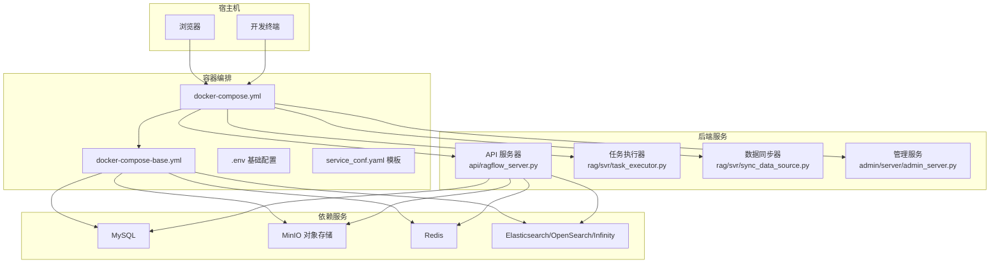
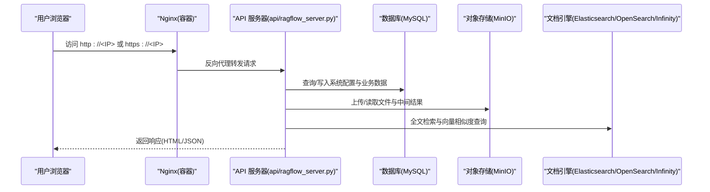
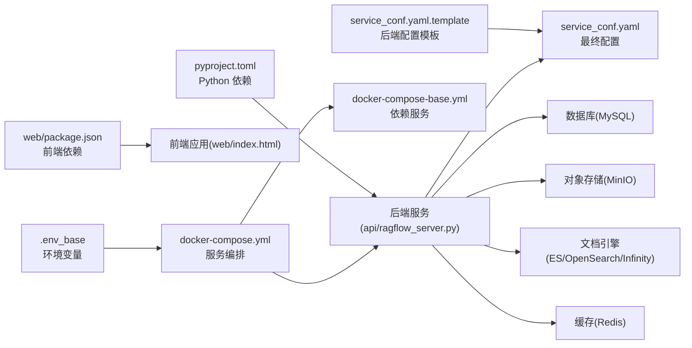

# 快速开始

<cite>
**本文引用的文件**
- [README.md](file://README.md)
- [docker/README.md](file://docker/README.md)
- [docs/quickstart.mdx](file://docs/quickstart.mdx)
- [docker/docker-compose.yml](file://docker/docker-compose.yml)
- [docker/docker-compose-base.yml](file://docker/docker-compose-base.yml)
- [docker/.env_base](file://docker/.env_base)
- [docker/service_conf.yaml.template](file://docker/service_conf.yaml.template)
- [docker/entrypoint.sh](file://docker/entrypoint.sh)
- [docker/launch_backend_service.sh](file://docker/launch_backend_service.sh)
- [api/ragflow_server.py](file://api/ragflow_server.py)
- [pyproject.toml](file://pyproject.toml)
- [web/package.json](file://web/package.json)
- [web/index.html](file://web/index.html)
- [docs/faq.mdx](file://docs/faq.mdx)
</cite>

## 目录
1. [简介](#简介)
2. [项目结构](#项目结构)
3. [核心组件](#核心组件)
4. [架构总览](#架构总览)
5. [详细组件分析](#详细组件分析)
6. [依赖关系分析](#依赖关系分析)
7. [性能考虑](#性能考虑)
8. [故障排除指南](#故障排除指南)
9. [结论](#结论)
10. [附录](#附录)

## 简介
本指南面向首次部署与使用 RAGFlow 的用户，目标是帮助你在最短时间内完成环境准备、选择合适的部署方式（Docker 一键部署或源码本地部署）、进行初始配置，并通过安装验证确认系统正常运行。随后，你将完成数据库、API 密钥、服务端口等关键配置，并获得登录界面使用说明与基础功能体验路径。

## 项目结构
RAGFlow 采用前后端分离与容器化部署为主的设计。后端由 Python 编写，提供 REST API；前端基于 Vite 构建；依赖服务通过 Docker Compose 启动，包括 MySQL、MinIO、Redis、Elasticsearch/OpenSearch/Infinity 等。

图表来源
- [docker/docker-compose.yml:1-133](file://docker/docker-compose.yml#L1-L133)
- [docker/docker-compose-base.yml:1-326](file://docker/docker-compose-base.yml#L1-L326)
- [api/ragflow_server.py:1-157](file://api/ragflow_server.py#L1-L157)

章节来源
- [README.md:143-251](file://README.md#L143-L251)
- [docker/README.md:13-26](file://docker/README.md#L13-L26)

## 核心组件
- 容器编排与环境变量
  - docker-compose.yml：定义 ragflow-cpu/ragflow-gpu 服务、端口映射、挂载卷、环境变量来源与健康检查触发条件。
  - docker-compose-base.yml：定义 MySQL、MinIO、Redis、Elasticsearch/OpenSearch/Infinity、TEI 等依赖服务及其健康检查。
  - .env_base：集中管理各服务的主机名、端口、密码、时区、日志级别、文件大小限制、批处理大小、文档引擎切换等。
  - service_conf.yaml.template：后端服务配置模板，用于生成最终的 service_conf.yaml，包含数据库、对象存储、向量库、默认 LLM 等。
  - entrypoint.sh：容器入口脚本，负责替换模板中的环境变量、按参数启动 Web 服务器、任务执行器、数据同步器、Admin 服务与 MCP 服务。
- 后端服务
  - api/ragflow_server.py：Flask 应用入口，初始化数据库、系统数据、运行时配置，启动 HTTP 服务并注册信号处理。
  - 任务执行器与数据同步器：在容器内作为子进程运行，负责异步任务与数据源同步。
- 前端
  - web/package.json：前端工程依赖与脚本，支持开发与构建。
  - web/index.html：前端入口页面，挂载根节点并加载主应用。

章节来源
- [docker/docker-compose.yml:1-133](file://docker/docker-compose.yml#L1-L133)
- [docker/docker-compose-base.yml:1-326](file://docker/docker-compose-base.yml#L1-L326)
- [docker/.env_base:1-280](file://docker/.env_base#L1-L280)
- [docker/service_conf.yaml.template:1-200](file://docker/service_conf.yaml.template#L1-L200)
- [docker/entrypoint.sh:1-273](file://docker/entrypoint.sh#L1-L273)
- [api/ragflow_server.py:1-157](file://api/ragflow_server.py#L1-L157)
- [web/package.json:1-195](file://web/package.json#L1-L195)
- [web/index.html:1-14](file://web/index.html#L1-L14)

## 架构总览
下图展示了从浏览器访问到后端 API、再到依赖服务的整体调用链路。

图表来源
- [docker/docker-compose.yml:31-47](file://docker/docker-compose.yml#L31-L47)
- [api/ragflow_server.py:148-157](file://api/ragflow_server.py#L148-L157)
- [docker/service_conf.yaml.template:1-200](file://docker/service_conf.yaml.template#L1-L200)

## 详细组件分析

### 部署方式一：Docker 一键部署
- 系统前置要求
  - CPU ≥ 4 核；内存 ≥ 16 GB；磁盘 ≥ 50 GB；Docker ≥ 24.0.0；Docker Compose ≥ v2.26.1。
  - Linux 需设置 vm.max_map_count ≥ 262144，否则会报“无法连接 ES 集群”。
- 步骤
  1) 准备环境：确保 vm.max_map_count 设置正确并持久化。
  2) 克隆仓库并进入 docker 目录。
  3) 使用预构建镜像启动服务（CPU 或 GPU）。
  4) 查看容器日志，确认后端服务已就绪。
  5) 在浏览器中访问 http://<服务器IP>（默认端口 80）。
  6) 如需启用默认 LLM，请在 service_conf.yaml.template 中配置 user_default_llm 并填入对应 API Key。
- 注意事项
  - 镜像版本与平台：v0.23.1 版本镜像适用于 x86 平台；ARM64 需自行构建镜像。
  - 端口映射：可通过 docker-compose.yml 调整对外暴露端口。
  - 文档引擎：默认使用 Elasticsearch，可切换至 Infinity/OpenSearch/OceanBase/SeekDB。
- 常见问题
  - “网络异常”：未等待服务完全初始化导致的提示，应先查看日志确认初始化完成。
  - “无法连接 ES 集群”：检查 vm.max_map_count 是否满足要求且持久化。

章节来源
- [README.md:145-251](file://README.md#L145-L251)
- [docs/quickstart.mdx:28-244](file://docs/quickstart.mdx#L28-L244)
- [docker/README.md:13-271](file://docker/README.md#L13-L271)
- [docker/docker-compose.yml:1-133](file://docker/docker-compose.yml#L1-L133)
- [docker/.env_base:1-280](file://docker/.env_base#L1-L280)
- [docker/service_conf.yaml.template:88-198](file://docker/service_conf.yaml.template#L88-L198)

### 部署方式二：源码本地部署（开发）
- 前置要求
  - 安装 uv 与 pre-commit；Python 3.12；系统具备 jemalloc。
  - 若无法访问 HuggingFace，可设置 HF_ENDPOINT 使用镜像站。
- 步骤
  1) 安装依赖：uv sync、下载依赖脚本、安装 pre-commit。
  2) 启动依赖服务：docker compose -f docker/docker-compose-base.yml up -d。
  3) 将 .env 中的主机名解析到 127.0.0.1（例如 es01、infinity、mysql、minio、redis）。
  4) 启动后端：source .venv/bin/activate；export PYTHONPATH=$(pwd)；bash docker/launch_backend_service.sh。
  5) 启动前端：cd web；npm install；npm run dev。
  6) 浏览器访问 http://localhost:3000（前端默认端口）。
- 注意事项
  - 任务执行器与后端服务均具备自动重启逻辑，便于开发调试。
  - 如需 MCP/Admin 服务，可在 entrypoint.sh 参数中开启相应开关。

章节来源
- [README.md:315-386](file://README.md#L315-L386)
- [docker/docker-compose-base.yml:1-326](file://docker/docker-compose-base.yml#L1-L326)
- [docker/launch_backend_service.sh:1-130](file://docker/launch_backend_service.sh#L1-L130)
- [docker/entrypoint.sh:1-273](file://docker/entrypoint.sh#L1-L273)
- [web/package.json:7-16](file://web/package.json#L7-L16)

### 安装验证流程
- Docker 一键部署
  - 执行 docker logs -f <容器名>，观察后端服务输出“Running on all addresses”等初始化完成信息。
  - 在浏览器中访问 http://<服务器IP>，若出现登录页则表示服务已可用。
- 源码本地部署
  - 确认后端日志无致命错误，前端控制台无跨域或资源加载失败。
  - 登录后进入系统，检查“系统设置”页面显示当前版本号。

章节来源
- [docs/quickstart.mdx:218-244](file://docs/quickstart.mdx#L218-L244)
- [api/ragflow_server.py:76-157](file://api/ragflow_server.py#L76-L157)

### 初始配置步骤
- 数据库设置
  - 默认使用 MySQL（docker-compose-base.yml 中定义），用户名 root，密码来自 .env_base 中的 MYSQL_PASSWORD。
  - 若使用外部 MySQL，需在 .env_base 中修改 MYSQL_HOST/MYSQL_PORT，并在 service_conf.yaml.template 中同步。
- 对象存储设置
  - 默认使用 MinIO（docker-compose-base.yml 中定义），用户名/密码来自 .env_base 中的 MINIO_USER/MINIO_PASSWORD。
  - 若更换存储实现（如 OSS），可在 service_conf.yaml.template 中配置对应字段。
- 文档引擎设置
  - 默认使用 Elasticsearch；可在 .env_base 中设置 DOC_ENGINE 切换至 Infinity/OpenSearch/OceanBase/SeekDB。
  - 切换后需重启容器，且注意数据卷清理风险。
- LLM 与嵌入模型
  - 在 service_conf.yaml.template 中配置 user_default_llm.factory 与 api_key。
  - 可选启用 TEI 服务（docker-compose-base.yml 中的 tei-cpu/tei-gpu），并在 service_conf.yaml 中指向 TEI 地址。
- 服务端口调整
  - Web(HTTP/HTTPS)、API、Admin、MCP 端口在 docker-compose.yml 中映射，.env_base 中也有对应变量。
  - 修改后需重启容器生效。

章节来源
- [docker/.env_base:109-157](file://docker/.env_base#L109-L157)
- [docker/service_conf.yaml.template:1-200](file://docker/service_conf.yaml.template#L1-L200)
- [docker/docker-compose.yml:31-47](file://docker/docker-compose.yml#L31-L47)
- [docker/docker-compose-base.yml:244-277](file://docker/docker-compose-base.yml#L244-L277)

### 登录界面使用说明与基础功能体验
- 登录页
  - 前端登录页位于 web/src/pages/login-next/index.tsx，支持邮箱/密码登录与第三方渠道登录（若配置）。
  - 注册开关由系统配置决定，可在登录页切换登录/注册模式。
- 基础功能体验
  - 创建数据集 → 上传文件 → 开始解析 → 可视化分块与干预 → 检索测试 → 创建聊天助手并对话。
  - 参考快速开始文档中的操作步骤与截图指引。

章节来源
- [web/src/pages/login-next/index.tsx:1-360](file://web/src/pages/login-next/index.tsx#L1-L360)
- [docs/quickstart.mdx:269-359](file://docs/quickstart.mdx#L269-L359)

## 依赖关系分析
- 组件耦合
  - api/ragflow_server.py 依赖数据库、对象存储、文档引擎与 Redis 等服务。
  - docker-compose.yml 通过 volumes/env_file 将 .env 与模板注入容器，entrypoint.sh 动态生成 service_conf.yaml。
- 外部依赖
  - Python 依赖集中在 pyproject.toml，包含主流 LLM SDK、数据源连接器、向量库客户端等。
  - 前端依赖集中在 web/package.json，包含 Ant Design、React 生态与构建工具链。

图表来源
- [pyproject.toml:1-278](file://pyproject.toml#L1-L278)
- [web/package.json:1-195](file://web/package.json#L1-L195)
- [docker/docker-compose.yml:1-133](file://docker/docker-compose.yml#L1-L133)
- [docker/docker-compose-base.yml:1-326](file://docker/docker-compose-base.yml#L1-L326)
- [docker/.env_base:1-280](file://docker/.env_base#L1-L280)
- [docker/service_conf.yaml.template:1-200](file://docker/service_conf.yaml.template#L1-L200)
- [api/ragflow_server.py:1-157](file://api/ragflow_server.py#L1-L157)

章节来源
- [pyproject.toml:1-278](file://pyproject.toml#L1-L278)
- [web/package.json:1-195](file://web/package.json#L1-L195)
- [docker/docker-compose.yml:1-133](file://docker/docker-compose.yml#L1-L133)
- [docker/docker-compose-base.yml:1-326](file://docker/docker-compose-base.yml#L1-L326)
- [docker/.env_base:1-280](file://docker/.env_base#L1-L280)
- [docker/service_conf.yaml.template:1-200](file://docker/service_conf.yaml.template#L1-L200)
- [api/ragflow_server.py:1-157](file://api/ragflow_server.py#L1-L157)

## 性能考虑
- 内存与线程
  - MEM_LIMIT 控制容器内存上限；THREAD_POOL_MAX_WORKERS 控制线程池最大工作线程数。
- 批处理与并发
  - DOC_BULK_SIZE 控制文档解析批大小；EMBEDDING_BATCH_SIZE 控制嵌入向量化批大小。
  - TEI 服务可按 CPU/GPU 模式启动，提升向量化性能。
- 存储与网络
  - MinIO 提供高吞吐对象存储；建议根据文件规模与并发需求调整其资源配额。
- GPU 加速
  - 使用 GPU 模式时，确保宿主机具备 NVIDIA 驱动与 nvidia-container-toolkit。

章节来源
- [docker/.env_base:63-213](file://docker/.env_base#L63-L213)
- [docker/docker-compose-base.yml:258-277](file://docker/docker-compose-base.yml#L258-L277)
- [docker/docker-compose.yml:100-107](file://docker/docker-compose.yml#L100-L107)

## 故障排除指南
- 网络异常与初始化未完成
  - 现象：登录提示“网络异常”。
  - 处理：查看容器日志，等待后端服务初始化完成后再尝试登录。
- 无法连接 ES 集群
  - 现象：报错“Can't connect to ES cluster”。
  - 处理：检查 vm.max_map_count 设置是否满足要求并持久化；确认 ES 容器健康状态。
- PDF 解析卡住
  - 现象：解析进度停滞在极低百分比或接近完成时被杀。
  - 处理：检查日志、确认 task_executor 进程存在；检查网络访问 huggingface；必要时提高 MEM_LIMIT。
- 文件大小限制
  - 现象：上传受限。
  - 处理：在 .env 中调整 MAX_CONTENT_LENGTH，并同步修改 nginx 配置中的 client_max_body_size。
- HTTPS 配置
  - 现象：需要安全访问。
  - 处理：参考 docker/README.md 中 HTTPS 设置步骤，挂载证书并切换到 HTTPS 配置文件。

章节来源
- [docs/faq.mdx:204-224](file://docs/faq.mdx#L204-L224)
- [docs/faq.mdx:312-340](file://docs/faq.mdx#L312-L340)
- [docs/faq.mdx:235-270](file://docs/faq.mdx#L235-L270)
- [docs/faq.mdx:414-424](file://docs/faq.mdx#L414-L424)
- [docker/README.md:202-271](file://docker/README.md#L202-L271)

## 结论
通过本快速开始指南，你已完成环境准备、选择了适合的部署方式、完成了初始配置与安装验证，并掌握了登录与基础功能体验路径。遇到问题时，可依据故障排除指南快速定位与解决。建议在生产环境中进一步完善安全策略（如 HTTPS、强密码、最小权限）、监控与日志体系以及备份方案。

## 附录
- 快速命令摘要
  - Docker 一键部署：docker compose -f docker-compose.yml up -d；docker logs -f <容器名>。
  - 源码本地部署：uv sync；docker compose -f docker/docker-compose-base.yml up -d；bash docker/launch_backend_service.sh；cd web && npm install && npm run dev。
- 关键配置文件清单
  - docker/.env_base：环境变量与服务端口、密码、文档引擎等。
  - docker/service_conf.yaml.template：后端服务配置模板。
  - docker/docker-compose.yml：服务编排与端口映射。
  - docker/docker-compose-base.yml：依赖服务定义与健康检查。
  - api/ragflow_server.py：后端服务入口。
  - docker/entrypoint.sh：容器启动与配置生成。
  - docker/launch_backend_service.sh：本地开发启动脚本。
  - pyproject.toml/web/package.json：后端/前端依赖清单。