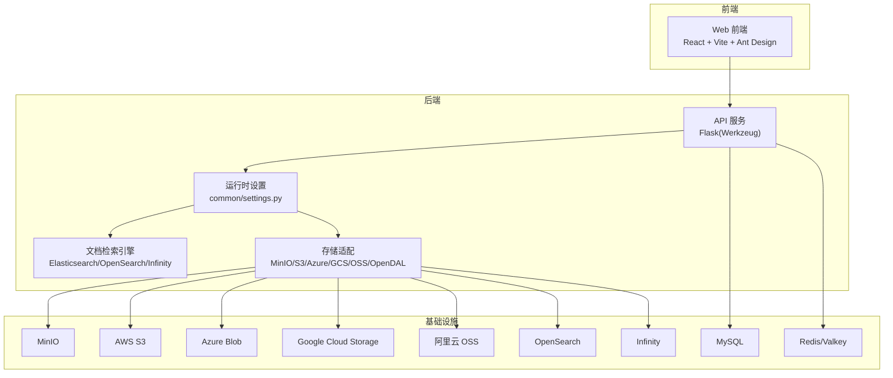
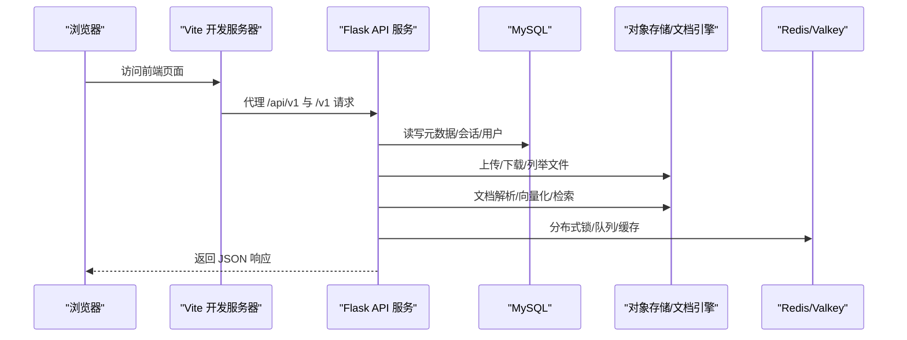
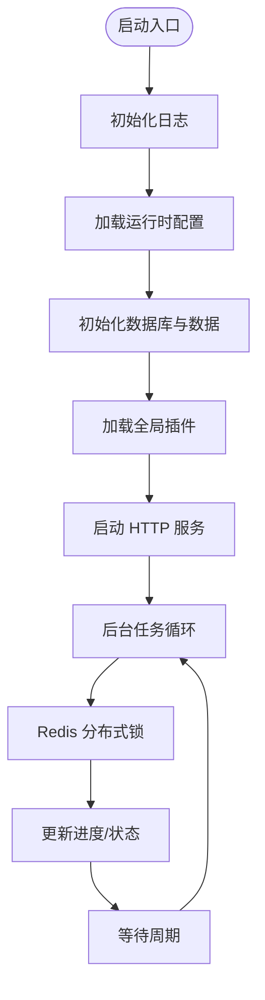
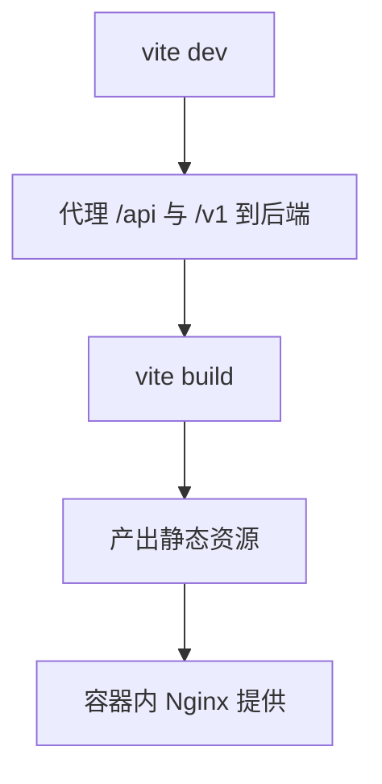
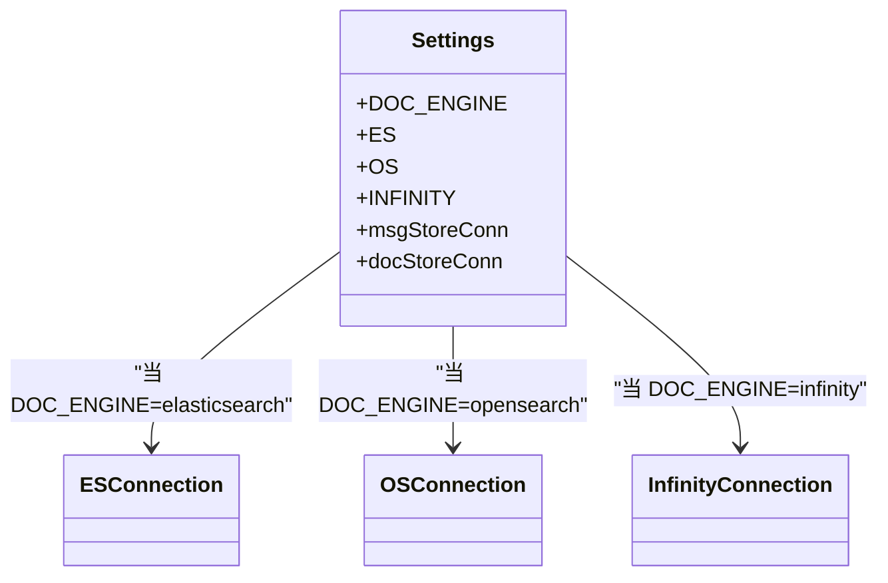
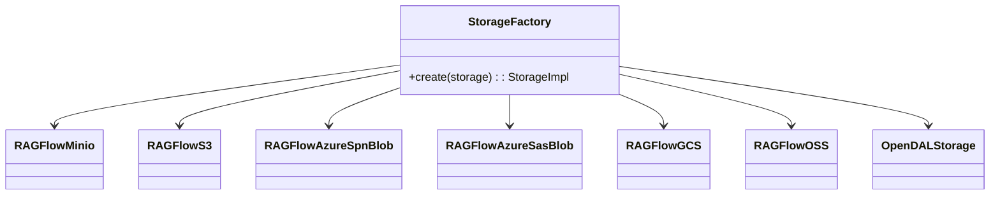
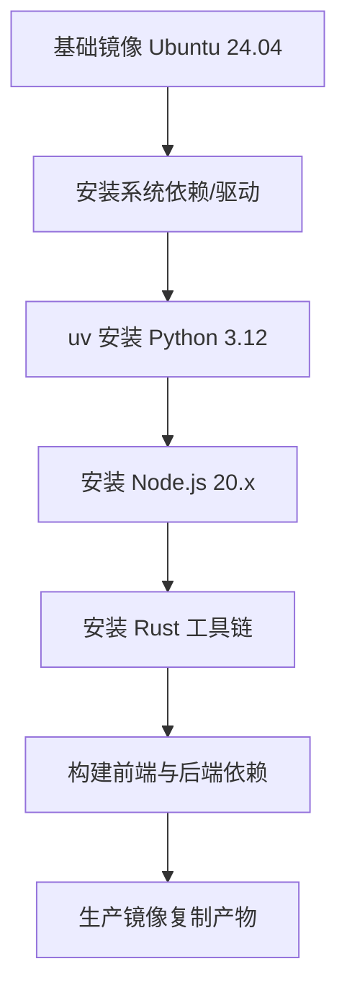
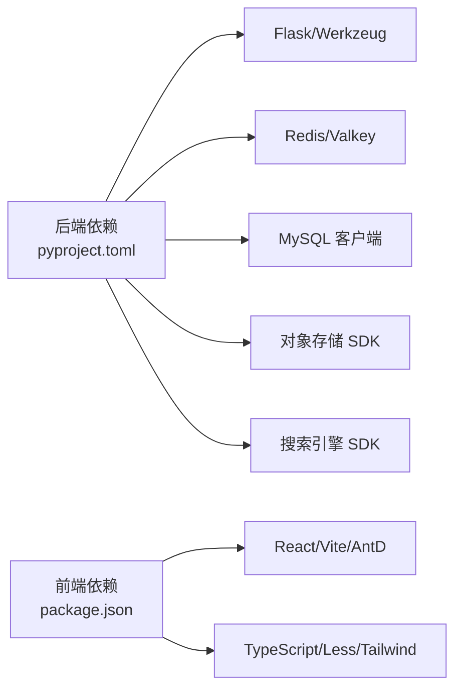

# 技术栈

<cite>
**本文引用的文件**
- [pyproject.toml](file://pyproject.toml)
- [package.json](file://web/package.json)
- [Dockerfile](file://Dockerfile)
- [docker-compose.yml](file://docker/docker-compose.yml)
- [values.yaml](file://helm/values.yaml)
- [service_conf.yaml](file://conf/service_conf.yaml)
- [vite.config.ts](file://web/vite.config.ts)
- [ragflow_server.py](file://api/ragflow_server.py)
- [settings.py](file://common/settings.py)
- [minio_conn.py](file://rag/utils/minio_conn.py)
- [migrate_to_single_bucket_mode.md](file://docs/develop/migrate_to_single_bucket_mode.md)
</cite>

## 目录
1. [简介](#简介)
2. [项目结构](#项目结构)
3. [核心组件](#核心组件)
4. [架构总览](#架构总览)
5. [详细组件分析](#详细组件分析)
6. [依赖关系分析](#依赖关系分析)
7. [性能考量](#性能考量)
8. [故障排查指南](#故障排查指南)
9. [结论](#结论)
10. [附录](#附录)

## 简介
本节概述 RAGFlow 的技术栈构成与选择理由。RAGFlow 是一个基于深度文档理解的开源 RAG（检索增强生成）引擎，面向企业级规模，提供从数据解析、向量化、检索到对话生成的完整链路。技术栈覆盖后端（Python、Flask/Werkzeug、异步与并发）、前端（React、Vite、Ant Design）、数据库与搜索引擎（MySQL、Elasticsearch、OpenSearch、Infinity、Redis）、对象存储（MinIO、S3、Azure Blob、GCS、OSS、OpenDAL）、容器化与编排（Docker、Kubernetes/Helm），以及 AI/ML 生态中的多模型厂商适配与本地推理支持。

## 项目结构
RAGFlow 采用多模块分层组织：后端服务以 Flask 应用为核心，通过统一入口启动；前端使用 Vite 构建；容器化与编排通过 Docker Compose 和 Helm 提供；配置集中于 YAML 模板与运行时环境变量；通用能力封装在 common 与 rag 子模块中。

图表来源
- [Dockerfile:188-224](file://Dockerfile#L188-L224)
- [values.yaml:105-259](file://helm/values.yaml#L105-L259)
- [settings.py:244-298](file://common/settings.py#L244-L298)

章节来源
- [Dockerfile:1-224](file://Dockerfile#L1-L224)
- [docker-compose.yml:1-133](file://docker/docker-compose.yml#L1-L133)
- [values.yaml:1-259](file://helm/values.yaml#L1-L259)

## 核心组件
- 后端运行时与框架
  - Python 版本：3.12 ≤ 版本 < 3.15（满足高性能与新特性）
  - Web 框架：Flask + Werkzeug（生产启动由自定义入口负责）
  - 异步与并发：线程池、信号处理、分布式锁（Redis）
- 前端技术栈
  - React 18、Vite、Ant Design 生态、TailwindCSS、TypeScript
- 数据库与搜索
  - 关系型：MySQL（8.0.x）
  - 搜索/向量：Elasticsearch、OpenSearch、Infinity（可选）
  - 缓存：Redis/Valkey
- 对象存储与云服务
  - MinIO（单桶/多桶模式）、AWS S3、Azure Blob、Google Cloud Storage、阿里云 OSS、OpenDAL 抽象
- 容器化与编排
  - Docker 镜像构建与多阶段优化、Compose 编排、Helm Chart 部署
- AI/ML 与模型适配
  - 多厂商 LLM/Embedding/Rerank/ASR/图像识别等生态集成，支持本地推理与外部 API

章节来源
- [pyproject.toml:8-156](file://pyproject.toml#L8-L156)
- [package.json:1-195](file://web/package.json#L1-L195)
- [settings.py:68-127](file://common/settings.py#L68-L127)
- [values.yaml:13-117](file://helm/values.yaml#L13-L117)

## 架构总览
RAGFlow 的整体架构围绕“文档解析与向量化 → 检索与生成 → 前后端交互”的主链路展开。后端通过统一入口初始化数据库、插件、配置与定时任务，对外暴露 REST 接口；前端通过 Vite 开发服务器代理后端 API；对象存储与文档检索引擎通过配置抽象解耦；容器化与编排确保部署一致性与弹性扩展。

图表来源
- [vite.config.ts:67-78](file://web/vite.config.ts#L67-L78)
- [ragflow_server.py:149-156](file://api/ragflow_server.py#L149-L156)
- [settings.py:244-298](file://common/settings.py#L244-L298)

## 详细组件分析

### 后端技术栈（Python/Flask/Werkzeug）
- 运行时与入口
  - 入口脚本负责日志初始化、版本输出、数据库初始化、插件加载、信号处理与 HTTP 服务启动
  - 支持调试模式、超级用户初始化、延迟进度更新线程
- 配置与连接
  - 通过环境变量与配置文件动态选择文档引擎（Elasticsearch/OpenSearch/Infinity）与对象存储实现
  - 统一的存储工厂与加密存储包装器
- 并发与可靠性
  - 使用线程池与 Redis 分布式锁保障后台任务（如进度更新）的串行执行
  - 信号处理优雅关闭，释放 MCP 会话资源

图表来源
- [ragflow_server.py:76-156](file://api/ragflow_server.py#L76-L156)
- [settings.py:169-328](file://common/settings.py#L169-L328)

章节来源
- [ragflow_server.py:1-157](file://api/ragflow_server.py#L1-L157)
- [settings.py:1-396](file://common/settings.py#L1-L396)

### 前端技术栈（React/Vite/Ant Design）
- 构建与开发
  - Vite 作为构建与开发服务器，支持 React、TypeScript、Less、PostCSS
  - 代理后端 API 到本地开发端口，便于联调
- 组件与样式
  - Ant Design 生态组件库与 ProComponents，TailwindCSS 辅助样式
  - Monaco Editor、React Router 7、TanStack React Query 等
- 性能优化
  - 手动分包策略、Tree Shaking、Terser 压缩、SourceMap 与产物命名规则

图表来源
- [vite.config.ts:61-84](file://web/vite.config.ts#L61-L84)
- [package.json:7-16](file://web/package.json#L7-L16)

章节来源
- [vite.config.ts:1-174](file://web/vite.config.ts#L1-L174)
- [package.json:1-195](file://web/package.json#L1-L195)

### 数据库与文档检索引擎
- MySQL（8.0.x）
  - Helm Chart 默认启用，支持持久化与资源限制
  - 通过 ORM/原生 SQL 访问，支持多种数据库类型测试连通性
- 文档检索引擎
  - 可选 Elasticsearch、OpenSearch 或 Infinity（向量/全文混合）
  - 通过配置文件与环境变量切换，统一连接封装
- 消息存储
  - 与文档引擎一致的消息存储连接（如 ES/Infinity）

图表来源
- [settings.py:244-298](file://common/settings.py#L244-L298)
- [service_conf.yaml:22-33](file://conf/service_conf.yaml#L22-L33)

章节来源
- [values.yaml:132-240](file://helm/values.yaml#L132-L240)
- [settings.py:244-298](file://common/settings.py#L244-L298)
- [service_conf.yaml:1-159](file://conf/service_conf.yaml#L1-L159)

### 对象存储与云服务
- 支持实现
  - MinIO（单桶/多桶模式）、AWS S3、Azure Blob（SPN/SAS）、Google Cloud Storage、阿里云 OSS、OpenDAL 抽象
- 连接与健康检查
  - MinIO 连接器支持前缀路径、默认桶、健康检查与重试
  - Helm/Compose 提供默认凭据与服务发现
- 模式迁移
  - 单桶/多桶模式差异与迁移注意事项详见文档

图表来源
- [settings.py:153-167](file://common/settings.py#L153-L167)
- [minio_conn.py:78-132](file://rag/utils/minio_conn.py#L78-L132)

章节来源
- [settings.py:153-167](file://common/settings.py#L153-L167)
- [minio_conn.py:61-132](file://rag/utils/minio_conn.py#L61-L132)
- [migrate_to_single_bucket_mode.md:149-170](file://docs/develop/migrate_to_single_bucket_mode.md#L149-L170)

### 容器化与编排（Docker/Kubernetes）
- Docker 镜像
  - 多阶段构建：基础镜像安装系统依赖、uv 安装 Python、Node.js、Rust、ODBC 驱动
  - 前端 npm install 与构建缓存优化
  - 生产镜像复制已构建前端产物与运行时依赖
- Docker Compose
  - CPU/GPU 两套服务配置，挂载 Nginx 配置与日志目录，暴露管理端口
  - 支持 MCP 服务与 Admin 服务开关
- Helm Chart
  - 统一 values.yaml 控制镜像、资源、存储容量与服务类型
  - 支持多种文档引擎与对象存储后端切换

图表来源
- [Dockerfile:28-139](file://Dockerfile#L28-L139)
- [Dockerfile:141-224](file://Dockerfile#L141-L224)

章节来源
- [Dockerfile:1-224](file://Dockerfile#L1-L224)
- [docker-compose.yml:1-133](file://docker/docker-compose.yml#L1-L133)
- [values.yaml:1-259](file://helm/values.yaml#L1-L259)

### AI/ML 与模型适配
- 模型工厂与默认模型
  - 通过配置文件与环境变量注入默认模型名称、厂商、API Key、Base URL
  - 支持聊天、嵌入、重排序、ASR、图像转文本等模型配置
- 并行设备检测
  - 自动检测 GPU 数量并安装对应 PyTorch CUDA 包
- 第三方 SDK
  - 集成多家大模型厂商 SDK（Anthropic、Cohere、DashScope、Groq、MistralAI、OpenAI 兼容、Qwen、VertexAI、Volcengine、Yuan等）

章节来源
- [settings.py:169-231](file://common/settings.py#L169-L231)
- [settings.py:352-361](file://common/settings.py#L352-L361)
- [pyproject.toml:11-117](file://pyproject.toml#L11-L117)

## 依赖关系分析
- 后端依赖管理
  - 使用 uv 管理 Python 依赖，锁定版本并支持镜像源
  - 测试依赖与覆盖率配置
- 前端依赖管理
  - Node.js 18.20.4+，React 18、Ant Design、TailwindCSS、Vite、TypeScript
- 运行时依赖
  - Flask/Werkzeug、Redis/Valkey、MySQL 客户端、对象存储 SDK、搜索引擎客户端、OCR/文档解析库

图表来源
- [pyproject.toml:8-156](file://pyproject.toml#L8-L156)
- [package.json:25-133](file://web/package.json#L25-L133)

章节来源
- [pyproject.toml:1-278](file://pyproject.toml#L1-L278)
- [package.json:1-195](file://web/package.json#L1-L195)

## 性能考量
- 镜像与构建
  - 多阶段构建减少镜像体积，缓存 npm 与 uv 依赖，提升 CI/CD 速度
- 前端
  - 手动分包、Tree Shaking、压缩与 SourceMap，控制产物体积与加载时间
- 后端
  - 线程池与 Redis 分布式锁避免竞态；GPU 设备自动检测与并行计算
- 存储与检索
  - 单桶/多桶模式对列表性能影响不同，按场景选择；对象存储健康检查与重试
- 搜索引擎
  - Helm 中为 ES/OS 设置 CPU/内存资源请求，保证检索稳定性

## 故障排查指南
- 前端代理与端口
  - 确认 Vite 代理目标与端口，避免跨域与 404
- 后端服务
  - 查看启动日志与异常堆栈，确认数据库初始化、插件加载、HTTP 服务启动是否成功
- 存储连接
  - MinIO 健康检查失败时，检查主机、端口、安全标志与桶存在性
- 模式迁移
  - 切换单桶/多桶模式后，核对路径结构与迁移脚本执行结果

章节来源
- [vite.config.ts:67-78](file://web/vite.config.ts#L67-L78)
- [ragflow_server.py:149-156](file://api/ragflow_server.py#L149-L156)
- [minio_conn.py:99-121](file://rag/utils/minio_conn.py#L99-L121)
- [migrate_to_single_bucket_mode.md:149-170](file://docs/develop/migrate_to_single_bucket_mode.md#L149-L170)

## 结论
RAGFlow 的技术栈在保证功能完整性的同时，兼顾了可维护性与可扩展性：后端以 Flask 为基础、配置驱动的存储与检索引擎解耦、前端现代化工具链、容器化与编排标准化、AI/ML 生态广泛适配。通过 Helm/Compose 快速落地，结合明确的配置与迁移文档，适合从开发到生产的全生命周期演进。

## 附录
- 版本与兼容性
  - Python 3.12–3.14、Node.js 18.20.4+、MySQL 8.0.x、Elasticsearch 8.x、OpenSearch 2.x、Infinity 0.7.x-dev2、Valkey/Redis、MinIO、S3/Azure/GCS/OSS/OpenDAL
- 升级路径建议
  - 后端：先升级 uv 锁与依赖版本，验证测试；再升级镜像与 Helm Chart 版本
  - 前端：先升级 Node.js 与包版本，修复 ESLint/TS 警告，再构建发布
  - 存储与引擎：变更配置文件或环境变量，逐步切换并进行回归测试