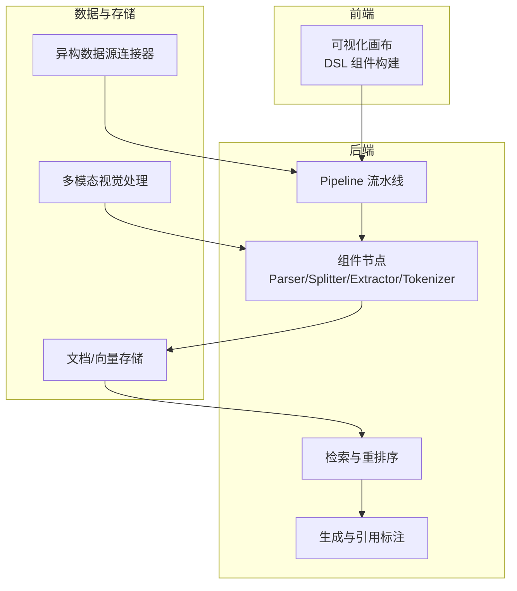
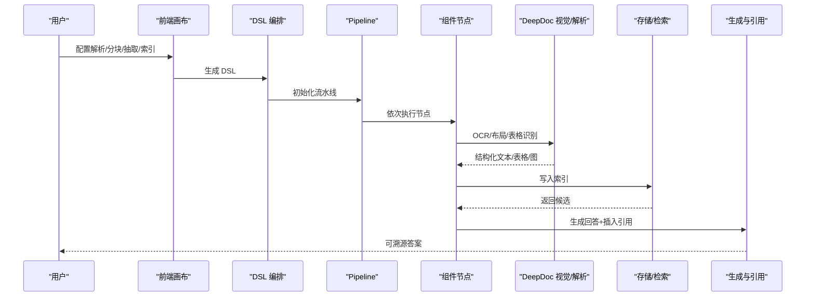
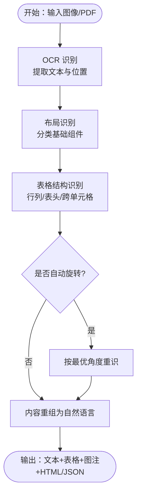
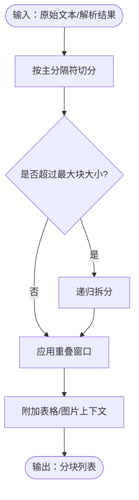
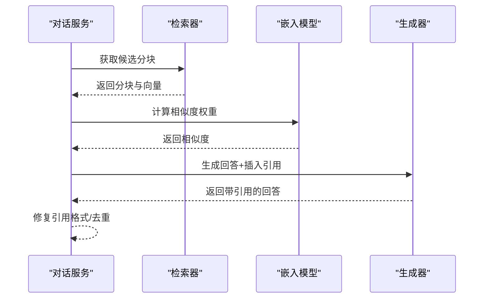
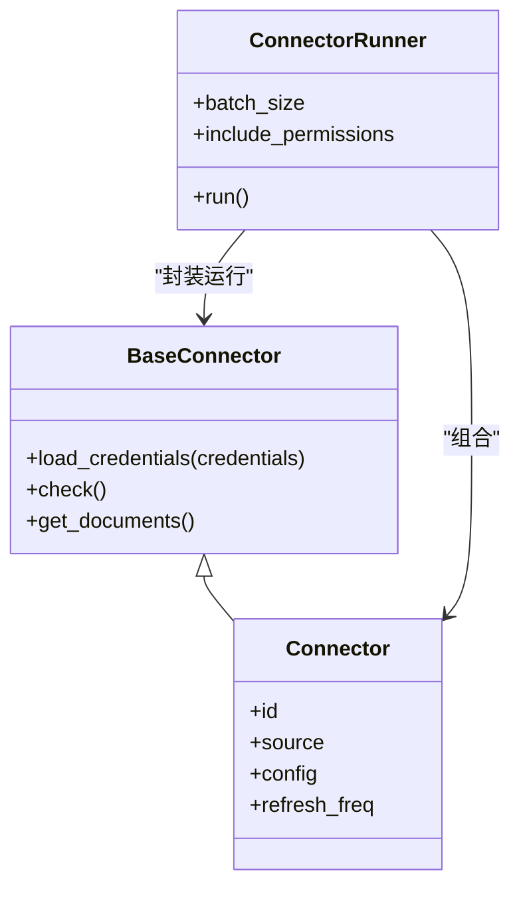
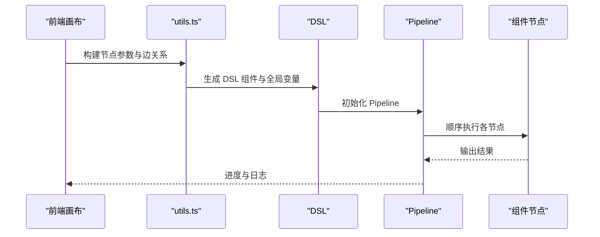
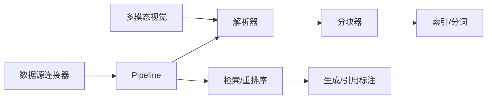

# 核心特性

<cite>
**本文引用的文件**
- [README.md](file://README.md)
- [README_zh.md](file://README_zh.md)
- [deepdoc/README.md](file://deepdoc/README.md)
- [deepdoc/README_zh.md](file://deepdoc/README_zh.md)
- [rag/nlp/__init__.py](file://rag/nlp/__init__.py)
- [rag/flow/splitter/splitter.py](file://rag/flow/splitter/splitter.py)
- [rag/flow/tests/dsl_examples/hierarchical_merger.json](file://rag/flow/tests/dsl_examples/hierarchical_merger.json)
- [rag/prompts/citation_prompt.md](file://rag/prompts/citation_prompt.md)
- [rag/prompts/citation_plus.md](file://rag/prompts/citation_plus.md)
- [api/db/services/dialog_service.py](file://api/db/services/dialog_service.py)
- [common/data_source/interfaces.py](file://common/data_source/interfaces.py)
- [common/data_source/connector_runner.py](file://common/data_source/connector_runner.py)
- [api/db/db_models.py](file://api/db/db_models.py)
- [agent/templates/advanced_ingestion_pipeline.json](file://agent/templates/advanced_ingestion_pipeline.json)
- [rag/flow/pipeline.py](file://rag/flow/pipeline.py)
- [web/src/pages/agent/utils.ts](file://web/src/pages/agent/utils.ts)
- [web/src/pages/dataflow-result/interface.ts](file://web/src/pages/dataflow-result/interface.ts)
- [deepdoc/vision/t_recognizer.py](file://deepdoc/vision/t_recognizer.py)
- [docs/faq.mdx](file://docs/faq.mdx)
</cite>

## 目录
1. [引言](#引言)
2. [项目结构](#项目结构)
3. [核心组件](#核心组件)
4. [架构总览](#架构总览)
5. [详细组件分析](#详细组件分析)
6. [依赖关系分析](#依赖关系分析)
7. [性能考量](#性能考量)
8. [故障排查指南](#故障排查指南)
9. [结论](#结论)
10. [附录](#附录)

## 引言
本文件聚焦 RAGFlow 的六大核心特性：深度文档理解能力、模板化分块技术、降低幻觉的引用标注、异构数据源兼容性、自动化 RAG 工作流、多模态处理能力。我们将从技术实现原理、应用场景、性能优势与实际效果出发，结合具体使用案例与演示效果，阐释这些特性如何协同工作，形成完整的 RAG 解决方案，并提供与同类产品的对比分析，突出 RAGFlow 的独特优势。

## 项目结构
RAGFlow 采用模块化与分层设计，围绕“解析-分块-索引-检索-生成-引用”的完整链路组织代码。前端通过可视化画布定义数据处理流水线；后端以组件化管线为核心，串联解析器、分块器、抽取器、分层合并器、分词与索引等节点；底层提供多模态视觉能力与异构数据源连接器，支撑复杂文档与多源数据的统一处理。

图表来源
- [rag/flow/pipeline.py:28-176](file://rag/flow/pipeline.py#L28-L176)
- [agent/templates/advanced_ingestion_pipeline.json:15-298](file://agent/templates/advanced_ingestion_pipeline.json#L15-L298)
- [web/src/pages/agent/utils.ts:404-472](file://web/src/pages/agent/utils.ts#L404-L472)

章节来源
- [README.md:137-141](file://README.md#L137-L141)
- [README_zh.md:137-141](file://README_zh.md#L137-L141)

## 核心组件
- 深度文档理解能力：依托 DeepDoc 的 OCR、布局识别与表格结构识别，实现对复杂文档（PDF、扫描件、表格、公式等）的高保真解析与结构化输出，为后续分块与检索奠定基础。
- 模板化分块技术：提供灵活的分隔符与层级策略，支持自定义子分隔符、重叠窗口与大块拆分，兼顾召回与上下文连贯性。
- 降低幻觉的引用标注：通过严格的引用格式规则与生成阶段的引用插入，确保答案可溯源、可验证，显著降低 LLM 幻觉风险。
- 异构数据源兼容性：统一抽象的连接器接口与运行器，覆盖 Web、邮件、知识库、云存储等多种来源，支持批量与增量同步。
- 自动化 RAG 工作流：以 DSL 描述的可编排流水线，将文件接入、解析、分块、抽取、索引与检索生成一体化，便于业务快速落地。
- 多模态处理能力：内置 OCR、布局识别、表格结构识别与可视化输出，支持对图片、扫描件、表格等进行结构化理解与自然语言转述。

章节来源
- [README.md:108-136](file://README.md#L108-L136)
- [README_zh.md:109-136](file://README_zh.md#L109-L136)

## 架构总览
RAGFlow 的整体架构围绕“可视化编排 + 组件化流水线 + 多模态解析 + 异构数据源 + 引用标注”的闭环展开。前端画布将用户意图转化为可执行的 DSL，后端 Pipeline 逐节点执行，结合 DeepDoc 的视觉与解析能力，最终产出可溯源的答案与索引。

图表来源
- [agent/templates/advanced_ingestion_pipeline.json:15-298](file://agent/templates/advanced_ingestion_pipeline.json#L15-L298)
- [rag/flow/pipeline.py:117-176](file://rag/flow/pipeline.py#L117-L176)
- [deepdoc/README.md:46-147](file://deepdoc/README.md#L46-L147)

## 详细组件分析

### 深度文档理解能力
- 技术实现
  - OCR：对图像/扫描件进行文本识别，输出带位置信息的文本与可视化结果。
  - 布局识别：识别文本、标题、图、图注、表格、表格注释、页眉页脚、参考文献、公式等基础布局组件。
  - 表格结构识别（TSR）：识别行列、表头、投影行头、跨单元格等结构，并将表格内容重组为自然语言句子。
  - 表格自动旋转：基于 OCR 置信度自动检测最佳旋转角度，提升识别与结构识别准确性。
- 应用场景
  - 扫描件与 PDF 的高精度解析，复杂报表与学术论文的结构化抽取。
  - 图表与表格的语义化转述，便于后续检索与问答。
- 性能优势
  - 多模型协同，支持阈值过滤与模式切换，兼顾速度与精度。
  - 输出包含位置信息与 HTML/JSON，便于二次加工与可视化。
- 实际效果
  - 示例命令与可视化结果可直接验证 OCR、布局与 TSR 的效果。

图表来源
- [deepdoc/README.md:46-147](file://deepdoc/README.md#L46-L147)
- [deepdoc/README_zh.md:48-141](file://deepdoc/README_zh.md#L48-L141)
- [deepdoc/vision/t_recognizer.py:172-186](file://deepdoc/vision/t_recognizer.py#L172-L186)

章节来源
- [deepdoc/README.md:46-147](file://deepdoc/README.md#L46-L147)
- [deepdoc/README_zh.md:48-141](file://deepdoc/README_zh.md#L48-L141)

### 模板化分块技术
- 技术实现
  - 支持自定义分隔符与子分隔符，按 token 数量与最大块大小进行切分，必要时递归拆分大块。
  - 提供重叠窗口参数，保证跨段落语义连贯。
  - 分块后可附加表格/图片上下文，提升检索质量。
- 应用场景
  - 长文档（合同、手册、论文）的结构化分块，兼顾主题一致性与检索粒度。
  - 多模态内容（含表格/图）的上下文保留。
- 性能优势
  - 可配置的 token 粒度与最大块限制，平衡吞吐与上下文长度。
  - 子分隔符支持细粒度控制，适合多级标题/段落的层次化检索。
- 实际效果
  - 通过 DSL 配置分隔符与重叠比例，直观控制分块策略。

图表来源
- [rag/flow/splitter/splitter.py:54-177](file://rag/flow/splitter/splitter.py#L54-L177)
- [rag/nlp/__init__.py:302-1190](file://rag/nlp/__init__.py#L302-L1190)

章节来源
- [rag/flow/splitter/splitter.py:54-177](file://rag/flow/splitter/splitter.py#L54-L177)
- [rag/nlp/__init__.py:302-1190](file://rag/nlp/__init__.py#L302-L1190)

### 降低幻觉的引用标注
- 技术实现
  - 严格引用格式与规则：句末引用、最多 4 条引用、禁止非标准格式。
  - 生成阶段插入引用：基于向量相似度与文本相似度加权，自动匹配并插入引用 ID。
  - 引用修复与去重：对格式不规范的引用进行修复，按文档去重，确保溯源清晰。
- 应用场景
  - 金融/法律/合规类问答，要求答案可追溯、可审计。
  - 科研/专利/标准问答，强调事实性与引用完整性。
- 性能优势
  - 引用插入与修复在生成阶段完成，减少人工干预。
  - 引用可视化与快照支持，便于审阅与复核。
- 实际效果
  - 对话服务中自动插入引用，输出包含引用与关键参考，显著提升可信度。

图表来源
- [api/db/services/dialog_service.py:454-512](file://api/db/services/dialog_service.py#L454-L512)
- [rag/prompts/citation_prompt.md:1-110](file://rag/prompts/citation_prompt.md#L1-L110)
- [rag/prompts/citation_plus.md:1-14](file://rag/prompts/citation_plus.md#L1-L14)

章节来源
- [api/db/services/dialog_service.py:454-512](file://api/db/services/dialog_service.py#L454-L512)
- [rag/prompts/citation_prompt.md:1-110](file://rag/prompts/citation_prompt.md#L1-L110)
- [rag/prompts/citation_plus.md:1-14](file://rag/prompts/citation_plus.md#L1-L14)

### 异构数据源兼容性
- 技术实现
  - 统一连接器接口与检查点运行器，屏蔽不同数据源差异。
  - 支持轮询/事件驱动/权限同步等模式，覆盖 Web、邮件、知识库、云存储等。
  - 提供通用文档模型与图片/文本/专家信息抽象，便于扩展。
- 应用场景
  - 企业内部知识库（Confluence、Notion、Google Drive、S3 等）的统一接入与增量同步。
  - 多渠道客服/邮件/工单系统的结构化抽取与检索。
- 性能优势
  - 连接器批处理与检查点机制，降低重复抓取成本。
  - 统一的文档模型与权限处理，简化下游处理逻辑。
- 实际效果
  - 通过连接器配置即可对接多种数据源，无需定制开发。

图表来源
- [common/data_source/interfaces.py:203-209](file://common/data_source/interfaces.py#L203-L209)
- [common/data_source/connector_runner.py:91-116](file://common/data_source/connector_runner.py#L91-L116)
- [api/db/db_models.py:1061-1071](file://api/db/db_models.py#L1061-L1071)

章节来源
- [common/data_source/interfaces.py:203-209](file://common/data_source/interfaces.py#L203-L209)
- [common/data_source/connector_runner.py:91-116](file://common/data_source/connector_runner.py#L91-L116)
- [api/db/db_models.py:1061-1071](file://api/db/db_models.py#L1061-L1071)

### 自动化 RAG 工作流
- 技术实现
  - DSL 描述的可编排流水线，节点间通过上游/下游关系连接，支持并行与串行组合。
  - 前端画布将节点参数与连接关系转换为 DSL，后端 Pipeline 顺序执行并上报进度。
  - 预置高级注入流水线模板，覆盖解析、分块、抽取（摘要/关键词/问答/元数据）、索引等环节。
- 应用场景
  - 快速搭建面向业务的 RAG 管道，如智能客服、知识问答、报告生成等。
  - 多租户与多 KB 的自动化索引与检索。
- 性能优势
  - 可视化编排降低开发门槛，模板化减少重复配置。
  - 流水线进度与日志持久化，便于监控与回溯。
- 实际效果
  - 通过模板一键生成复杂数据处理流程，快速上线。

图表来源
- [web/src/pages/agent/utils.ts:404-472](file://web/src/pages/agent/utils.ts#L404-L472)
- [web/src/pages/dataflow-result/interface.ts:25-60](file://web/src/pages/dataflow-result/interface.ts#L25-L60)
- [rag/flow/pipeline.py:117-176](file://rag/flow/pipeline.py#L117-L176)
- [agent/templates/advanced_ingestion_pipeline.json:15-298](file://agent/templates/advanced_ingestion_pipeline.json#L15-L298)

章节来源
- [web/src/pages/agent/utils.ts:404-472](file://web/src/pages/agent/utils.ts#L404-L472)
- [rag/flow/pipeline.py:28-176](file://rag/flow/pipeline.py#L28-L176)
- [agent/templates/advanced_ingestion_pipeline.json:15-298](file://agent/templates/advanced_ingestion_pipeline.json#L15-L298)

### 多模态处理能力
- 技术实现
  - OCR：对图像/扫描件进行文本识别，输出带位置信息的文本与可视化结果。
  - 布局识别：识别文本、标题、图、图注、表格、表格注释、页眉页脚、参考文献、公式等基础布局组件。
  - 表格结构识别（TSR）：识别行列、表头、投影行头、跨单元格等结构，并将表格内容重组为自然语言句子。
  - 表格自动旋转：基于 OCR 置信度自动检测最佳旋转角度，提升识别与结构识别准确性。
- 应用场景
  - 扫描件与 PDF 的高精度解析，复杂报表与学术论文的结构化抽取。
  - 图表与表格的语义化转述，便于后续检索与问答。
- 性能优势
  - 多模型协同，支持阈值过滤与模式切换，兼顾速度与精度。
  - 输出包含位置信息与 HTML/JSON，便于二次加工与可视化。
- 实际效果
  - 示例命令与可视化结果可直接验证 OCR、布局与 TSR 的效果。

章节来源
- [deepdoc/README.md:46-147](file://deepdoc/README.md#L46-L147)
- [deepdoc/README_zh.md:48-141](file://deepdoc/README_zh.md#L48-L141)

## 依赖关系分析
- 组件耦合与内聚
  - Pipeline 与组件节点松耦合，通过 DSL 描述上下游关系，便于扩展与替换。
  - 深度文档理解能力与分块器解耦，解析结果可作为多下游节点的输入。
- 直接与间接依赖
  - 引用标注依赖检索器与嵌入模型，生成阶段进行引用插入与修复。
  - 数据源连接器为上游数据提供统一入口，影响后续解析与分块质量。
- 外部依赖与集成点
  - LLM/Embedding/OCR/视觉模型等外部服务通过组件参数配置，支持多厂商与本地部署。
  - 前端画布与后端 DSL 的映射关系，确保可视化与执行的一致性。

图表来源
- [rag/flow/pipeline.py:28-176](file://rag/flow/pipeline.py#L28-L176)
- [agent/templates/advanced_ingestion_pipeline.json:15-298](file://agent/templates/advanced_ingestion_pipeline.json#L15-L298)

章节来源
- [rag/flow/pipeline.py:28-176](file://rag/flow/pipeline.py#L28-L176)
- [agent/templates/advanced_ingestion_pipeline.json:15-298](file://agent/templates/advanced_ingestion_pipeline.json#L15-L298)

## 性能考量
- 吞吐与延迟
  - 分块与索引阶段可通过并行与批处理提升吞吐；重叠窗口与子分隔符需权衡召回与延迟。
  - 多模态处理（OCR/TSR）对计算资源敏感，建议在 GPU 加速场景下部署。
- 可靠性与可观测性
  - Pipeline 的进度与日志持久化至 Redis，便于监控与回溯。
  - 引用标注的修复与去重逻辑减少人工干预，提升稳定性。
- 可扩展性
  - 组件化节点与统一连接器接口，便于新增数据源与处理能力。

## 故障排查指南
- 常见问题定位
  - 引用缺失或格式异常：检查引用规则与生成阶段的插入逻辑，确认向量与文本相似度权重配置。
  - 分块过大导致检索失败：调整分隔符、重叠比例与最大块大小。
  - 多模态识别不准确：调整 OCR 置信度阈值与表格自动旋转开关。
- 日志与进度
  - 通过 Pipeline 的回调与 Redis 日志查看各节点进度与错误信息，定位失败节点。
- 数据源同步异常
  - 检查连接器凭证、权限与时间范围配置，确认检查点运行器的批次与权限参数。

章节来源
- [rag/flow/pipeline.py:43-105](file://rag/flow/pipeline.py#L43-L105)
- [api/db/services/dialog_service.py:454-512](file://api/db/services/dialog_service.py#L454-L512)

## 结论
RAGFlow 通过“深度文档理解 + 模板化分块 + 引用标注 + 异构数据源 + 自动化工作流 + 多模态处理”的六大特性，构建了从数据接入到可溯源回答的全链路能力。其可视化编排与组件化流水线降低了工程门槛，多模态与异构数据源兼容性提升了适用范围，严格的引用标注机制有效降低了幻觉风险。与同类产品相比，RAGFlow 更强调“可解释、可溯源、可编排、可扩展”，在企业级场景中具备更强的落地能力与长期演进空间。

## 附录
- 与其他产品的对比要点
  - “垃圾进垃圾出”现状下，RAGFlow 强调“精细解析 + 可溯源引用”，在复杂文档与多源数据场景更具优势。
  - 模板化分块与可视化干预，使召回与上下文控制更可控，区别于仅依赖固定策略的产品。
  - 自动化工作流与预置模板，显著缩短从原型到生产的路径，适合快速迭代与规模化部署。

章节来源
- [docs/faq.mdx:22-28](file://docs/faq.mdx#L22-L28)