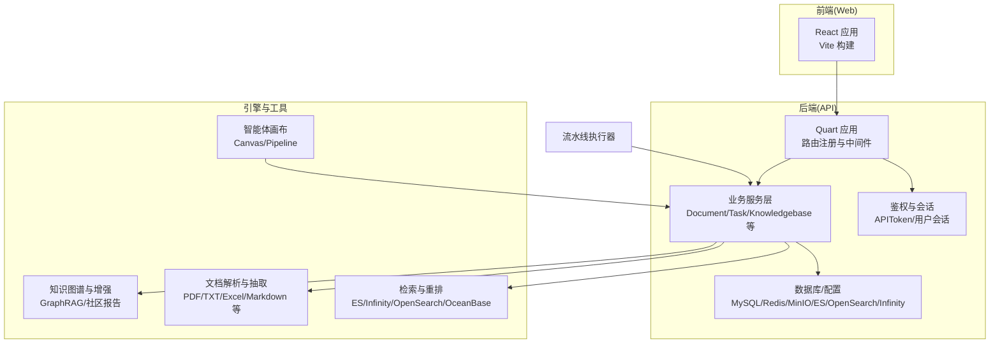
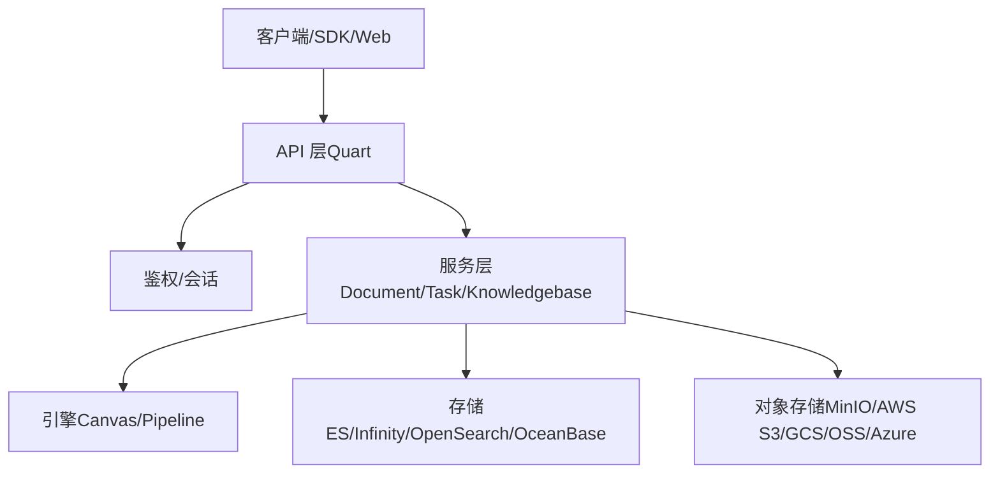
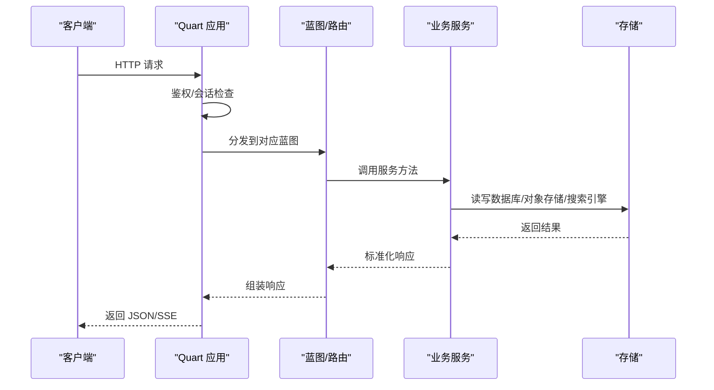
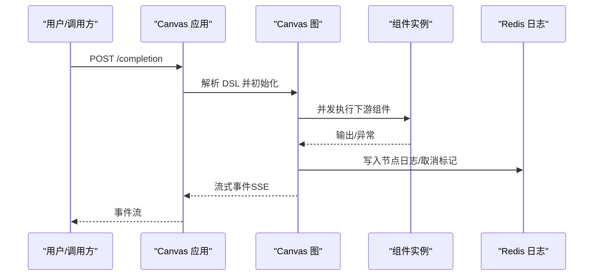
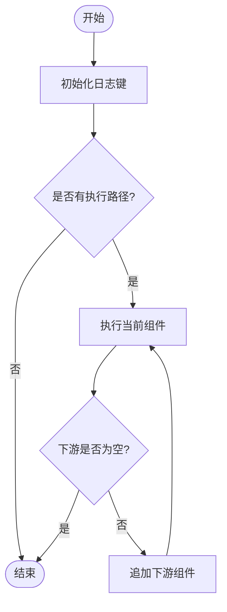
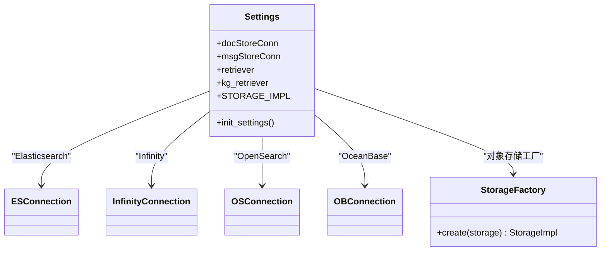
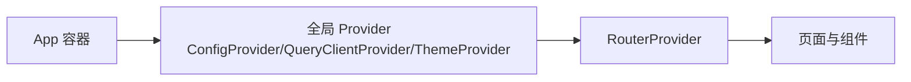
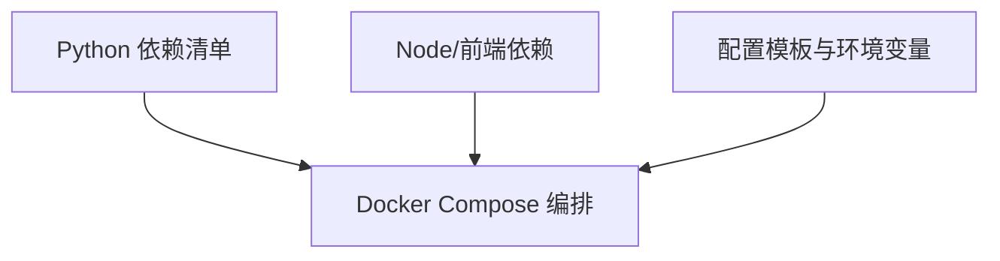

# 系统架构

<cite>
**本文引用的文件**
- [README.md](file://README.md)
- [api/ragflow_server.py](file://api/ragflow_server.py)
- [api/apps/__init__.py](file://api/apps/__init__.py)
- [api/apps/api_app.py](file://api/apps/api_app.py)
- [api/apps/canvas_app.py](file://api/apps/canvas_app.py)
- [api/db/services/document_service.py](file://api/db/services/document_service.py)
- [common/settings.py](file://common/settings.py)
- [web/src/app.tsx](file://web/src/app.tsx)
- [web/package.json](file://web/package.json)
- [docker/docker-compose.yml](file://docker/docker-compose.yml)
- [conf/service_conf.yaml](file://conf/service_conf.yaml)
- [agent/canvas.py](file://agent/canvas.py)
- [rag/flow/pipeline.py](file://rag/flow/pipeline.py)
- [pyproject.toml](file://pyproject.toml)
</cite>

## 目录
1. [引言](#引言)
2. [项目结构](#项目结构)
3. [核心组件](#核心组件)
4. [架构总览](#架构总览)
5. [详细组件分析](#详细组件分析)
6. [依赖分析](#依赖分析)
7. [性能考虑](#性能考虑)
8. [故障排查指南](#故障排查指南)
9. [结论](#结论)
10. [附录](#附录)

## 引言
本文件面向开发者与运维人员，系统化梳理 RAGFlow 的整体架构设计与实现要点，覆盖前后端分离、微服务化、容器化部署、数据与存储、以及可扩展性与高可用保障策略。通过架构图与组件关系图，帮助读者快速理解系统设计思路与关键交互路径。

## 项目结构
RAGFlow 采用前后端分离与多模块协作的工程组织方式：
- 后端（Python）：基于 Quart 框架构建 API 层，按功能域拆分应用模块与服务层，统一注册路由并集中处理鉴权、异常与连接生命周期。
- 前端（React/Vite）：基于 Vite 构建，使用 Ant Design 生态与 TanStack React Query 进行状态管理与数据获取。
- 容器化与编排：通过 Docker Compose 编排后端服务、数据库、对象存储、搜索引擎与消息队列等基础设施。
- 核心引擎：包含智能体画布（Canvas）、流水线（Pipeline）、检索与嵌入、解析与抽取、知识图谱等能力模块。

图示来源
- [api/apps/__init__.py:59-84](file://api/apps/__init__.py#L59-L84)
- [api/ragflow_server.py:33-46](file://api/ragflow_server.py#L33-L46)
- [common/settings.py:244-282](file://common/settings.py#L244-L282)
- [agent/canvas.py:279-321](file://agent/canvas.py#L279-L321)
- [rag/flow/pipeline.py:28-42](file://rag/flow/pipeline.py#L28-L42)

章节来源
- [README.md:137-141](file://README.md#L137-L141)
- [docker/docker-compose.yml:1-133](file://docker/docker-compose.yml#L1-L133)
- [conf/service_conf.yaml:1-159](file://conf/service_conf.yaml#L1-L159)

## 核心组件
- API 层（Quart）
  - 负责路由注册、请求校验、鉴权、错误处理与连接关闭。
  - 统一响应格式与超时配置，支持 SSE 流式输出。
- 业务服务层（Services）
  - 封装领域操作，如文档、任务、知识库、用户与租户等。
  - 提供跨模块协作接口，协调引擎与存储。
- 配置与设置（Settings）
  - 动态加载服务配置，初始化文档引擎（Elasticsearch/Infinity/OpenSearch/OceanBase）、对象存储（MinIO/AWS S3/GCS/OSS/Azure）、检索器与知识图谱检索器。
- 引擎与工作流
  - Canvas：以 DSL 描述的智能体工作流，支持同步/异步组件调用、变量传递、取消与日志追踪。
  - Pipeline：面向数据处理的单向流水线，支持进度回调、日志记录与取消。
- 前端应用（React）
  - 使用 Ant Design 与 TanStack React Query，提供路由、主题、国际化与全局状态管理。

章节来源
- [api/apps/__init__.py:59-84](file://api/apps/__init__.py#L59-L84)
- [api/apps/api_app.py:26-54](file://api/apps/api_app.py#L26-L54)
- [api/apps/canvas_app.py:130-185](file://api/apps/canvas_app.py#L130-L185)
- [api/db/services/document_service.py:46-78](file://api/db/services/document_service.py#L46-L78)
- [common/settings.py:169-324](file://common/settings.py#L169-L324)
- [agent/canvas.py:279-321](file://agent/canvas.py#L279-L321)
- [rag/flow/pipeline.py:28-42](file://rag/flow/pipeline.py#L28-L42)
- [web/src/app.tsx:84-119](file://web/src/app.tsx#L84-L119)

## 架构总览
RAGFlow 采用“API 层 + 业务服务层 + 引擎与存储”的三层架构，并通过容器化实现微服务化部署。API 层负责对外暴露 HTTP/SSE 接口；业务服务层封装领域逻辑；引擎层负责复杂推理与数据处理；存储层支持多种搜索引擎与对象存储。

图示来源
- [api/ragflow_server.py:33-46](file://api/ragflow_server.py#L33-L46)
- [api/apps/__init__.py:59-84](file://api/apps/__init__.py#L59-L84)
- [common/settings.py:244-282](file://common/settings.py#L244-L282)

## 详细组件分析

### API 层与路由注册
- 路由自动注册：扫描指定目录下的 *_app.py 与 sdk 文件，动态注册蓝图与 URL 前缀。
- 鉴权中间件：支持基于 JWT 与 APIToken 的双重认证，统一注入当前用户上下文。
- 错误处理：集中捕获异常并返回标准响应；对 404/401 做专门处理。
- 超时与限流：配置响应与请求体超时，适配长耗时 LLM 推理场景。

图示来源
- [api/apps/__init__.py:250-271](file://api/apps/__init__.py#L250-L271)
- [api/apps/__init__.py:144-179](file://api/apps/__init__.py#L144-L179)
- [api/apps/api_app.py:26-54](file://api/apps/api_app.py#L26-L54)

章节来源
- [api/apps/__init__.py:59-84](file://api/apps/__init__.py#L59-L84)
- [api/apps/__init__.py:250-271](file://api/apps/__init__.py#L250-L271)
- [api/apps/api_app.py:26-54](file://api/apps/api_app.py#L26-L54)

### Canvas 工作流引擎
- DSL 驱动：以 JSON DSL 描述组件拓扑、变量与路径，支持条件分支、循环与迭代。
- 并发执行：组件调用在独立线程池中并发执行，支持异步生成器流式输出。
- 取消与追踪：通过 Redis 标记任务取消；记录节点开始/结束、输出与引用信息。
- TTS 与引用：支持文本转语音与引用标注，便于前端展示。

图示来源
- [agent/canvas.py:367-417](file://agent/canvas.py#L367-L417)
- [agent/canvas.py:418-491](file://agent/canvas.py#L418-L491)
- [api/apps/canvas_app.py:130-185](file://api/apps/canvas_app.py#L130-L185)

章节来源
- [agent/canvas.py:279-321](file://agent/canvas.py#L279-L321)
- [agent/canvas.py:367-417](file://agent/canvas.py#L367-L417)
- [agent/canvas.py:418-491](file://agent/canvas.py#L418-L491)
- [api/apps/canvas_app.py:130-185](file://api/apps/canvas_app.py#L130-L185)

### Pipeline 数据处理流水线
- 单向执行：从首个组件开始，按下游链路顺序执行，支持错误中断与进度回调。
- 进度与日志：基于 Redis 记录每个组件的进度、耗时与消息，最终汇总到任务进度。
- 取消机制：检测取消标记后抛出异常，确保资源及时释放。

图示来源
- [rag/flow/pipeline.py:117-166](file://rag/flow/pipeline.py#L117-L166)

章节来源
- [rag/flow/pipeline.py:28-42](file://rag/flow/pipeline.py#L28-L42)
- [rag/flow/pipeline.py:117-166](file://rag/flow/pipeline.py#L117-L166)

### 存储与配置（Settings）
- 文档引擎选择：支持 Elasticsearch、Infinity、OpenSearch、OceanBase 等，运行时根据环境变量切换。
- 对象存储：支持 MinIO、AWS S3、GCS、OSS、Azure SPN/SAS 与 OpenDAL 抽象。
- 检索器与 KG 检索器：根据文档引擎初始化 Dealer 与 KGSearch。
- 加密存储：可选启用加密存储包装器。

图示来源
- [common/settings.py:244-282](file://common/settings.py#L244-L282)
- [common/settings.py:153-167](file://common/settings.py#L153-L167)

章节来源
- [common/settings.py:169-324](file://common/settings.py#L169-L324)

### 前端应用（React）
- 主题与国际化：基于 Ant Design 与 dayjs，支持多语言与暗/亮主题。
- 全局状态：使用 React Query 管理远端数据缓存与刷新。
- 路由与布局：采用 React Router 管理页面路由与侧边栏布局。

图示来源
- [web/src/app.tsx:84-119](file://web/src/app.tsx#L84-L119)
- [web/package.json:25-133](file://web/package.json#L25-L133)

章节来源
- [web/src/app.tsx:84-119](file://web/src/app.tsx#L84-L119)
- [web/package.json:25-133](file://web/package.json#L25-L133)

## 依赖分析
- 技术栈选择
  - 后端：Quart（异步 WSGI）、Peewee（ORM）、TanStack React Query（前端状态）、Ant Design（UI）、Docker Compose（编排）。
  - 检索：Elasticsearch、Infinity、OpenSearch、OceanBase。
  - 对象存储：MinIO、AWS S3、GCS、OSS、Azure Blob、OpenDAL。
- 外部依赖与版本约束：详见项目依赖清单与包管理配置。

图示来源
- [pyproject.toml:1-156](file://pyproject.toml#L1-L156)
- [docker/docker-compose.yml:1-133](file://docker/docker-compose.yml#L1-L133)
- [conf/service_conf.yaml:1-159](file://conf/service_conf.yaml#L1-L159)

章节来源
- [pyproject.toml:1-156](file://pyproject.toml#L1-L156)
- [docker/docker-compose.yml:1-133](file://docker/docker-compose.yml#L1-L133)
- [conf/service_conf.yaml:1-159](file://conf/service_conf.yaml#L1-L159)

## 性能考虑
- 异步与并发
  - API 层使用 Quart 支持异步请求处理；Canvas 在线程池中并发执行组件，避免阻塞。
  - 前端使用 React Query 缓存与并发请求合并，减少重复网络开销。
- 检索与向量化
  - 支持多引擎切换，结合优先级队列与批处理参数优化吞吐。
- 存储与对象访问
  - 对象存储抽象（OpenDAL）与多厂商适配，便于按需选择与迁移。
- 超时与资源
  - API 层配置较长响应/请求超时，适配本地或远程 LLM 推理延迟。
  - 任务取消通过 Redis 快速传播，避免无效计算。

## 故障排查指南
- 启动与健康检查
  - 后端启动日志包含版本与初始化耗时信息，确认服务就绪后再访问。
  - Docker Compose 中包含健康检查与端口映射，确认容器健康与端口开放。
- 鉴权与权限
  - API 层对未认证请求返回 401；确认 Authorization 头或 APIToken 是否正确。
- 文档处理与进度
  - 文档服务提供进度更新与元数据聚合；若长时间无进展，检查任务取消标记与日志键。
- 检索与存储
  - 切换文档引擎（ES/Infinity/OpenSearch/OceanBase）时，确认配置项与连接参数一致。
- 前端问题
  - 检查 React Query 缓存与网络请求状态；确认路由与主题配置。

章节来源
- [api/ragflow_server.py:76-157](file://api/ragflow_server.py#L76-L157)
- [docker/docker-compose.yml:1-133](file://docker/docker-compose.yml#L1-L133)
- [api/apps/__init__.py:298-314](file://api/apps/__init__.py#L298-L314)
- [api/db/services/document_service.py:46-78](file://api/db/services/document_service.py#L46-L78)
- [common/settings.py:244-282](file://common/settings.py#L244-L282)

## 结论
RAGFlow 通过清晰的分层架构、灵活的引擎与存储抽象、以及容器化编排，实现了可扩展、高可用且易于维护的 RAG 与智能体平台。API 层与前端解耦、服务层专注业务、引擎层支撑复杂工作流，配合多引擎与对象存储适配，满足不同规模与场景需求。

## 附录
- 快速启动与配置参考见项目自述文件中的“系统架构”与“配置说明”部分。
- Docker Compose 与服务配置模板位于 docker 与 conf 目录，用于一键拉起后端服务与基础设施。

章节来源
- [README.md:137-141](file://README.md#L137-L141)
- [docker/docker-compose.yml:1-133](file://docker/docker-compose.yml#L1-L133)
- [conf/service_conf.yaml:1-159](file://conf/service_conf.yaml#L1-L159)