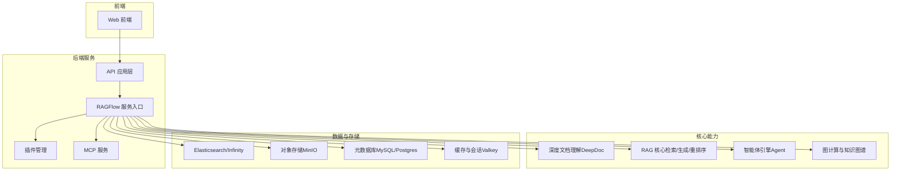
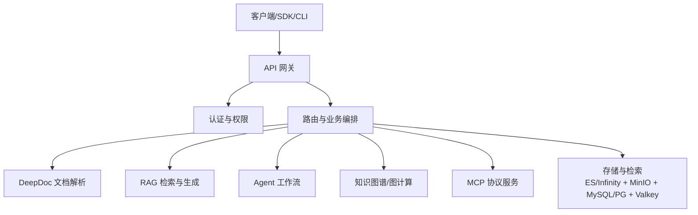
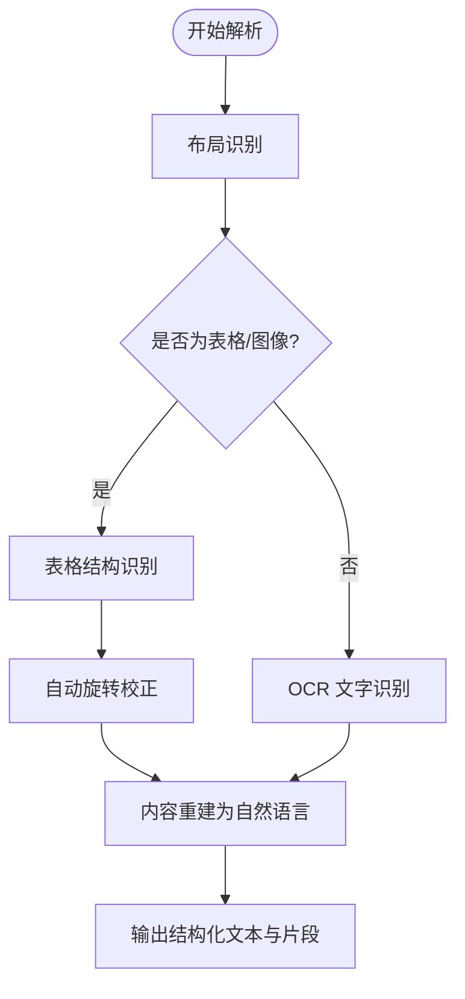
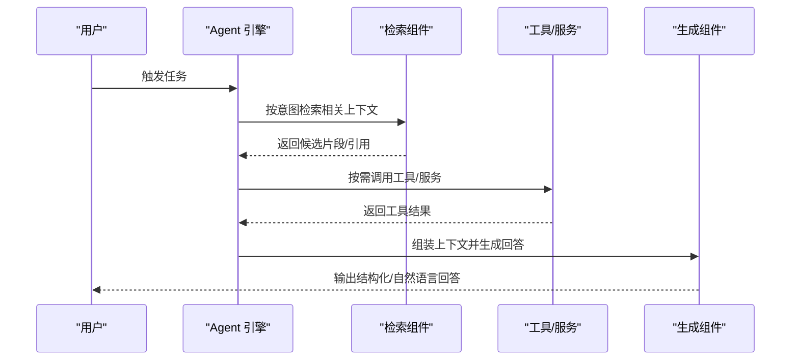
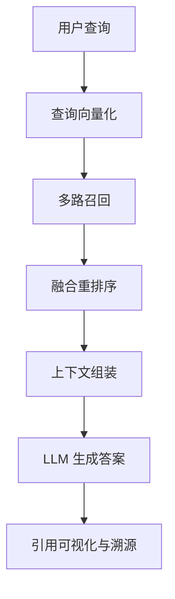
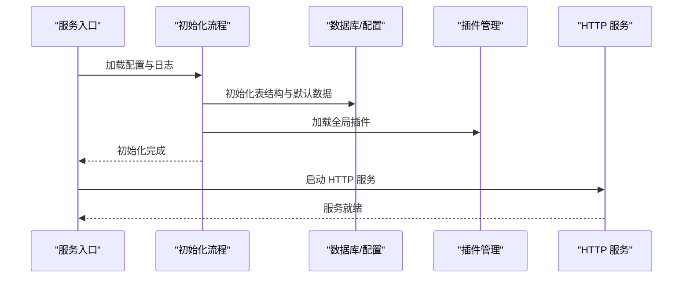
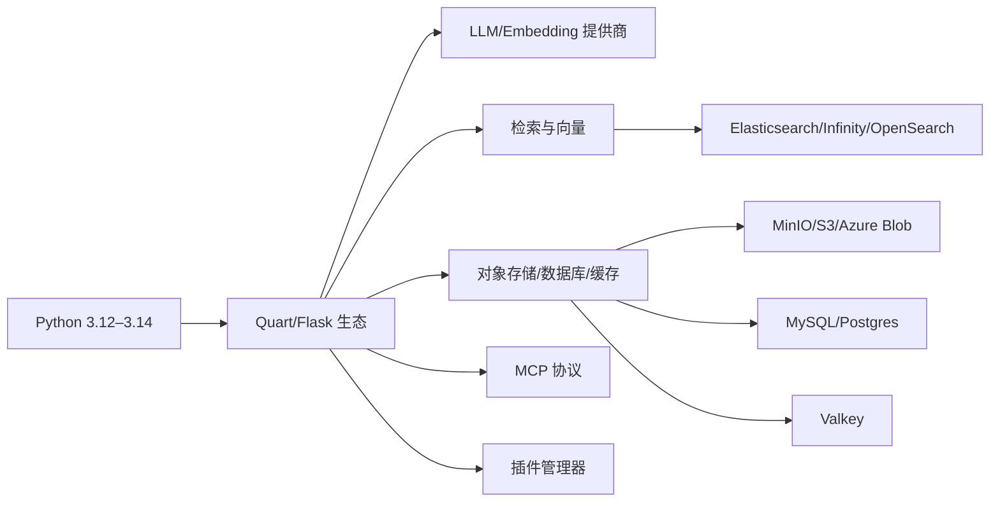

# 项目介绍

<cite>
**本文引用的文件列表**
- [README.md](file://README.md)
- [README_zh.md](file://README_zh.md)
- [pyproject.toml](file://pyproject.toml)
- [docs/release_notes.md](file://docs/release_notes.md)
- [docs/basics/rag.md](file://docs/basics/rag.md)
- [docs/basics/agent_context_engine.md](file://docs/basics/agent_context_engine.md)
- [docs/contribution/contributing.md](file://docs/contribution/contributing.md)
- [LICENSE](file://LICENSE)
- [SECURITY.md](file://SECURITY.md)
- [deepdoc/README.md](file://deepdoc/README.md)
- [api/ragflow_server.py](file://api/ragflow_server.py)
</cite>

## 目录
1. [引言](#引言)
2. [项目结构](#项目结构)
3. [核心组件](#核心组件)
4. [架构总览](#架构总览)
5. [详细组件分析](#详细组件分析)
6. [依赖关系分析](#依赖关系分析)
7. [性能考量](#性能考量)
8. [故障排查指南](#故障排查指南)
9. [结论](#结论)
10. [附录](#附录)

## 引言
RAGFlow 是一款领先的开源检索增强生成（RAG）引擎，将前沿的 RAG 技术与智能体（Agent）能力深度融合，打造面向 LLM 的卓越上下文层。项目以“质量在，质量出”的质量保证原则为核心理念，围绕深度文档理解、模板化分块、多模态兼容、自动化 RAG 工作流等关键能力，为企业提供可扩展、可运维、可复用的端到端 RAG 能力平台。项目采用 Apache License 2.0 许可证，鼓励社区协作与开放创新；同时提供完善的开发与部署指南、安全策略与路线图，帮助用户快速落地并持续演进。

## 项目结构
RAGFlow 采用模块化分层的工程组织方式，涵盖后端服务、前端界面、RAG 核心、智能体引擎、文档解析、知识图谱与图计算、MCP 协议支持、插件体系、SDK 与 CLI 工具链等。整体结构清晰，便于按需扩展与维护。

图表来源
- [api/ragflow_server.py:76-157](file://api/ragflow_server.py#L76-L157)
- [pyproject.toml:178-188](file://pyproject.toml#L178-L188)

章节来源
- [README.md:137-141](file://README.md#L137-L141)
- [README_zh.md:137-141](file://README_zh.md#L137-L141)

## 核心组件
- 深度文档理解（DeepDoc）
  - 针对多模态文档（PDF、Word、Excel、PPT、扫描件等）进行布局识别、OCR、表格结构识别与重建，输出高质量文本与结构化片段，支撑后续 RAG 精准检索与生成。
- 智能体引擎（Agent）
  - 提供可编排的 Agent 工作流与工具调用能力，结合检索、记忆与结构化输出，实现跨场景的自动化决策与执行。
- RAG 核心
  - 包含多路召回、融合重排序、上下文窗口优化、跨语言检索、引用可视化与可追溯性等能力，保障答案的准确性与可解释性。
- 图计算与知识图谱
  - 支持实体抽取、关系建模与图谱构建，提升长上下文检索与跨文档关联发现的能力。
- MCP 协议与插件体系
  - 支持 MCP Server/Client 模式，统一工具与服务接入，便于企业内部系统与外部服务的无缝集成。
- 多模态与多数据源
  - 支持从 Confluence、S3、Notion、Discord、Google Drive 等异构数据源同步数据，覆盖结构化与非结构化数据。

章节来源
- [deepdoc/README.md:1-147](file://deepdoc/README.md#L1-L147)
- [docs/basics/rag.md:49-77](file://docs/basics/rag.md#L49-L77)
- [docs/basics/agent_context_engine.md:26-35](file://docs/basics/agent_context_engine.md#L26-L35)
- [README.md:108-136](file://README.md#L108-L136)
- [README_zh.md:109-136](file://README_zh.md#L109-L136)

## 架构总览
RAGFlow 的系统架构以“统一上下文引擎”为目标，将传统 RAG 的静态知识库扩展为“知识核心 + 记忆层 + 工具编排”的三位一体上下文装配平台。后端通过 API 层统一对外提供 HTTP/Python/MCP 接口，底层依赖 Elasticsearch/Infinity 向量与全文检索、MinIO 对象存储、MySQL/Postgres 元数据存储、Valkey 缓存与会话管理，形成高可用、可扩展的企业级基础设施。

图表来源
- [api/ragflow_server.py:149-157](file://api/ragflow_server.py#L149-L157)
- [docs/basics/agent_context_engine.md:26-35](file://docs/basics/agent_context_engine.md#L26-L35)

## 详细组件分析

### 组件一：深度文档理解（DeepDoc）
- 能力要点
  - 布局识别：区分文本、标题、图表、表格、公式、页眉页脚等 10 类基础版式，指导后续结构化处理。
  - OCR 与 TSR：对扫描件与图像 PDF 进行高精度文字识别与表格结构识别，并自动旋转校正以提升准确率。
  - 结构化输出：将表格与图像内容转写为自然语言句子，便于 LLM 理解与检索。
- 价值体现
  - 将多模态信息转化为高质量的单模态文本，显著降低 RAG 的语义碎片化与信息损失风险。
  - 为复杂文档（合同、报表、简历等）提供结构化理解基础，支撑下游问答与摘要生成。

图表来源
- [deepdoc/README.md:46-131](file://deepdoc/README.md#L46-L131)

章节来源
- [deepdoc/README.md:10-147](file://deepdoc/README.md#L10-L147)

### 组件二：智能体引擎（Agent）
- 能力要点
  - 可编排工作流：支持 Begin/Generate/Retrieval/Switch/Iteration/List Operations/Variable Aggregator 等组件，实现复杂任务的可视化编排。
  - 工具与 MCP：通过 MCP 协议连接外部工具与服务，按需检索最佳工具与操作指南，避免将全部工具描述塞入上下文窗口。
  - 记忆与回放：支持检索式或消息式上下文注入，实现对话历史与交互记忆的连续性与个性化。
  - 结构化输出：支持结构化数据输出，便于下游组件消费与二次加工。
- 价值体现
  - 将“手工作坊式”的上下文拼装升级为“工业级平台”，降低开发与维护成本，提升可扩展性与一致性。

图表来源
- [docs/basics/agent_context_engine.md:26-35](file://docs/basics/agent_context_engine.md#L26-L35)

章节来源
- [docs/basics/agent_context_engine.md:1-62](file://docs/basics/agent_context_engine.md#L1-L62)

### 组件三：RAG 核心（检索-生成-重排序）
- 能力要点
  - 多路召回与融合重排序：结合向量检索与关键词检索（BM25），提升召回的广度与精度。
  - 上下文窗口优化：针对图像、表格等复杂内容优化上下文长度与结构，减少截断与信息丢失。
  - 引用可视化与可追溯：提供关键引用快照与来源追踪，降低幻觉风险，提升答案可信度。
  - 跨语言检索：在中英混合等多语言场景下提升检索与问答质量。
- 价值体现
  - 将 RAG 从“Context Engineering 1.0”升级为“Context Engineering 2.0”，面向 Agent 的动态上下文装配需求，提供更高效、更可控的知识服务。

图表来源
- [docs/basics/rag.md:49-77](file://docs/basics/rag.md#L49-L77)

章节来源
- [docs/basics/rag.md:1-108](file://docs/basics/rag.md#L1-L108)

### 组件四：服务启动与运行（RAGFlow 服务入口）
- 能力要点
  - 初始化日志、配置与数据库表结构，加载全局插件，启动后台进度更新线程。
  - 支持信号处理（SIGINT/SIGTERM）优雅关闭，释放 MCP 会话资源。
  - 提供调试模式与超级用户初始化选项，便于开发与运维。
- 价值体现
  - 为整个系统提供稳定可靠的启动与运行基座，确保服务可用性与可观测性。

图表来源
- [api/ragflow_server.py:76-157](file://api/ragflow_server.py#L76-L157)

章节来源
- [api/ragflow_server.py:1-157](file://api/ragflow_server.py#L1-L157)

## 依赖关系分析
- 语言与框架
  - Python 3.12–3.14，后端基于 Quart/Flask 生态，前端基于 React/Vite。
- 第三方库与生态
  - 支持多种 LLM 与嵌入模型提供商（OpenAI、Anthropic、Google、Groq、Mistral、通义千问、Claude 等），并提供 OpenAI 兼容 API。
  - 检索与向量：Elasticsearch、Infinity、OpenSearch、Infinity-Emb。
  - 存储：MinIO、S3、Azure Blob、本地文件系统。
  - 数据库：MySQL、Postgres。
  - 缓存与会话：Valkey。
  - 工具与服务：MCP、Tavily、ArXiv、GitHub、Google Scholar、Wikipedia、天气、股票、新闻等。
- 插件与扩展
  - 插件管理器支持动态加载与卸载，便于按需扩展工具与服务。

图表来源
- [pyproject.toml:9-156](file://pyproject.toml#L9-L156)

章节来源
- [pyproject.toml:1-278](file://pyproject.toml#L1-L278)

## 性能考量
- 启动与初始化
  - 服务启动包含日志初始化、配置加载、数据库初始化、插件加载与后台任务线程启动，建议在生产环境中预留充足的内存与磁盘空间，确保初始化阶段的稳定性。
- 检索与生成
  - 多路召回与融合重排序可显著提升召回质量，但也会增加计算开销；建议根据业务场景调整召回策略与重排序权重。
- 多模态解析
  - DeepDoc 的布局识别、OCR 与 TSR 任务对 GPU 加速友好，建议在具备 GPU 的环境中启用加速以缩短解析时延。
- 并发与阻塞
  - 从同步到异步的 Web 框架升级提升了并发能力，避免上游 LLM 服务阻塞导致的响应延迟。

章节来源
- [README.md:143-250](file://README.md#L143-L250)
- [README_zh.md:143-250](file://README_zh.md#L143-L250)
- [docs/release_notes.md:1-800](file://docs/release_notes.md#L1-L800)

## 故障排查指南
- 安全漏洞报告
  - 项目提供安全策略与漏洞报告流程，明确受支持版本与修复建议，建议在升级到最新版本后及时修复已知问题。
- 常见问题定位
  - 启动失败：检查 vm.max_map_count、Docker 环境与依赖服务状态；确认服务配置文件与环境变量一致。
  - 解析异常：确认 HF_ENDPOINT 镜像站点设置、jemalloc 安装与 GPU 驱动版本；检查 DeepDoc 的自动旋转与 TSR 参数。
  - 记忆与 Agent：确认记忆接口配置、Agent 组件输出结构化数据能力与工具调用权限。
- 日志与诊断
  - 使用调试模式与日志级别调整，结合 CI 测试与覆盖率报告定位问题。

章节来源
- [SECURITY.md:1-75](file://SECURITY.md#L1-L75)
- [README.md:143-250](file://README.md#L143-L250)
- [README_zh.md:143-250](file://README_zh.md#L143-L250)

## 结论
RAGFlow 以“质量在，质量出”的理念，将 RAG 从单一技术手段升维为面向 Agent 的上下文装配平台，通过深度文档理解、模板化分块、多模态兼容与自动化工作流，为企业提供可落地、可扩展、可治理的智能知识系统。项目采用 Apache 2.0 许可证，配合完善的社区贡献机制与安全策略，持续推动开源生态繁荣与技术创新。未来，RAGFlow 将继续围绕上下文引擎、Agent 能力与企业级可靠性展开迭代，助力下一代可信、可控、可扩展的智能应用建设。

## 附录

### 许可证与合规
- 许可证：Apache License 2.0
- 使用条款与免责声明详见 [LICENSE:1-202](file://LICENSE#L1-L202)

章节来源
- [LICENSE:1-202](file://LICENSE#L1-L202)

### 社区与贡献
- 贡献指南与 PR 流程：参见 [docs/contribution/contributing.md:1-59](file://docs/contribution/contributing.md#L1-L59)
- 社区渠道：Discord、Twitter、GitHub Discussions

章节来源
- [README.md:401-411](file://README.md#L401-L411)
- [README_zh.md:407-416](file://README_zh.md#L407-L416)
- [docs/contribution/contributing.md:1-59](file://docs/contribution/contributing.md#L1-L59)

### 版本与路线图
- 最新版本与特性：参见 [docs/release_notes.md:1-800](file://docs/release_notes.md#L1-L800)
- 路线图：参见 [README.md:397-400](file://README.md#L397-L400) 与 [README_zh.md:403-406](file://README_zh.md#L403-L406)

章节来源
- [docs/release_notes.md:1-800](file://docs/release_notes.md#L1-L800)
- [README.md:86-98](file://README.md#L86-L98)
- [README_zh.md:86-100](file://README_zh.md#L86-L100)