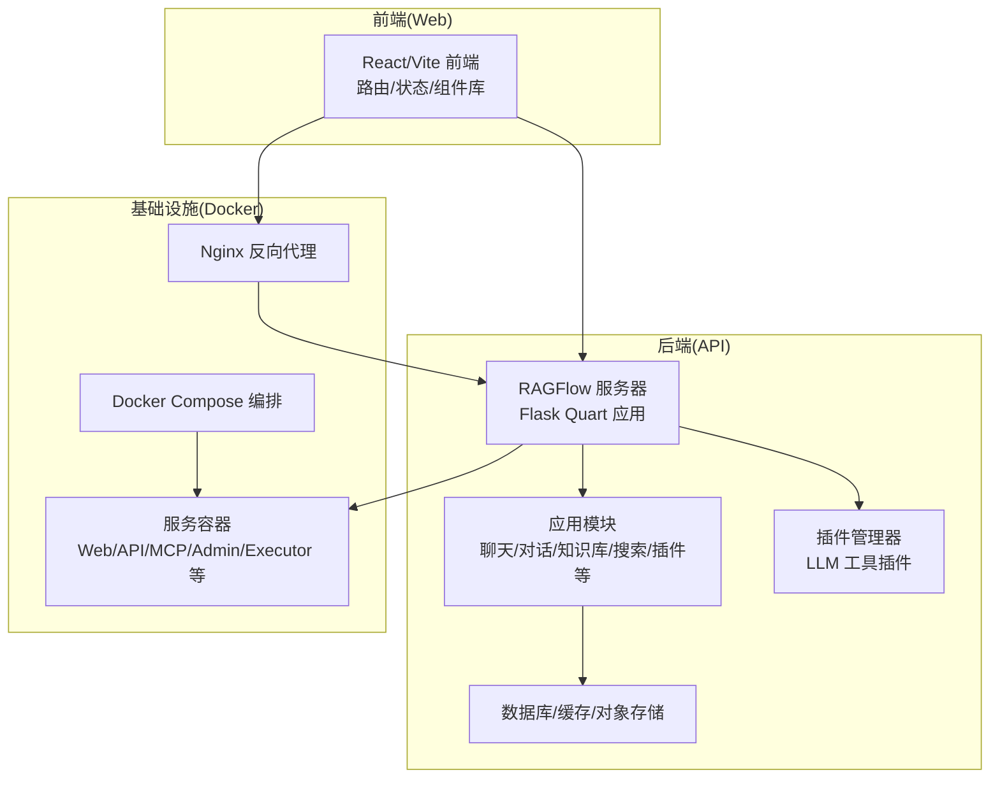
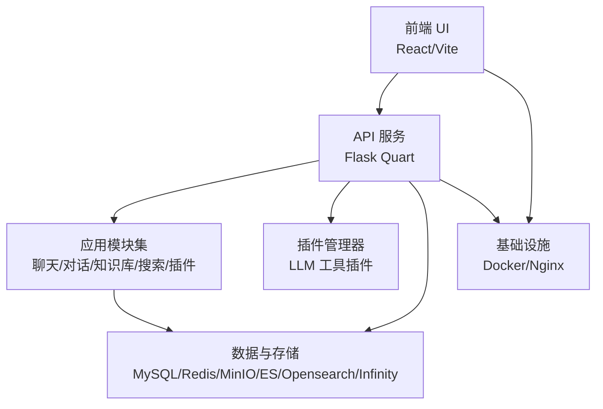
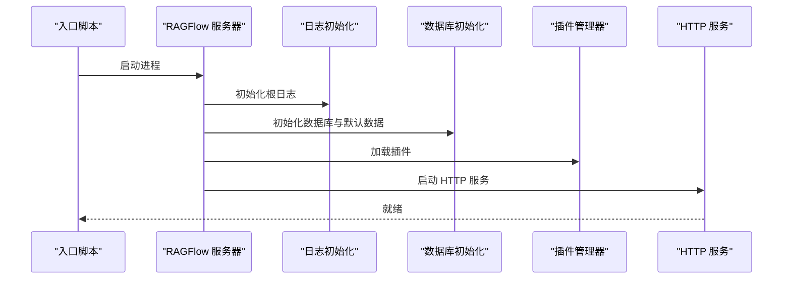
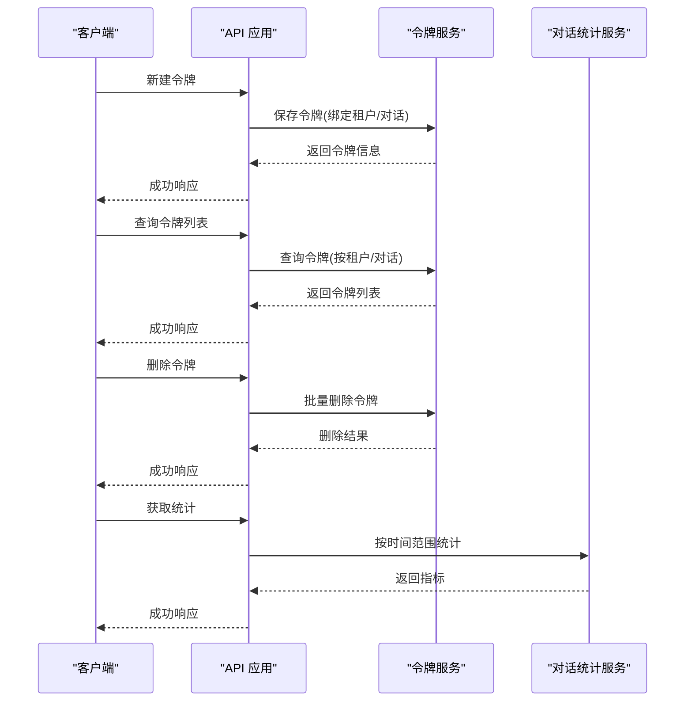
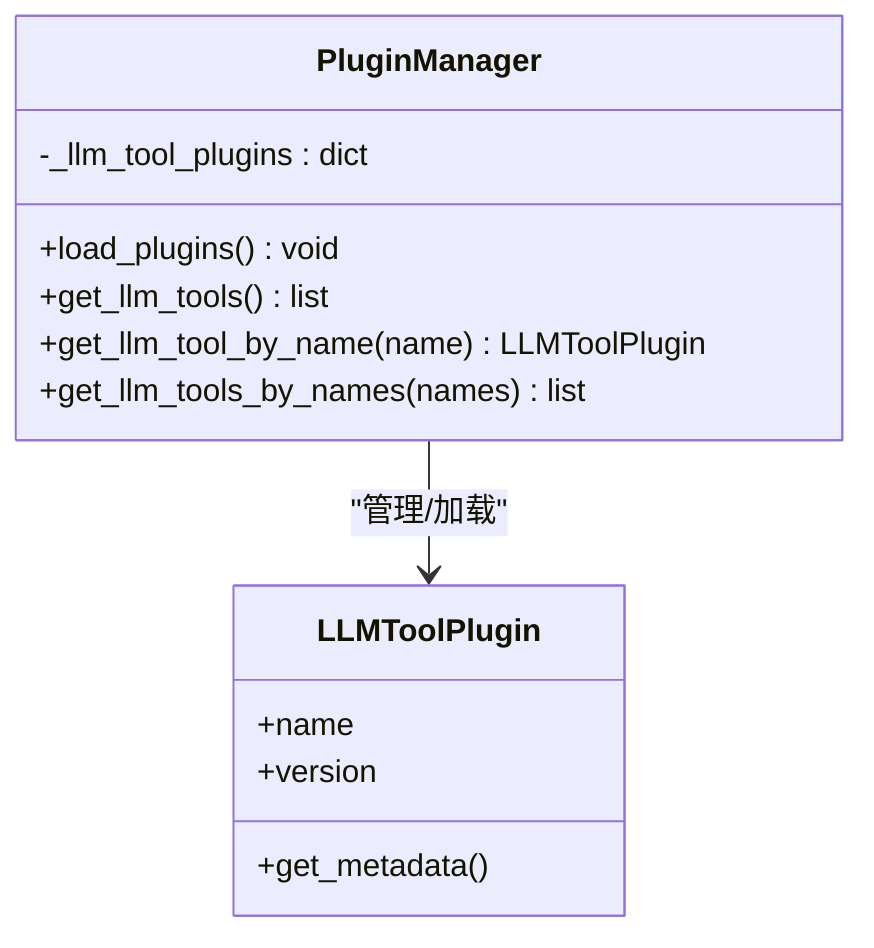
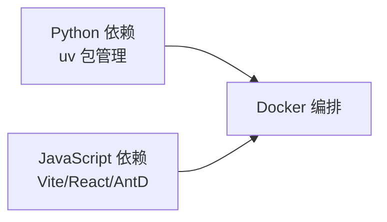

# 项目概述

<cite>
**本文引用的文件**
- [README.md](file://README.md)
- [pyproject.toml](file://pyproject.toml)
- [api/ragflow_server.py](file://api/ragflow_server.py)
- [web/package.json](file://web/package.json)
- [docker/docker-compose.yml](file://docker/docker-compose.yml)
- [agent/__init__.py](file://agent/__init__.py)
- [api/apps/api_app.py](file://api/apps/api_app.py)
- [conf/system_settings.json](file://conf/system_settings.json)
- [docs/quickstart.mdx](file://docs/quickstart.mdx)
- [docs/basics/rag.md](file://docs/basics/rag.md)
- [docs/basics/agent_context_engine.md](file://docs/basics/agent_context_engine.md)
- [plugin/plugin_manager.py](file://plugin/plugin_manager.py)
- [LICENSE](file://LICENSE)
- [SECURITY.md](file://SECURITY.md)
</cite>

## 目录
1. [引言](#引言)
2. [项目结构](#项目结构)
3. [核心组件](#核心组件)
4. [架构总览](#架构总览)
5. [详细组件分析](#详细组件分析)
6. [依赖关系分析](#依赖关系分析)
7. [性能考量](#性能考量)
8. [故障排查指南](#故障排查指南)
9. [结论](#结论)
10. [附录](#附录)

## 引言
RAGFlow 是一款面向企业与个人的开源检索增强生成（RAG）引擎，融合前沿 RAG 技术与智能体（Agent）能力，构建卓越的“上下文层”。它以“高质量输入，高质量输出”的理念，提供从多格式非结构化数据中抽取知识、可解释的模板化分块、多模态兼容、以及自动化的 RAG 工作流，帮助开发者高效地将复杂数据转化为高保真、可生产的 AI 应用。

RAGFlow 的定位是“面向智能体的上下文引擎”，其目标不仅是提供问答能力，更是将 RAG 从单一技术演进为智能体的“数据与智能基础设施”，实现从“手工拼装上下文”到“工业级自动装配”的转变。

章节来源
- [README.md:73-75](file://README.md#L73-L75)
- [docs/basics/agent_context_engine.md:53-59](file://docs/basics/agent_context_engine.md#L53-L59)

## 项目结构
RAGFlow 采用前后端分离与模块化架构：后端以 Python 为核心，提供 REST API 与任务执行；前端基于 React/Vite 构建；系统通过 Docker 进行容器化部署，并支持多种数据库与存储后端。项目还包含智能体编排、工具插件、图谱与检索增强、深度文档解析与多模态视觉理解等子系统。

图表来源
- [docker/docker-compose.yml:1-133](file://docker/docker-compose.yml#L1-L133)
- [api/ragflow_server.py:33-157](file://api/ragflow_server.py#L33-L157)
- [web/package.json:1-195](file://web/package.json#L1-L195)

章节来源
- [docker/docker-compose.yml:1-133](file://docker/docker-compose.yml#L1-L133)
- [api/ragflow_server.py:33-157](file://api/ragflow_server.py#L33-L157)
- [web/package.json:1-195](file://web/package.json#L1-L195)

## 核心组件
- 检索增强生成（RAG）内核：提供向量化、多召回、重排序、引用可视化与可追溯性，支撑高质量问答与决策支持。
- 深度文档理解（DeepDoc）：多格式文档解析与多模态理解，支持 PDF、表格、图片、幻灯片等，输出结构化语义文本。
- 模板化分块：可解释、可配置的分块策略，平衡“精确性”与“完整性”，并支持人工干预与关键词标注。
- 多模态兼容：图像、公式、表格结构识别与理解，提升复杂文档的语义质量。
- 自动化 RAG 工作流：从数据接入、解析、嵌入、索引到检索与生成的全链路自动化。
- 智能体上下文引擎：将 RAG、记忆与工具编排统一为“上下文装配平台”，实现面向 Agent 的工业级上下文工程。
- 插件化扩展：内置插件管理器，支持 LLM 工具插件加载与按需调用，便于生态扩展。
- 前后端分离与容器化：后端 API 与前端 UI 解耦，Docker Compose 一键部署，支持 CPU/GPU 两种运行模式。

章节来源
- [README.md:108-136](file://README.md#L108-L136)
- [docs/basics/rag.md:49-77](file://docs/basics/rag.md#L49-L77)
- [docs/basics/agent_context_engine.md:26-35](file://docs/basics/agent_context_engine.md#L26-L35)
- [plugin/plugin_manager.py:11-46](file://plugin/plugin_manager.py#L11-L46)

## 架构总览
RAGFlow 的系统架构由“前端界面层、API 服务层、业务应用层、插件与工具层、数据与存储层、基础设施层”构成。前端通过浏览器访问 API，API 负责路由、鉴权、业务编排与任务调度；业务应用模块覆盖聊天、对话、知识库、搜索、插件等；插件管理器负责 LLM 工具的动态加载；数据与存储层包含 MySQL、Redis、MinIO、Elasticsearch/OpenSearch/Infinity 等；基础设施层通过 Docker Compose 统一编排，支持 Nginx 反向代理与 HTTPS。

图表来源
- [api/ragflow_server.py:33-157](file://api/ragflow_server.py#L33-L157)
- [docker/docker-compose.yml:1-133](file://docker/docker-compose.yml#L1-L133)

章节来源
- [api/ragflow_server.py:33-157](file://api/ragflow_server.py#L33-L157)
- [docker/docker-compose.yml:1-133](file://docker/docker-compose.yml#L1-L133)

## 详细组件分析

### 后端启动与运行流程
后端通过主程序初始化日志、设置运行时配置、加载数据库与默认数据、启动插件管理器，并在信号处理下优雅关闭。随后启动 HTTP 服务，等待请求。

图表来源
- [api/ragflow_server.py:76-157](file://api/ragflow_server.py#L76-L157)

章节来源
- [api/ragflow_server.py:76-157](file://api/ragflow_server.py#L76-L157)

### API 认证与令牌管理
API 模块提供令牌生成、列表查询与删除接口，配合登录校验与租户绑定，支持对特定对话或画布进行细粒度权限控制与统计分析。

图表来源
- [api/apps/api_app.py:26-118](file://api/apps/api_app.py#L26-L118)

章节来源
- [api/apps/api_app.py:26-118](file://api/apps/api_app.py#L26-L118)

### 插件化扩展与 LLM 工具
插件管理器通过插件库加载嵌入式插件，筛选出 LLM 工具类型插件并维护名称到插件实例的映射，支持按名称批量获取工具，便于在智能体工作流中动态调用。

图表来源
- [plugin/plugin_manager.py:11-46](file://plugin/plugin_manager.py#L11-L46)

章节来源
- [plugin/plugin_manager.py:11-46](file://plugin/plugin_manager.py#L11-L46)

### 部署与运行环境
- Docker Compose 提供 CPU/GPU 两种镜像与端口映射，挂载 Nginx 配置与日志目录，支持 MCP 与管理后台服务的启用。
- 前端使用 Vite 开发与构建，依赖 Ant Design 生态与 React 生态组件库，支持国际化与主题切换。
- 后端依赖 Python 3.12~3.14，集中于 uv 包管理与测试框架，覆盖度报告与严格标记体系。

章节来源
- [docker/docker-compose.yml:1-133](file://docker/docker-compose.yml#L1-L133)
- [web/package.json:1-195](file://web/package.json#L1-L195)
- [pyproject.toml:1-278](file://pyproject.toml#L1-L278)

## 依赖关系分析
RAGFlow 的依赖主要集中在后端 Python 生态与前端 JavaScript 生态。后端通过包管理器集中声明第三方库，涵盖数据源连接器、搜索引擎、向量化与推理模型、MCP 协议、安全与监控等；前端通过 Vite 与 React 生态构建，集成图表、流程图、Markdown 渲染、富文本编辑器等组件。

图表来源
- [pyproject.toml:1-278](file://pyproject.toml#L1-L278)
- [web/package.json:1-195](file://web/package.json#L1-L195)

章节来源
- [pyproject.toml:1-278](file://pyproject.toml#L1-L278)
- [web/package.json:1-195](file://web/package.json#L1-L195)

## 性能考量
- 文档解析与多模态理解：通过深度解析与视觉理解减少语义损失，提高检索精度与生成质量。
- 分块策略与重排序：模板化分块与多召回融合重排序降低长文本嵌入成本，提升检索效率。
- 容器化与资源调度：Docker Compose 支持 CPU/GPU 模式，结合 Nginx 反向代理与持久化存储，保障高可用与可扩展性。
- 插件化工具：按需加载 LLM 工具，避免不必要的资源占用，提升系统灵活性。

章节来源
- [docs/basics/rag.md:25-48](file://docs/basics/rag.md#L25-L48)
- [docs/basics/rag.md:69-77](file://docs/basics/rag.md#L69-L77)
- [docker/docker-compose.yml:1-133](file://docker/docker-compose.yml#L1-L133)

## 故障排查指南
- 启动确认：确保容器日志显示“Running on all addresses”，否则可能未完全初始化。
- 系统参数：Linux 需设置 vm.max_map_count 至少 262144，避免连接 ES/Infinity 失败。
- 端口与代理：检查 Nginx 配置与端口映射，确认 HTTPS/HTTP 端口开放。
- 数据库健康：确认 MySQL/Redis/MinIO 等依赖服务健康，必要时查看容器日志。
- 安全与漏洞：遵循安全策略，及时更新依赖，修复已知漏洞（如受限反序列化问题）。

章节来源
- [README.md:217-239](file://README.md#L217-L239)
- [docs/quickstart.mdx:44-183](file://docs/quickstart.mdx#L44-L183)
- [docker/docker-compose.yml:1-133](file://docker/docker-compose.yml#L1-L133)
- [SECURITY.md:1-75](file://SECURITY.md#L1-L75)

## 结论
RAGFlow 以“上下文装配平台”的理念，将 RAG、记忆与工具编排整合为面向智能体的基础设施，覆盖从文档理解、分块、检索、生成到智能体工作流的全链路能力。通过前后端分离、插件化扩展与容器化部署，RAGFlow 既能满足个人开发者快速试错，也能支撑企业级大规模应用的稳定性与可运维性。

章节来源
- [docs/basics/agent_context_engine.md:53-59](file://docs/basics/agent_context_engine.md#L53-L59)
- [README.md:73-75](file://README.md#L73-L75)

## 附录

### 适用场景与目标用户
- 个人开发者：快速搭建本地 RAG/Agent 应用，验证想法与原型。
- 企业团队：构建内部知识问答、合规检索、跨模态文档理解与自动化决策支持。
- 研究机构：探索多模态、图谱与检索增强的新范式，进行算法与工程实验。

章节来源
- [docs/basics/rag.md:85-95](file://docs/basics/rag.md#L85-L95)

### 技术栈概览
- 后端：Python（Flask/Quart）、uv 包管理、Docker、Nginx、MySQL/Redis/MinIO/Elasticsearch/OpenSearch/Infinity。
- 前端：React/Vite、Ant Design、TailwindCSS、国际化与主题系统。
- 部署：Docker Compose，支持 CPU/GPU 模式与 MCP/管理后台服务。

章节来源
- [pyproject.toml:1-278](file://pyproject.toml#L1-L278)
- [web/package.json:1-195](file://web/package.json#L1-L195)
- [docker/docker-compose.yml:1-133](file://docker/docker-compose.yml#L1-L133)

### 开源协议与社区生态
- 协议：Apache License 2.0。
- 社区：提供 Discord、Twitter、GitHub Discussions 等渠道，欢迎贡献与反馈。
- 版本发布：遵循稳定版与夜间版策略，文档与路线图持续更新。

章节来源
- [LICENSE:1-202](file://LICENSE#L1-L202)
- [README.md:401-411](file://README.md#L401-L411)